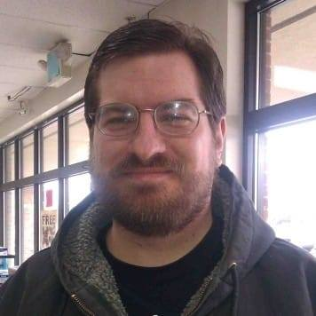

# Hoshisabi's Projects

Hello! My name is Dan Chapman and I am working on a variety of tasks in order to avoid ever finishing one, but chances are
if you're coming here you managed to find one of the rare finished tasks.

* Are you interested in [My Adventures](myadventures.md)?
* Are you interested in joining a session of the games I run at [Pando DND](http://pandodnd.com)?
* Looking to contact me on [Twitter](https://twitter.com/hoshisabi)?

## RPG Information that I don't want to lose

Information about [Basht](rpg/basht.md) from before the first adventure was written.

## D&D Campaigns I Play In

* RETIRED: Icewind Dale "Heroes We Need" (in person, DM: Chris Hubbard) [Spare](rpg/spare/index.md)
* FINISHED: Vecna (in person, DM: Anthony Gow): [Faark](https://www.dndbeyond.com/characters/100329165/V3rxpG)
* FINISHED: Wild Beyond the Witchlight (online, DM: John Rogers): [Burgess](rpg/burgess/index.md)
* FINISHED: Wild Beyond the Witchlight (in person, DM: Kate Hoff): [Rool](rpg/rool/index.md)

## Adventurers League at U-Con 2023
We will be running AL at U-Con this year, again. If you want more detail, please look at the U-Con site https://www.ucon-gaming.org/

The AL events are available [here](https://tabletop.events/conventions/u-con-2023/schedule#?query=U-Con%20Adventurers%20League)

In addition, we will be fundraising for [The Trevor Project](https://give.thetrevorproject.org/team/534949) 
and [Doctors Without Borders](https://events.doctorswithoutborders.org/index.cfm?fuseaction=donordrive.personalCampaign&participantID=8648).

## Ignore this section

[AL List](trial_al_viewer.html)
[Test](mermaid.md)
* Information about the past [U-Con](ucon.md)?

[DDAL Test](ddaltest.md)
