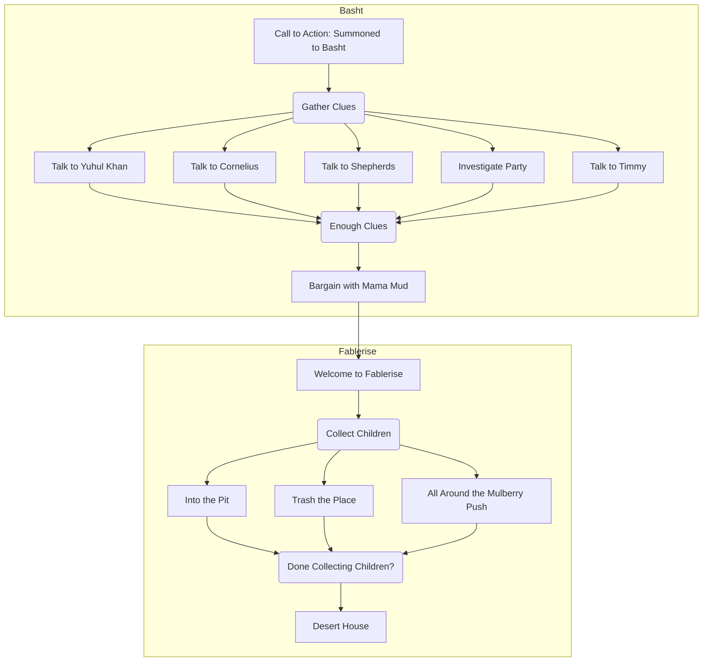

# Testing mermaid syntax

Ignore below this line:

```mermaid
graph TD;
    CTA[Call to Action: Summoned to Basht]
    Enough(Enough Clues)
    Gather(Gather Clues)
    Mud[Bargain with Mama Mud]
    Yuhul[Talk to Yuhul Khan]
    Cornelius[Talk to Cornelius]
    Shepherds[Talk to Shepherds]
    Party[Investigate Party]
    Boy[Talk to Timmy]
    Welcome[Welcome to Fablerise]
    Collect(Collect Children)
    Pit[Into the Pit]
    Breaking[Trash the Place]
    Bush[All Around the Mulberry Push]
    Done(Done Collecting Children?)
    Finale[Desert House]

    subgraph Basht
        CTA-->Gather
    
        Gather-->Yuhul-->Enough
        Gather-->Cornelius-->Enough
        Gather-->Shepherds-->Enough
        Gather-->Party-->Enough
        Gather-->Boy-->Enough

        Enough-->Mud
    end
    
    subgraph Fablerise
        Mud-->Welcome
    
        Welcome-->Collect
        Collect-->Pit-->Done
        Collect-->Breaking-->Done
        Collect-->Bush-->Done

        Done-->Finale
    end
```
