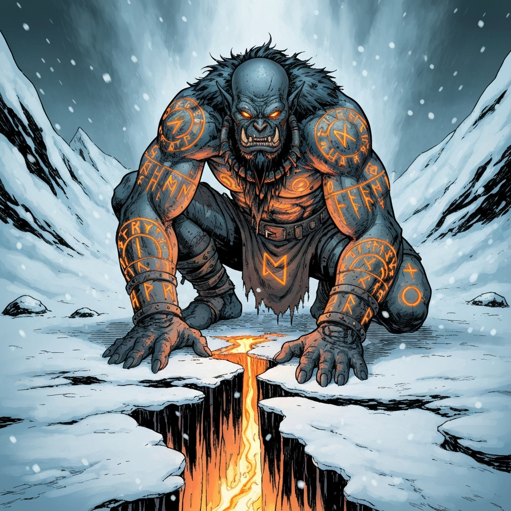

The Coldpeak's shaman, and a large part of the reason the tribe still eats. A healer and a reader of the land whose answer to most things is the ground: fix the land, and let the land fix the people.

His spring is the thing to understand. In the middle of a winter that has not ended in years, he made a warm place. Green things grow there. The water runs. He did that, not through prayer or luck, but through understanding the land at a depth most people never reach, and refusing to accept that Auril's cold is the final word on the matter. Most of what grows in its hot ground is [pembelon](../lore/pembelon) from Chult, dense round melons that radiate heat when cut; getting them to survive open snow is the problem he hasn't solved. His cold-resistant vegetables, grown in an enclosure at the edge of camp, are what carry the Coldpeak through when the hunts fail.

## Brekk

He and [Brekk](brekk) trained under the same master and have been colleagues and rivals ever since. They once spent three miserable nights on a theory about flux stones; Brekk found the answer first, and neither has let the other forget it. The same crop-hardiness research that feeds the tribe also produced a concentrate so foul that Brekk keeps it around as a joke. ([Session 14](../sessions/2026-07-31))

## With the Party

He came to Coldpeak in [Session 15](../sessions/2026-08-08) by sled, behind a team of wolves, with bags of pembelon, and walked down the line with a question for each of them. He asked [Father Joseph](../characters/dr-medicine) about his training and let the difference in their philosophies stand. He asked [Alina](../characters/alina) about her research; when she raised Irenthal he cared more about the geography than the history, and offered his journals. He told [River](../characters/river) the camp's young ones had taken to him, and that they should learn their Orcish traditions first.

He is not easy to be near. He is guarded with outsiders, slower to trust than most of the tribe, and he does not trouble to hide it. He holds his tribe's ways ahead of anyone else's, and he has also shown the party that he can be moved.

## The Mountain

In [Session 16](../sessions/2026-08-21), when Father Joseph floated preaching Arveth to the tribe, Durok stopped him cold. He has spoken to the mountain himself. It offered his people greatness and protection at the cost of "you and others like you," and he turned it down.

When the question of sheltering the Elk came before [Broken Tusk](broken-tusk), he argued against it, harder the longer the meal went: more people in one place is a more enticing target for the mountain's attention, and Coldpeak cannot feed the mouths it already has. Berg's case, pull the thorn before it festers, got a measured refusal. What moved him was Alina's other question: what if we kill the bird? Once won over, he chose to stay and defend his people, and sent his aid with the party instead. His ritual called the spirits of the land into a stone, and everyone who took part attuned to a Stone of Controlling Earth Elementals.

> **Before the Reweave** — In the unwoven, Durok's listening had curdled into obsession. His journal told of a staff that knew the land the way he had spent his life trying to, and of Netherese geomancers who had bent the earth to their will — power he meant to take for himself and turn against the cold across the whole Dale. He bonded and named creatures to that purpose; [Rimetalon](rimetalon) was his. Then his runestones went dark, his last entry ended mid-thought, and he was gone. The [Reweave](arveth) rewove that thread: in this reality he never touched Netherese magic, never bonded a creature, and never vanished. Memories of the darker Durok surface as half-rumor, not error.
>
> 
