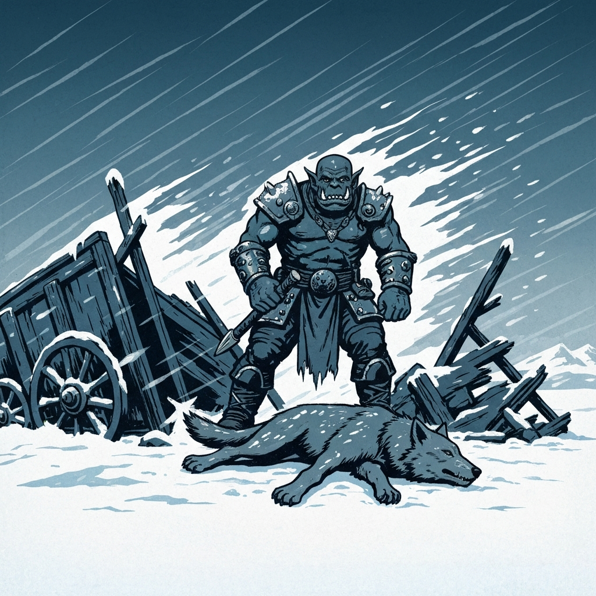
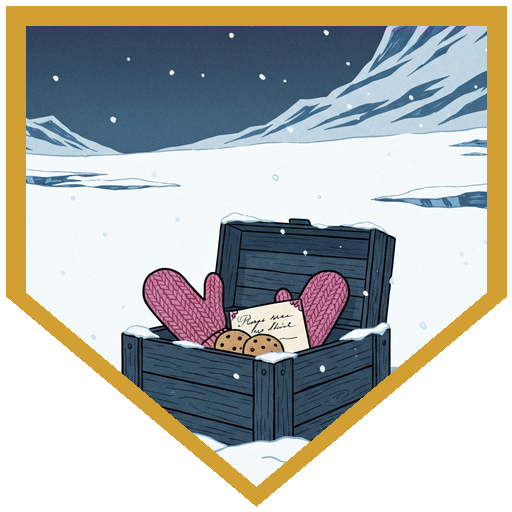
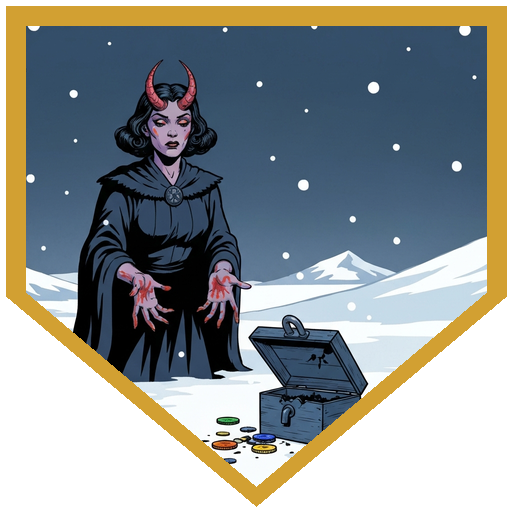
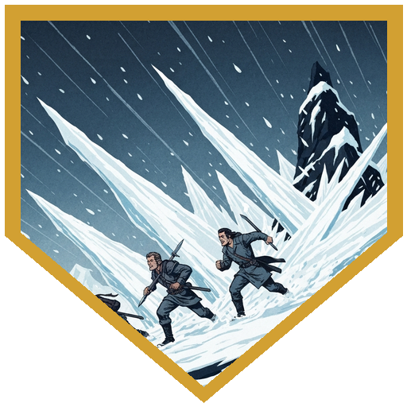
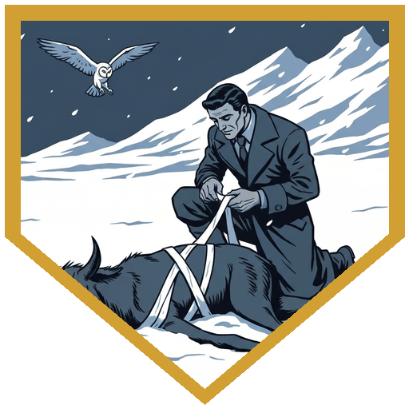
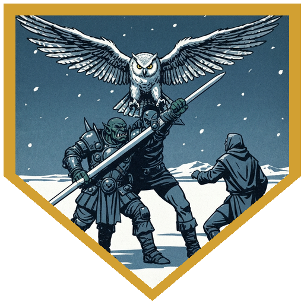
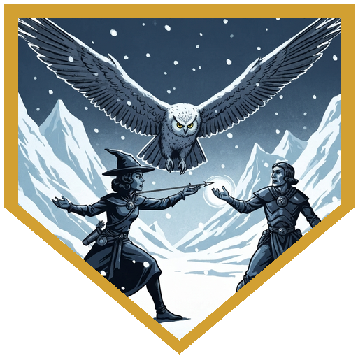
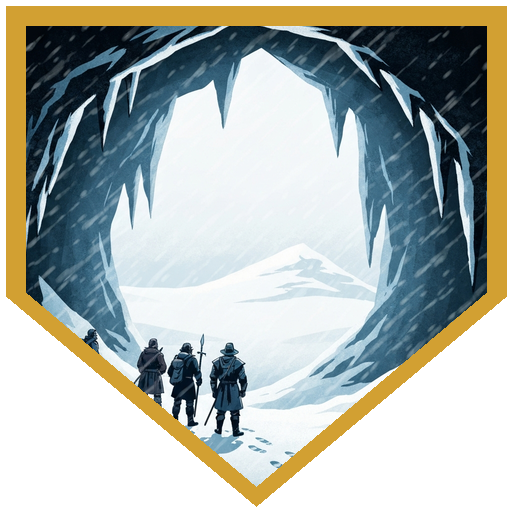

The party picked up mid-combat, dispatching the last wolf from an ambush that had already destroyed most of the caravan. What followed wasn't a dungeon or a villain — just weather, and weather in Icewind Dale is its own kind of enemy.

With the caravan swept away and night coming on, their guide Pasha advised making camp before the temperature dropped further. They scavenged the wreckage: digging out a lockbox, finding a sturdy crate. The crate held a knitted pink hat and mittens, a package of home-baked chocolate chip cookies, and a handwritten note from someone named Jordan's mother, worried and hopeful. Jordan was already dead beneath the snow. The lockbox was more complicated — the velvet pouch of coins had been soaked through by shattered potion vials, staining everything in rainbow colors. One vial had somehow survived intact. Whoever touched the stained coins had to make a Constitution save or start developing strange rainbow discoloration on their skin. The intact vial was a Potion of Growth. Dr. Medicine immediately recognized it as a premium sales opportunity.

They survived the night — barely. Constitution saves against the cold meant some of the party woke with a level of exhaustion and the story award Frostbitten. The next morning brought a quicksnow field (snow concealing a half-frozen river surface; Pasha spotted it and guided them through with advantage), then razor snow — sheets of ice hurled by unnatural wind that sent the party sprinting for cover. Three rounds of dashing. Two slashing damage on the way in.

When the wind cut out and strange yellow eyes appeared in the settling snow, Berg rolled Arcana and identified them as elemental manifestations — not natural creatures, but something conjured. Giant owls dropped from the snow-sky. Four of them, with Flyby and, oddly, Spellcasting (Detect Good and Evil, Detect Magic, Clairvoyance — none of which helped the owls in combat but raised questions about what they were doing with those spells otherwise). River went down to a crit in the first round. Dr. Medicine stabilized her with his Healer feat. The sidekicks took serious damage. The party ground out the fight.

After: a frozen caravan member found clutching a Potion of Healing and a platinum ring set with a large sapphire. A warm cave with an underground stream — shelter, and the equivalent of a long rest. They settled in.

They woke to find the gnome expert sidekick torn limb from limb, his remains arranged in a careful geometric pattern in the snow. Something large had done it. Pasha recognized the sign — the creature had developed their scent. It would hunt them every night until they dealt with it. The party voted to go after it immediately. Pasha led them into the blizzard. Somewhere in the whiteout, between one step and the next, they lost sight of her. When they retraced their path, the cave was empty and Pasha was gone.

Session ended with two sidekicks lost, an unknown creature in the dark, and a guide they couldn't find.

---

## Player Highlights

**Berg** — When the owls found Dr. Medicine at one hit point and a talon already dropping, Berg stepped into the gap. Interception isn't a flashy maneuver — it's the one that costs you on purpose, because the man behind you isn't dead yet and you'd like to keep it that way.

**Dr. Medicine** — River went down hard to a crit before the fight was ten seconds old. Dr. Medicine closed the distance, announced his credentials, and stitched her back into the fight with the calm efficiency of someone who has made a professional study of not letting people die on his watch.

**River** — The owl's cone of cold had half the party restrained and the sidekicks bleeding. River refused to stay down — took the hit that should have ended the night, came back up, and kept the pressure on until the last feathered nightmare unraveled into storm.

**Alina** — Arrows flying when she had an angle, Healing Word to Dr. Medicine when the math got ugly — Alina never chose between offense and support when she could do both. The owl fight lasted as long as it did because Alina refused to stop.

---

## Achievements

<strong>Iron Curtain Call</strong> — Berg put down the last wolf mid-retreat and closed the ambush before the cold could open anything worse.

<strong>Return to Sender</strong> — They found a mother's care package in the wreckage — hat, mittens, cookies, a letter — addressed to a man already buried under the snow outside. Dr. Medicine put on the mittens and earned his survival roll.

<strong>The Rainbow Tax</strong> — Alina's fingers couldn't find the keyhole on the lockbox, the shattered potions inside stained everything they touched, and her skin took up a new color palette that won't come off until the dice say otherwise.

<strong>Three Rounds, No Casualties</strong> — With razor snow filling the sky like broken glass, the whole party dashed to cover and made it — mostly intact, slightly scored, and breathing.

<strong>Licensed Chiropractor</strong> — River went down hard to a crit. Dr. Medicine closed the distance, announced his credentials with complete confidence, and brought her back from death's waiting room with a Healer feat and a bedside manner that doesn't actually require a license.

<strong>Eat the Hit</strong> — When the owls found a gap and Dr. Medicine was already at 1 HP, Berg stepped between them and took the damage himself. Interception. It's not a flashy maneuver. It is the best kind.

<strong>The Line Holds</strong> — Alina kept arrows flying and Healing Word ready throughout the owl fight — damage here, a spark of magic there — and the party's ability to keep standing was partly a function of her refusing to stop.

<strong>The Shape She Left Behind</strong> — They followed Pasha into the blizzard to hunt something that had already shown what it could do. The snow ate her voice, then her trail, then the space where she'd been. They came back. She didn't.

---

## Rewards

- **Gold**: 40 gold each
- **[Potion of Growth]**: *(uncommon)* *(consumable)*
- **[Potion of Healing]**: *(common)* *(consumable)*
- **Platinum ring set with a large sapphire**

[Potion of Growth]: https://www.dndbeyond.com/magic-items/9805016-potion-of-growth
[Potion of Healing]: https://www.dndbeyond.com/magic-items/4708-potions-of-healing
