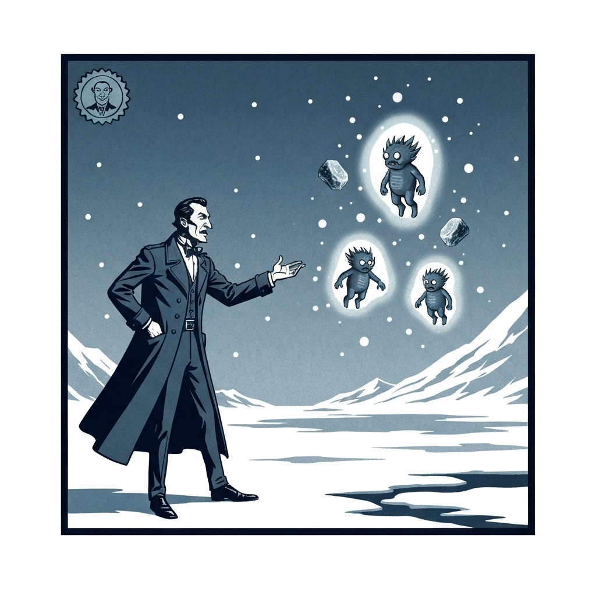
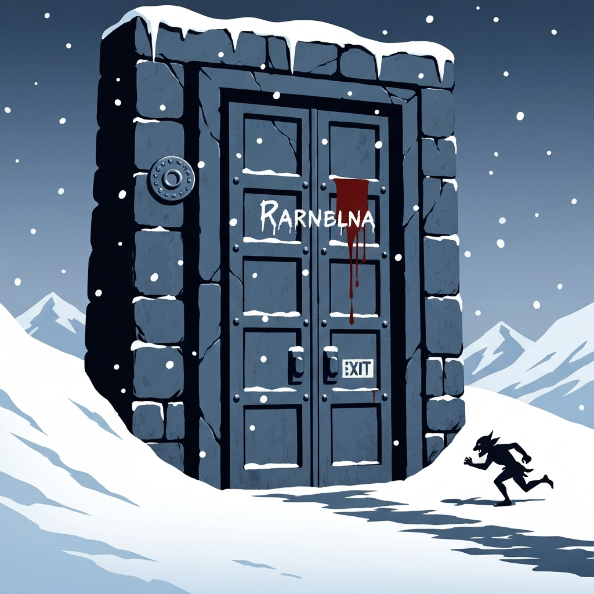
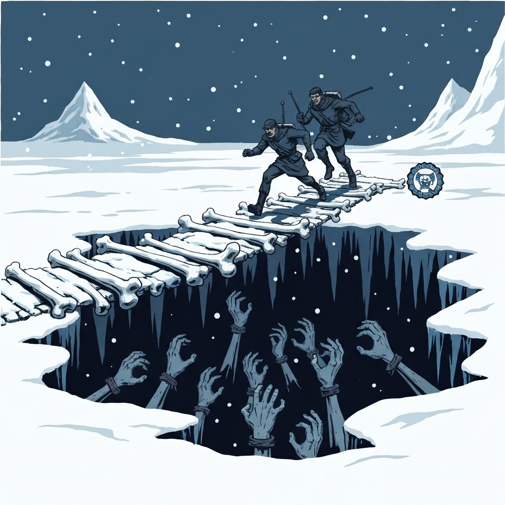
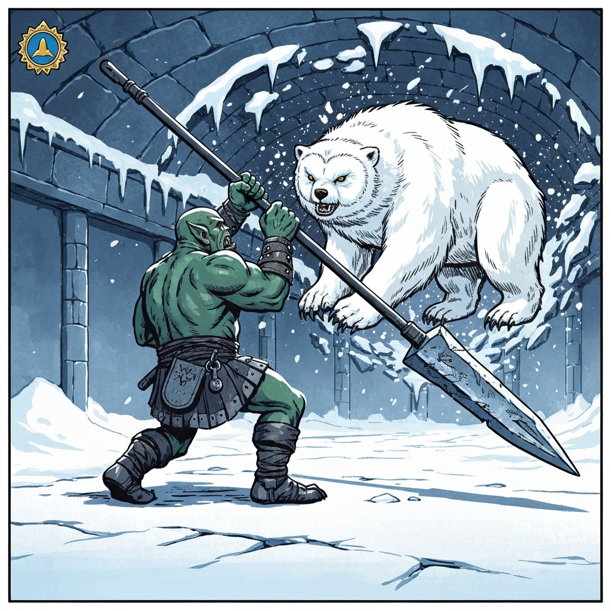
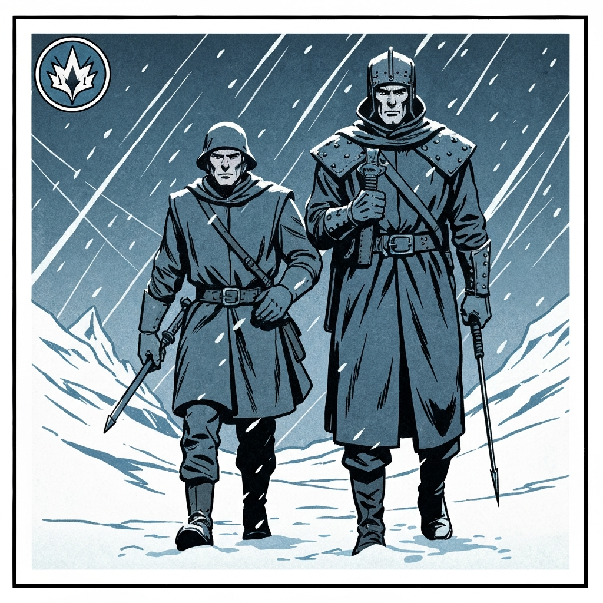

The cave the party had sheltered in turned out not to be a cave at all. A narrow tunnel at the back opened into a grand 30-foot chamber of worked Netherese stone — carved murals of floating cities, ancient gods, and scenes of magical experimentation covered the walls, and an ice-covered marble door sealed the far end. The remnants of a previous camp: a limestone-crusted backpack, a handful of sparkly blue pebbles, a journal.

The door was inscribed with what looked like Draconic but wasn't. Netherese — the same script used in the schools of Congenio Ioun, creator of the Ioun stones. The journal contained a logic puzzle. The puzzle identified four stones needed to open the door: a dark blue rhomboid (Intellect), a silvery gem (Self-Preservation), a pale green prism (Mastery), and a marbled scarlet and blue sphere (Awareness). Finding them meant crossing an underground lake (Alina went straight through, took a Constitution save, and kept moving), surviving a ceiling full of piercers who hit considerably harder than anyone expected, and then negotiating with three baby beholders who were playing keep-away with the stones.

Dr. Medicine handled the negotiation. He traded snake oil and a promise that the stones would "magically reappear in the cavern in two days" for all four. The baby beholders were satisfied. The stones are still in the party's possession. The two-day deadline has passed.

Back at the door, the party inserted the stones in order. As they did, the goblin spellcaster sidekick — who had never remembered his own name and whom the party had simply called Creepy — watched his name appear in blood on the door. He ran. He made it outside. Something large was waiting for him and took him immediately. His body was not recovered.

Through the door: a bridge of worked stone designed to resemble bones, crossing a deep pit. The pit was full of crawling hands — all right hands. The frescoes above showed Netherese mages, every one of them missing their right hand. One fresco depicted the initiation: an apprentice cutting off her own. The party ran across. One hand caught Dr. Medicine before he cleared the bridge for 2 necrotic damage.

In the Chamber of the Slumbering Crystal — colder than the blizzard outside, which was itself already deadly cold — the Owlbear crashed through the ceiling. The nameless goblin spellcaster who had survived this long was crushed by the falling ice. The fight that followed: the Owlbear breathed a cone of frost that restrained most of the party. Berg drank the Potion of Growth, Action Surged, and drove a pike home for 16 piercing damage. Apparently 14 feet of Snowy Owlbear has a threshold. She fled through the wall, sealed the tunnel behind her, and revealed a passage to the surface — where the frozen bodies of a group of archaeologists had been waiting in the dark.

Outside, in the blizzard: Pasha. Alive, unhurt, having spent the intervening time in the wilderness before finding a half-orc hunter named Savin. Savin's tribe, the Coldpeak, was nearby. Their chieftain, Broken Tusk, was reportedly very interested in people who had encountered the creature and survived.

---

## Player Highlights

**Berg** — 

**Dr. Medicine** — 

**River** — 

**Alina** — 

---

## Achievements

<!-- image_prompt: 1930s pulp adventure paperback illustration style, bold linework, limited color palette of deep blues and slate grays with stark white snow, flat simplified background, dramatic lighting, arctic Icewind Dale setting with snow and ice always present, absolutely no text, no letters, no words, no labels anywhere in the image — small circular badge icon, charlatan in a long coat gesturing grandly at three small beholders floating around glowing ioun stones, bold simple shapes -->

<strong>The Two-Day Guarantee</strong> — Dr. Medicine traded snake oil for four Ioun stones with baby beholders on the solemn promise that the stones would magically reappear in two days. The deadline has passed. The stones are still in the party's possession.

<!-- image_prompt: 1930s pulp adventure paperback illustration style, bold linework, limited color palette of deep blues and slate grays with stark white snow, flat simplified background, dramatic lighting, arctic Icewind Dale setting with snow and ice always present, absolutely no text, no letters, no words, no labels anywhere in the image — small circular badge icon, a name written in dripping blood on a massive ancient stone door, small goblin silhouette fleeing toward an exit, bold simple shapes -->

<strong>What the Door Knows</strong> — The goblin who had never remembered his own name watched it appear in blood on the Netherese door. He ran. He made it outside. Something large was waiting for him.

<!-- image_prompt: 1930s pulp adventure paperback illustration style, bold linework, limited color palette of deep blues and slate grays with stark white snow, flat simplified background, dramatic lighting, arctic Icewind Dale setting with snow and ice always present, absolutely no text, no letters, no words, no labels anywhere in the image — small circular badge icon, adventurers sprinting across a bone bridge over a dark pit filled with reaching severed right hands, bold simple shapes -->

<strong>All Right Hands</strong> — The pit beneath the bone bridge was full of crawling hands — every one of them a right hand. The frescoes above showed Netherese mages who had cut off their own. Nobody stopped to discuss the implications. They ran.

<!-- image_prompt: 1930s pulp adventure paperback illustration style, bold linework, limited color palette of deep blues and slate grays with stark white snow, flat simplified background, dramatic lighting, arctic Icewind Dale setting with snow and ice always present, absolutely no text, no letters, no words, no labels anywhere in the image — small circular badge icon, enormous orc grown to giant size driving a pike upward into a massive white owlbear crashing through a stone ceiling, bold simple shapes -->

<strong>Potion of Growth, Action Surge</strong> — Berg drank the Potion of Growth, doubled in size, Action Surged, and drove a pike through 14 feet of Snowy Owlbear for 16 piercing damage. Rimetalon decided she had somewhere else to be.

<!-- image_prompt: 1930s pulp adventure paperback illustration style, bold linework, limited color palette of deep blues and slate grays with stark white snow, flat simplified background, dramatic lighting, arctic Icewind Dale setting with snow and ice always present, absolutely no text, no letters, no words, no labels anywhere in the image — small circular badge icon, a ranger stepping calmly out of a blizzard beside a tall hunter, expression completely composed, bold simple shapes -->

<strong>She Was Always Going to Be Fine</strong> — When the dust settled and the archaeologists were accounted for, Pasha stepped out of the wilderness with a hunter named Savin and the quiet confidence of someone who had never actually needed rescuing.

---

## Rewards

- **Gold**: 40 gp each
- **Ioun Stone** *(dark blue rhomboid — Intellect)*
- **Ioun Stone** *(silvery gem — Self-Preservation)*
- **Ioun Stone** *(pale green prism — Mastery)*
- **Ioun Stone** *(marbled scarlet and blue sphere — Awareness)*
- **Goggles of Night** *(uncommon)* — black crystal lenses with brass and leather frames, found on one of the archaeologists.
- **Potion of Comprehension**
- **Illuminator's Tattoo** *(common, requires attunement)*
