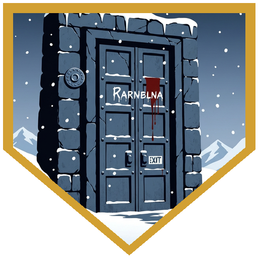
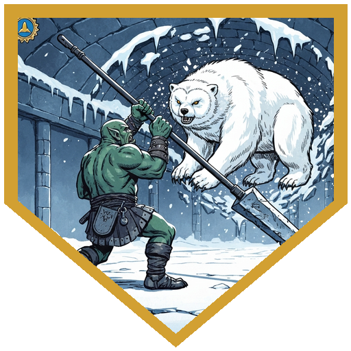
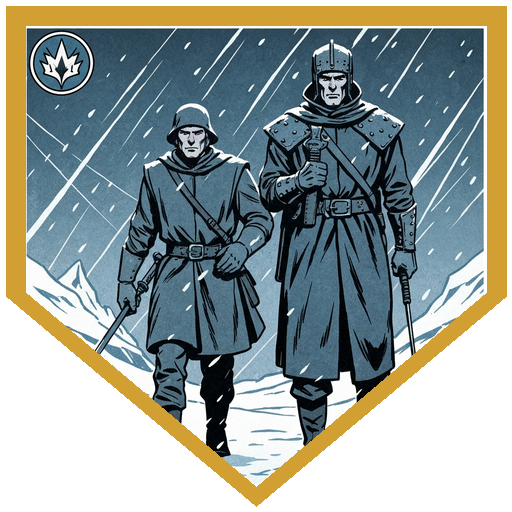

The cave the party had sheltered in turned out not to be a cave at all. A narrow tunnel at the back opened into a grand 30-foot chamber of worked Netherese stone — carved murals of floating cities, ancient gods, and scenes of magical experimentation covered the walls, and an ice-covered marble door sealed the far end. The remnants of a previous camp: a limestone-crusted backpack, a handful of sparkly blue pebbles, a journal.

The door was inscribed with what looked like Draconic but wasn't. Netherese — the same script used in the schools of Congenio Ioun, creator of the Ioun stones. The journal contained a logic puzzle. The puzzle identified four stones needed to open the door: a dark blue rhomboid (Intellect), a silvery gem (Self-Preservation), a pale green prism (Mastery), and a marbled scarlet and blue sphere (Awareness). Finding them meant crossing an underground lake ([**Berg**](../characters/berg) went first, [**River**](../characters/river) right behind him — cold water, nobody went under, which was luck enough), surviving a ceiling full of piercers who hit considerably harder than anyone expected, and then negotiating with three baby beholders who were playing keep-away with the stones.

[**Dr. Medicine**](../characters/dr-medicine) handled the negotiation. He traded snake oil and a promise that the stones would "magically reappear in the cavern in two days" for all four. The baby beholders were satisfied. The stones went into the door. The two-day deadline has passed.

Back at the door, the party inserted the stones in order. As they did, the goblin spellcaster sidekick — who had never remembered his own name and whom the party had simply called [**Creepy**](../npcs/creepy) — watched his name appear in blood on the door. He ran. He made it outside. Something large was waiting for him and took him immediately. His body was not recovered.

Through the door: a bridge of worked stone designed to resemble bones, crossing a deep pit. The pit was full of crawling hands — all right hands. The frescoes above showed Netherese mages, every one of them missing their right hand. One fresco depicted the initiation: an apprentice cutting off her own. The party ran across. One hand caught Dr. Medicine before he cleared the bridge for 2 necrotic damage.

In the Chamber of the Slumbering Crystal — colder than the blizzard outside, which was itself already deadly cold — the Owlbear crashed through the ceiling. The nameless goblin spellcaster who had survived this long was crushed by the falling ice. The fight that followed: the Owlbear breathed a cone of frost that restrained most of the party. Berg drank the Potion of Growth, Action Surged, and drove a pike home for 16 piercing damage. Apparently 14 feet of Snowy Owlbear has a threshold. She fled through the wall, sealed the tunnel behind her, and revealed a passage to the surface — where the frozen bodies of a group of archaeologists had been waiting in the dark.

Outside, in the blizzard: [**Pasha**](../npcs/pasha). Alive, unhurt, having spent the intervening time in the wilderness before finding a half-orc hunter named [**Savin**](../npcs/savin). Savin's tribe, the Coldpeak, was nearby. Their chieftain, [**Broken Tusk**](../npcs/broken-tusk), was reportedly very interested in people who had encountered the creature and survived.

---

## Player Highlights

<strong>Berg</strong> — Fourteen feet of Snowy Owlbear came through the ceiling. Berg drank the Potion of Growth, doubled in size, and Action Surged — one pike thrust for sixteen piercing damage, straight through the question of whether this was survivable. [**Rimetalon**](../npcs/rimetalon) decided she had somewhere else to be and went through the wall to get there.

<strong>Dr. Medicine</strong> — Three baby beholders, four Ioun stones, one bottle of snake oil, and a solemn two-day guarantee. Dr. Medicine negotiated all four stones out of the beholders' hands — then used them to open the Netherese door. The deadline passed. The beholders are still waiting.

<strong>River</strong> — After the underground lake crossing, the piercers dropped from the ceiling without warning on slick stone with bad footing. River turned the chaos into a springboard — an acrobat's ease on terrain that should have been a liability, treating the worst ground in the room like it was made for her.

<strong><a href="../characters/alina">Alina</a></strong> — The baby beholders were playing keep-away with the Ioun stones and the party needed a quiet approach before Dr. Medicine could start his pitch. Alina rolled a natural twenty on stealth — already in position before the beholders knew anyone else had entered the room.

<strong>Pasha</strong> — When the dust settled and the archaeologists were accounted for, Pasha stepped out of the wilderness with a hunter named Savin and the quiet confidence of someone who had never actually needed rescuing.

---

## Achievements

<strong>The Two-Day Guarantee</strong> — Dr. Medicine traded snake oil for four Ioun stones with baby beholders on the solemn promise that the stones would magically reappear in two days. The deadline has passed. The stones are inside the door.

<strong>What the Door Knows</strong> — The goblin who had never remembered his own name watched it appear in blood on the Netherese door. He ran. He made it outside. Something large was waiting for him.

<strong>All Right Hands</strong> — The pit beneath the bone bridge was full of crawling hands — every one of them a right hand. The frescoes above showed Netherese mages who had cut off their own. Nobody stopped to discuss the implications. They ran.

<strong>Potion of Growth, Action Surge</strong> — Berg drank the Potion of Growth, doubled in size, Action Surged, and drove a pike through 14 feet of Snowy Owlbear for 16 piercing damage. Rimetalon decided she had somewhere else to be.

<strong>She Was Always Going to Be Fine</strong> — When the dust settled and the archaeologists were accounted for, Pasha stepped out of the wilderness with a hunter named Savin and the quiet confidence of someone who had never actually needed rescuing.

---

## Rewards

- **Gold**: 40 gp each
- **[Goggles of Night]** *(uncommon)* — black crystal lenses with brass and leather frames, found on one of the archaeologists.
- **[Potion of Comprehension]**
- **[Illuminator's Tattoo]** *(common, requires attunement)*

[Goggles of Night]: https://www.dndbeyond.com/magic-items/4648-goggles-of-night
[Potion of Comprehension]: https://www.dndbeyond.com/magic-items/954138-potion-of-comprehension
[Illuminator's tattoo]: https://www.dndbeyond.com/magic-items/2412346-illuminators-tattoo
