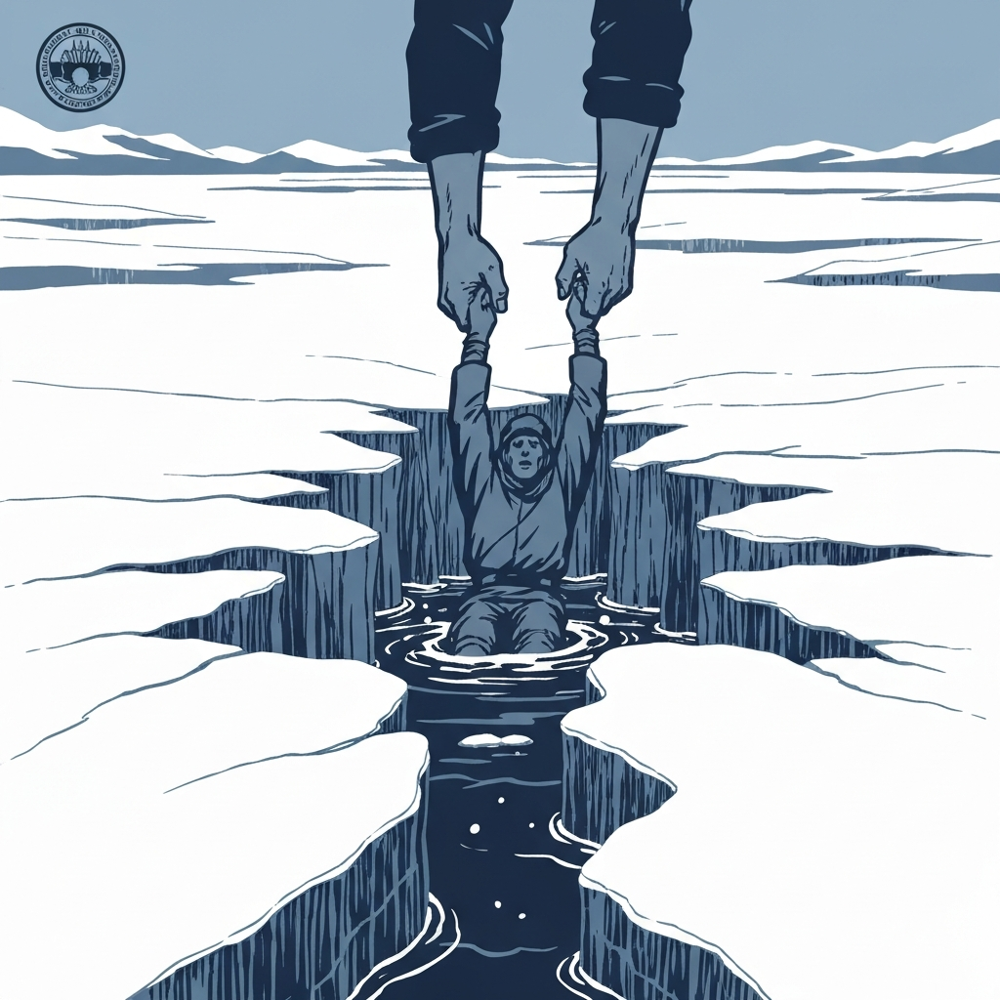
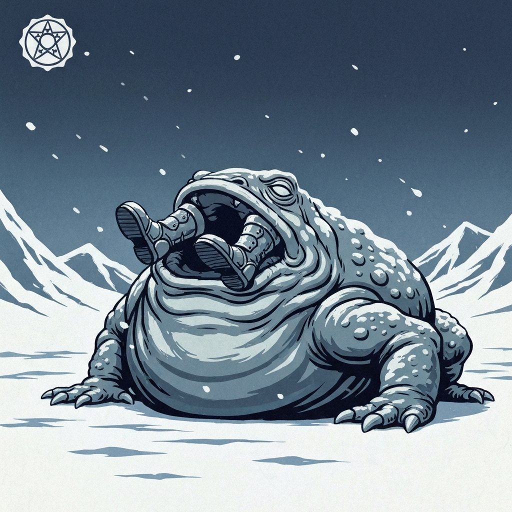
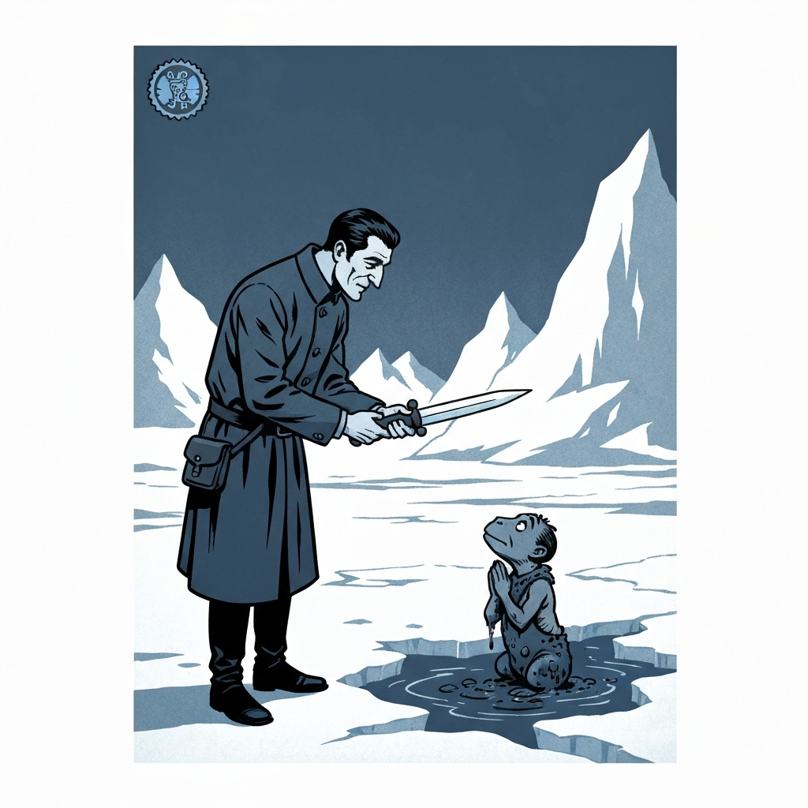
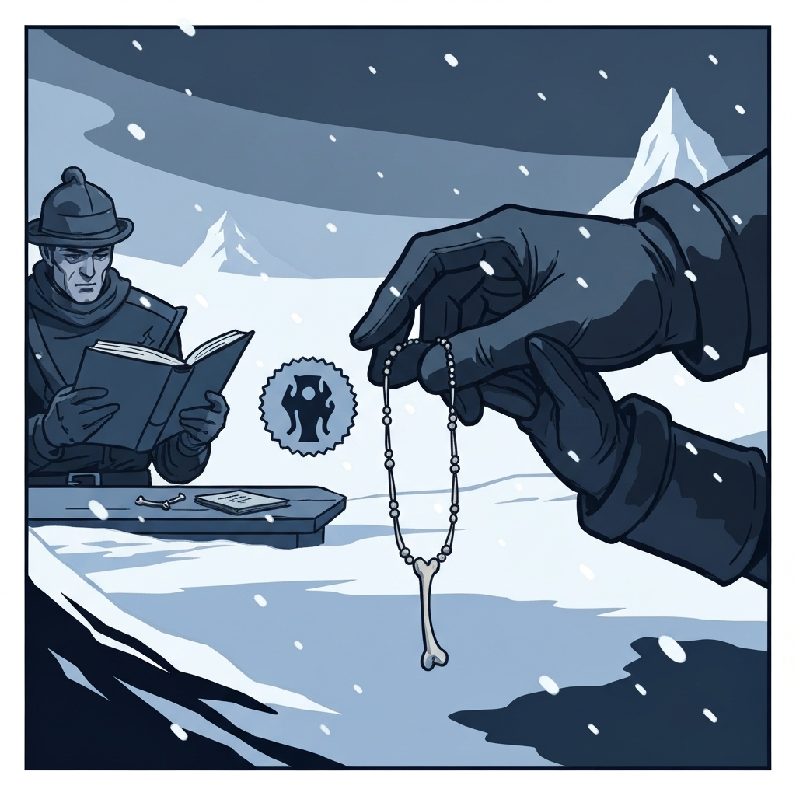
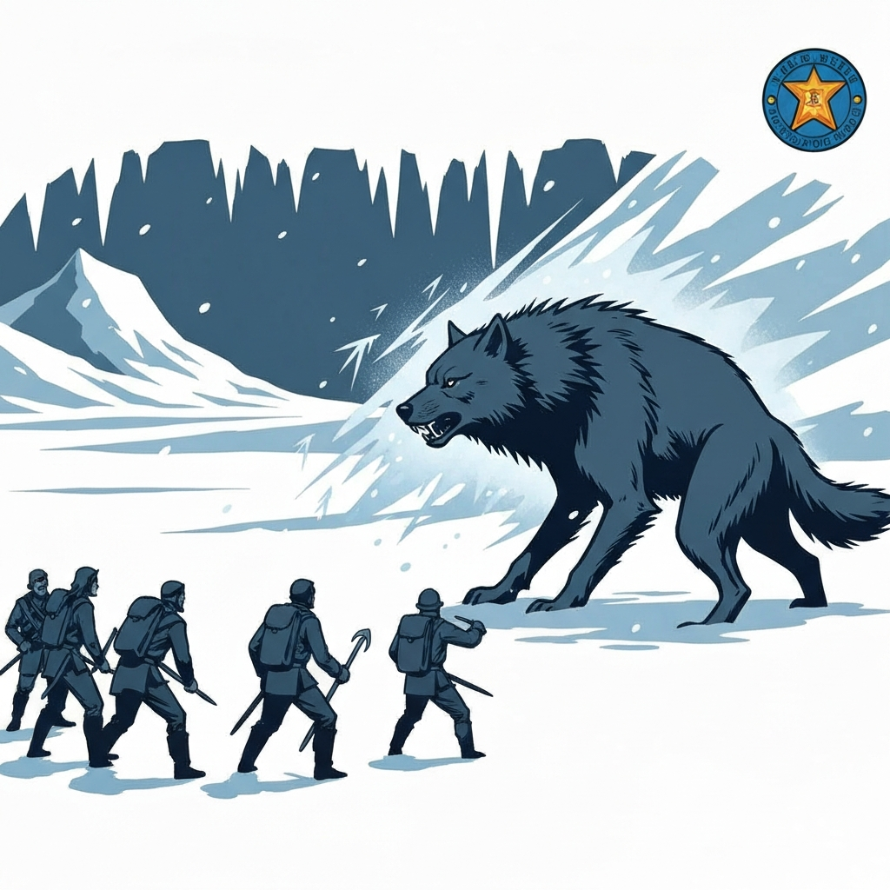
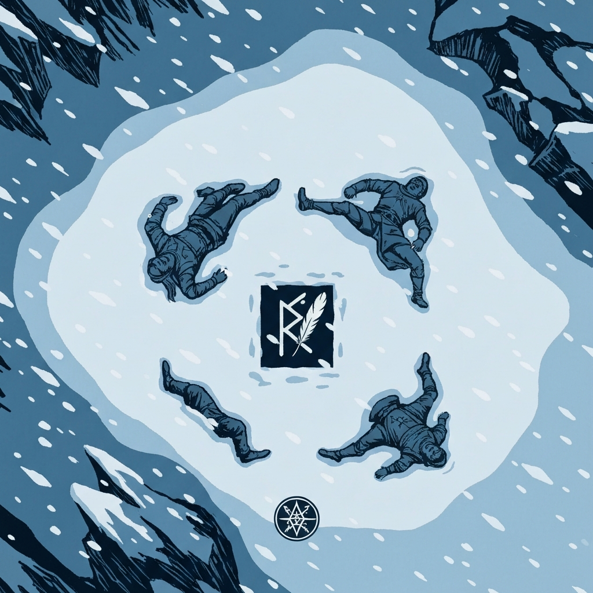

# Session 3 (May 9, 2026)

Back at the Coldpeak camp after a few days of rest, the party learned that Savin — the hunter who'd escorted them in — was being quietly groomed for tribal leadership despite wanting nothing to do with it, and that Broken Tusk had been watching everyone with the patient eye of someone who has caught people lying for sixty years. The peace didn't last: a hunter returned with a mangled mountain ram and news that the creature had returned and the hunting party had gone missing. Broken Tusk suggested bringing the outsiders along; Kaarsk, the tribe's lead hunter, grumbled and relented — Berg speaking Orcish probably helped.

Getting there was its own ordeal. Kaarsk moved at a pace that required an Athletics check just to keep up, and a frozen river claimed both Alina and one of the hunters before Dr. Medicine could pull them out. The hunter didn't make it back to full fitness; Kaarsk sent him home with an escort and pressed on with just the party. The blizzard had cleared, which should have been a relief, but the quiet stretch of rest they found by a cliff was interrupted by a snow creature forming from the air and blasting cold, followed immediately by an Ice Toad and three Ice Mephits. Berg went into the toad's mouth. Everybody had a bad time. The toad left behind a potion and a handful of intricate bone masks when it died, which Dr. Medicine immediately began mentally pricing.

Kaarsk then led them somewhere he clearly felt ambivalent about: a shaman's sacred spring — warm, verdant, impossibly out of place in the Arctic cold. A small muddy creature had taken up residence and declared itself the Guardian, ready to trade. Dr. Medicine, in his element, traded a regular dagger (rebranded as the Dragonlord's Dagger, Guardian of That Mountain Over There) and some baubles for the spring guardian's one magical item — a sending stone. The spring guardian departed to guard its new mountain. Inside the shaman's yurt, the party found a journal belonging to Durok Deepseeker — the tribe's missing shaman — which told an unsettling story: a rockslide had revealed something buried in the mountain, a staff had started whispering to him, he'd named a great beast Rimetalon and begun sharing power with the local wildlife, the standing stones that were keeping voices at bay had failed, and the last entry mentioned a stolen runestone and a lesson to be taught. The mud guardian, the party realized, had been that lesson. The necklace and herbs in the yurt also quietly disappeared into someone's pockets while Kaarsk wasn't looking.

Leaving the spring, wolves circled them — herding rather than attacking, accompanied by something whispering *meat, meat, meat* on the wind. The large wolf who led the pack could speak, and called the party food for her children before breathing a cone of ice that dropped Alina. It did not end well for the wolves. Berg drove a pike through the pack leader for 13 damage and that was the fight's turning point. Kaarsk skinned the wolves afterward and gave River a nod for helping — high praise. The large wolf had been wearing a bone necklace with a name on it: Chanon.

The party returned to camp to find the missing hunters had made it back the night before. The tribe celebrated. Then a scream from outside, and two orc guards dead in the snow, their bodies arranged around a rune of goat entrails with a single bloody white feather at the center. The rune read: *Soon.*

---

## Achievements

<!-- image_prompt: 1930s pulp adventure paperback illustration style, bold linework, limited color palette of deep blues and slate grays with stark white snow, flat simplified background, dramatic lighting, arctic Icewind Dale setting with snow and ice always present, absolutely no text, no letters, no words, no labels anywhere in the image — small circular badge icon, a figure being hauled out of a crack in frozen river ice by outstretched hands above, cold water visible below, bold simple shapes -->

<strong>Under the Ice</strong> — The frozen river took Alina under. Dr. Medicine got her out. The hunter who went in alongside her didn't make it back to full fitness; Kaarsk sent him home with an escort and pressed on.

<!-- image_prompt: 1930s pulp adventure paperback illustration style, bold linework, limited color palette of deep blues and slate grays with stark white snow, flat simplified background, dramatic lighting, arctic Icewind Dale setting with snow and ice always present, absolutely no text, no letters, no words, no labels anywhere in the image — small circular badge icon, massive bloated ice toad with armored boots visibly sticking out of its closed mouth, bold simple shapes -->

<strong>The Toad Ate Berg</strong> — The Ice Toad swallowed Berg whole. Berg objected, from the inside.

<!-- image_prompt: 1930s pulp adventure paperback illustration style, bold linework, limited color palette of deep blues and slate grays with stark white snow, flat simplified background, dramatic lighting, arctic Icewind Dale setting with snow and ice always present, absolutely no text, no letters, no words, no labels anywhere in the image — small circular badge icon, a charlatan solemnly presenting a plain dagger to a small muddy creature that gazes up at it in reverence, warm spring visible behind them amid arctic ice, bold simple shapes -->

<strong>The Dragonlord's Dagger</strong> — Dr. Medicine convinced the spring guardian to trade its one magical item for a regular dagger he renamed on the spot. The Guardian of That Mountain Over There departed to take up its new post. The sending stone is now in the party's hands.

<!-- image_prompt: 1930s pulp adventure paperback illustration style, bold linework, limited color palette of deep blues and slate grays with stark white snow, flat simplified background, dramatic lighting, arctic Icewind Dale setting with snow and ice always present, absolutely no text, no letters, no words, no labels anywhere in the image — small circular badge icon, a gloved hand silently lifting a bone necklace from a table while a hunter reads a journal in the background, bold simple shapes -->

<strong>While Kaarsk Wasn't Looking</strong> — The necklace and herbs from the shaman's yurt quietly disappeared into someone's coat while the tribe's lead hunter examined Durok's journal. No one mentioned it.

<!-- image_prompt: 1930s pulp adventure paperback illustration style, bold linework, limited color palette of deep blues and slate grays with stark white snow, flat simplified background, dramatic lighting, arctic Icewind Dale setting with snow and ice always present, absolutely no text, no letters, no words, no labels anywhere in the image — small circular badge icon, a massive wolf facing down a line of adventurers in open snow, frost visible in the air between them, bold simple shapes -->

<strong>Meat, Meat, Meat</strong> — A large wolf that could speak told the party they were food for her children. Berg drove a pike through her for 13 damage. Kaarsk skinned her afterward and gave River a nod for her part. High praise.

<!-- image_prompt: 1930s pulp adventure paperback illustration style, bold linework, limited color palette of deep blues and slate grays with stark white snow, flat simplified background, dramatic lighting, arctic Icewind Dale setting with snow and ice always present, absolutely no text, no letters, no words, no labels anywhere in the image — small circular badge icon, two fallen figures in snow arranged around a dark rune with a single white feather at its center, viewed from above, bold simple shapes -->

<strong>Soon</strong> — The party returned to find two guards dead in the snow, their bodies arranged around a rune written in goat entrails with a white feather at the center. The rune read: Soon.

