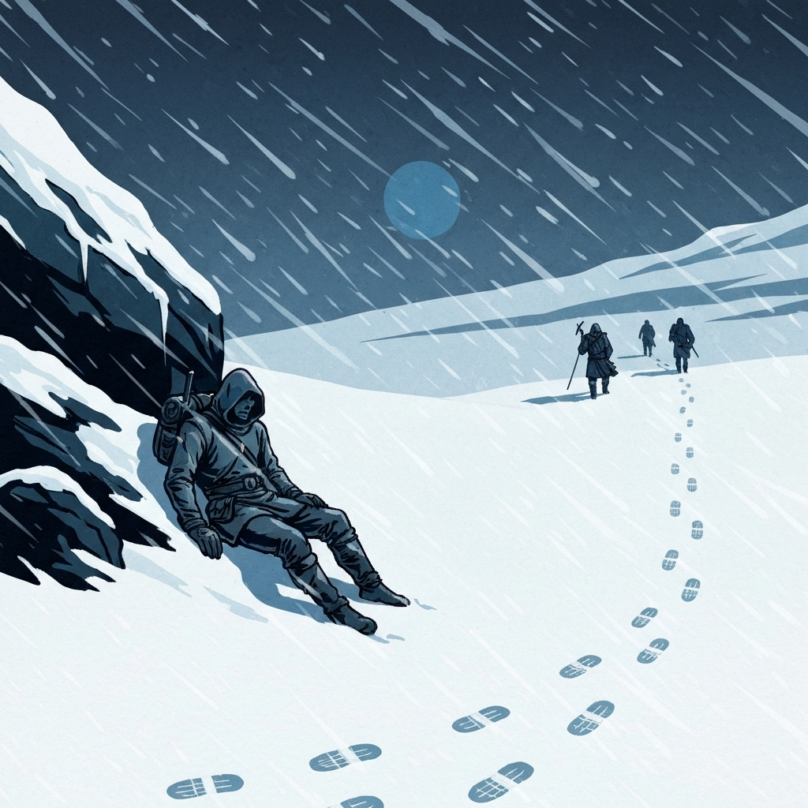
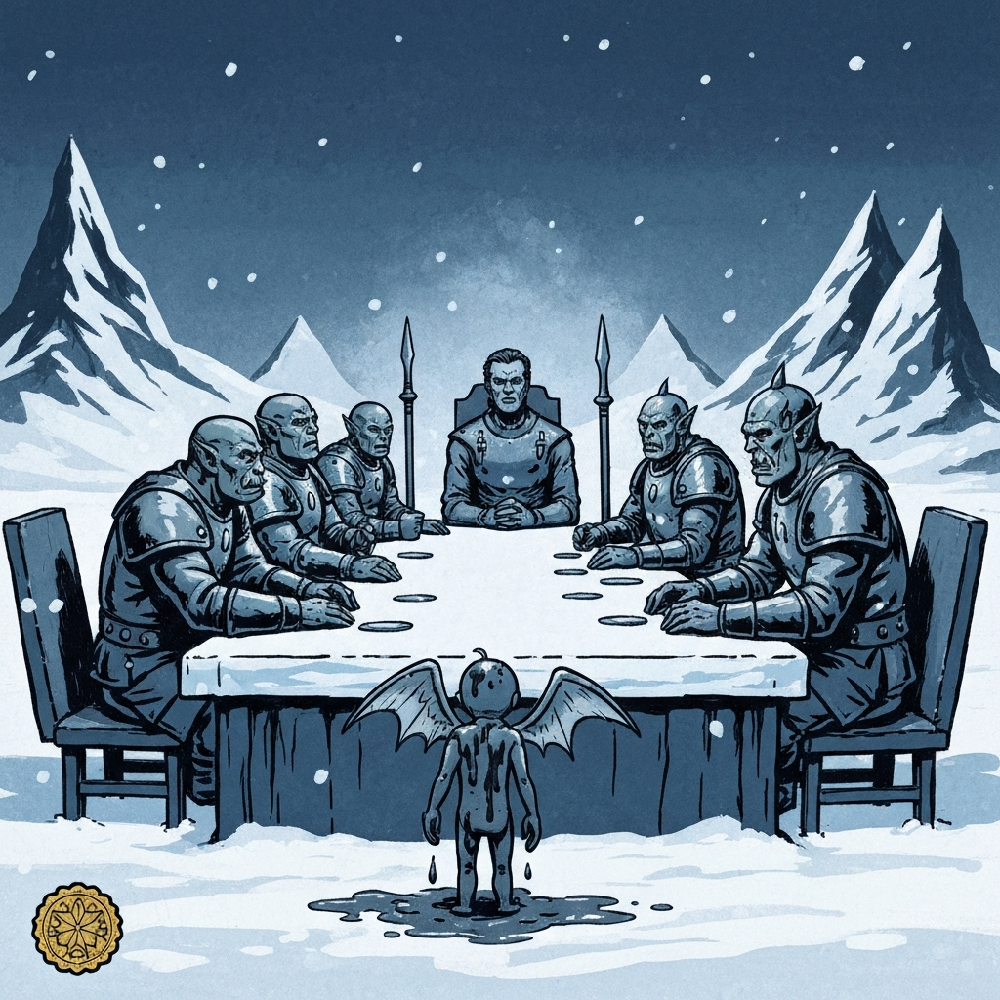
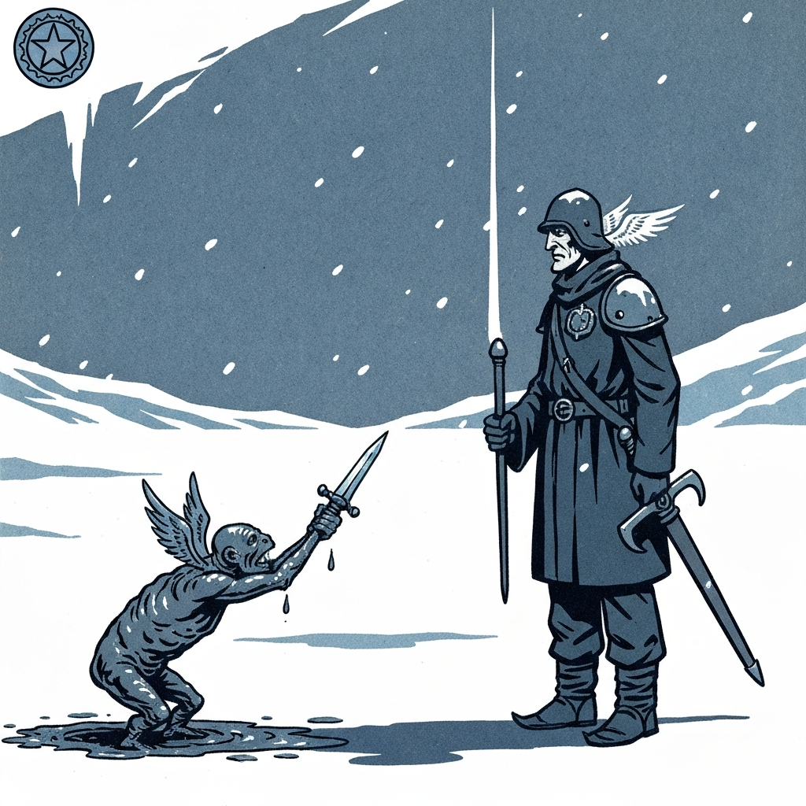
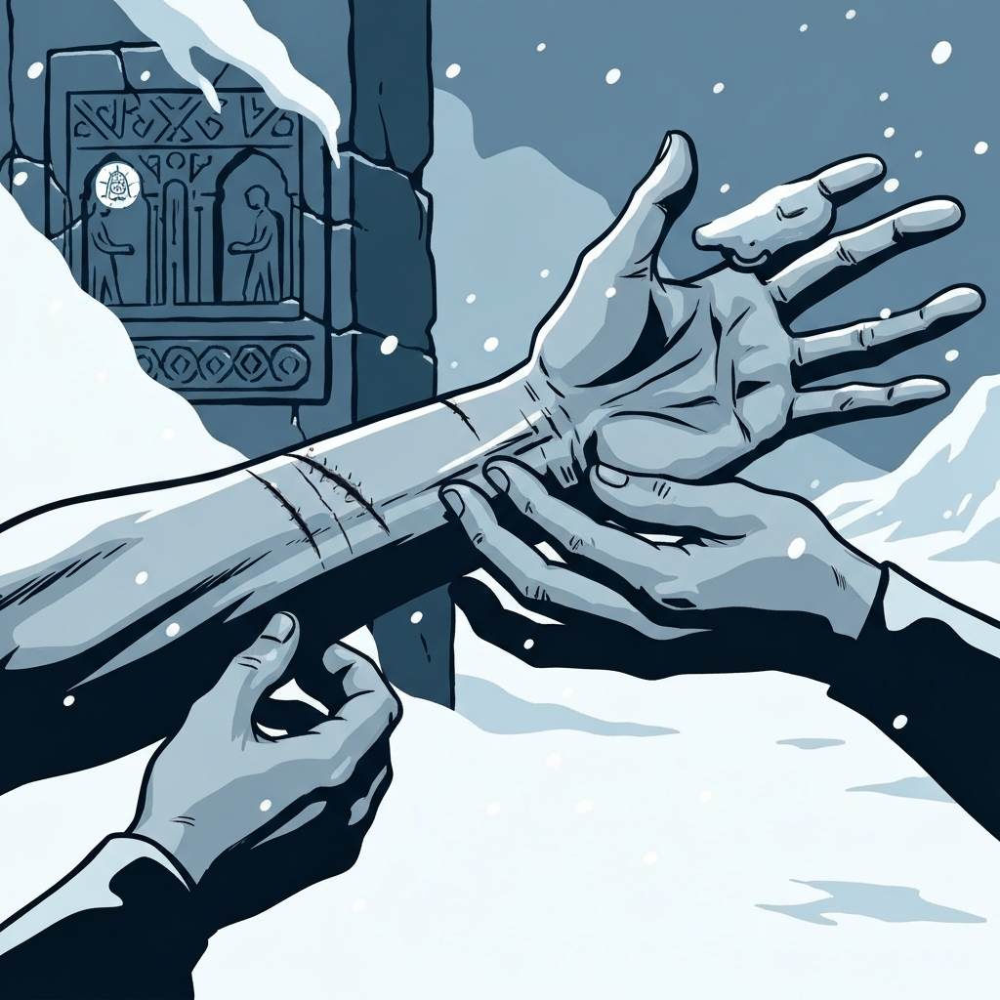
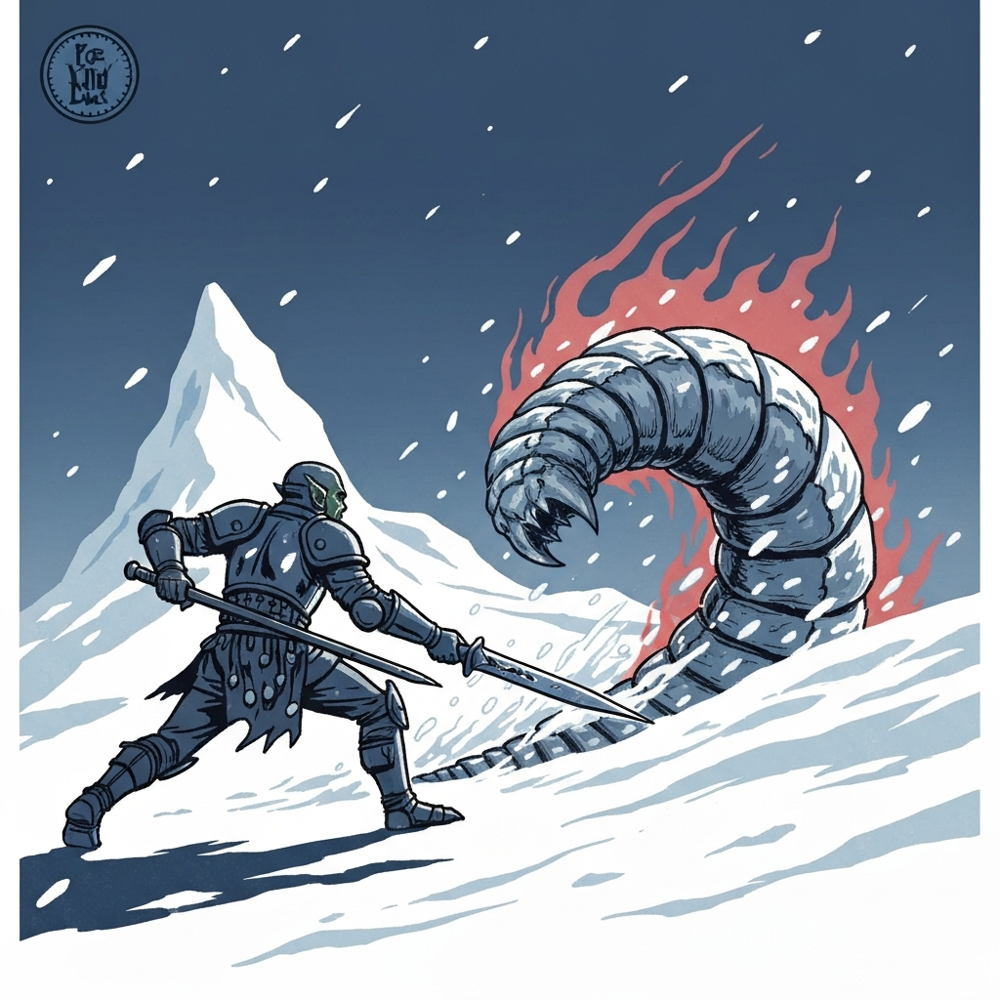
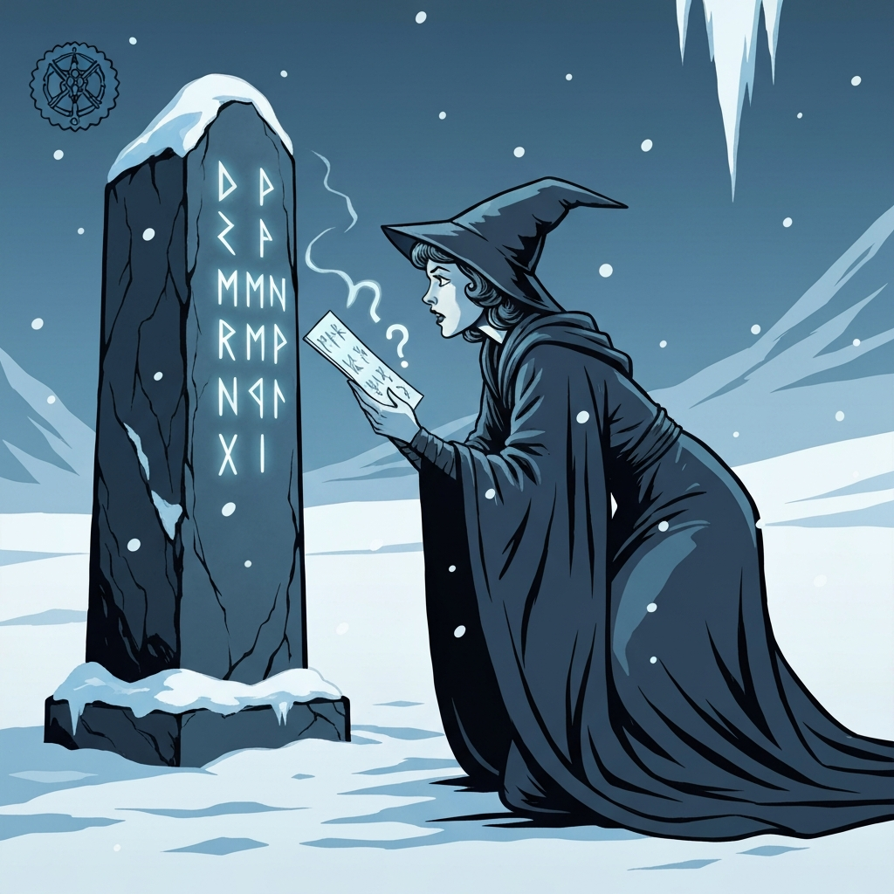

The Coldpeak camp was quiet in the way of places after something bad has happened in them. Two spears stood planted in the ground outside the main area — the tribe's vigil for the guards who'd been taken the night before. Kaarsk found Berg first thing in the morning and explained it plainly: the spirits of the fallen would not rest until their killer was confronted. They didn't need to kill the beast, merely confront it.

The morning's work was investigating Durok Deepseeker's disappearance. Savin agreed to escort them and warned the party on the way out about the mountain visible from camp. The tribe doesn't name it, doesn't look at it, tries not to think about it. Hunters who go close come back wrong; most don't come back at all. Savin had never felt the pull himself and asked that they not mention any of this to the rest of the tribe.

Durok's sacred spring was still warm, impossibly green for an arctic shelter, and unmistakably the workplace of someone who had been changed by proximity to old magic. Durok wasn't there. His journal was. The relevant entries: the staff had started whispering, the Sending Stones had been keeping voices at bay until they failed, someone had stolen one of his runestones, and he intended to teach that thief a lesson. (Obviously the thief had not yet been taught.)

From the spring they continued to the Netherese ruins. River felt the sting of the cold and picked up a level of exhaustion. Alina used a Potion of Comprehension to understand the symbols on the door: it was an academy built to train apprentice geomancers, associated with a city whose name slipped from memory every time she tried to read it. The crystals inside — one buried under the rockslide from Rimetalon's exit, four more at other locations — served as concentration anchors for some sustained spell of enormous power.

While Alina was reading, Savin had been quietly scratching at an old scar on his right hand. When the party asked, he said it had been itching and he couldn't quite remember when he'd gotten it. Berg rolled Medicine and took a close look: someone had tried to remove that hand at the wrist when Savin was very young, hadn't quite succeeded, and the wound had knitted closed over years. The pit of crawling right hands beneath the ruins — the one they'd crossed in the second session — was very much in everyone's recent memory. Nobody said anything out loud.

The dignitary arrived that evening. Clod — the mud mephit who had spent the intervening weeks guarding That Mountain Over There, per last session's arrangement — stepped into the tribal meeting area trailing mud and delivered its report: the mountain was pleased with Dr. Medicine, had offered Clod hands through cracks in the stones (Clod declined, having hands already), and wished to convey that Dr. Medicine remained its guardian. Clod returned the dagger, bowed with as much elegance as a three-foot-tall mud elemental with vestigial wings can manage, and departed. The tribe had prepared a small dinner. The diplomacy went smoothly.

Broken Tusk, asked about the mountain, confirmed the things the tribe pointedly didn't say: it doesn't appear on any maps, it shouldn't be there, and she could not protect anyone from what happened if they went close. She also mentioned that Durok, in past conversations, had spoken of Standing Stones to the east — nowhere near the mountain.

The party spent the next day prepping for an overnight expedition to those Standing Stones. Berg worked the blacksmith's forge, fixed weapons, and came away with two bear traps. Dr. Medicine helped with medicinal brewing and earned a healing potion. River attempted leatherworking. Alina had a quiet word with Broken Tusk, who had noticed Durok's journal and asked, not unkindly, whether their paths were toward the same destination. Alina also added Comprehend Languages to her spellbook, anticipating a need to translate more Netherese runes.

The Standing Stones sat in open ground: dark rock with silverish metal flecks that held cold the way iron holds heat. The party set up camp. Savin and Pasha handled the perimeter. Alina began studying the runes. The others kept watch and rolled Perception. None of them rolled well enough.

The Remorhaz came up through the ground during the research. Dr. Medicine used Step of the Fey to relocate sixty feet back, gave Berg ten temporary hit points via Refreshing Step, and opened with a Witch Bolt upcast to second level for sixteen lightning damage. Berg took thirteen fire from the Remorhaz's heat aura, used Second Wind, then charged back in for twenty-six damage on the killing blow. River landed a sneak attack for fourteen. Alina dropped Comprehend Languages when the fight started and threw a second-level spell into the creature for twenty lightning damage. The Remorhaz died bloodied from Berg's charge. From its stomach: a Wand of Magic Missiles, which had survived because it was magical. The hide was going to interest the leatherworkers of the orcish tribe.

From the full night of interrupted research, Alina retained one thing: a Netherese phrase that translated to "the city that never was." That was the associated city's name — or as close to it as the inscription would let her get. The actual name slipped every time she tried to look directly at it.

Pasha left the next morning to rejoin the Elk tribe. The Standing Stones needed at least one more visit.

---

## Player Highlights

**Berg** — 

**Dr. Medicine** — 

**River** — 

**Alina** — 

---

## Achievements

<!-- image_prompt: 1930s pulp adventure paperback illustration style, bold linework, limited color palette of deep blues and slate grays with stark white snow, flat simplified background, dramatic lighting, arctic Icewind Dale setting with snow and ice always present, absolutely no text, no letters, no words, no labels anywhere in the image — small circular badge icon, a hooded traveler collapsed against a boulder in blowing snow, footprints of the rest of the party continuing ahead through the blizzard, bold simple shapes -->

<strong>Cold Snap</strong> — River failed the Constitution save on the walk to the ruins and picked up a level of exhaustion. The cold in Icewind Dale is not a story element. It is a stat that decrements.

<!-- image_prompt: 1930s pulp adventure paperback illustration style, bold linework, limited color palette of deep blues and slate grays with stark white snow, flat simplified background, dramatic lighting, arctic Icewind Dale setting with snow and ice always present, absolutely no text, no letters, no words, no labels anywhere in the image — small circular badge icon, a tiny mud-dripping creature with small wings being solemnly received at a long table by orc guards while a warlock sits at the head looking composed, bold simple shapes -->

<strong>Official Visit</strong> — The tribal guard announced that a dignitary of newly elevated station had arrived and would speak only to Dr. Medicine. The tribe prepared a small dinner. The dignitary was Clod. The diplomacy went smoothly.

<!-- image_prompt: 1930s pulp adventure paperback illustration style, bold linework, limited color palette of deep blues and slate grays with stark white snow, flat simplified background, dramatic lighting, arctic Icewind Dale setting with snow and ice always present, absolutely no text, no letters, no words, no labels anywhere in the image — small circular badge icon, a tiny mud creature bowing and presenting a dagger upward to a warlock with small wings spread behind it in a gesture of ceremony, bold simple shapes -->

<strong>Still a Guardian</strong> — Clod returned the dagger, confirmed the mountain was pleased, reported that it had offered hands through the cracks in the stones (Clod had declined), and formally re-designated Dr. Medicine as guardian. The title had apparently never lapsed.

<!-- image_prompt: 1930s pulp adventure paperback illustration style, bold linework, limited color palette of deep blues and slate grays with stark white snow, flat simplified background, dramatic lighting, arctic Icewind Dale setting with snow and ice always present, absolutely no text, no letters, no words, no labels anywhere in the image — small circular badge icon, a close view of a scarred wrist being examined by careful hands, worked Netherese stone ruins visible as carvings on a wall behind them, bold simple shapes -->

<strong>When Did You Get That</strong> — Savin had been scratching at an old scar on his right hand. He didn't know when he'd gotten it. Berg's Medicine check filled in the details: someone had tried to remove that hand at the wrist when Savin was very young. The pit of right hands beneath the ruins was still fresh in everyone's memory.

<!-- image_prompt: 1930s pulp adventure paperback illustration style, bold linework, limited color palette of deep blues and slate grays with stark white snow, flat simplified background, dramatic lighting, arctic Icewind Dale setting with snow and ice always present, absolutely no text, no letters, no words, no labels anywhere in the image — small circular badge icon, an armored orc charging forward with a pike leveled at a massive segmented arctic creature surrounded by heat shimmer and melting snow, bold simple shapes -->

<strong>Second Wind, Then Charge</strong> — The Remorhaz came up through the ground at the worst possible moment. Dr. Medicine led with Witch Bolt, River landed a sneak attack, Alina dropped her concentration spell and hit it with lightning, Savin and Pasha put arrows into it from the perimeter. Berg took thirteen fire from the heat aura, used Second Wind, backed off, then charged back in for twenty-six on the killing blow.

<!-- image_prompt: 1930s pulp adventure paperback illustration style, bold linework, limited color palette of deep blues and slate grays with stark white snow, flat simplified background, dramatic lighting, arctic Icewind Dale setting with snow and ice always present, absolutely no text, no letters, no words, no labels anywhere in the image — small circular badge icon, a wizard leaning toward a tall standing stone reading glowing runes while her expression shifts to confusion as if the words she just read have already escaped her, bold simple shapes -->

<strong>The City That Never Was</strong> — A full night at the Standing Stones, interrupted by a Remorhaz, yielded one Netherese phrase: the city that never was. That was the name of the city the academy was built for. The actual name slipped every time Alina tried to hold it.

---

## Rewards

- **Gold**: *(TBD)*
- **Wand of Magic Missiles** *(uncommon)* — recovered from the Remorhaz's stomach; survived the heat because it was magical.
- **Potion of Healing** — crafted by Dr. Medicine during tribe prep.
- **Remorhaz hide** — traded to the Coldpeak blacksmith.
- **Bear traps** (×2) — traded from the blacksmith in exchange for forge work.
- **Common magic item**: Talking Doll *(to be confirmed next session)*
