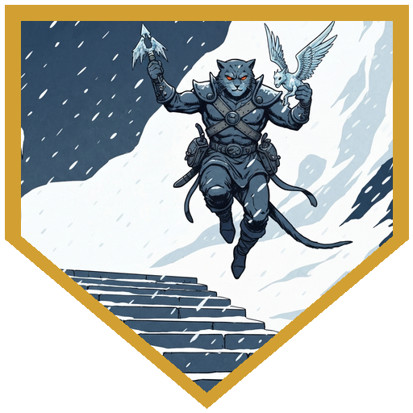
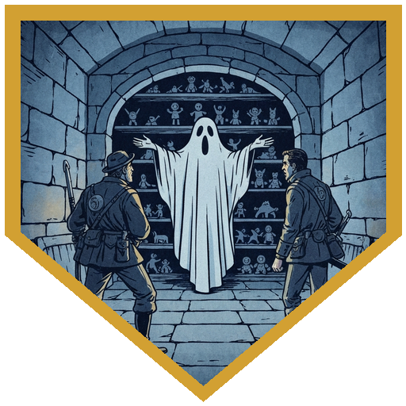
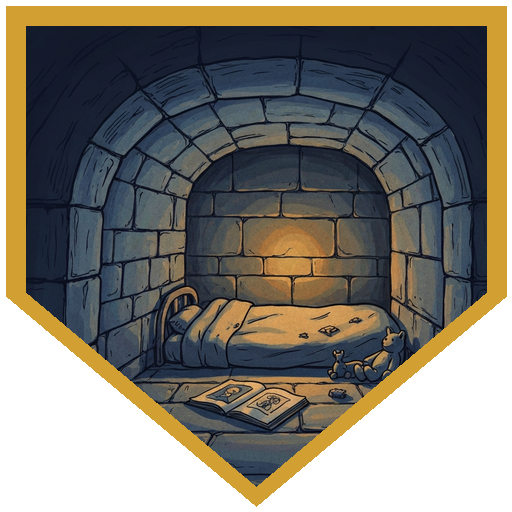
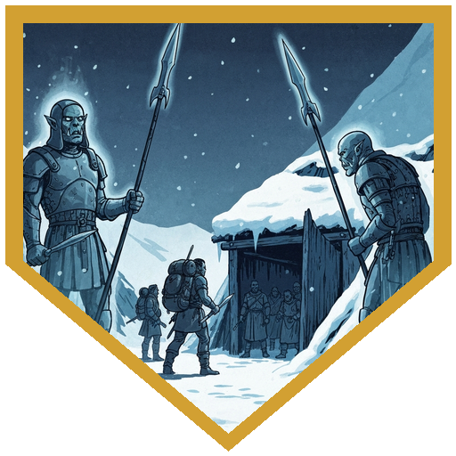

[**Pasha**](../npcs/pasha) left at first light — she had a tribe to find, and whatever supplies the caravan had been carrying were no longer the party's problem. With her gone and [**Savin**](../npcs/savin) quiet at the perimeter, the group's highest Perception roll landed on something they'd missed in last night's chaos: the [**Shaping House**](../locations/shaping-house) — a crèche, visible from the [**Standing Stones**](../locations/standing-stones) camp. Not collapsed, not weathered to rubble — *sheared*, as if someone had taken a level cut at a comfortable height and removed everything above it. Before reaching the ruins, [**Dr. Medicine**](../characters/dr-medicine) found something in the debris field: a child's doll with no face, no mouth, and a right arm ending at the wrist. It spoke anyway, in a child's sing-song Netherese that only became legible once [**Alina**](../characters/alina) brought Comprehend Languages to bear. The intent: *sacrifice for the empire.* You are a citizen of Irenthal. Your right hand is a gift you give so others may be safe. The doll had been made to prepare a child for what was coming — and it named the city that the Standing Stones inscriptions had refused to hold in memory. Dr. Medicine pocketed it.

Six ice mephits had claimed the ruins' upper approach, which had once been a reception area — the room where parents came to visit before children were brought up from the levels below. The mephits filled it with Frost Breath and Fog Cloud and made the party work for the stairs down. [**River**](../characters/river) solved the geometry problem directly: jumped off the landing, grabbed one mephit out of the air on the way down, and absorbed two points of falling damage alongside it. [**Alina**](../characters/alina) hit a different one with a natural 20 Fire Bolt, which turned out to be particularly productive given the mephits' fire vulnerability. [**Berg**](../characters/berg) Action Surged a javelin through the last aerial one. When the fight was over, the broom that had been quietly sweeping the landing came down the stairs and stood next to Dr. Medicine.

Below, the cold stopped. The air inside was warm in a way that had nothing to do with fire. The floor was swept. Everything in the children's common area was set down mid-use — a cup on a table, small books on shelves, the linens long since decayed but the beds still made underneath. The party found the caretaker's journal: a spellbook belonging to a wizard named Igenio, who had been outside when the building's upper floors were removed. The children had gone with it. He spent the rest of his life doing Divinations trying to find them. His journal didn't say how he died, because he hadn't lived to write the ending. The doll changed when Dr. Medicine carried it into one of the children's rooms — a second voice, softer and pitched differently from the propaganda recitation, spoke a single Netherese word that translated as *mother.* A small door in the corner swung open. Inside: a bedroll, stale rations, a child's clothing, small toys, a picture book. Someone had prepared a hiding place and left a message the doll could carry. The Empire had put its words in the doll. The mother had put one more in.

Igenio's ghost manifested fully once the party had been there long enough. He tried to possess someone — Charisma save, failed — then planted himself between Dr. Medicine and Alina and screamed, dealing thirteen psychic damage to those who failed the Wisdom save and leaving them frightened. Dr. Medicine had anticipated this: before the ghost appeared, he'd cast Protection from Good and Evil on [**Berg**](../characters/berg), making Berg immune to frightened and putting the ghost's attacks against him at disadvantage. Eldritch Blast hit at full damage — force bypasses resistance — while Berg's javelin, River's sneak attack, and Alina's sustained Witch Bolt and final Fire Bolt ground the ghost down. Its last words before it dissipated: *go to the safe room.* It had been looking for the children since the day the building left without it. On the way back to [**Coldpeak camp**](../locations/coldpeak-camp), two ghostly figures stood at the perimeter where the mourning spears had been planted — the shapes of [**Vroth and Orrak**](../npcs/vroth-and-orrak), who'd been killed by [**Rimetalon**](../npcs/rimetalon)'s beast. They didn't block the party. When Savin reached the front of the group, one of them turned its head toward him. Recognition. They stepped aside.

---

## Player Highlights

<strong>Dr. Medicine</strong> — He found the doll, translated what it was saying, and was holding it when it spoke the second voice's word and opened the hidden room. He also cast Protection from Good and Evil on Berg before the ghost fully manifested — the one spell that would matter most in the fight that followed. The broom started following him specifically.

<strong>Alina</strong> — Natural 20 Fire Bolt on a fire-vulnerable ice mephit. In the ghost encounter she sustained Witch Bolt through multiple rounds while also landing the Fire Bolt that ended it — hitting AC 14, five fire damage, halved to three by the resistance, which was exactly enough.

<strong>River</strong> — Five hit points going into the ghost fight. He'd spent most of the mephit encounter solving the fog problem by jumping off the landing, grabbing one mephit out of the air, and taking two points of falling damage alongside it. He kept swinging through the ghost encounter at 5 HP until it was done.

<strong>Berg</strong> — Protection from Good and Evil meant the ghost's attacks had disadvantage against him and he couldn't be frightened while the rest of the party took thirteen psychic damage. He Action Surged a javelin through the last aerial mephit, then used Bait and Switch to reposition Alina out of the ghost's reach during the fight.

---

## Achievements

<strong>Sacrifice for the Empire</strong> — A faceless doll with a missing right arm, speaking Netherese in a child's sing-song. Alina translated the intent: things told to children to make it acceptable that they would give up their dominant hand to serve the mage academy of Irenthal. Also: it named the city the Standing Stones inscriptions had refused to let them remember.

<strong>Best Use of Gravity</strong> — The mephits had the high ground and the fog was working in their favor. River jumped off the landing, grabbed one out of the air on the way down, and absorbed two falling damage alongside it. The mephit's tactical advantage ended on contact with the floor.

<strong>Don't Forget Your Mother</strong> — The propaganda doll had one voice reciting the Empire's message. It had a second voice — softer, a different register — that spoke only the word "mother" in Netherese, which opened a hidden door in the children's rooms. Inside: a bedroll, small toys, a picture book. Someone prepared a hiding place and left a message only the child would hear.

<strong>He Never Left</strong> — Igenio's journal documented a lifetime of Divinations trying to find children who had vanished when the building was removed around him. His ghost was still in the nursery when the party arrived, still reaching toward the children's things, still trying to send visitors to the safe room. The building had been gone for centuries. He had not stopped looking.

<strong>They're Still at Their Post</strong> — Two ghostly figures stood at the Coldpeak camp perimeter where the mourning spears had been planted — the shapes of Vroth and Orrak, who'd been killed by the beast. They didn't block the party. When Savin reached the front of the group, one of them turned its head toward him. Recognition. They stepped aside.

---

## Rewards

- **Gold**: 50 gp each
- **Baba Yaga's Dancing Broom** *(uncommon)* — all players. The nursery broom had been sweeping for centuries. Magic action activates it as an animated broom that acts immediately after your initiative; bonus action to deactivate. Attunes in 1 minute (Harmonious property).
- **Keoghtom's Ointment** *(uncommon consumable)* — all players; found in the caretaker's medicine cabinet. 1d3+1 charges; each charge neutralizes one poison, heals 2d8+2 hit points, or cures one disease.
- **Enduring Spellbook** *(common)* — Igenio's spellbook and journal, recovered from the caretaker's quarters. Can't be damaged by fire or water; doesn't deteriorate with age.
