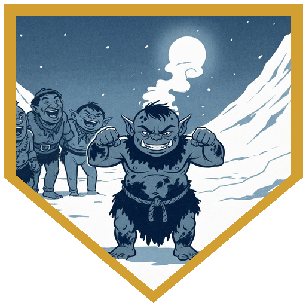
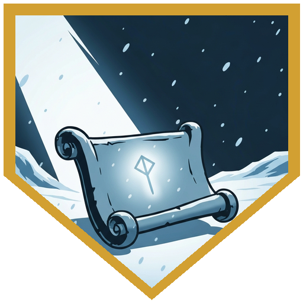
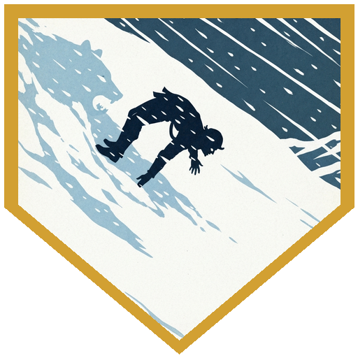
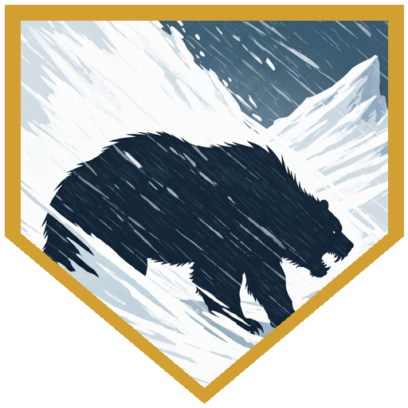
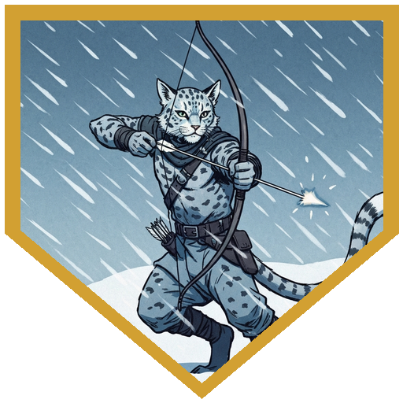

The party returned to the [**Coldpeak camp**](../locations/coldpeak-camp) to familiar tensions. The two slain sentinels still held their post in a ghostly form at the camp perimeter — [**Vroth and Orrak**](../npcs/vroth-and-orrak), killed by [**Rimetalon**](../npcs/rimetalon) weeks ago, neither resting nor moving on. [**Broken Tusk**](../npcs/broken-tusk) had news: a runner had arrived; the Elk Tribe would be coming. [**Kaarsk**](../npcs/kaarsk) received this information the way he receives most information involving outsiders — with visible restraint and a glance at the food stores. The party split to their tasks. [**Berg**](../characters/berg) went with Kaarsk to check the traps; [**Dr. Medicine**](../characters/dr-medicine) returned to the brewer's workshop; [**Alina**](../characters/alina) stayed with Broken Tusk. Out at the traps, Berg rolled an 8 on Survival — enough to confirm that something had been raiding them deliberately: animals torn free, the same pattern across every site. Not opportunistic scavenging. Something was trying to starve the camp. At the brewer's workshop, an orc child named Dak had filled Dr. Medicine's spice pouch with soured goat milk — a tradition called gunting, reserved for people who take themselves too seriously. The natural 20 Constitution save meant Dr. Medicine wasn't retching, just covered in it. Prestidigitation: strawberry. [**River**](../characters/river), working the tannery nearby, caught the kid on a 22 Perception, repaid him with hide scrapings, and both of them walked away having earned something in the camp's estimation. The brewer formalized the gift: Heward's Handy Spice Pouch, Repulsive property, which opens perfectly every time and smells exactly like the worst thing you've ever smelled. With Broken Tusk, Alina rolled an 18 on History: the Elk Tribe's leader Ragnhild had a complicated history with the clan — Broken Tusk's sister had married in and died while travelling with them; Savin, her son, had been injured shortly after. Broken Tusk gave Alina an Augury scroll. She wanted to know: would it be good or bad for the Elk Tribe to stay? The answer was woe. Not mixed. Woe.

The Elk Tribe arrived at sundown — no extra food, they were in crisis too, and the doubled camp doubled the mouths to feed. [**Pasha**](../npcs/pasha) had caught up with them on the road and was back. Kaarsk stood at the edges of the feast barely containing himself. River and Dr. Medicine brought up the owlbear. The revelation that it had been targeting the traps specifically — not hunting, *targeting* — shifted both chieftains' attention. River promised the meat would be split equally between the camps — speaking off the cuff in a diplomatic meeting, about food both tribes were in crisis over. Both Broken Tusk and Ragnhild noticed. Kaarsk said what camps are owed food from their own land. River told him to get up and help, or stop complaining. Kaarsk stood, said nothing, grabbed his bow, and walked outside. The weather shifted: an instant blizzard, unnatural — the crackling sound of ice forming too fast. And then Pasha's body came through the air.

[**Rimetalon**](../npcs/rimetalon) had used her as a message. She had said *soon* back in their third session in these lands. She chose the diplomatic gathering, two tribes together, a feast that was already going poorly. She stood in the storm surrounded by whirling elemental flurries — ice elementals, one per camp section — and the flurries went to work on the orcs and Raghedsmen still exposed in the open while she focused on the party. Berg charged into position between Pasha and the creature. River moved to within 10 feet and opened with shortbow. Alina hit a flurry with Fire Bolt from the cave entrance and started pushing forward. Dr. Medicine cast Link — a blink mechanic, rolling each round to phase into the Ethereal — Misty Stepped through to give Berg temporary hit points, and kept it flowing in pieces across the fight. Kaarsk went in with an axe because it was his home and he was not going to stop. Rimetalon ground through Berg's hit points while Berg worked down the list: Bait and Switch for +6 AC, Second Wind, another Second Wind, Adrenaline Rush. Alina's Fire Bolt landed for 1 damage that turned out to be exactly enough to kill a flurry. Dr. Medicine's Eldritch Blast burst another. Then the storm around Rimetalon thinned — she was bloodied, her elemental armor shredding — and before the party could finish her she broke and fled into the blizzard. Kaarsk turned to the party: *I will defend the village. Go.* He stayed.

Ragnhild handed [**River**](../characters/river) her own shortbow. *Go get her killer.* Skill challenge: Alina tracked on an 18 Survival, Dr. Medicine hit the DC exactly on Perception, Berg failed once and made it on the second check. Three successes: the storm was thinner in pursuit, Rimetalon visible at 40 feet. Alina opened the chase with a second-level Witch Bolt for 27 lightning — full damage, no resistance. Dr. Medicine Misty Stepped to position, gave Berg 6 temporary hit points from Refreshing Step, Witch Bolted for 8 more. Berg closed the distance with Adrenaline Rush, Distracting Strike, Savage Attack, Action Surge — 13 damage, rerolled. Then River's ready action triggered with Berg adjacent: natural 20, sneak attack, 27 on the critical. Rimetalon fell. The blizzard thickened immediately. Back at camp, the Raghedsmen were packing. They had come here for safety and the camp had not been safe. Kaarsk had held the line alone while the party was in the field; he was very badly injured. There were fatalities on both sides. The augury had said woe, and the augury had been right. The party was level 5.

---

## Player Highlights

<strong><a href="../characters/river">River</a></strong> (Eric) — Caught Dak's second gunt attempt on a 22 Perception, paid him back in hide scrapings, and earned the camp's respect. Then survived the entire Rimetalon fight on diminishing resources, took Ragnhild's shortbow from her hands, chased the creature into the blizzard, and killed her with a natural 20 critical hit. 27 damage on the crit. That was the shot.

<strong><a href="../characters/alina">Alina</a></strong> (Dominic) — History 18 on the Raghedsmen gave Broken Tusk someone to actually talk to, and the Augury scroll answered woe before the evening had started. In the chase fight she opened with a second-level Witch Bolt for 27 lightning damage. She also killed the last air elemental flurry with a 1-damage Fire Bolt, which was exactly 1 more than it had left.

<strong><a href="../characters/dr-medicine">Dr. Medicine</a></strong> (Henry) — Natural 20 on the Constitution save versus soured goat milk, Prestidigitation to strawberry, and then back to work. In the fight he ran Link to phase in and out of the Ethereal while keeping Berg's temporary hit points supplied via Refreshing Step — two Witch Bolts, one Eldritch Blast that killed a flurry, and never in the same place for two rounds in a row.

<strong><a href="../characters/berg">Berg</a></strong> (Josh) — Found the trap raiding with Kaarsk and understood what it meant before anyone else did. In the fight he was the one Rimetalon kept swinging at: Bait and Switch, Second Wind, Second Wind again, Adrenaline Rush, 65 total damage received and still up. He used Distracting Strike to give River the advantage that made the killing shot land.

---

## Achievements

<strong>You Have Been Gunted</strong> — Dak filled Dr. Medicine's spice pouch with soured goat milk. The natural 20 Constitution save meant he wasn't retching, just covered. The brewer explained that gunting is a tradition of affection for people who are too serious. He also formally gave Dr. Medicine the pouch, because its Repulsive property means it will smell exactly like this every time he opens it for the rest of his life.

<strong>The Answer Was Woe</strong> — Broken Tusk gave Alina an Augury scroll and asked whether it would be good or bad for the Elk Tribe to stay. The answer was woe — strong, clear, no ambiguity. By the time the night was over, Pasha was dead, the Raghedsmen were leaving, and Kaarsk was badly injured. The scroll had been right.

<strong>Something Is Starving the Camp</strong> — Berg and Kaarsk checked the traps and found the same pattern at every one: animals torn free, deliberately. Not opportunistic scavenging — something had been making a point to find each trap and empty it. Kaarsk understood. He said nothing. There are still no answers about what, or why.

<strong>I Will Defend the Village</strong> — When Rimetalon appeared in the storm and the party needed to pursue her, Kaarsk turned and said: <em>I will defend the village. Go.</em> He held the perimeter alone with an axe he'd grabbed off a rack on his way out the door. The party came back to find him very badly injured and the Raghedsmen packing their camp.

<strong>Go Get Her Killer</strong> — Ragnhild gave River her own shortbow with four words: *go get her killer.* River chased Rimetalon into the blizzard, waited for Berg to get adjacent, and killed her with a natural 20 critical hit: 27 damage. The bow turned out to be a Shortbow of Warning. Ragnhild had known what she was giving away.

---

## Rewards

- **Rime Talon's Hide** — 200 gp value; recovered from the body
- **Scroll of Augury** — Alina
- **[Heward's Handy Spice Pouch]** *(uncommon)* — Dr. Medicine. Holds an unlimited supply of any mundane spice; minor property: **Repulsive** — smells exactly like soured goat milk every time it is opened
- **[Shortbow of Warning]** *(uncommon)* — party treasure; Ragnhild's bow, given to River to avenge Pasha. Advantage on initiative rolls for the attuned character and all allies within 30 feet; Guardian property: +2 initiative
- **Knucklehead Trout Bone Scrimshaw** — River; gift from Dak. Origin: Ten Towns (Berg, 16 History). How Dak got it is unknown
- **Level 5** — all characters

[Heward's Handy Spice Pouch]: https://www.dndbeyond.com/magic-items/9228723-hewards-handy-spice-pouch
[Shortbow of Warning]: https://www.dndbeyond.com/magic-items/9229199-weapon-of-warning
