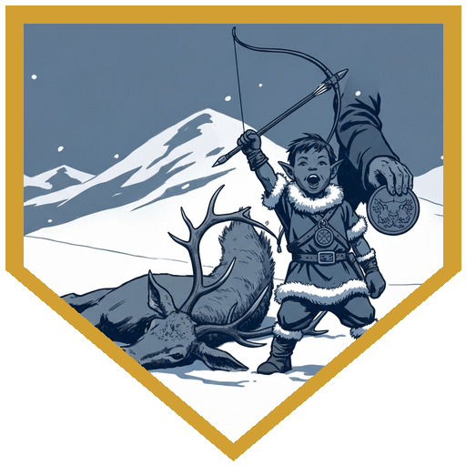
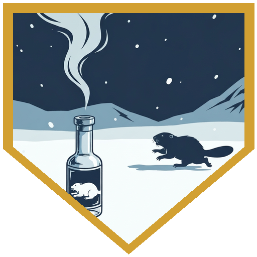
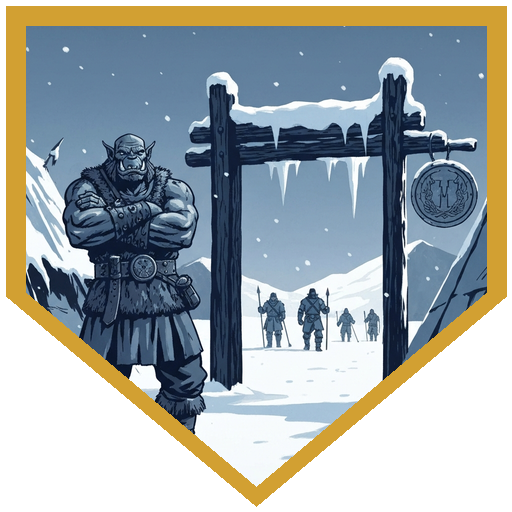
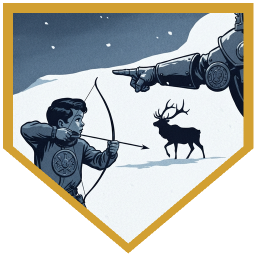
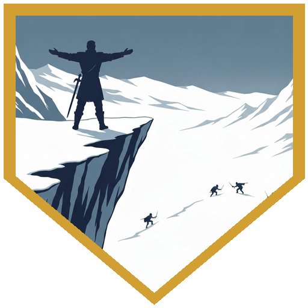

The [**Coldpeak camp**](../locations/coldpeak-camp) was quieter. [**Savin**](../npcs/savin) had gone with the Elk Tribe — the son of both peoples, heading out to smooth what couldn't be unsmoothed. The Raghedsmen were gone. The Haldef was complete: [**Vroth**](../npcs/vroth-and-orrak) and [**Orrak**](../npcs/vroth-and-orrak) had been sent on properly, their vigil finished. [**Berg**](../characters/berg) met with [**Broken Tusk**](../npcs/broken-tusk); [**Alina**](../characters/alina) and [**Dr. Medicine**](../characters/dr-medicine) tended to [**Kaarsk**](../npcs/kaarsk)'s wounds — a poultice that required applying to an injured orc warrior who kept trying to wave them off. [**River**](../characters/river) was out at the tannery. A newcomer found them there — [**Raydin**](../characters/raydin), sole survivor of a buried caravan, an Aasimar whose card tricks had gotten him into a dispute with some Elk Tribe members and whose only protection from a duel had been [**Pasha**](../npcs/pasha). Pasha was dead, the Elk Tribe had left, and Raydin didn't have many options. He joined for the hunt.

[**Broken Tusk**](../npcs/broken-tusk) had a harder ask. Kaarsk had to stay in camp — his injuries were real, and if he went out, others who should be healing would follow him. The trick was that Kaarsk didn't take orders, didn't respond to pity, and would see through a fake curse before anyone finished the sentence. The party ran a group insight check and hit 16. The right angle appeared: not weakness, not authority — framing. The camp needed someone to guard it. [**River**](../characters/river) delivered the words, and Kaarsk heard them and didn't argue. No persuasion roll needed. Shortly after, Dak found River by the tannery. His parents had been injured in the Rimetalon attack; he was about to come of age; River had been the one who'd pranked him back, and his name had been in the hunters' talk ever since. He wanted to come on the hunt. River looked at the leather worker father Dak had dragged along as an audience, saw the man's face, and said yes. Before they set out, Dr. Medicine handed Dak something he called beaver repellent. Dak covered himself in it. It smelled awful. Dr. Medicine had returned the gunting.

River organized the Cold Peaks hunters with a 13 on Persuasion. The group Survival check found a strong herd, healthy enough that taking some wouldn't hurt it. The Stealth approach came back a straight pass — Dak counted as a failure (he'd been talking since they left camp and trailed a powerful vinegar smell that no elk had ever encountered before), but the rest carried it. River opened with a natural 20, one elk clean. Berg hit twice and expended a Superiority Die on Distracting Strike. Dr. Medicine said *give it to Dak*, and Berg did. Dr. Medicine put 25 on an Eldritch Blast and took another elk. Alina launched Magic Missiles. [**Raydin**](../characters/raydin), new to the party and dealing his magic out through a deck of cards, Quickened a second Eldritch Blast and rolled a natural 20 on it. Dak rolled 21 with advantage and an elk came down. Then Dak walked over to start field-dressing the kill and the elk got up and kicked him. The shot hadn't been enough. One round, everything the party had: River Nat 20'd again, the rest piled in. Dr. Medicine used his healer's kit and Dak came up disoriented and ashamed. River gave him the explanation: *dead run. The elk can run after it's dead — it's not dead because you didn't kill it, but it's bleeding out.* Persuasion 11. More than enough for a thirteen-year-old who wanted to believe.

They found a second herd on four-plus successes of Survival, spotted it with advantage on Perception — and saw hunters on the far side they recognized by their furs. The Elk Tribe's hunting party. The camp had less than a minute to decide. Dr. Medicine stepped through Misty Step to the top of a cliff and rolled a 23 on Performance. The Elk Tribe hunters saw the signal, moved over quietly, and the two groups worked the herd together. The Cold Peaks party persuaded their own hunters that sharing was sound. They coordinated, took what both camps needed, and the Raghedsmen went home with food. One of the Elk Tribe hunters pressed a fur cloak into the party's hands before they separated: functions as a Cloak of Protection, +1 to AC and saving throws, with a Temperate property that keeps the wearer warm in any cold.

---

## Player Highlights

<strong><a href="../characters/alina">Alina</a></strong> (Dominic) — Applied a painful, effective poultice to Kaarsk's wounds while he grumbled about it — the medicine worked precisely because it wasn't gentle. Her contribution to the group insight check helped find the framing that kept Kaarsk in camp without a fight. In the hunt she deployed Magic Missiles at second level, taking down one elk and putting hits on another, and her roll on the initial Survival check helped the group find a healthy herd to begin with.

<strong><a href="../characters/river">River</a></strong> (Eric) — River rolled a natural 20 to open the first hunt round, a natural 20 again to take down the elk that tried to trample Dak, and a 13 on Persuasion to convince the hunters to follow her plan. When Dak came back disoriented and ashamed, River invented "dead run" on the spot, applied a Persuasion 11 to a thirteen-year-old, and successfully gave the kid his coming-of-age. That's a 3-for-3 session.

<strong><a href="../characters/dr-medicine">Dr. Medicine</a></strong> (Henry) — Returned the gunting by handing Dak a vial of something terrible before the hunt and calling it beaver repellent. Misty Stepped to a cliff with less than a minute to decide, rolled 23 on Performance, and brought two tribes' hunting parties together around a single herd. Also used the Healer feat to bring Dak back up after the elk incident, and was the one who said *give it to Dak* at exactly the right moment.

<strong><a href="../characters/berg">Berg</a></strong> (Josh) — Berg Adrenaline Rushed into melee range during a hunting expedition, hit twice, then used Distracting Strike not for himself but to give advantage to Dak. When Dr. Medicine said *give it to Dak*, Berg had already been thinking the same thing. Dak rolled 21 and took the elk. Berg was also part of the group that cracked the Kaarsk problem — the insight check that found the right framing before anyone had to argue it out.

<strong><a href="../characters/raydin">Raydin</a></strong> (Nadir) — Joined mid-session as a stranger with a deck of cards and nowhere else to go — his original caravan destroyed, his Elk Tribe card-game troubles resolved by Pasha, who is now dead. In the hunt, he Quickened a second Eldritch Blast and rolled a natural 20 on it, cards spinning overhead and turning into eldritch energy on the way down. First session in, first critical hit landed.

---

## Achievements

<strong>Dead Run</strong> — Dak walked over to field-dress the elk he thought he'd killed, and the elk stood up and kicked him. River dropped it on a second natural 20, Dr. Medicine brought Dak back with the healer's kit, and River explained the situation: *it'll run — it's not dead because you didn't kill it, but it's bleeding out.* Persuasion 11 on a thirteen-year-old who needed to believe it. He believed it.

<strong>Beaver Repellent</strong> — Before the hunt, Dr. Medicine handed Dak a vial and explained that sprinkling it on your arms keeps beavers away. Dak covered himself in it. The beaver repellent smelled terrible. Dr. Medicine had returned the gunting — the Cold Peaks tradition of pranking someone who takes themselves too seriously, which Dak had started on Dr. Medicine the session before. The elk's opinion of the smell was also negative.

<strong>You Are Needed Here</strong> — Broken Tusk needed Kaarsk kept in camp without an order, a fake curse, or a pity argument — none of those would work on him. The party hit 16 on a group insight check and the angle appeared: the camp needed someone to watch it. River delivered it. Kaarsk heard it, recognized it as true, and didn't push back. No persuasion was required because the right words don't need to be sold.

<strong>Give It to Dak</strong> — Berg hit his target, expended a Superiority Die on Distracting Strike, and paused. Dr. Medicine's response was immediate: *give it to Dak.* Berg assigned the advantage to the kid. Dak rolled 21. The elk went down. Berg had Adrenaline Rushed into melee range during a hunt specifically so a child could have a better shot at his first kill.

<strong>One Signal</strong> — When the Elk Tribe's hunters appeared across the second herd, there was no sun for a mirror signal and less than a minute to decide. Dr. Medicine Misty Stepped to the top of a cliff and rolled a 23 on Performance. The Elk Tribe hunters saw it, came over, and worked the herd alongside the Cold Peaks party. Both tribes went home with food. The party had to spend one action convincing their own hunters the cooperation made sense.

---

## Rewards

- **Gold**: 45 gp each (225 gp total, reduced from standard 250 — the rest went to the Elk Tribe in the cooperative hunt)
- **Downtime**: 10 days
- **Advancement**: level (optional — party declined)
- **[Cloak of Protection]** *(uncommon, requires attunement)* — a fur cloak from the Elk Tribe hunters, gifted in recognition of the cooperation. +1 bonus to AC and saving throws. Minor property: **Temperate** — the wearer always feels comfortably warm regardless of natural cold.
- **Common magic item** *(TBD)* — not decided in time; will be awarded at the start of the next session

[Cloak of Protection]: https://www.dndbeyond.com/magic-items/4607-cloak-of-protection
