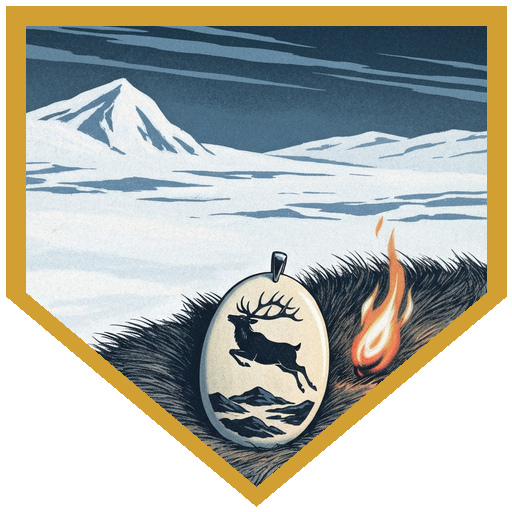
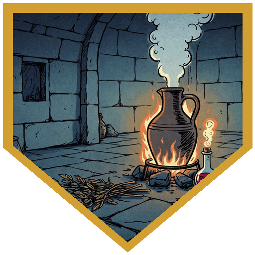
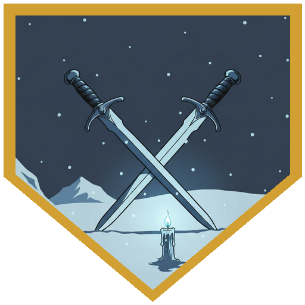
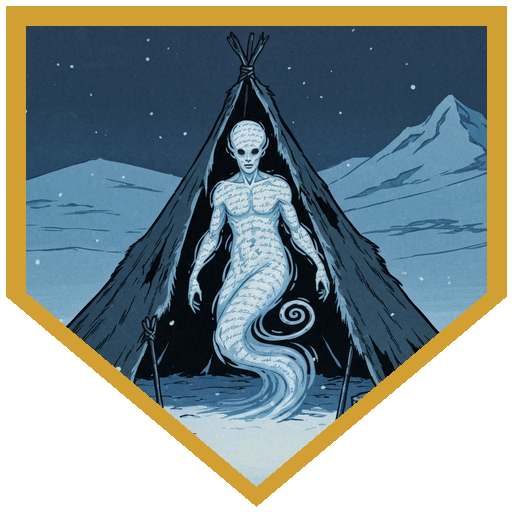
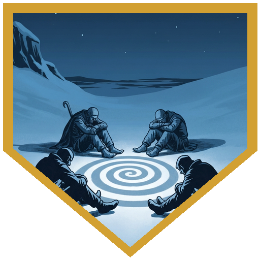

[**Roaring River**](../characters/river) walked [**Dak**](../npcs/dak) home to his parents, Skara and Borsk. Skara was already carving a memory-bone for Dak's first hunt by the firelight when they arrived. Afterward, she pulled River aside to ask what really happened out there — the "dead run." River framed it carefully: not a cover-up, just the truth shaped the right way. The elk would have come down on the others regardless, and Dak had already done everything a first hunt asks of a boy — he didn't need to prove it again. The Persuasion roll came with advantage for hitting exactly the angle a worried mother needed, and it landed clean. Skara spent the rest of the visit asking River about his own life before Coldpeak.

Back at camp, the brewer [**Brekk**](../npcs/brekk) told the old story of Gunt the Fool — a long-ago watchman whose anti-ghost brew of garlic, river water, and fermented milk worked so well it drove off the ghosts, the other guards, and sleep itself, all at once. With the night watch thinned, the camp wanted something better. [**Dr. Medicine**](../characters/dr-medicine) took it on, rolling a 21 on Alchemist's Supplies — a clean success, with an unplanned bonus brewing up alongside it. Meanwhile [**Broken Tusk**](../npcs/broken-tusk)'s augury request — meant for Alina, who wasn't at the table tonight — fell to [**Berg**](../characters/berg), who rolled a 17 on Arcana and got the reading through clearly: [**Savin**](../npcs/savin), alone among the Coldpeak, has never felt the mountain's pull, and it traces back to his childhood — cultists who abducted him and tried to take his hand. He refused. The others gave it up willingly. The augury's answer came back the same single word as Session 6's: *Woe*. What it revealed about Savin, the party kept to themselves.

Then came [**Pasha**](../npcs/pasha)'s memorial — not a burial, Broken Tusk said, but something "for us." Berg led the rite, rolling Religion with advantage and guidance for a "dirty 29," the best roll of the night. All four of them stood for it. A blue glow rose over the grave, the candles, and the blades each of them held, and when it faded, every blade from the rite — Berg's, Dr. Medicine's, Raydin's, and River's — had become Moon Touched, glowing with their own light. Each of them walked away holding a Candle of the Deep: a cold blue-white flame that burns even underwater.

As Pasha's memorial wound down, an Elk tribe scout named [**Ulfe**](../npcs/elk-scouts) sought out Raydin specifically — the two had history, an old card-game debt, and Ulfe offered to forgive it entirely in exchange for help with his brother. That brother was [**Bjarne**](../npcs/elk-scouts), out at a cache site near [**the City that Never Was**](../locations/the-city-that-never-was), wearing a dead mage's Glamoured Studded Leather and speaking in a language nobody recognized. Ulfe had kept him restrained and intoxicated, trying to manage him until help could be found. By the time the party reached the tent, Bjarne was raving, acting erratically, and surrounded by wreckage — and under the babbling was a second voice, calm and clear once Comprehend Languages sorted it out, with Berg translating. It spoke Netherese. It said it had died a long time ago and shouldn't still be here. It had a wife and children once, and it had refused to go through with whatever the others gave up willingly — and lost everything for it. The locket the party offered was his — he recognized the woman and child pictured the instant he saw it — but recognition alone wasn't enough to reach him. It was Raydin's illusion, conjuring that same family back into being in front of him, that finally got through — just long enough for the babbling to ease, before the compulsion reasserted, worse than before, and the party found out what they were actually dealing with: an Allip, the lingering remnant of one of the City's own — someone who, like Savin, had been "partially taken" and never came back from it — riding inside Bjarne and turning Ulfe, [**Klaud**](../npcs/elk-scouts), and [**Snurre**](../npcs/elk-scouts) hostile with its babble all at once. Wisdom saves went around the tent — fail for 10 psychic damage and stunned, succeed for 5. Its touch hit Berg for 18 (Dr. Medicine, diagnosing: "the Lich cannot legally drain your life without your consent"), but Berg Second Wind'd back for 13 and put his pike through it twice — the second swing rerolled with Savage Attacker — and the Allip finally let go, the illusion of its family the last thing it saw. Bjarne came back to himself almost immediately, blinking at a tent full of armed strangers and three very confused friends. Raydin's Hypnotic Pattern had already caught all three hunters in a single trance — full effect, no allies caught in it — and while Klaud and Snurre stayed under, Berg knocked Klaud out cold with the flat of a dagger (advantage from the stun, a "dirty 20") and River dropped Snurre with a non-lethal rapier strike and a sneak attack. Ulfe stayed patterned too, undisturbed — Dr. Medicine's only note: nobody wake him up yet. Among what Bjarne had been wearing: Glamoured Studded Leather — given to the party, no longer wanting to be near it.

## Player Highlights

<strong><a href="../characters/river">Roaring River</a></strong> (Eric) — Walked Dak home and gave Skara the story she needed: not a cover-up, just the truth framed right — the elk would have died anyway, and Dak had already done what a first hunt is supposed to do. The Persuasion roll came with advantage for hitting exactly the angle a worried mother needed, and it landed clean enough that Skara spent the rest of the visit asking about River's own past. Stood for Pasha's memorial alongside everyone else — his blade came away Moon Touched, and he picked up his own Candle of the Deep. Also has an eye on the Glamoured Studded Leather Bjarne handed off, if nobody else wants it.

<strong><a href="../characters/berg">Berg Wurdnowwah</a></strong> (Josh) — Rolled the Arcana (17) that filled in Savin's backstory for Broken Tusk's augury, then a guided 29 on Religion to lead Pasha's memorial — the ceremony that left every blade present Moon Touched and put a Candle of the Deep in everyone's hands. In the tent, cast Comprehend Languages and translated for the table while the Allip riding inside Bjarne explained, calmly, that it had died a long time ago and shouldn't still exist. Took an 18-damage hit from it, Second Wind'd back for 13, then put the Allip down with two pike strikes — the second rerolled with Savage Attacker — before knocking Klaud out cold with the hilt of a dagger.

<strong><a href="../characters/raydin">Raydin</a></strong> (Nadir) — Ulfe came back specifically for him — an old gambling debt, fully forgiven, in exchange for help with a brother whose name Raydin had to ask for twice before performing just the right amount of concern. Cast Shield to soften an incoming hit (AC 22), then Minor Illusion to conjure the Allip's family back into being in front of it — enough to ease the babbling for a moment, before the compulsion came roaring back. When the fight broke out, closed the whole scene with a single Hypnotic Pattern that caught Ulfe, Klaud, and Snurre all at once — full effect, no allies caught in the blast.

<strong><a href="../characters/dr-medicine">Doctor Medicine</a></strong> (Henry) — Helped Brekk brew the camp's new ghost-repellent with a 21 on Alchemist's Supplies, and the same batch produced a Potion of Necrotic Resistance as a bonus. In the tent, ran the Medicine check that told the party how to handle three confused hunters without killing them, and capped it with the only instruction that mattered once Raydin's Hypnotic Pattern landed: "Nobody wake them up." Also diagnosed Berg's brush with the Allip: "the Lich cannot legally drain your life without your consent."

## Achievements

<strong>Already a Man</strong> — River walked Dak home to Skara and Borsk and, with advantage on the roll, gave Skara exactly the story she needed: the elk would have come down on the others regardless, and Dak had already done everything a first hunt requires of a boy — he didn't need to prove it again. The roll landed clean, and Skara spent the rest of the visit asking about River's life before Coldpeak instead.

<strong>Better Than Gunt the Fool</strong> — Brekk's story of Gunt the Fool — a watchman whose anti-ghost brew of garlic, river water, and fermented milk drove off the ghosts, the other guards, and sleep itself, all at once — set the bar low. Dr. Medicine's 21 on Alchemist's Supplies cleared it easily, and the batch came with an unplanned bonus: a Potion of Necrotic Resistance.

<strong>Moon Touched</strong> — Broken Tusk asked Berg what Pasha's people did for their dead, and Berg invented the rite on the spot — a guided 29 on Religion, the best roll of the night. A blue glow rose over the grave, the candles, and every blade held during the ceremony. When it faded, all four blades — Berg's, Dr. Medicine's, Raydin's, and River's — had become Moon Touched, and each of them walked away holding a Candle of the Deep: a cold flame that burns even underwater.

<strong>I Should Be Dead Already</strong> — Inside Bjarne's wrecked tent, Comprehend Languages picked a second voice out of his drunken babbling — calm, Netherese, and not his. It was an Allip: the lingering remnant of a citizen of <a href="../locations/the-city-that-never-was"><strong>the City that Never Was</strong></a>, someone who — like Savin — had been "partially taken" and never came back from it. It said it had a wife and children once. The locket the party offered was his, recognized on sight — but it took Raydin conjuring that family into being with an illusion before it responded at all, calming just long enough for the babbling to come roaring back worse than before.

<strong>Nobody Wake Them Up</strong> — With the Allip destroyed and Bjarne blinking back to himself, Raydin's Hypnotic Pattern had already caught Ulfe, Klaud, and Snurre in one trance — full effect, no allies caught in it. Berg knocked Klaud out cold with the hilt of a dagger, River dropped Snurre with a non-lethal rapier strike, and Ulfe stayed under, harmless, until it was safe. Dr. Medicine's only instruction: <em>nobody wake them up.</em>

## Rewards

- **Gold**: 500 gp each (2,500 gp total) — from Ulfe, in thanks
- **Raydin's gambling debt** with Ulfe, Klaud, and Snurre — forgiven in full
- **Candle of the Deep** *(common, no attunement)* — one for every party member, including River; burns with a cold blue-white flame even underwater and sheds light like a torch
- **Moon Touched weapons** *(common, no attunement)* — Berg's, Dr. Medicine's, Raydin's, and River's blades from Pasha's memorial now shed light
- **Potion of Necrotic Resistance** *(common)* — a byproduct of brewing Brekk's new ghost-repellent, available to whoever wants it
- **Glamoured Studded Leather** *(uncommon, requires attunement)* — light armor that can be made to resemble any ordinary clothing; Bjarne handed it over, not wanting it near him, available to whoever wants it
- **Potion of Greater Healing** and **Scroll of Protection from Evil and Good** — party treasure, from Ulfe
- A locket bearing portraits of a woman and child — confirmed to have belonged to the spirit that possessed Bjarne; the party still has it
