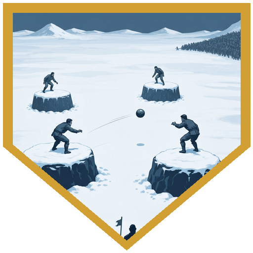
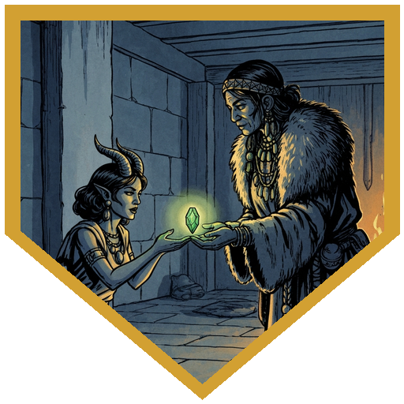
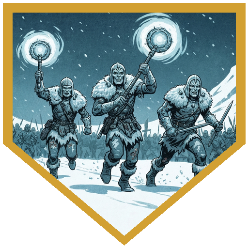
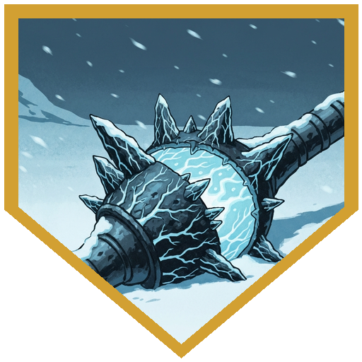
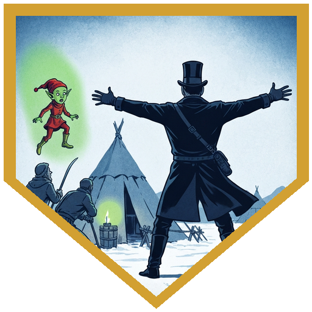

The Reghedsmen camp was generous with its guests. [**Ulfe**](../npcs/elk-scouts) was still nursing his wounds from the previous encounter but wasn't sitting out — though [**Bjarne**](../npcs/elk-scouts) was, quietly, at the edge of the court, staring at something in the distance. The invitation was for goatball: a sport the Reghedsmen had learned from the Goliaths, a rematch on the horizon, and they needed practice partners. The game was played on flat-topped boulders set in a ring, best of three, with a rule that the ball had to be passed three times before it could be thrown at an opponent to knock them off the platform. Drop the ball and you're out. Berg stayed behind — an orc in the Reghedsmen camp would have made the afternoon more complicated than it needed to be — and the party went in as a four; when [**Raydin**](../characters/raydin) arrived, the Reghedsmen added [**Leif**](../npcs/elk-scouts) to even the teams, with [**Klaud**](../npcs/elk-scouts) and [**Snurre**](../npcs/elk-scouts) rounding out their side.

[**Roaring River**](../characters/river) ran the athletic end of things: 25 on the first interception, 27 on a tackle to drop the first opponent out of round one. Raydin activated Bladesinger and held the ball, proposing the strategy that made it work — let River tackle, avoid using Raydin's questionable Strength for throwing, keep possession cycling. [**Doctor Medicine**](../characters/dr-medicine) contributed exactly where his stats permitted: a 23 on Deception to intercept the ball mid-pass, then an 18 Deception to walk away from Snurre's tackle. The Reghedsmen won round two — Raydin got knocked off the platform by a 23 on the tackle, River's throw didn't land — but in the decider, [**Alina Shandorath**](../characters/alina) pulled a natural 20 to recover the loose ball at -1 to Athletics, which kept possession alive, and River eventually converted a 17-versus-13 throw to close it out. Party won 2-1.

As the cheering wound down, [**Ragnhild**](../npcs/ragnhild) found Alina and asked to speak privately. She had heard from Savin that Alina read signs. Her question: should the Reghedsmen try to make peace with the Cold Peaks tribe, even against her own people's wishes? Alina cast Augury. The answer came back *Woe*. She told Ragnhild the truth — that making peace now probably wasn't the right call. Ragnhild accepted it without argument. *We follow the herds,* she said. *The herds are thin here. My people will be glad to leave.* Before sending Alina off she pressed three things into her hands: a gem that shows the truth when your eyes would otherwise deceive you, a Potion of Greater Healing, and a Potion of Cold Resistance. Her brother, she mentioned, used to say: *the mountain doesn't warn twice.*

The game had barely finished when the crowd noticed the newcomers. Three Reghedsmen came in fast from the direction [**Bjarne**](../npcs/elk-scouts) had been staring — emaciated, frost covering their skin, armor ripped, humming flails already drawn, heading straight for the bystanders without slowing and babbling in a language nobody recognized. Doctor Medicine opened with Summon Fey — calling [**Gunter**](../npcs/gunter), his fey redcap spirit — and ordered a Fey Step strike for 10 force damage. Alina put a Fireball on two of them. River sneak-attacked the first for exactly 20 damage, which was precisely what it had left. Raydin hit the second with Booming Blade and a follow-up attack — 11 and 9 thunder damage — while the Reghedsmen NPCs fought alongside the party. Doctor Medicine followed with 17 force damage from Eldritch Blast, then vanished using his new Disappearing Step — Misty Step now comes with invisibility at level 6. Alina closed the last one with a second Fireball and Doctor Medicine finished it off. [**Ragnhild**](../npcs/ragnhild) immediately told the party not to touch the weapons — the warriors had been cursed by what they were carrying. The Arcana check confirmed: Chardalyn takes form from whatever magic surrounds it, and these had been touched by something in the mountain — not the mountain itself, which connected to fire and heat, but something cold inside it, something separate. During the fight, they had been repeating a single phrase in Netherese. Alina translated: *It is not too late to come home.* Not addressed to the party, not to anyone — just repeating it. Alina cast Remove Curse on the weapons twice. What that accomplished is still an open question.

## Player Highlights

<strong><a href="../characters/river">Roaring River</a></strong> (Eric) — Goatball MVP: 25 on the first interception, 27 Athletics to knock out the first opponent, and the game-winning throw — 17 against a 13 — in the deciding round after Alina kept possession alive. In the chardalyn fight, landed a sneak attack for exactly 20 damage, which was precisely how many hit points the first warrior had left. Also confirmed a rebuild: strictly Rogue now, Soulknife subclass.

<strong><a href="../characters/dr-medicine">Doctor Medicine</a></strong> (Henry) — Used Deception to intercept a ball in a sport that doesn't have a Deception rule: 23 to snag it mid-pass, 18 to walk away from Snurre's tackle afterward. In the fight, opened by summoning Gunter, then ended by going invisible mid-battle with Disappearing Step — Misty Step now comes with invisibility at level 6, which nobody on the opposing team was expecting.

<strong><a href="../characters/raydin">Raydin</a></strong> (Nadir) — Activated Bladesinger and proposed the strategy that drove the game: hold the ball, let River do the tackling, avoid committing his Strength to a throw. Got knocked off the platform in round two (23 on the tackle beat his dodge), but in the decider held possession through multiple switches and fed it back to River for the winning throw. In combat, Booming Blade plus a follow-up scimitar — 11 and 9 thunder damage — before the party finished the last two off.

<strong><a href="../characters/alina">Alina Shandorath</a></strong> (Dominic) — Natural 20 on Athletics at -1 to the modifier — the ball was loose, the decider was on the line, and she caught it. Cast Augury for Ragnhild's question; the answer was *Woe*, and she told Ragnhild the truth. Two Fireballs in the chardalyn fight. Cast Remove Curse on the chardalyn weapons twice; what that accomplished is still unclear. Walked away holding a Gem of Seeing she didn't ask for, with the mountain's message still ringing in Netherese.

## Achievements

<strong>Don't Drop the Goat Ball</strong> — Goatball: flat-topped boulders, pass three times before you can throw someone out, drop it and you're eliminated. The Reghedsmen were practicing for a Goliath rematch and needed partners. The party went in as a four and won 2-1, with Roaring River landing the game-winning throw — 17 against a 13 — after Alina snagged a natural 20 at -1 to Athletics to keep possession alive in the deciding round.

<strong>Not an Athletics Check</strong> — Doctor Medicine used Deception to intercept the ball mid-pass during a sport that doesn't have a Deception rule, rolling a 23 to snag it and then an 18 to sidestep the tackle that followed. He noted afterward that nothing in the rules technically prevented it. Nobody argued because they had already moved on.

<strong>The Mountain Doesn't Warn Twice</strong> — Ragnhild had heard from Savin that Alina read signs, so she asked privately: should the tribes try for peace, even against her own people's wishes? Alina cast Augury — *Woe* — and told her honestly. Ragnhild said the herds were thin anyway and her people would be glad to leave — then gave Alina a Gem of Seeing, two potions, and her brother's old saying: the mountain doesn't warn twice.

<strong>It Is Not Too Late to Come Home</strong> — Three frost-covered Reghedsmen came out of the dark mid-celebration, humming flails drawn, Netherese on their lips. The party took them down. Ragnhild said not to touch the weapons. The Arcana check explained why: Chardalyn takes form from the magic around it, and these were cold — something inside the mountain, but not the mountain itself, which had always run hot. The phrase the warriors kept repeating, translated: <em>it is not too late to come home.</em> Alina cast Remove Curse on the weapons twice. What that accomplished is still an open question.

<strong>Staring at the Distance</strong> — During the game, while everyone else cheered, Bjarne stood at the edge of the court and watched the horizon — the same direction the chardalyn warriors came from. Every now and then, when the crowd cheered, he would cheer a little too. But mostly he just stared. He didn't say anything about it before they arrived.

## Rewards

- **Goatball winnings**: 250 gp total (62.5 gp each) — the party bet on themselves and won
- **Provisions from the Elk Tribe's abandoned camp**: 1,000 gp total (250 gp each) — Ragnhild gave the party leave to take what was left behind; these goods go back to Cold Peaks to help the tribe through the season
- **Total gold this session**: 312.5 gp each (1,250 gp total)
- [**Gem of Seeing**](https://www.dndbeyond.com/magic-items/9228895-gem-of-seeing) *(rare, requires attunement)* — gifted by Ragnhild to Alina; looking through it reveals the truth when eyes would otherwise be deceived, functioning as *True Seeing* when activated
- [**Potion of Greater Healing**](https://www.dndbeyond.com/magic-items/5133-potion-of-healing-greater) *(uncommon)* — from Ragnhild
- [**Potion of Cold Resistance**](https://www.dndbeyond.com/magic-items/5419-potion-of-resistance) *(uncommon)* — from Ragnhild
- **Chardalyn flails** (3) — cursed with the mountain's influence; Chardalyn takes form from surrounding magic; Ragnhild recommended leaving them alone; what Remove Curse accomplished is still unclear
