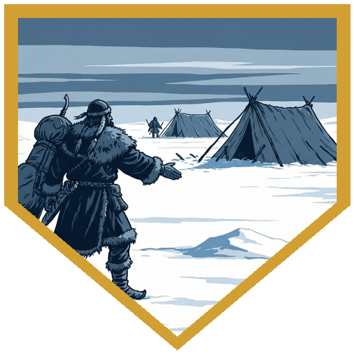
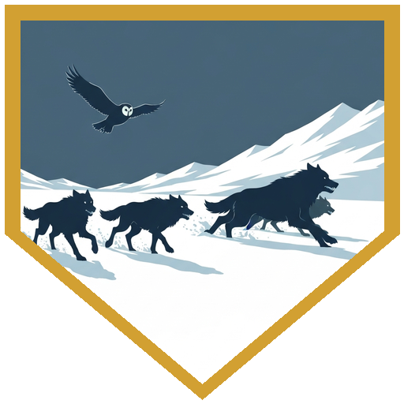
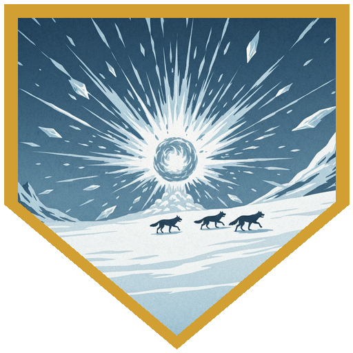
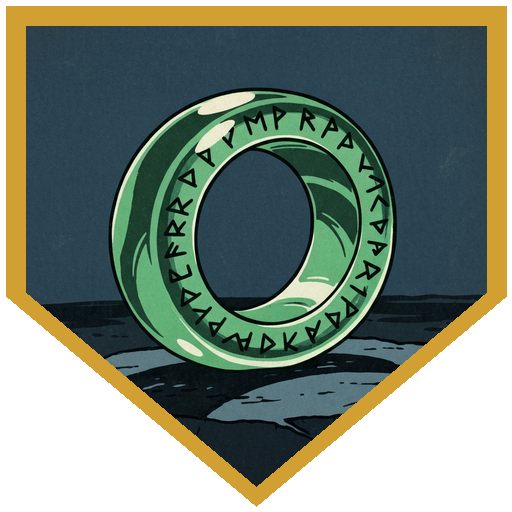
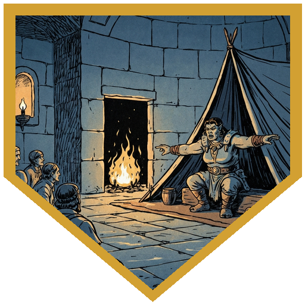

The Elk Tribe was still breaking camp when the session opened. [**Ulf**](../npcs/elk-scouts) came to [**Raydin**](../characters/raydin) to close the debt formally: his brother had recovered, the debt was repaid in full, and the camp would always have a place for the party. Raydin's response was a formal dab that apparently echoed across the whole camp. [**Ragnhild**](../npcs/ragnhild) found [**Roaring River**](../characters/river) last — the shortbow stays with him, she said, because she'd heard what he did for Pasha at the ceremony. *The world is cold enough that when something warm comes into it, it is a change.* [**Bjorn**](../npcs/elk-scouts) gave the remaining piece: the call he'd been resisting was gone, but not cleanly gone — like forgetting a word you used to remember, it came back sometimes. He knew the direction of Renier's lodge: three hours east of camp, a timber frame in the shadow of the mountain, from a place in his memory that felt uncomfortably like someone else's. The party took the heading and left.

The survival check back to Cold Peaks came in on the low end, cold weather gear providing advantage on rerolls but not enough to rescue the group result. The cold had changed character — not storming, but still, and the stillness had opened a long sight line across the snowfield. That's how they had time to prepare: seven wolves moving fast out of the east, close enough to see clearly, far enough out to have a plan. [**Raydin**](../characters/raydin) sent Owlbert — his owl familiar — ahead to confirm the count: seven total, two alphas the size of horses. [**Alina**](../characters/alina) opened with a Fireball that caught both alphas and two smaller wolves for 23 fire damage. [**Roaring River**](../characters/river) used Steady Aim and Sharpshooter range to put an arrow into the nearer alpha at 80 feet; ice chips flew from the frost-covered hide. [**Raydin**](../characters/raydin) cast Slow — Wisdom DC 16 — and three wolves failed, losing their reactions and dropping to one action per turn. From there the party dismantled the pack: River landed a natural 20 for 22 damage, sending a wolf he described as going to the boneyard; Alina Misty-Stepped free of an alpha's jaws and followed with a second Fireball that killed two more; [**Doctor Medicine**](../characters/dr-medicine) phased in and out of the Ethereal plane with Fey Step, landing Eldritch Blast hits and handing Alina 9 temporary hit points via Refreshing Step when she most needed them. [**Raydin**](../characters/raydin) cast Web to restrain a fleeing alpha at range; the second made 100 feet north before disappearing over terrain no one could follow. When the last wolf fell, Doctor Medicine heard something in what everyone else was hearing as growls: his Hat of Comprehend Languages caught the Orcish underneath. The wolf said: *we're done, run.*

The dead alpha wore a chain collar with a name tag. The word on it, in Orcish: **Zekvesh**. Tangled alongside the tag was a ring — Netherese mystical green glass, harder than steel, with a property of keeping whatever is held in that hand from being dropped or taken: +4 to saves and checks against disarming. [**Alina**](../characters/alina) read the inscription, recognized the script immediately, and crashed out. [**Broken Tusk**](../npcs/broken-tusk) heard the full account — the Elk Tribe's departure, the chardalyn warriors from last session, the wolves, the collar — and named what she was hearing. *Zek* means tooth. *Vesh* means cold. Zekvesh is what her people have always called Chardalyn. The mountain, she said, has waited patiently. It sounds as if it has lost that patience. If it's sending things out now, perhaps it's time to go address it.

[**Brekk**](../npcs/brekk) filled in the edge. He and Durok had apprenticed together and studied Zekvesh together. Gruumsh, Brekk said, asks his people to fight — not to win, but to fight. The struggle is where the honor lives. He doesn't care about the outcome, only that you meet the thing. Facing the mountain, whatever it holds, is a fight worth having in Brekk's theology. Durok was different: he couldn't commit to a fight unless he had the advantage, couldn't accept the possibility of losing. He asked more questions, went deeper into the Chardalyn warriors and what the mountain held. What he's doing with that knowledge now that he's missing is the next question. [**Raydin**](../characters/raydin) was assigned the camp role of trapper — intelligence-based work setting snares with the existing hunters, counted toward the party's seasonal contribution. The session closed at 200 gold each from wolf hides and the necklace. [**Alina**](../characters/alina) is taking the ring.

## Player Highlights

<strong><a href="../characters/river">Roaring River</a></strong> (Eric) — Ragnhild's farewell was his alone: the shortbow stays in his hands because of what he did for Pasha, not because he asked for it. In the fight, Steady Aim and Sharpshooter range put an arrow into a charging alpha at 80 feet before it closed — ice chips flying from the frost-covered hide. Then a natural 20 later in the fight: 22 damage, which he called "to the boneyard" before it fell, and which opened the space for Alina to Misty Step clear and throw the second Fireball.

<strong><a href="../characters/alina">Alina Shandorath</a></strong> (Dominic) — Both Fireballs landed where they needed to: the opener caught both alphas and two smaller wolves for 23 fire; the second, after a Misty Step free of an alpha's jaws, killed two more and changed the shape of the fight. The Netherese ring found on the wolf's collar got a look, immediate recognition of the script, and what the table described as a full crash-out. She's taking the ring.

<strong><a href="../characters/dr-medicine">Doctor Medicine</a></strong> (Henry) — Ran Fey Step in and out of the Ethereal plane across multiple rounds — landing Eldritch Blast hits from a clean angle and handing Alina 9 temporary hit points via Refreshing Step when she needed them most. The Hat of Comprehend Languages, acquired from a wandering trader in exchange for his Goggles of Night (the trader claimed it had belonged to a goat), paid off when the last wolf died: while everyone else heard growls, it caught the Orcish underneath. <em>We're done, run.</em>

<strong><a href="../characters/raydin">Raydin</a></strong> (Nadir) — Sent Owlbert ahead before anyone committed to a plan: seven wolves, two alphas the size of horses, confirmed. Cast Slow as the alphas closed — three failed the DC 16 Wisdom save, losing their reactions and dropping to one action per turn, which prevented the party from being overwhelmed on open snow. When one alpha fled, Web restrained it at range; the second escaped north before he could close. Assigned the trapper role at Cold Peaks afterward: intelligence-based, working with the existing hunters through the next season.

## Achievements

<strong>The Debt Is Repaid</strong> — Ulf came to Raydin as the camp was breaking to settle the account formally: his brother had recovered, the debt was done, and the Elk Tribe would remember the party. Raydin extended his hand for a formal dab that resonated across the whole camp. Ragnhild's words to River were quieter and separate: the bow stays because the world is cold enough that when something warm comes into it, it is a change. Go find what's making things worse.

<strong>Seven in the Field</strong> — The cold turned still — which is worse — and opened a long sight line across the snow. That's how they had time: seven wolves, two the size of horses, still minutes out. Owlbert confirmed the count from overhead. Slow caught three of them, cut the tactical problem down to size, and kept the fight from becoming a rout on open ground. One alpha still escaped over the horizon.

<strong>To the Boneyard</strong> — River landed a natural 20 mid-fight, rolling 22 damage on a wolf that had already taken punishment. He called it "to the boneyard" before it fell. The table agreed that was the right framing. It was the shot that tipped the fight from managed pressure to cleanup, opening space for Alina to Misty Step clear and open the second Fireball on what remained.

<strong>We're Done, Run</strong> — When the last wolf fell, Doctor Medicine's Hat of Comprehend Languages caught something in the growling that everyone else heard only as animal noise. In Orcish, the wolf said: <em>we're done, run.</em> He had traded his Goggles of Night for the hat from a wandering merchant who claimed it had belonged to a goat. It comprehends all languages. The translation held.

<strong>Zekvesh</strong> — The dead alpha wore a collar with a name tag in Orcish: Zekvesh. A Netherese ring was tangled alongside it. Broken Tusk confirmed the word: <em>Zek</em> means tooth, <em>Vesh</em> means cold. Her people have always called Chardalyn by that name. The mountain, she said, has been patient. It sounds as if it has run out.

## Rewards

- **Gold**: 800 gp total (200 gp each) — wolf hides and the necklace from the pack
- **Silver Flails** *(common)* — the chardalyn flails from last session, revealed this session after Remove Curse was cast: dark coloring gone, replaced by a silvery sheen. Functions as a silvered weapon with a special property against shapechangers. Available as an unlock for all characters.
- **Netherese Green Glass Ring** — found on the dead alpha's collar alongside the Zekvesh tag. Mystical green glass harder than steel. Property: +4 bonus to saving throws and ability checks to avoid dropping or being disarmed of any item held in that hand. Alina is taking this.
