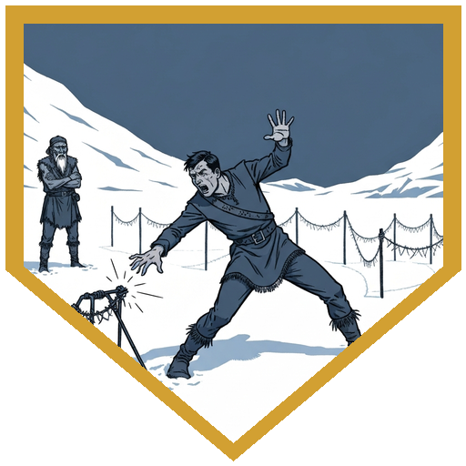
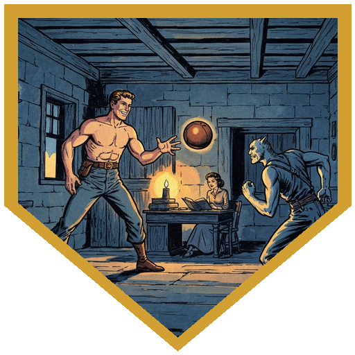
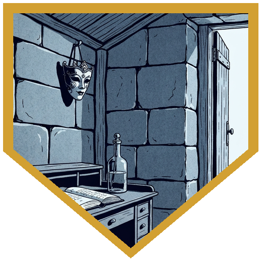
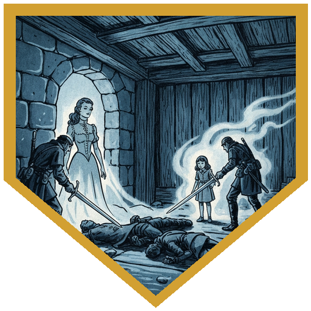
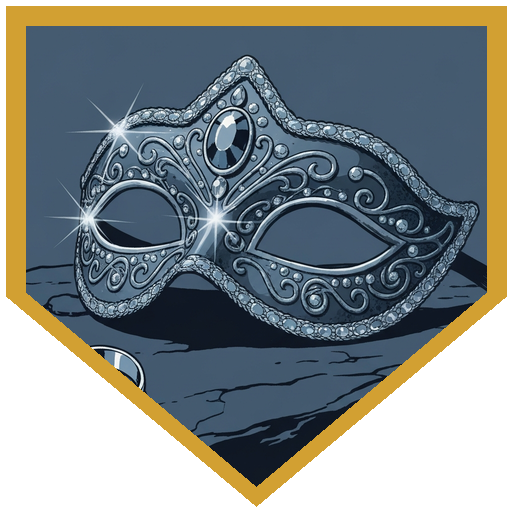

The session opened at Cold Peaks with Tuk Vesh — the everybody-hunts, where everyone has something to do. [**Raydin**](../characters/raydin) apprenticed as a trapper under Hauk, an older orc whose hands and arms carry the scars of the trade. Offered the choice between repeating Hauk's plans and improvising his own design, Raydin improvised — and the snare snapped shut on his hand. Two damage, a lasting mark, and Hauk's verdict when he wandered back: *that's why I left you alone. You seemed the sort.* [**Doctor Medicine**](../characters/dr-medicine) patched the hand with a 22 on the medicine check and produced a Potion of Greater Healing from his work besides. [**Berg**](../characters/berg), at the forge, got a visit from [**Kaarsk**](../npcs/kaarsk) — still healing, favoring his wrist, asking for a bracer so he could get back to the hunt before he should. Berg talked him down instead: rest first. [**Roaring River**](../characters/river) got [**Dak**](../npcs/dak), freshly of age, proudly showing off the bone sculpture from his ceremony — with River carved into the hunt — and angling for aim training without quite asking. River taught him (a 16 on a wisdom-based teaching check), earning a floating advantage to grant on a ranged attack. [**Alina**](../characters/alina) worked the Netherese problem: the changed warriors have mostly been speaking Low Netherese, the commoners' dialect — but *"it's not too late to come home"* was High Netherese. Loross. The noble tongue. Before the party left, [**Broken Tusk**](../npcs/broken-tusk) named what everyone was thinking: our time is starting to run out. Perhaps it's time we address things we've let sit.

Three cold hours toward the mountain — the temperature dropping harder the closer they got, cold weather gear and the Cloak of Protection turning what could have been an ugly constitution save into a formality — brought them to Renier's shelter: a timber lean-to that has no business having survived. Not preserved, not maintained. Just Netherese, knowing how to do things slightly differently. Inside were two people who weren't ghosts yet: a gnome absorbed in a journal at the writing desk, and a large, cheerful, extremely well-built man who wanted to know if anyone would play ball. River played ball. The party's insight checks failed spectacularly — a table full of 9s — and so nobody caught what was wrong: the man introduced himself as Yrel, a name that was *in the journal*, and the gnome never once asked what year it was. [The journal itself](../items/renier-journal), in careful Loross handwriting, told Renier's story: an architect of the Fourth Tower coming to remind him that one does not resign obligations of such kind; his wife returning again and again with the word he refused to say — *home*; and then the entry where the city vanished mid-conversation, taking her and their daughter with it. *The shelter holds*, the last entry says, above a crossed-out half-line about the cold. And then: *I cannot say the same for myself.*

When Alina spoke the name — **Irenthal, the city that never was** — the shadows stopped pretending. Yael, the Netherese noblewoman, had been wearing the gnome; her daughter Yrel had attached herself to the man. Alina's Charm Person actually landed on the gnome — useless, it turned out, since the ghost and not the gnome was at the wheel — but it earned her the possessed wizard's full attention: a lightning bolt down the line at Alina and River. Both saved, River's brand-new evasion turning his half into nothing, but the bolt dropped Aldric where he stood. Yrel tried to slip into River next; he made the charisma save by exactly one. The party fought to spare the hosts: Berg scattered caltrops across the only doorway and goaded attacks onto himself, parrying Yael's necrotic touch down to a single point of damage; River spent the floating advantage from Dak's training for a 21 to hit; Raydin's familiar died buying him an opening for his acid-awakened blade; and Doctor Medicine summoned [**Gunter**](../npcs/gunter), whose force-damage crit finally put Yael down. Both hosts hit the floor dying before it was over — Yael's shriek threatened to flatten anyone under 25 hit points, though no PC went down — and both were pulled back: Doctor Medicine stabilized the gnome with his healer's kit mid-fight, citing the hypocritical oath (*I must attend to my patients*), and River poured a potion into the fallen bodyguard. When the little girl fell, both echoes dissipated — not back to where they came from, because Irenthal never was. Back to not being.

The gnome came to as [Thessaly](../npcs/thessaly) of the Arcane Brotherhood, with her bodyguard [Aldric](../npcs/aldric) — researchers who had found the lean-to only that morning, investigating a mountain that appears on no map and turns visitors away with reasons they never quite examine. She took [the journal](../items/renier-journal) for safekeeping, shared what she knew — the Netherese custom of lower-birth-order nobles volunteering as mages in service of the empire, an honor Renier is one of the only known people to have refused — and left the party a token of invitation to the Brotherhood's outpost. The shelter gave up a jeweled mask, a plain silver ring of Renier's, and a drawer of jewelry. And on the way out, [**Clod**](../npcs/clod) was waiting, delighted: *I knew you would come! He's ready for you now.* Arveth wants to speak to Doctor Medicine. It's time, apparently, for him to take over as guardian. *He will return — and then nothing ever will have been.*

## Player Highlights

<strong><a href="../characters/river">Roaring River</a></strong> (Eric) — Taught Dak to aim with a 16 on the strangest roll of the night (a wisdom-based ranged attack — teaching, not shooting), earning a floating advantage he spent himself mid-fight for a 21 to hit. Played ball with Aldric through the entire tense standoff, keeping the possessed man calm one throw at a time — and when the fighting ended, he was the one pouring a potion into the fallen [Aldric](../npcs/aldric) he'd spent the evening befriending. When the lightning bolt came down his line, brand-new evasion turned a save into zero damage — and when Yrel tried to possess him, he made the charisma save by exactly one.

<strong><a href="../characters/alina">Alina Shandorath</a></strong> (Dominic) — Cracked the linguistic detail everyone else missed: the warriors speak Low Netherese, but <em>"it's not too late to come home"</em> was Loross — High Netherese, the noble tongue. Then she said the name <strong>Irenthal</strong> out loud and started the fight. Charm Person landed on the gnome — and accomplished nothing, since the ghost riding her didn't care — but it drew the lightning bolt's personal attention; she saved, answered with the readied fireball, and was the first to see both ghosts for what they actually were.

<strong><a href="../characters/dr-medicine">Doctor Medicine</a></strong> (Henry) — A 22 medicine check on Raydin's mangled hand came with a bonus Potion of Greater Healing and a loaner anatomy book (entirely goblin physiology). In the fight he summoned Gunter, whose critical force damage finished Yael — but his defining moment was stopping mid-combat to stabilize the dying [Thessaly](../npcs/thessaly) with his healer's kit, citing the hypocritical oath: <em>I must attend to my patients.</em> Arveth, per Clod, now wants a word with him about becoming the mountain's guardian.

<strong><a href="../characters/berg">Berg Wurdnowwah</a></strong> (Josh) — Talked Kaarsk into resting instead of hunting hurt — the persuasion nobody else could have landed, blacksmith to hunter. In the shelter he read the room before the fight started: caltrops across the only doorway, immunities and resistances scouted on the gnome wizard, goading attack pulling aggression onto the party's wall. When Yael's necrotic touch landed, his parry maneuver cut 10 damage down to 1.

<strong><a href="../characters/raydin">Raydin</a></strong> (Nadir) — Chose to improvise his own snare design rather than copy Hauk's plans, and paid for the ambition with a snapped trap, 2 damage, and a scar he gets to keep. Earned Hauk's grudging respect anyway: <em>you seemed the sort.</em> In the fight his familiar flew distraction so he could line up his acid-awakened blade — 23 to hit, bloodying Yael — and died for it in the shriek that followed. Frightened by a dead little girl, he kept swinging through the disadvantage.

## Achievements

<strong>That's Why I Left You Alone</strong> — Given the choice between copying Hauk's snare plans and improvising his own, Raydin improvised. The trap snapped shut on his hand — 2 damage and a permanent mark, if he wants it. Hauk wandered back, chuckled, and delivered the lesson: <em>you learn real quickly that the way we do it is the way it should be done. You seemed the sort.</em> At least it wasn't one of the ones with the grabbing teeth.

<strong>One of You Want to Play?</strong> — While the party interrogated a gnome researcher who was not what she seemed, her large, cheerful bodyguard sat cross-legged on the floor, produced a ball, and asked if anyone wanted to play. River played. Throw after throw, through journal revelations and mounting dread, the game continued — an influence action one bounce at a time, right up until the ghost wearing the man stopped pretending.

<strong>The City Is Gone</strong> — Renier's journal, in careful Loross handwriting, recorded it all: the architect from the Fourth Tower who reminded him that one does not resign such obligations, the wife who kept saying <em>home</em>, and the day the city vanished mid-conversation and took her and their daughter with it. The final entry reads <em>the shelter holds</em> — a half-line about the cold crossed out beneath it — and then: <em>I cannot say the same for myself. I've been trying to remember her name.</em>

<strong>Back to Not Being</strong> — Yael and Yrel were not quite ghosts — echoes of people from a city that never was. The party fought them without killing their stolen hosts: knockout blows, two mid-combat rescues, and Gunter's critical hit. When the last echo fell, they didn't return to where they came from. There is no where. They went back to not being.

<strong>A Face for Every Occasion</strong> — On a hook by the hearth, untouched by centuries: a noblewoman's masquerade mask, jeweled and elegant, enchanted to grant its wearer whatever face the evening requires. Cosmetic only — it can't make you someone else, just the perfect version of you. In Renier's effects, one ring stood apart from the jewelry: plain silver, utilitarian, built to keep thoughts private. He had reasons.

## Rewards

- **Gold**: 2,500 gp total (500 gp each) — jewelry and valuables from Renier's shelter
- **Potion of Greater Healing** — produced by Doctor Medicine during his healer's work at Cold Peaks; party supply
- **[Mask of Changed Appearance](https://www.dndbeyond.com/magic-items/10828745-mask-of-changed-appearance)** *(common)* — a jeweled Netherese masquerade mask with 3 charges; expend a charge to alter your face's cosmetic appearance however you wish (it cannot disguise you as someone else). Invisible while active. Elegant enough for any party. Available as an unlock.
- **[Ring of Mind Shielding](https://www.dndbeyond.com/magic-items/4725-ring-of-mind-shielding)** *(uncommon, requires attunement)* — Renier's plain silver ring, conspicuously utilitarian among a noble's jewelry. A man hiding from an empire of mages had good reasons to keep his thoughts unread. Minor property: **Harmonious** — attunes in 1 minute. Available as an unlock.
- **Advancement**: the party reached **level 7** this session
