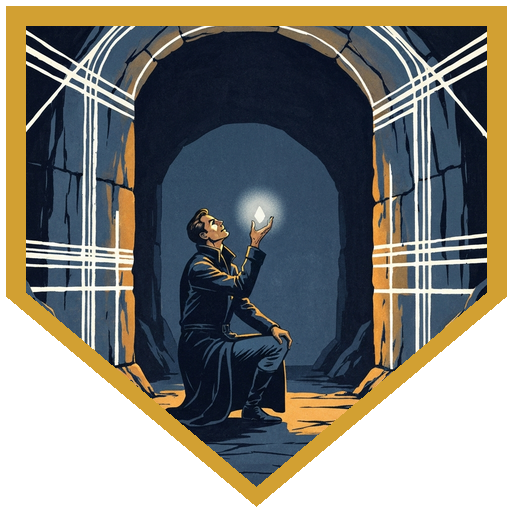
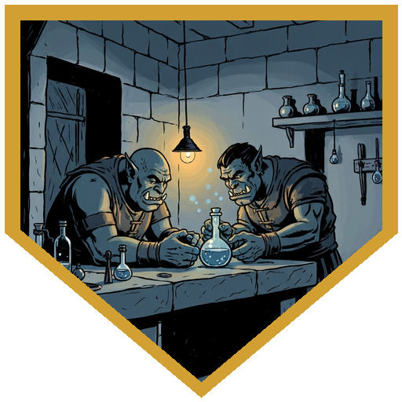
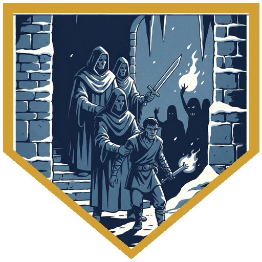
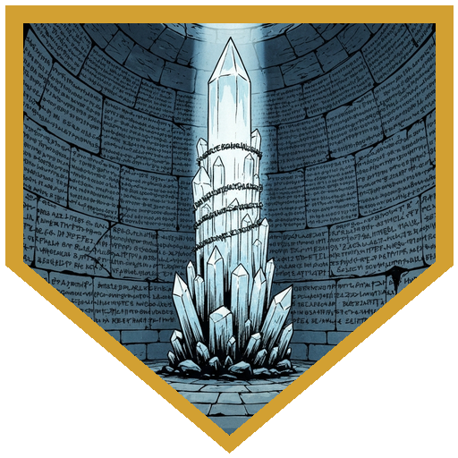
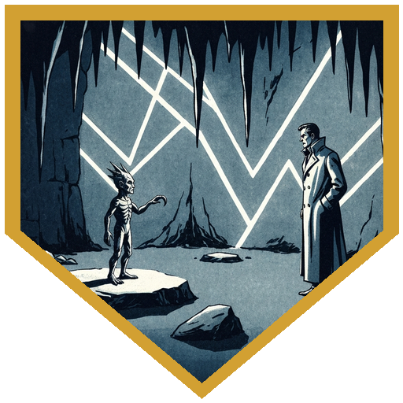

[Clod](../npcs/clod) was outside the shelter when the party emerged from last week — delighted, insisting, *hurrying*. He's ready for you now. Nothing will ever have been. The mountain wasn't far; it had been in their shadow since last session. A tunnel entrance found them more than they found it. The passages inside narrowed to places that required squeezing through or climbing around (DC 13 group Athletics or Acrobatics — Alina got advantage for her size, everyone made it), then opened into a circular chamber no one had shaped. Dark rock, shot through with thousands of white striations in dense crisscrossing patterns. If you looked at them long enough they seemed to shift. When you put a hand on them: cold, solid, completely still.

[Clod](../npcs/clod) flew to the center and did his best to be imposing. *I have come to convey the message that the Guardian has come. She says I will translate for her.* Arveth spoke first through images: stone, depth, the mountain ranges of Icewind Dale understood as a single web — each peak connected to each other, the ground held stable by their relationship, the latent understanding that one failure could propagate into the next. A single thread singled out and plucked, not torn: just set vibrating, the vibration passing through every mountain in the chain. Clod offered his interpretation of her name for herself — something in the vicinity of Quality Storage Solutions, he acknowledged he might be paraphrasing — then went quiet. *I think this one wants to show you himself.* A small pebble, white striations in it, held out toward [**Doctor Medicine**](../characters/dr-medicine). *I think you're supposed to swallow it.* He swallowed it.

The rest of the party watched him go still. When Arveth spoke directly it was loud even at a whisper. She showed him a vision of a year forward: [Brekk](../npcs/brekk) gone from the port where he'd always worked, a memorial visible in the distance for Brekk and [Dak](../npcs/dak) both. Durok had taken them — for something Brekk knew about Chardalyn. Then further back: Brekk and Durok as young apprentices, given the shared task of developing a flux for working the metal. Durok stayed up all night and produced something brittle and useless. Brekk solved it the next morning with apparent ease and the explanation *a little of this and a little of that*, which Durok knew was a lie but could never prove. The resentment settled into something it would never quite leave. *A small change*, Arveth said. *A tangle. A nudge.* Doctor Medicine rolled Deception — 24 — and rewrote one fact: Brekk and Durok had always worked on it together. Brekk was one of the very few people in the world who had ever caused Durok to smile. It had always been like that. The change took without a ripple.

The striations started moving before the deal finished settling. [Clod](../npcs/clod) noted: *I don't think that's her. I think that's trying to prevent whatever he's doing.* Six memory web creatures pulled themselves off the walls — animate lattices of the same geometric strands, no faces, sensing by something other than sight, all heading for the prone Doctor Medicine. They grappled and drained: any grappled party member had to make intelligence saves, failures costing real memories and stacking a die penalty on checks and attacks. When a creature died, it discharged whatever it had stored as a waking vision. [Raydin](../characters/raydin) opened with Slow — three targets, two wisdom saves failed; [Alina](../characters/alina) opened with a third-level Witch Bolt that cracked one for 35 lightning damage, barely not enough to drop it. Then [Berg](../characters/berg) put his pike through two creatures and saw both memories: the first was Doctor Medicine's — a street kid, a back alley, eating a sewer rat, a memory the good doctor had at that moment temporarily forgotten how to access. The second had nobody in the room's name on it: a young half-orc boy being dragged through a stone passage by tall robed orc men in masks, past a pit of severed hands, to a stump. A heavy blade raised over his wrist. The blade missed the clean cut and left a jagged scar across the back of the hand instead. The party recognized Savin before anyone said it. Raydin killed a third creature and received a stolen vision of an ancient crystal formation in a chamber covered in old writing in an unknown language — a Netherese spell held inside it, the sense that cracking it would release the power of that empire to whoever knew how. A detail surfaced after the fight: doing it would require a Chardalyn mirror. [Alina](../characters/alina) Misty Stepped free of her grapple and ended one creature with a Fire Bolt for 24 fire damage. [River](../characters/river) burned his action to break free of a grapple and anchored with Steady Aim for a 20 to hit. All six down, the visions distributed, the memories returned.

[Clod](../npcs/clod) made the announcement with what solemnity the little creature could muster. *Presenting the Guardian of the Mountain.* [Doctor Medicine](../characters/dr-medicine) accepted. He committed to switching his patron from Archfey to Great Old One before the session was out — the mountain, apparently, found this reasonable. Before the party left the chamber, a footnote surfaced from memory: [Thessaly](../npcs/thessaly) had mentioned, almost in passing, that she'd asked whether Rennier still had both his hands — and he did. Every Netherese mage of his rank gave a hand to their service to the empire. He had refused. If the party finds Thessaly's outpost, they'll have something to bring her. Also, something in the web's contact seemed to have left a mark on [Raydin](../characters/raydin) specifically — the seasonal Eladrin warmth in his fey nature had run cooler since the chamber, more shadowed. Shadar-kai, by the look of it, as though the mountain's touch had done the reclassifying.

## Player Highlights

<strong><a href="../characters/river">Roaring River</a></strong> (Eric) — River spent the session watching history rewrite itself from across a stone chamber. He was in combat when Doctor Medicine went still and the mountain spoke through him; he was watching when Berg's pike pulled two stolen memories out of dying creatures and both turned out to matter. He shot when he had a line, broke free of a grapple with Athletics when he didn't, and kept track of how many creatures were left and whether anyone was going down. In a session where the weight landed on one person, River was the one making sure nobody forgot there were six of these things and the math still had to work out.

<strong><a href="../characters/dr-medicine">Doctor Medicine</a></strong> (Henry) — Swallowed a pebble from a mountain on the promise of seeing what could be prevented. Arveth showed him a future where Brekk and Dak are both gone, taken by Durok over something Brekk knew about Chardalyn. She gave him one small change to make. He rolled a 24 on Deception and retroactively made Brekk and Durok old friends — always close, always collaborative, there was never a rift and there never would be. At the end of the session he committed to switching his patron from Archfey to Great Old One, a decision the evening had spent building toward. Keep the pebble on you at all times.

<strong><a href="../characters/berg">Berg Wurdnowwah</a></strong> (Josh) — Killed two memory web creatures and lived through what they had stored. The first was Doctor Medicine's — a back alley, homeless, eating a sewer rat, a memory the good doctor had at that moment temporarily misplaced. The second had nobody in the room's name on it: Savin as a child, masked orc men, a pit of severed hands, a blade that missed a clean cut and left a jagged scar across the back of his hand instead. Berg recognized him before anyone said it. A third vision came when Raydin killed the creature that had been grappling Berg — Berg's own memory of the first book he ever read, knowing all the words he knows now. The DM noted he was living through it as himself, not watching from outside. He was proud of it. He kept swinging through the entire fight and ended it with Rally to keep Doctor Medicine provisioned through the drain.

<strong><a href="../characters/raydin">Raydin</a></strong> (Nadir) — Slow opened the fight by locking three creatures to one action per turn and stripping their reactions, meaningful when each creature's action was either grapple or drain memory or both. He worked the remaining targets with his scimitars, using Owlbert for Help action advantage. One creature he killed released a stored vision: an ancient Netherese crystal in a chamber of angular script, a held spell inside it, the sense that cracking it would release the contained power of an empire. The key detail came after the battle was over: a Chardalyn mirror is what it would take. His Cloak of Displacement also turned a confirmed critical hit into a miss — disadvantage dropped a 25 to a 9. Something in the mountain's web seemed to have left a mark on him specifically; his fey nature has run cooler and more shadowed since the chamber. Shadar-kai, as though Arveth's touch did the reclassifying.

<strong><a href="../characters/alina">Alina Shandorath</a></strong> (Dominic) — Opened with a third-level Witch Bolt for 35 lightning damage — just barely not enough to drop the first creature, leaving it for Berg's follow-up. Got grappled and memory-drained mid-fight, then Misty Stepped free and ended creature E with a Fire Bolt for 24 fire damage. She has been saying Netherese names aloud and starting fights for three months. Thessaly's token is in the party's pocket; the outpost is probably next.

## Achievements

<strong>Swallow the Marble</strong> — Arveth offered a pebble and a deal: carry it always so she can see, and she will help prevent what she has shown you. No guarantee about how, no details about what helping costs. Doctor Medicine swallowed it. <em>Good things will come to me if I swallow the marble. I've done it before. It's normal. Everyone swallows rocks, right?</em> The mountain, apparently, found this sufficient.

<strong>It Was Always Like That</strong> — Arveth gave Doctor Medicine one small change to make in the past: a nudge on a thread, a tangle worked loose. A 24 on Deception retroactively made Brekk and Durok old collaborators, old friends — Brekk was one of the very few people who had ever made Durok smile, and he had always been. <em>We have never had a problem with Brekk and Durok not getting along.</em> The retcon settled into place without disturbing anything else. That's the difference between time travel and fiction change.

<strong>That's Not My Memory</strong> — When Berg put his pike through the second memory creature, the vision that came out wasn't anyone's in the room: a young half-orc boy being dragged by masked orc men past a pit of severed hands to a stump, a heavy blade raised over his wrist. The blade missed the clean cut and left a jagged scar across the back of his hand instead. The party recognized Savin before anyone said anything. The creature had been holding it for someone — or waiting for someone to see it.

<strong>The Crystal and the Mirror</strong> — Raydin killed a memory creature that had never drained anyone and received its stored vision free and clear: an ancient Netherese crystal in a chamber of unknown script, a spell contained inside it, the knowledge that cracking it would put the power of a fallen empire at the disposal of whoever held the key. The vision ended there. The key came as a footnote after the fight: a Chardalyn mirror. Something to add to the list.

<strong>Guardian of the Mountain</strong> — With six memory creatures unraveled and the deal struck, Clod made the announcement. <em>Presenting the Guardian of the Mountain.</em> Doctor Medicine, who had swallowed a pebble from a mountain, rewritten the past with a Deception roll, and committed to a new patron before the session was over, accepted. Clod looked as pleased as he always does when a plan only he could see comes together exactly as planned.

## Rewards

- **Gold**: 200 gp each (1000 gp) — valuable rocks from the chamber walls
- **[Rope of Entanglement](https://www.dndbeyond.com/magic-items/4730-rope-of-entanglement)** *(uncommon)* — woven from memory web silk left behind when the creatures unraveled. Feels slightly wrong to the touch, as though the threads are still trying to remember something. (Minor property: Unusual material)
- **[Dark Shard Amulet](https://www.dndbeyond.com/magic-items/9228417-dark-shard-amulet)** *(common)* — Doctor Medicine's is the one currently in his stomach. 
- **Potion of Psychic Resistance** — distilled by Doctor Medicine from web essence left in the chamber; party supply
- **Patron change**: Doctor Medicine committed to switching subclass from Archfey Warlock to Great Old One at the end of this session.
