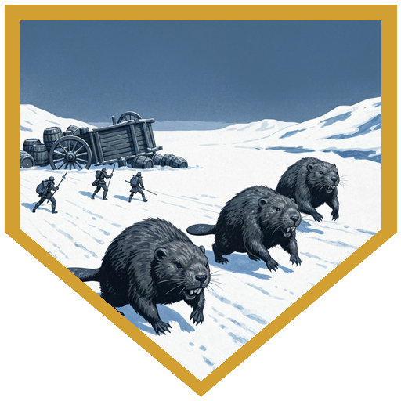
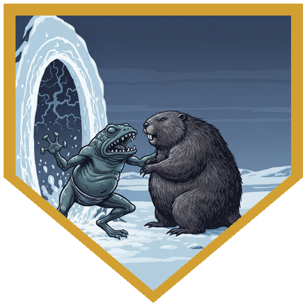
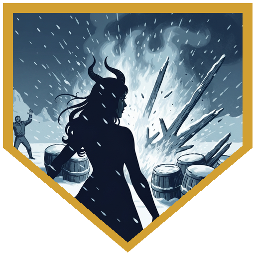
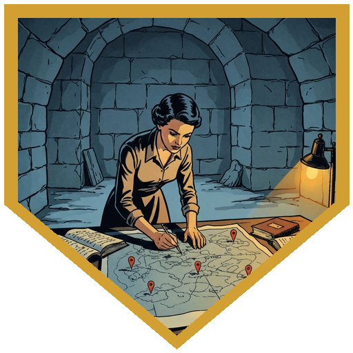
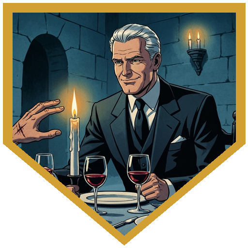

The road to Caer-Konig had a wagon blocking it — overturned, barrels tumbled across the snow, a man pinned underneath crying for help. He was the proprietor of the Northern Lights, a fishing-village inn, returning from a resupply run after a batch of mead had gone bad. Three giant beavers, drunk on what they'd already smashed, were working through the rest. The party lifted the wagon (a combined Strength check that the DM noted was probably balanced for five players), pulled the driver free, and turned to fight. What followed was four rounds of combat that came closer than it should have: the beavers had enormous hit points, a DC 18 trample that dealt serious damage, and the particular fury of creatures that are both drunk and inconvenienced. [Berg](../characters/berg) went down twice and came back both times — first on [Doctor Medicine](../characters/dr-medicine)'s Greater Healing Potion, then on Second Wind. [Doctor Medicine](../characters/dr-medicine) summoned an aberration; the creature bore a notable resemblance to Gunter, and it had in fact always been a Slaad. It lasted one round before Beaver A trampled it flat. [Alina](../characters/alina)'s Fireball landed perfectly and caught four of the mead barrels in the blast radius. *At least you have your life*, she told the driver. He wasn't entirely sure, but he accepted 100 gold from the party, gave them a mystery vial he'd found mixed in with the resupply (a Potion of Heroism, as it turned out), and extended an open invitation to the Northern Lights whenever they passed through Caer-Konig.

[Aldric](../npcs/aldric) came out to meet them at the Brotherhood outpost — a hunting lodge on the edge of town, the work of people whose idea of roughing it was still quite comfortable. He had new scars across his face and a pair of elegant gloves that looked wrong against his practical kit. He'd been attacked by something that controlled his mind since they'd last seen each other; he didn't elaborate, but he asked whether the party knew of anything that protected against that sort of thing. [River](../characters/river) had a ring. They traded: Ring of Mind Shielding for an Amulet of Health [Aldric](../npcs/aldric) had been carrying, plus a Potion of Heroism from his brother's supply. Before taking them inside, he talked about [Thessaly](../npcs/thessaly) — how she'd turned his life around, how he kept her safe because she wasn't quite street smart. *Most of the people she works with*, he said, *smile at you in one room, and in the other room it's gone.* He said it like a man who had met those people before and did not enjoy the memory.

[Thessaly Vorn](../npcs/thessaly) had been working through Rennier's journal. It didn't go back far enough to explain how he had avoided the dedicant ritual in his youth — he should have given a hand in service to the empire as a mage of his rank, and somehow he never did. The journal started after he'd been discovered: he had fled, asked his wife Yael to come with him, and she hadn't. They kept contact for a while. Then the prose changed. He lost a part of himself, possibly literal, possibly figurative, and went slowly mad. The party laid out what they knew — the standing stones, the buried crystal, Irinthal, the site of the dead archaeologists. [Doctor Medicine](../characters/dr-medicine) rolled 13 on Arcana, and it was enough. [Thessaly Vorn](../npcs/thessaly) had been correlating the same sites from her own research: five locations, five crystals, five anchor points for a Netherese spell she believed was still active. The scale of it was above anything in the current rules. She didn't know whether stopping it would be good or catastrophic, and her recommendation was to find out before doing either.

Then Sarevyn Cole walked in — the leader of the expedition, silver-haired and elder statesman, the kind of man whose charm is a professional tool. He had been out and wanted to touch base; he was pleased to find Thessaly had guests and invited everyone to dinner. The persuasion checks were mixed: [River](../characters/river) and [Doctor Medicine](../characters/dr-medicine) passable, [Alina](../characters/alina)'s outright failing the moment Sarevyn mentioned spellbooks (her tail went straight up). The middling result earned one exchange: the party revealed the location of the dead archaeologists, and Sarevyn offered an Enduring Spellbook inscribed with two 3rd-level spells in return for anything recovered from the bodies. He framed it as returning effects to their families. The insight roll suggested that was not the only reason. And then [Aldric](../npcs/aldric) reached to wipe something from his gloves and removed them, and on the back of his hand was a gash — a scar from a blade that missed a clean cut. Sarevyn Cole's expression changed for exactly one moment. He stopped himself. He made a note. The dinner ended shortly after.

## Player Highlights

<strong><a href="../characters/river">Roaring River</a></strong> (Eric) — Steady through both halves of the session. In the beaver fight, River never missed, and when Beaver A came for [Berg](../characters/berg) on a 22 to hit, River used his Parry reaction to cut the damage down to 3. He also spotted that Beaver A had taken no damage and directed fire accordingly. At the outpost, he traded his Ring of Mind Shielding to <a href="../npcs/aldric">Aldric</a> for an Amulet of Health — a straight upgrade, made in about fifteen seconds, the kind of deal River tends to walk out of better than he walked in.

<strong><a href="../characters/dr-medicine">Doctor Medicine</a></strong> (Henry) — Now a Great Old One Warlock, and the change is already shaping his options. He summoned Gunter — a Slaad, obviously, it had always been a Slaad — who lasted one round and died nobly. He pulled a Greater Healing Potion when [Berg](../characters/berg) went down and handed it over without ceremony. His Dissonant Whispers on the last beaver dealt 13 psychic damage even on a successful save. At dinner, when <a href="../characters/alina">Alina</a>'s tail went straight up at the mention of spellbooks, he attempted to steer the conversation back. He rolled terribly. <em>When it's a skill I really use, I roll terribly</em>, he observed. Accurate.

<strong><a href="../characters/berg">Berg Wurdnowwah</a></strong> (Josh) — Went down twice and came back twice, which is the kind of session Berg has. Beaver A landed a hit that triggered Relentless Endurance and then a second massive hit that dropped him anyway; Doctor Medicine's healing potion got him back up, and he immediately stood, picked up his pike, and kept swinging. His Distracting Strike provided advantage for follow-up attacks throughout the fight, and his Action Surge on round 4 dealt enough damage to drop Beaver B. He finished the fight on 10 hit points after spending Second Wind and Adrenaline Rush. New plate armor absorbed at least one hit that would have ended the night — an 18 that missed by 1.

<strong><a href="../characters/alina">Alina Shandorath</a></strong> (Dominic) — 4th-level Witch Bolt for 39 lightning damage in round 1, sustained Witch Bolt in subsequent rounds, Fireball in round 4 for 30 fire damage — which also caught four of the wagon driver's mead barrels in the blast. He received 100 gold and a standing invitation to the Northern Lights in consolation. At the lodge, <a href="../npcs/thessaly">Thessaly Vorn</a> mentioned spellbooks and Alina's tail went straight up and her poker face disappeared entirely. She is getting an Enduring Spellbook. The DM noticed. Everyone noticed.

## Achievements

<strong>Fur and Hatred</strong> — Three huge beavers, drunk on stolen mead, nearly dropped the party on the road to Caer-Konig. They had enormous hit points, a DC 18 trample, and the energy of creatures with nothing to lose. The DM noted afterward they were probably balanced for five players. The party put all three down over four rounds anyway — at the cost of one summoned Slaad, both of Berg's emergency resources, and the wagon driver's entire mead supply. <em>Fur and hatred</em>, said River, when asked what they were made of. The DM confirmed this was correct.

<strong>Gunter Was Always a Slaad</strong> — <a href="../characters/dr-medicine">Doctor Medicine</a> is no longer an Archfey Warlock, which means he no longer has Summon Fey. What he has is Summon Aberration. The creature he summoned bore a notable resemblance to <a href="../npcs/gunter">Gunter</a>. <em>Gunter is a Slaad</em>, Doctor Medicine said, <em>and has always been a Slaad.</em> The DM agreed — he had always been. The creature lasted one round before Beaver A trampled it into the snow. The retcon stands regardless.

<strong>Fire Sale</strong> — <a href="../characters/alina">Alina</a>'s Fireball was aimed at the last two beavers. It dealt 30 fire damage to anything in the radius, which included four barrels of the mead the wagon driver had come out to recover. The beavers failed their saves. The barrels had 15 hit points and took enough damage to explode. The driver watched the last of his livelihood go up in flames and blowing snow. <em>At least you have your life</em>, Alina told him. He accepted 100 gold from the party and went home with the vinegar.

<strong>Five Anchor Points</strong> — <a href="../npcs/thessaly">Thessaly Vorn</a> had been working the same problem from the archive side while the party worked it from the field. When the party mapped their standing stone locations against her research, the pattern resolved: five crystals, five sites, one Netherese spell anchoring itself to the landscape and still running after centuries. The scale was above anything in the current rules. <a href="../characters/dr-medicine">Doctor Medicine</a> rolled 13 on Arcana and confirmed the correlation. Nobody in the room was certain yet whether stopping it would be better or worse than letting it finish.

<strong>The Smile That Goes This Far</strong> — <a href="../npcs/aldric">Aldric</a> described Sarevyn Cole before they met him: a man whose smile only goes as far as his lips, who is one person in one room and a different person in the next. At dinner, something happened that Sarevyn Cole did not intend. <a href="../npcs/aldric">Aldric</a> removed his gloves to wipe something away, and the scar on the back of his hand was visible — a blade that missed the clean cut. Sarevyn Cole's expression changed for exactly one moment. He stopped himself. He made a note. The dinner ended shortly after. <a href="../npcs/aldric">Aldric</a> had described the type accurately.

## Rewards

- **Amulet of Health** *(uncommon, attunement)* — River, traded from <a href="../npcs/aldric">Aldric</a> in exchange for his Ring of Mind Shielding. Maintains the wearer's Constitution score at 19 while attuned.
- **Potion of Heroism** *(×2)* — One purchased from the Northern Lights wagon driver for 50 gp (mystery vial in his resupply); one from <a href="../npcs/aldric">Aldric</a>'s brother. Both party supply.
- **Enduring Spellbook + 2 3rd-level spells** *(common)* — Alina, pending delivery of the archaeologists' personal effects to Sarevyn Cole. The book survives submersion and fire. Two 3rd-level spells of her choice will be inscribed.
- **Beaver hides (3)** — Recoverable from the scene; unusually large, worth significant gold once sold in town.
- **Vinegar barrels** — Recovered from the scene. The power of <a href="../npcs/arveth">Arveth</a>, probably.
