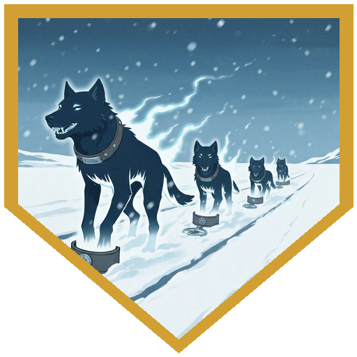
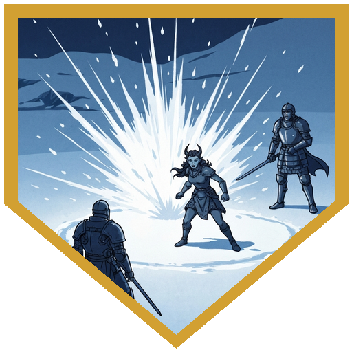
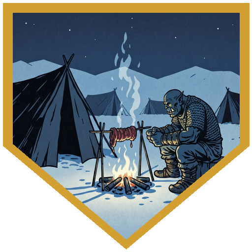
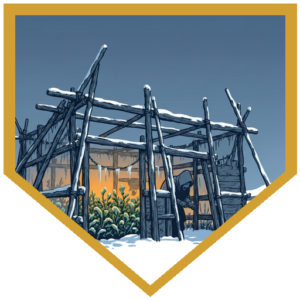
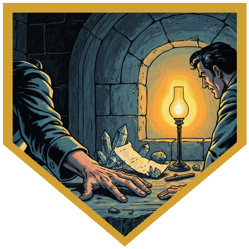

The trip back from the Arcane Brotherhood started with survival and constitution saves against the open cold — both passed, the party carrying themselves through without difficulty as far as the dice could tell. What the dice didn't cover: four wolf-shaped constructs tailing them from the direction of Caer-Konig, closing fast. A Weapon of Warning flagged the danger before they were visible; perception checks resolved four of them in the distance, though the DM noted there may have been more beyond sight. They were not like the changed creatures that glow blue — they moved differently, faster, with a caster's modifications behind them: a spell granting +2 to hit and double speed, and cold breath weapons in cones. [Doctor Medicine](../characters/dr-medicine) opened with Eldritch Blasts; [Berg](../characters/berg) planted himself and used Goading Strike to lock the largest construct's attacks onto him at disadvantage against everyone else, then burned Bait and Switch to swap places with [River](../characters/river) and shore his AC up to 22. [Alina](../characters/alina) hit a bloodied target with 34 lightning damage and closed the fight with a 4th-level Fireball, using her Evoker's Sculpt Spells to guarantee all four allies automatic saves — the blast landed exactly where it needed to without touching any of them. Three breath-weapon cones swept the party across the last rounds. Everyone took hits. Nobody dropped.

The constructs didn't bleed when killed. Pulling the collars was what dissolved them — each body simplified back into snow and was gone. The collars stayed: leather, with silver name tags etched by careful hands. Sentinel. Reaver. Thresh. Inside each collar, a stylized compass rose. History checks came up empty. Nobody recognized it.

Kaarsk was sitting at a cooking fire just outside the Cold Peak camp when the party arrived — he'd felt closed in, stuffy, and come outside to work over an open flame instead. He had more than enough food for all of them, which was not accidental: Durok had told him they were coming. They ate and gave him the briefing on the constructs. "If they're being made by people," [Alina](../characters/alina) observed, "that person is getting better at making them." He took that in. Inside the camp, Brekk welcomed them back and introduced the other half of his current project: Durok, an old colleague and sometime rival who had trained under the same master and had spent the last stretch building a cold-weather enclosure for vegetables — a partial answer to the livestock shortage and the deteriorating hunting. Durok and Brekk had collaborated before: three miserable nights on a theory about flux stones, Brekk finding the answer first. They'd found a working rhythm again here. Before anyone had asked for anything, Durok handed over a Potion of Greater Healing and a Potion of Cold Resistance.

Savin came in last, from the direction of Durok's enclosure, carrying an armful of vegetables he set down at Brekk's worktable. Durok has been workng on cold-resistant vegetables, food that could actually survive the cold. He said they were close to working it out. The first thing anyone noticed, though, was his hand. In Session 4, [Berg](../characters/berg)'s Medicine check had found the old cut on Savin's wrist. Now, coming in with his arms full, the scar was gone. Nobody asked about the hand.

## Player Highlights

<strong><a href="../characters/alina">Alina Shandorath</a></strong> (Dominic) — Handled both ends of the construct fight. Opening: 2nd-level lightning for 34 damage that finished off an already-bloodied target. Closing: a 4th-level Fireball placed squarely on the remaining constructs, with Sculpt Spells ensuring all four allies automatically succeeded their saves — she could put it exactly where it needed to go, and she did. The constructs failed their saves. The party's hit points remained where they were.

<strong><a href="../characters/river">Roaring River</a></strong> (Eric) — When one of the constructs connected on a 25 to hit, River used Uncanny Dodge to halve the incoming damage and stayed on his feet. Later he finished the last construct standing with an offhand dagger crit — the doubled sneak attack dice produced, as the DM observed, more dice than the creature had hit points remaining. A precise session: every meaningful attack landed.

<strong><a href="../characters/berg">Berg Wurdnowwah</a></strong> (Josh) — Ran the construct fight from the center. Goading Strike locked the largest construct's attacks onto him at disadvantage against everyone else; Bait and Switch repositioned River and pushed Berg's AC to 22 through the closing rounds; Action Surge kept his damage output going when it needed to. When the fight ended and the party was still standing, it was largely because Berg had spent every resource available to arrange that outcome.

<strong><a href="../characters/dr-medicine">Doctor Medicine</a></strong> (Henry) — Changed out an invocation this session; the party now has a horrid little demon creature named Quaza following them. In the construct fight he opened with Eldritch Blasts, then summoned an aberration that bore a notable resemblance to Gunter, was a Slaad (and always had been), and dealt 33 slashing damage before being dissolved by a construct. The dice on his blasts were unkind. The Slaad carried its weight while it lasted. At Kaarsk's fire, the ram didn't sit right with him — too greasy, off in some way he couldn't name — while nobody else at the fire noticed anything wrong with it. He ate it anyway.

## Achievements

<strong>Sentinel, Reaver, Thresh</strong> — The wolf-shaped constructs that followed the party out of Caer-Konig wore leather collars with silver tags, names etched by a careful hand. Inside each collar: a stylized compass rose. When the collars came off, the bodies dissolved into snow. The collars remained.

<strong>Sculpt Spells</strong> — <a href="../characters/alina">Alina</a>'s Fireball needed to land on constructs without touching allies. At 4th level, Sculpt Spells gives her up to five creatures who automatically succeed their saves against her evocation spells. She chose all four party members. The blast went where it needed to go. The constructs failed their saves. The party did not.

<strong>He Knew You Were Coming</strong> — Kaarsk was outside the Cold Peak camp when the party arrived, sitting at a fire he'd built away from the tents. He said he'd felt closed in. He had enough food for everyone — not because he'd guessed, but because Durok had told him. He listened to the report on the constructs, noted that they were getting harder to kill, and did not seem surprised. He'd been out here waiting.

<strong>Durok's Oasis</strong> — Brekk's old colleague Durok had been solving the food problem from a different angle: an enclosure on the edge of Cold Peak, cold-resistant vegetables, a druid's answer to a landscape that doesn't want anything to grow. Brekk and Durok had collaborated before — three miserable nights on a theory about flux stones; Brekk found the answer first, and they've never entirely let each other forget it. They found their rhythm again. The vegetables work. Durok will be joining them next session.

<strong>No Scar</strong> — In Session 4, <a href="../characters/berg">Berg</a>'s Medicine check found the old cut on Savin's wrist. In Session 13, a similar scar on <a href="../npcs/aldric">Aldric</a>'s hand made Sarevyn Cole stop himself mid-expression and make a note. Now Savin walked in from Durok's enclosure with smooth skin where the wound had been. He set down the vegetables. He mentioned the vegetables. Nobody asked about the hand.

## Rewards

- **150 gold each** (600 gp total) — from the three construct collars sold; any player may hold a collar worth 150 gp in lieu of coin
- **Potion of Greater Healing** *(uncommon)* — from Durok and Brekk; party supply; restores 4d4+4 hit points
- **Potion of Cold Resistance** *(uncommon)* — from Durok and Brekk; party supply; grants resistance to cold damage for 1 hour
