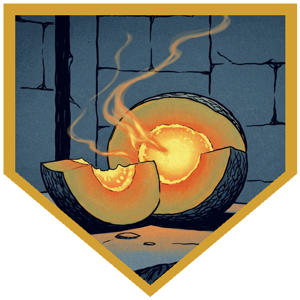
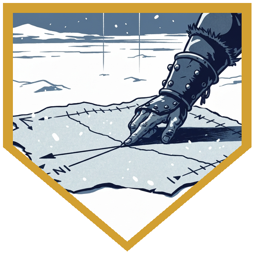
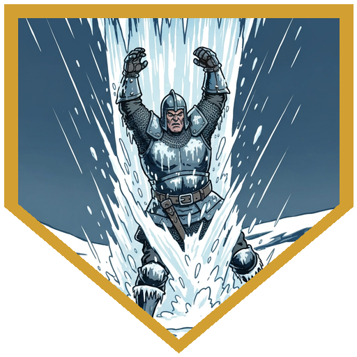
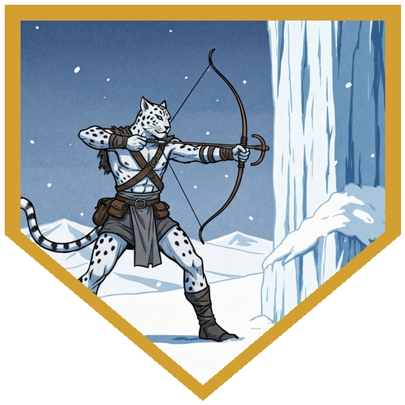
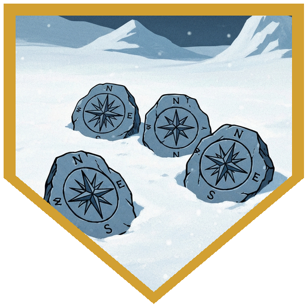

Durok arrived by dog sled — wolves, not dogs, pulling a load of canvas bags. Brekk had been expecting him; the party had known since last session he was coming. He was deliberate about the introductions, walking down the line with a specific question for each one. To [Dr. Medicine](../characters/dr-medicine), he asked about specialty and training; "medicine" earned a measured response — his approach is to fix the land and let the land fix the people, though he acknowledged the difference in philosophy without dwelling on it. To [Alina](../characters/alina), he turned to the research; Broken Tusk had spoken well of her, and Durok wanted to know what she'd learned about their situation — when she brought up Irenthal, he engaged with the geography more than the history, and offered to share his journals. To [River](../characters/river), he noted that the camp's young ones had taken to him, then said plainly that what mattered most was that those young ones learned their Orcish traditions first — River's influence was welcome, but the tribe's ways came before it. To [Berg](../characters/berg), he said Kaarsk had spoken highly of him, noting that Berg sounded closer to his own view of things than most outsiders; Brekk confirmed afterward that Kaarsk speaking highly of anyone means more than it sounds. He closed with a direct warning to all of them: the mountain where Irenthal concentrates is near his oasis, and if they go there and come back changed, not to bring it back to the tribe's door. It was a courtesy, framed as a request. The party rolled insight and passed; what they found was that Durok had been working hard not to signal condescension while running his own evaluation the whole time. They had passed that too, apparently.

The bags held food grown in his volcanic oasis — most of it pembelon from Chult, round dense melons that radiate actual heat when cut. Durok has them growing in his enclosed hot ground; getting them to survive open snow is the unsolved problem he thought Arcana might help with. He also had a vial — a concentrate from the same crop hardiness research, a side effect that turned out to be aggressively foul. Brekk had clearly decided this was the funniest thing in the camp. "Hey, smell this." What is it? "It smells horrible." [Dr. Medicine](../characters/dr-medicine) waved it to waft, failed his Constitution save, went to the corner. Brekk had a chuckle. [River](../characters/river) tried it. Failed. Tried it again. That made it funnier. [Berg](../characters/berg) also failed. [Alina](../characters/alina) watched all of this and declined.

Kaarsk, still injured and unable to hunt, approached the group with work: six attacks had reached the camp while the party was away — mephits, giant snowy owls, a dozen creatures or fewer each time, never enough to push through the defenses but consistent, always coming back. Find where they were coming from. Survival checks (17, 13) gave them direction and composition. Investigation (16) mapped it northwest, toward Caer Konig. Insight (18, natural 20) resolved the shape of the thing: these were not killing attacks. Something from the northwest was deliberately harrying the Cold Peak tribe — wearing them down, making the ground feel unsafe, pushing without finishing. Before the group could discuss what that meant, an Elk tribesman appeared on the snow, running hard, three ice elementals closing behind him.

[Berg](../characters/berg) used Bait and Switch to swap places with the scout, putting himself between the elementals and the panicking tribesman and buying the man a bonus to AC while clearing his path. The elementals pushed. One hit Berg with Whelm: 21 cold damage, restrained condition, suffocation ticking. Berg spent Second Wind not on hit points but on Tactical Mind — roll a d10, add it to the failing Athletics check. He needed 14. He rolled to 19. Out. The second elemental engulfed Gunter — [Dr. Medicine](../characters/dr-medicine)'s summoned Slaad, always a Slaad, always Gunter — for 26 damage; ordered to gouge it out from the inside, Gunter managed 10 slashing at disadvantage. Two Eldritch Blasts hit the same turn for 21 combined force damage. [River](../characters/river) put a natural 20 into a bloodied elemental: doubled sneak attack dice, 25 total damage, done. [Alina](../characters/alina) Firebolted the elemental still holding Gunter inside it — fire-resistant, but with 6 hit points remaining, 12 fire halved to 6 was the number exactly. [Berg](../characters/berg) finished the last.

The elementals dissolved. The gems didn't. Three of them, one from each creature: small, carved, deliberate, with a compass rose on every face. The same compass rose as last month's construct collars. [Alina](../characters/alina)'s Arcana came back 22; that was enough. Arcane Brotherhood. The north point is the most prominent. This is their northern chapter's mark. Six harrying attacks, directed, carrying the Brotherhood's symbol in their cores. The scout pulled himself together and gave his name: Ulfe. His brother was Klaud. The party knew those names — not from any introduction, but from a history that no longer quite existed. Reghedsmen. Just not these ones, with these stories. Ulfe reported that the elemental attacks had been hitting his tribe too, and recently something worse: a giant bird, a cloud of ice and wind, that his people had started calling Rime Talon. It had swept through the Elk camp and taken several of their warriors. At the start of the session, Broken Tusk had told the party that a runner confirmed [Pasha](../npcs/pasha) made it safely to her tribe. Ulfe's account placed the Rime Talon attack after that. She got there. Then Rime Talon came.

## Player Highlights

<strong><a href="../characters/alina">Alina Shandorath</a></strong> (Dominic) — Landed Arcana 22 at the end of the fight, connecting last month's wolf collars to this session's elemental gems: same compass rose, Arcane Brotherhood, northern chapter. Before that, she Firebolted the elemental holding Gunter inside it — fire-resistant, 6 HP remaining, 12 fire halved to 6. She killed it anyway.

<strong><a href="../characters/river">Roaring River</a></strong> (Eric) — Rolled a natural 20 on initiative, which the table agreed was the least useful place for one. Opened with Steady Aim, then put a natural 20 into a bloodied elemental late in the fight: doubled sneak attack dice, 25 damage total. The elemental was done.

<strong><a href="../characters/berg">Berg Wurdnowwah</a></strong> (Josh) — Got Whelmed: engulfed, restrained, suffocating, 21 cold damage. Spent Second Wind on Tactical Mind rather than the hit points — roll a d10, add it to the failing Athletics check. Needed 14, got 19. Out. Had opened the fight by swapping places with the Elk scout via Bait and Switch, keeping the man alive long enough to deliver his report.

<strong><a href="../characters/dr-medicine">Doctor Medicine</a></strong> (Henry) — Summoned Gunter, which was immediately engulfed by an ice elemental for 26 damage. Ordered Gunter to gouge it out from the inside at disadvantage; 10 slashing damage resulted. Two Eldritch Blasts hit in the same turn for 21 combined force damage. Also tried Brekk's vial first and established definitively that it was awful, a finding that did not deter River from repeating the experiment.

## Achievements

<strong>Firemelon</strong> — Durok's bags held pembelon from Chult: round, dense melons that radiate actual heat when cut. He's growing them in his volcanic oasis; getting them to survive open snow is the unsolved problem. His crop hardiness research also produced a concentrate so aggressively foul that Brekk has been using it as a joke. All three party members who tried it failed their Constitution saves. The fourth watched and declined.

<strong>Not to Kill</strong> — Six attacks since the party left. Small creatures each time, a dozen or fewer, always withdrawing. Insight resolved the picture: the attacks are harrying, not killing — something from the northwest is methodically trying to make the Cold Peak tribe want to leave. Survival and Investigation put the source northwest of camp, in the direction of Caer Konig.

<strong>Engulfed</strong> — The ice elemental Whelmed Berg: 21 cold damage, restrained condition, suffocation. Berg spent Second Wind on Tactical Mind — not for hit points, but for a d10 added to the failing Athletics check. He needed 14. He got 19. Climbed out while the elemental was still trying to hold him.

<strong>Natural 20</strong> — River rolled a natural 20 on initiative, noted as the least useful critical in D&D. His attack roll late in the fight was also a natural 20. Doubled sneak attack dice, 25 damage into an elemental that was already bloodied. It was done.

<strong>The Northern Chapter</strong> — Each elemental left a gem. Each gem had a compass rose. The wolf collars from last session had one too. Alina's Arcana 22 resolved it: Arcane Brotherhood, northern chapter — the north point is most prominent on every rose. The six harrying attacks were deliberate and directed. Ulfe confirmed Rime Talon is operating in the same direction, and that it already took Pasha.

## Rewards

- **150 gold each** (600 gp total) — from the three compass rose gems recovered from the ice elementals
- **Luckstone** *(Stone of Good Luck, uncommon, requires attunement)* — recovered from one of the elemental gems; while attuned, grants a +1 bonus to all ability checks and saving throws
