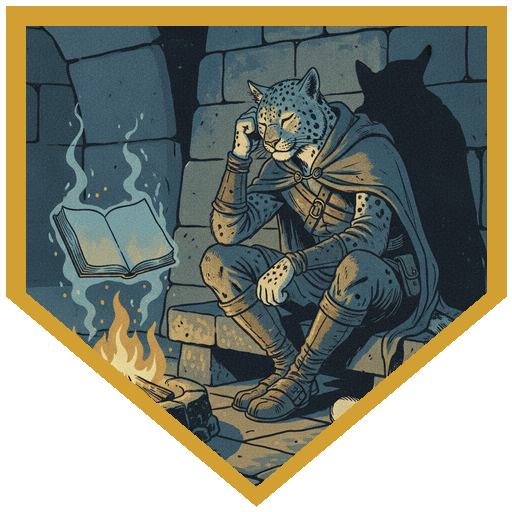
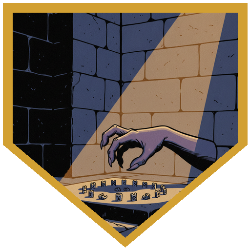
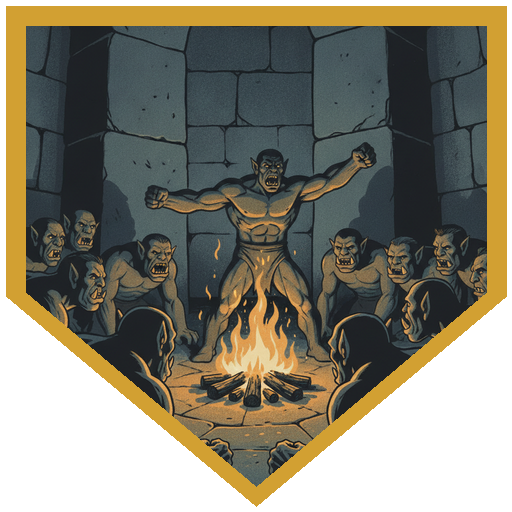
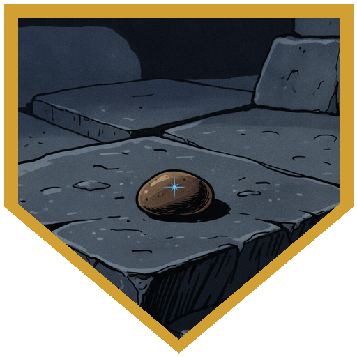
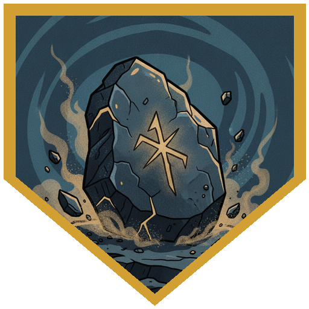

Roaring River rolled a natural 20 on a Wisdom save to open the session, and what it bought him was a headache. He has been having small bouts of déjà vu for days, but this one landed differently — he *knew* the scene in front of him hadn't happened this way, because he had been there when it did. Something in it reminded him of a journal he was certain he had kept, wrote in, referred back to. Except there was no journal, and there never had been. [Father Joseph](../characters/dr-medicine) waved it off as memory leakage from when they changed things around, and offered to prescribe a tonic. The party had come back to the Cold Peak camp to find Durok waiting, Kaarsk still recovering from his injuries and refusing to sit out the way an elder is entitled to, and a meal being laid out with more fresh vegetables than the tribe has seen in a long time. When Father Joseph floated preaching Arveth to the tribe, Durok stopped him cold: he has spoken to the mountain himself, the one who offers to shape the future. He turned it down. It offered greatness for his people — protection — at the cost of "you and others like you." Durok's warning was plain. If the mountain has already given you a gift, the price may not be visible yet.

Then Ulfe laid out the problem. The Elk tribe has been harried by the same robed elementals that have been wearing down Cold Peak. Traveling toward the Cold Peak as they always had, they were forced into a box ravine capped by a frozen waterfall — safe for now, the narrow mouth funneling the attacks into a single front, but no protection at all from anything that flies, and no game inside to hunt. Their supplies are dwindling and their foragers get taken. And there is the bird: a giant thing of ice and wind they have started calling Rime Talon, roosting somewhere on the cliff top. They sent three runners to Cold Peak. Rime Talon took two of them out of the air — [Pasha](../npcs/pasha) among them — and only Ulfe got through. He also carried a message for [River](../characters/river): when Ragnhild gave him the bow, River had promised that if the Elk ever stood alone, he would stand with them. The Elk are asking, through Ulfe, whether Cold Peak will open its fire to them. It is not a small ask of a tribe that can barely feed itself.

Durok argued against it, and the longer the meal went, the harder he argued — more people in one place makes a more enticing target for the mountain's attention, and Cold Peak cannot feed the mouths it already has. Insight checks read the room: this is not a democracy, it is Broken Tusk's decision, but a leader does not give an order her people won't follow. [Berg](../characters/berg) made the case to Durok directly — one large threat, both tribes, deal with Rime Talon quickly and pull a thorn before it festers — and got a measured refusal (the thorn is not in your side yet; they are the ones bringing it here). [Alina](../characters/alina) cast an augury on whether joining forces was wise and, for the first time in this campaign on this kind of question, the bones came back **Weal** rather than Woe — enough that even she suspected they were lying to her. She presented it to Broken Tusk; taken as one more voice, it moved nothing on its own. The turn came when Alina reframed the whole question: *what if we kill the bird?* That is a different question entirely. Father Joseph put a persuasion roll of 27 with advantage behind it, and the room flipped — suddenly this was not shelter for refugees, it was a glory hunt, the story of the day the Cold Peak brought down a mighty creature, and hunters were volunteering to come along. Durok looked at the party with something like respect. He would stay and protect his people, but he would send his help with them: a ritual to call the spirits of the land into a stone.

While the council settled, the mountain opened a second front. Arveth contacted [Father Joseph](../characters/dr-medicine) directly — no ritual, no request on his end, the patron simply reaching out — and offered a bargain: plant a stone from the mountain here in the camp, and the home will be safe while they are gone. "I can't promise that if you don't." Father Joseph asked, more than once, what "save" was going to mean, and got only reassurance. Berg stayed behind to give the others cover — going over every fighting technique in "this big book of the one word I know" — while River slipped out with Father Joseph (stealth 24) to meet the herald. Clod fluttered down on small wings and handed over a plain brown pebble. Alina's Identify confirmed it: non-magical, unremarkable, from the mountain, and nothing else. Father Joseph buried it in the center of the camp — the spot where they had just eaten — while the whole table narrated exactly how badly this was going to go and reminded each other that they, at least, have the privilege of leaving. Then came Durok's ritual: everyone who took part attuned to a Stone of Controlling Earth Elementals, able to call up an earth elemental once a day (it does everything Henry asks and is openly rude to him about it). Brekk brewed Father Joseph a Potion of Greater Healing on the way out. Supplies were gathered for the march. Next session, they leave for the ravine — and for Rime Talon.

## Player Highlights

<strong><a href="../characters/alina">Alina Shandorath</a></strong> (Dominic) — Cast the augury that finally came back <em>Weal</em> instead of Woe — the first time this campaign the bones have blessed a decision — and was suspicious enough of it to say so out loud. When the council was deadlocked over feeding refugees, she reframed the entire debate with one question: <em>what if we kill the bird?</em> That turned a burden into a glory hunt. Also cast Identify on the mountain's pebble and confirmed it was exactly, only, a rock.

<strong><a href="../characters/river">Roaring River</a></strong> (Eric) — Opened the session with a natural 20 Wisdom save that only sharpened the wrongness: déjà vu, and a certainty that he had kept a journal that no longer exists. Carried Ragnhild's message and his own old promise — to stand with the Elk if they ever stood alone. Pressed Durok with the thorn-in-the-side argument, took the rebuttal, and later slipped out at stealth 24 to meet the mountain's herald.

<strong><a href="../characters/dr-medicine">Father Joseph</a></strong> (Henry) — Landed the roll the whole negotiation turned on: a 27 persuasion with advantage that flipped the council from reluctant charity to an eager hunt for Rime Talon. Meanwhile his patron reached out to him unprompted — Arveth, offering to keep the camp safe while they're gone if a stone from the mountain is planted in it. He questioned what "save" would mean, got no real answer, and buried the pebble in the center of camp anyway, reasoning aloud that they can always just leave. Attuned to the earth-elemental stone from Durok's ritual, whose elemental obeys him and insults him in equal measure.

<strong><a href="../characters/berg">Berg Wurdnowwah</a></strong> (Josh) — Made the opening case to Durok directly: one big threat, both tribes, deal with Rime Talon fast and remove a thorn before it festers. It landed as a measured refusal, but it planted the frame the party later won on. When the herald meeting needed cover, he stayed behind to hold the room's attention — lecturing on every combat technique in "this big book of the one word I know" — and handed the others advantage on their stealth.

## Achievements

<strong>The Journal That Never Was</strong> — River's natural 20 Wisdom save opened the session on the wrong foot: he knew the scene hadn't gone this way, because he'd lived the version that did, and he reached for a journal he was sure he'd kept — that has never existed. Memory leakage from the reweave, Father Joseph called it. "I wouldn't worry about it."

<strong>The Bones Turn</strong> — Alina cast an augury on whether the two tribes should unite, and for the first time in the campaign on this kind of question the answer came back <em>Weal</em> — better together than apart. After a run of Woe long enough that she trusted it, she was openly suspicious the bones were finally lying to her.

<strong>What if We Kill the Bird?</strong> — Durok would not be moved on sheltering more mouths, until Alina stopped arguing about food and asked the other question: what if we kill the bird? Father Joseph's 27 persuasion with advantage landed it, flipping the room from reluctant charity to an eager hunt for Rime Talon, with Cold Peak hunters volunteering to march.

<strong>It's Just a Rock</strong> — Arveth's herald, Clod, delivered a plain brown pebble with a promise that it would keep the camp safe. Identify confirmed it was non-magical and from the mountain, and nothing more. Father Joseph buried it in the center of camp while the whole table narrated how badly it would go. "It's just a rock, don't worry about it."

<strong>Spirits of the Land</strong> — Won over, Durok chose to stay and defend his people but sent his aid with the party: a ritual calling the spirits of the land into a stone. Everyone who took part attuned to a Stone of Controlling Earth Elementals — an earth elemental on call once a day, one that does everything Henry asks of it and is rude to him the entire time.

## Rewards

- **150 gold each** (600 gp total) — narratively provisions, hides, and resources rather than literal coin
- **Supplies for the march** — enough to move a party of roughly eight to ten toward the ravine
- **Stone of Controlling Earth Elementals** *(uncommon, requires attunement)* — from Durok's ritual; summons an earth elemental once per day to obey your commands. Available as an unlock.
- **Potion of Greater Healing** — brewed by Brekk for Father Joseph on the way out (a successful check would also have yielded a Potion of Cold Resistance)
