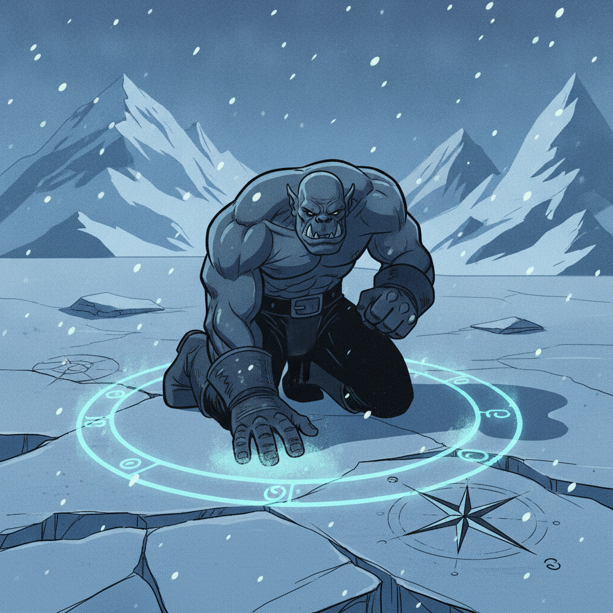
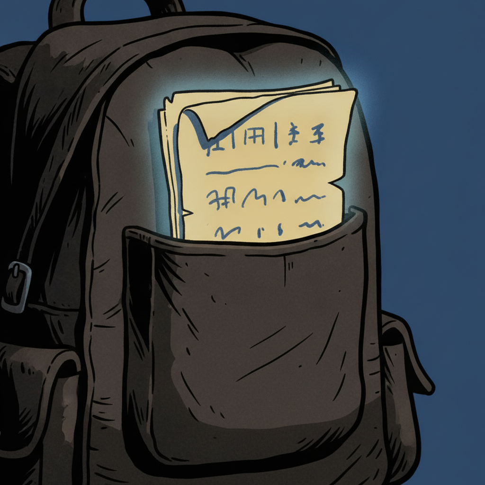
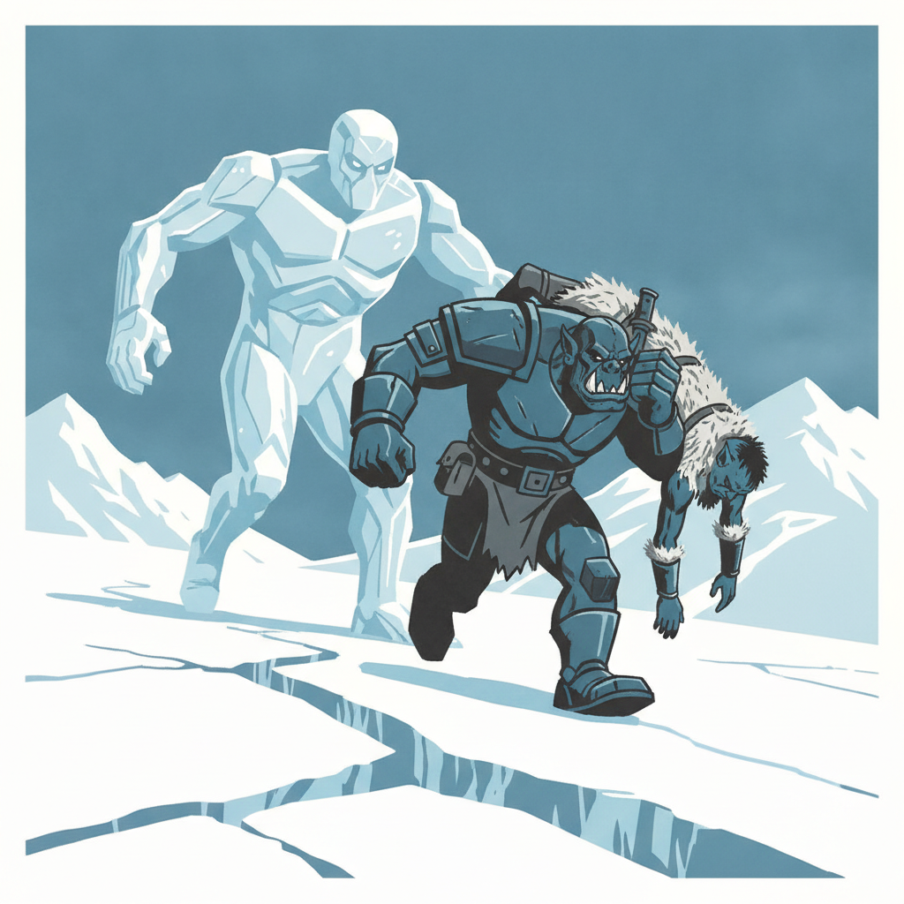
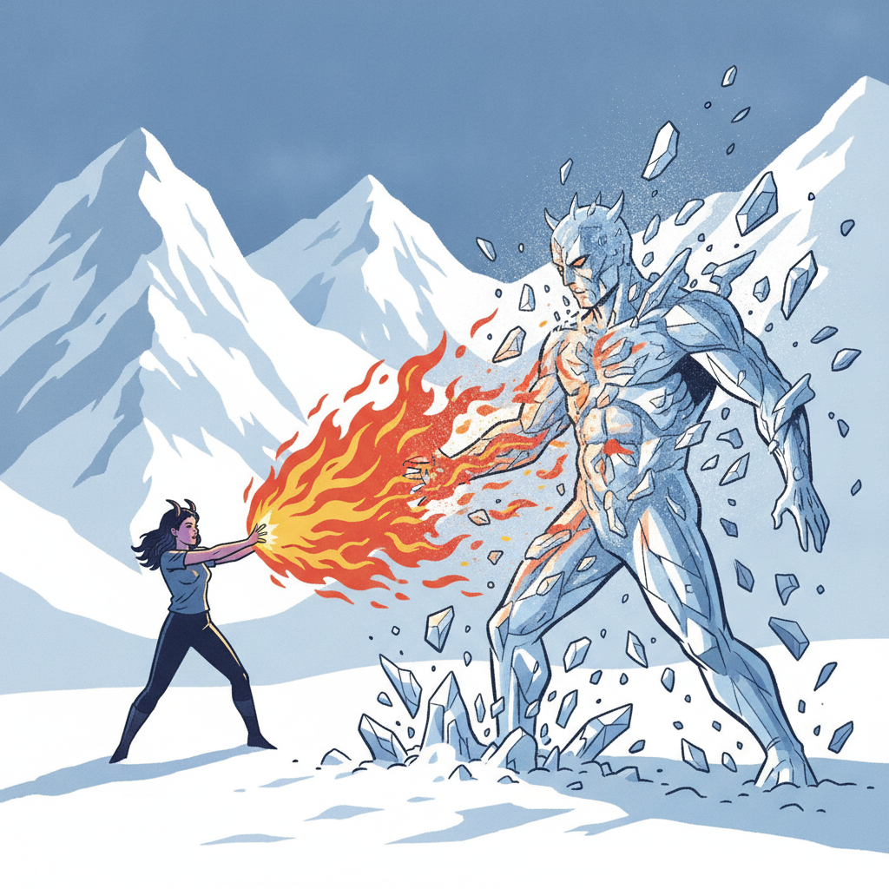
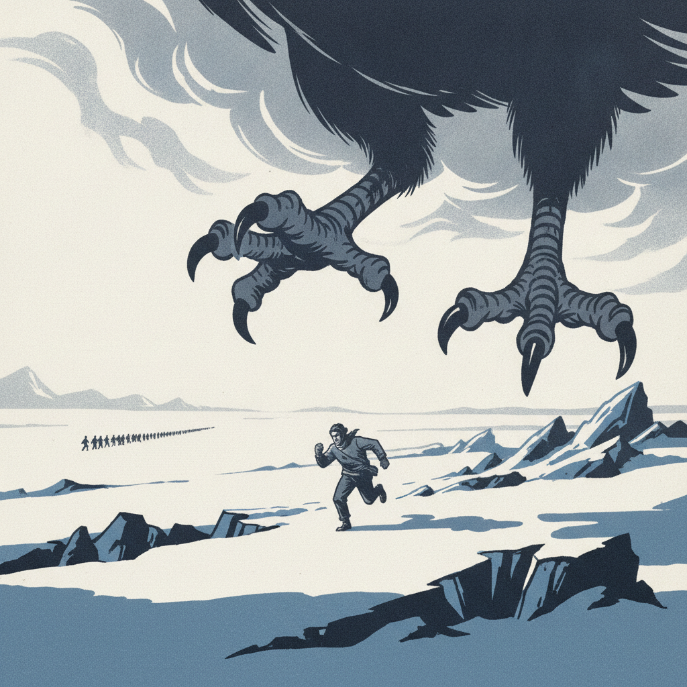

The column moved northwest through the ice: [Berg](../characters/berg), [Alina](../characters/alina), and [River](../characters/river) with [Ulfe](../npcs/elk-scouts) as guide and four volunteer Coldpeak hunters — [Tarn](../npcs/tarn), the youngest and fastest on his first expedition beyond the perimeter; [Grath](../npcs/grath), older and steady; [Hauk](../npcs/hauk) the trapper; and [Tarsk](../npcs/tarsk), a guard eager for a real fight. [Kaarsk](../npcs/kaarsk) stayed behind to hold the camp, his trust in Berg's command expressed by his absence. The hunters took the lead on survival, calling out the route where the party's own rolls fell short. Hours in, the column walked into a wide clearing scoured flat on the ice — chardalyn dust in binding-circle patterns, compass-rose marks burned into the ground at three points, northern point heaviest on each. Alina cast Detect Magic and investigated: a summoning site, used repeatedly, the most recent binding only days old. Berg rolled a natural 20 on Arcana and lived up to his name — Wurdnowwah, the word knower — confirming the chardalyn as the medium anchoring the summonings. The Brotherhood wasn't raiding Coldpeak with wild magic. They had a forward staging ground, organized and active.

During a rest in cover, River reached into a hidden pocket in his backpack — the spot he used in his tomb-raiding days to stash things — and found a folded page in his own handwriting. It described this corridor: the ice, the route toward the Elk camp, the cold that didn't track with weather. One line referenced the bow. Another referenced a promise to stand with someone whose name was smudged past reading. It was written as if all of this had already happened. River's Arcana check connected it to his Soulknife abilities — psionic, near rewoven ground, something pulling a thread loose from the realm of maybes. Another artifact from the version of River who was rewoven out, surfacing the way the doll and Igenio's spellbook had surfaced before: proof that a man who doesn't exist remembered things this one doesn't. With Father Joseph absent, no one at the table could interpret what it meant. River held the page and continued the march.

The open ice came next — exposed, no cover, the cold sharpening past what weather could explain. River spotted the cracks forming with a 25 on perception and the party scattered before the thing erupted: a hulking creature of ice, ten feet tall, vaguely humanoid, carrying a massive frozen weapon. The fight was a chase. River cleared 200 feet in two rounds on Cunning Action dashes, firing psionic blades backward to slow the creature by 10 feet. Alina ran and threw fire behind her. Berg was the one it caught — 17 cold damage and his speed cut by 10 — and Berg was the one who refused to leave anyone behind. When Grath went prone on bad footing, Berg burned his movement to reach the fallen hunter, picked him up, carried him at half speed, and Action Surged to put distance between them and the hulk. Then he turned to fight: pike for 15 damage with a push, javelin for another 15 with Distracting Strike and the slow property reapplied. River critted with a natural 20, doubled sneak attack, and tripped the hulk prone. Alina ended it — a natural 20 on a third-level Witch Bolt for exactly 60 lightning damage. "Holy Christmas." The hulk shattered. Then the fog rolled in.

Something was angry. A fog — not snow, fog — blanketed the ice, and the column had to dash six more rounds to clear the corridor. Constitution saves every round past their limit. River pushed hardest and paid for it: three failed saves, three levels of exhaustion, rolling 1s and 2s while everyone else scraped through. Tarn — the fastest runner in the column, the youngest hunter, the kid on his first expedition who had asked Berg about formation — hit his own wall of exhaustion and fell just slightly behind the rest. Through the mist the party saw enormous talons close around him, and Rime Talon climbed into the clouds with the youngest hunter in its grip. The column stopped. Grath said nothing. When the orcish hunters stood demoralized on the ice, Berg spoke to them in Orcish — invoking Gruumsh, invoking adversity as the forge that makes a people stronger. He rolled an 8 and added Tactical Mind for another 8: a 16 that landed. The hunters refocused. The column reformed. They pressed on toward the ravine mouth visible in the distance, carrying one fewer name than they started with.

## Player Highlights

<strong><a href="../characters/berg">Berg Wurdnowwah</a></strong> (Josh) — Commanded the column on his first real expedition as leader and the hunters deferred to him the whole march. When Grath went prone mid-chase with the ice hulk bearing down, Berg turned back — burned his movement, picked the hunter up, and Action Surged to carry him clear. Then turned and fought: pike and javelin for 30 combined damage with pushes and Distracting Strikes setting up the party's kills. After Tarn was taken, rallied the demoralized hunters with an Orcish speech invoking Gruumsh — an 8 saved by Tactical Mind into a 16.

<strong><a href="../characters/alina">Alina Shandorath</a></strong> (Dominic) — Read the Brotherhood's staging ground with Detect Magic and investigation, confirming the chardalyn binding circles as recent and active — the enemy has infrastructure, not just monsters. Killed the ice hulk with a natural 20 on a third-level Witch Bolt for exactly 60 lightning damage, the crit that ended the chase before the fog brought something worse.

<strong><a href="../characters/river">Roaring River</a></strong> (Eric) — Found a page in his own handwriting in a hidden pocket of his pack, describing this exact corridor and referencing a bow and a promise — written as if it had already happened. Spotted the ice hulk forming at 25 perception and opened the distance with Cunning Action dashes, firing psionic blades to slow the creature from range. Critted with a natural 20 and doubled sneak attack to trip the hulk prone. Paid the heaviest price on the forced march: three levels of exhaustion on rolls of 1, 2, and 1.

## Achievements

<strong>The Word Knower</strong> — The column walked into a clearing scored with chardalyn dust in binding-circle patterns, compass-rose marks burned into the ice. Berg rolled a natural 20 on Arcana and lived up to his name — Wurdnowwah, the word knower — reading the Brotherhood's summoning method on the ground like a page from the book he never puts down.

<strong>In His Own Hand</strong> — River reached into a hidden pocket he'd used in his tomb-raiding days and found a folded page in handwriting that was his but slightly different — the way your own hand looks in a photograph you don't remember sitting for. It described the corridor they were crossing, referenced the bow and a promise, and was written as if all of this had already happened.

<strong>Nobody Gets Left Behind</strong> — Grath went prone mid-chase with the ice hulk closing in. Berg turned back — burned 30 feet of movement to reach the fallen hunter, picked him up, carried him at half speed, then Action Surged to put distance between them and the thing behind them. Set Grath on his feet and turned to fight.

<strong>Sixty Damage, Exactly</strong> — The hulk was prone and bloodied. River had critted and tripped it. Berg had shoved it back and slowed it twice. Alina rolled a natural 20 on a third-level Witch Bolt and the dice came back exactly 60 lightning damage, shattering the ice creature into nothing. "Holy Christmas. If this doesn't kill him, we have an issue."

<strong>The Fastest Runner</strong> — Tarn was the fastest in the column. The youngest hunter, first expedition beyond the perimeter, the one who asked Berg about formation on the march out. When exhaustion hit the forced dash through Brotherhood fog, he fell just slightly behind the rest. Rime Talon descended from the clouds and took him. Speed wasn't the thing that mattered.

## Rewards

- **200 gold each** — scavenged chardalyn dust from the Brotherhood staging ground
- **Level up to 8** — all PCs advance at session end, ahead of the Rime Talon hunt
