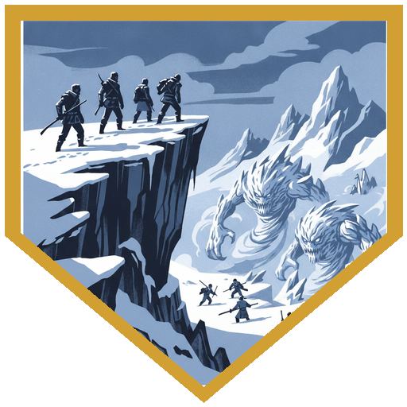
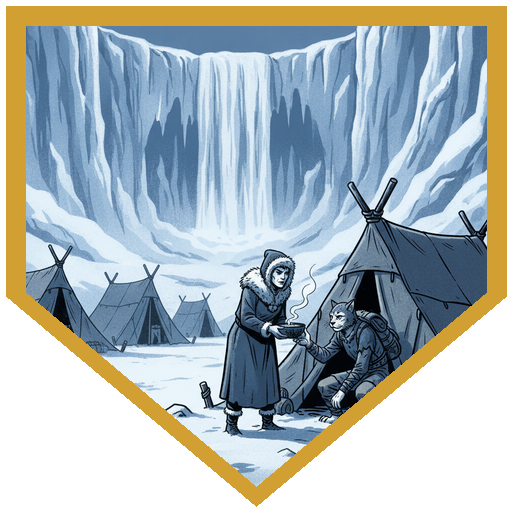
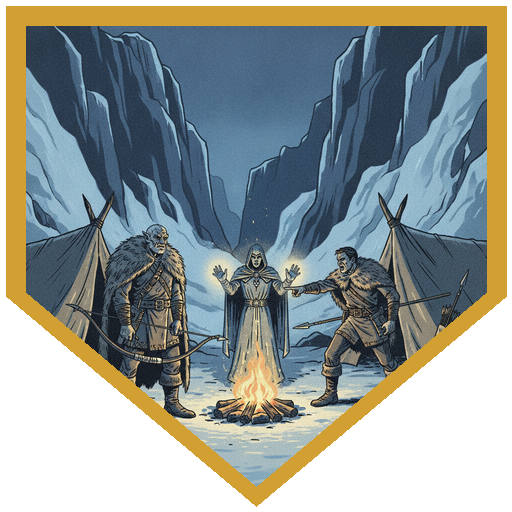
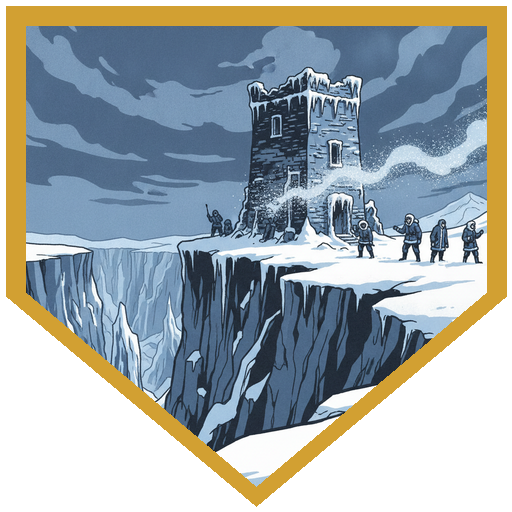
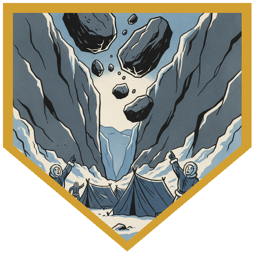

The column closed on the Elk's box canyon with [River](../characters/river) still carrying three levels of exhaustion from the crossing that cost [Tarn](../npcs/tarn). [Father Joseph](../characters/dr-medicine) had caught up - full party for the arrival. Survival checks found a high approach: thirty feet of height and cover, advantage on initiative. Below, Elk hunters were already losing a fight with three beefy mist-and-frost elementals - Brotherhood work, the same family as the corridor hulk. The party dropped in as the answer. River opened with Steady Aim from the ledge. Alina spent luck for advantage on a fourth-level Witch Bolt and put 38 lightning into an undamaged hulk. Berg burned Adrenaline Rush and Charger's dash to close, pike and Distracting Strike chewing the Witch-Bolt target while [Tarsk](../npcs/tarsk) and [Hauk](../npcs/hauk) ran down with him. Father Joseph chanted a backwards "message," summoned Gunther in Slaad form, and put 25 slashing into Berg's fight. The Elk cheered when the war party joined. When the last hulk dropped, [Bjarne](../npcs/bjarne) - healthy, winded, the man they'd once rescued from Allip possession - clasped River's hand and got them toward a fire. Don't tell the camp how close the crossing was. On the walk in, anyone who hit 14 Perception caught a large silhouette crossing the high sky: [Rime Talon](../npcs/rime-talon), distant only.

[Ragnhild](../npcs/ragnhild) said simply that they came - then put warm broth in their hands before any questions. Long rest. Father Joseph delivered a riveting sermon for 12 temporary hit points and sent his familiar around with a collection plate. After the food, Ragnhild asked the ritual question: how were your journeys? [Grath](../npcs/grath) went quiet and stayed quiet. Hauk answered angrier - the elementals took one of theirs on the way - and was about to make it the Elk's fault when Father Joseph stepped in. Persuasion 16: they had come to aid the fight against Rime Talon, not to tally guilt. River's bow-promise surfaced in the telling; Alina named the Brotherhood's light-born elementals. Ragnhild already knew part of it - scouts had seen flashes on the ridges near the ruined towers before some attacks. She asked for fortification advice. Berg and River worked the martial side (Athletics and Stealth successes: choke points, falling traps, better sniper posts for Elk scouts). Alina and Father Joseph took the ruined watchtowers: Investigation and Arcana found chardalyn residue sheltered from the wind - older than the corridor staging ground, used for a while. Both towers mapped. They swept the residue — **300 gp** each when the dust is counted as gold. The box wasn't safe because of open approaches; someone had been birthing bindings on the rim.

During the rest River brought Father Joseph the journal page from the other life - handwriting that shouldn't exist. What answered was not only a friend's read. Alina felt briefly ill in the exchange; a presence that had bargained with Joseph spoke of welcome bargains and finer control, and of meeting again where they had first been seen. Dawn. An outcry. A portion of the canyon rim crumbled and huge boulders began falling into the camp. That is where the session ends - next week starts under the rockfall.

## Player Highlights

<strong><a href="../characters/berg">Berg Wurdnowwah</a></strong> (Josh) — Dropped from the high approach on Adrenaline Rush and Charger into the hulks the Elk were losing to, Distracting Strike setting up the table's damage. Worked the canyon's martial defenses afterward - Athletics into choke points and funnels for Large elementals - the Word Knower's command turning into engineering.

<strong><a href="../characters/alina">Alina Shandorath</a></strong> (Dominic) — Spent luck to land a fourth-level Witch Bolt for 38 lightning on an undamaged hulk from the ledge. On the rim she and Father Joseph read the ruined towers: chardalyn residue held out of the wind, older use than the corridor clearing - Brotherhood conjuring tied to the flashes Ragnhild's scouts had seen.

<strong><a href="../characters/river">Roaring River</a></strong> (Eric) — Three levels of exhaustion and still Steady Aim from the ledge; later Stealth into better sniper posts for Elk scouts. Showed Father Joseph the journal page from the never-was. Heard Ragnhild's "you came" with broth in hand before the bow-promise had to be spoken aloud.

<strong><a href="../characters/dr-medicine">Father Joseph</a></strong> (Henry) — Caught up for the arrival; summoned Gunther to finish a hulk beside Berg. Sermon for 12 temp HP and a collection plate. Persuasion 16 kept Hauk's grief from becoming a diplomatic wound with the Elk. Read River's page - and more than a page answered.

## Achievements

<strong>High Ground</strong> — Survival found the ledge: thirty feet up, cover, advantage on initiative. The Elk were losing the mouth until the war party arrived from above and turned a grinding attrition fight into a rescue.

<strong>You Came</strong> — Ragnhild's first words were not a briefing. Broth before questions. The bow-promise could wait until there was warmth in hand.

<strong>How Were Your Journeys?</strong> — The Elk ritual question. Grath went quiet and stayed quiet. Hauk's anger almost made Tarn the Elk's fault until Father Joseph's Persuasion 16 reframed the column as saviors against Rime Talon, not accountants of blame.

<strong>Both Towers</strong> — Ruined watch posts on the rim held chardalyn out of the wind - older residue than the corridor staging ground. Alina and Father Joseph mapped both. The flashes the scouts had seen had an address.

<strong>The Rim Gives Way</strong> — Dawn after the defenses were set. Outcry. The top of the box canyon crumbled and boulders fell toward the camp. Next session starts under the rockfall.

## Rewards

- **300 gp** each — **chardalyn dust sweepings** from the ruined towers (represented as gold)
- **No permanent magic item** this session
- Consumables: not finalized at table (confirm before publishing)
- Father Joseph's sermon: **12 temporary hit points** (do not stack with other temp HP)
