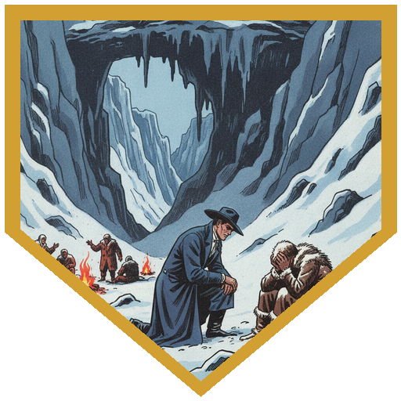
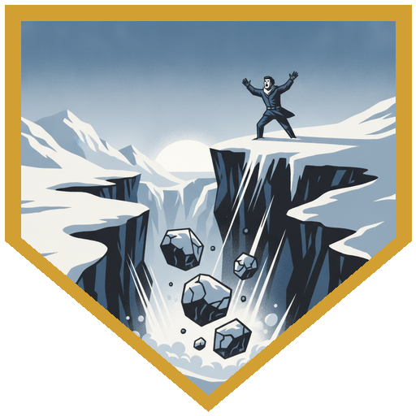
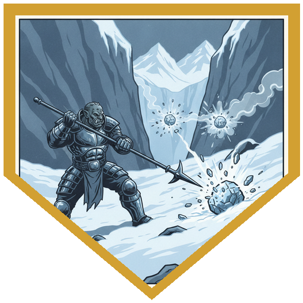
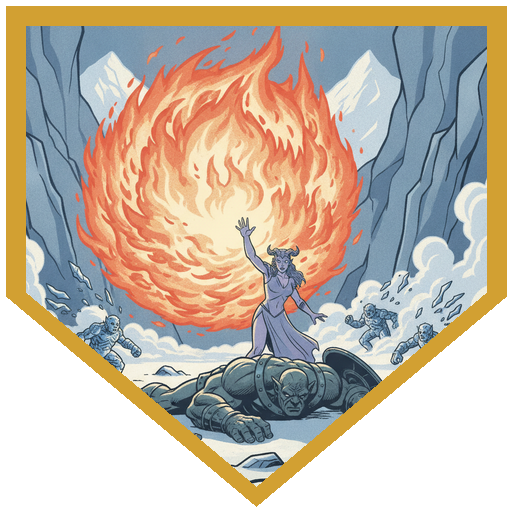
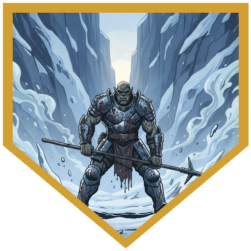

The rim gave way at dawn — the rockfall that ended Session 18, now landing. Eight Rime Motes — small ice-and-rock elementals — tumbled into the Elk camp's box canyon alongside two heavier Floating Boulders, animated rock with flyby. Initiative rolled high: [River](../characters/river) at 19, [Alina](../characters/alina) and [Berg](../characters/berg) at 17, [Father Joseph](../characters/dr-medicine) at 16. River opened from under the overhang with a sniper's calm — 19 damage, and the first Mote exploded in a burst of cold shards. Alina Firebolted another for 13 and got the same detonation. Berg locked a Floating Boulder with Goading Attack at DC 16 — it failed the Wisdom save and spent the fight trying to hit only him — then Bait and Switched Alina to safety with +5 AC. Father Joseph summoned Gunter, who couldn't land his opening swings. Then Joseph froze. The others had seen it before. Arveth was calling.

The bargain was simple. One of the Elksmen sat apart — the one who should have been on watch, whose family was among the losses. He wasn't angry the reinforcements came. He just didn't see what was left. Arveth wanted Joseph to talk to him. Natural 20 on Persuasion — 27 total. "You die here, everything that was known about your family is gone," Joseph told him. "But if you survive this, you can keep their memory." The watchman asked for Joseph's story in return. Then the camp followed. Everyone spoke about what they lived for, because any of them might not survive the next dawn. When Joseph came back to the present, the boulders were on the ridge again — no Elksmen crushed beneath them, the two Rime Motes he'd watched die still dead. But the watchman — despondent and idle in the old timeline — had raised the warning this time and been thrown over the edge for it. He fell at Joseph's feet. The cost of a reweave: he lived long enough to do his job.

The party had a prep round, resources refreshed. River hid behind the ridge (Stealth 23) and came out with a natural 20 crit — doubled sneak attack dice, another Mote obliterated. Berg and Joseph held actions. When the Floating Boulders came over the ridge, held actions fired: Joseph's Eldritch Blast for 16 force, Alina's Firebolt for 7 fire. Berg Action Surged and cut through three Rime Motes in sequence, each death-burst chaining cold damage into the Galeb Dur and nearby boulders — the 2d4+2 cascading through everything adjacent. The Galeb Dur — a true animated boulder, not reskinned — dropped from above onto Berg: 20 bludgeoning, Parried to 9, knocked prone. Two more Floating Boulders slammed him while he was down. Joseph's Eldritch Blasts put 25 force into a boulder, bloodying it; Gunter followed with 18 slashing. Alina dropped a fourth-level Fireball for 33 damage with Sculpt Spells — Berg was prone on the ground in the center of the blast and took nothing. The chain continued: dying Motes' ice bursts hitting everything adjacent. Then the mist that had been rising from every shattered Mote coalesced into two spectral shapes that screamed despair — a wail meant to incapacitate the camp. But the Reghedsmen began a chant, and Joseph's natural 20 echoed across two timelines: fear immunity and Bless for the party.

River switched to Psychic Blades — the one damage type that cut through the insubstantial mist elementals clean. Twenty-seven psychic on the first, bloodied. Alina threw two more Fireballs. Berg killed the Galeb Dur with Distracting Strike for 23 damage, triggering a 10-foot death burst that dropped Gunter. Joseph resummoned the Slaad without breaking stride and put it back to work — Gunter's claws for 26 slashing into a mist creature. Berg finished the last substantial target, then Parried a mist elemental's slam from 16 cold to 1 damage. River's Psychic Blades ended the final spectral shape for 21 more. Berg closed the fight on 6 hit points: over a hundred taken across the engagement, Relentless Endurance, three Second Winds, and that closing Parry. The summoning source on the rim was spent. The camp could move. But the taken were still out there.

## Player Highlights

<strong><a href="../characters/berg">Berg Wurdnowwah</a></strong> (Josh) — Took over a hundred damage and refused to stop. Goading Attack locked the first Floating Boulder. Action Surge cleared three Rime Motes in chain, each death-burst softening the big targets. The Galeb Dur landed on him for 20 — Parried to 9, knocked prone. Relentless Endurance, three Second Winds, and a closing Parry that turned 16 cold into 1. Ended on 6 HP.

<strong><a href="../characters/alina">Alina Shandorath</a></strong> (Dominic) — Three Fireballs across the fight, the biggest at fourth level for 33. Sculpt Spells kept Berg alive while prone in the blast radius — he took nothing. Natural 20 Firebolt killed a Mote mid-chain. Every Fireball triggered cascading ice-burst damage into the larger targets.

<strong><a href="../characters/river">Roaring River</a></strong> (Eric) — Natural 20 crit from stealth with doubled sneak attack dice. Later switched to Psychic Blades against the insubstantial mist elementals — 27 psychic damage, the one type that went through clean. Finished the final spectral shape for 21 more. Still the deadliest thing in the canyon.

<strong><a href="../characters/dr-medicine">Father Joseph</a></strong> (Henry) — Natural 20 Persuasion on the despondent watchman changed two timelines. The camp's story-sharing echoed forward as the Reghedsmen's chant when spectral mist tried to incapacitate everyone — fear immunity and Bless. Gunter died to a 10-foot death burst and was immediately resummoned. Eldritch Blasts for 25 force. The mountain's bargain cost one life and saved the camp.

## Achievements

<strong>What We Live For</strong> — Father Joseph's natural 20 Persuasion on the despondent watchman. "You die here, everything that was known about your family is gone." The camp shared what they lived for. It echoed forward as the Reghedsmen's chant — fear immunity and Bless when the spectral wail came.

<strong>He Raised the Warning</strong> — In the old timeline, the watchman never went to his post. After Joseph's words, the reweave put him there — shouting the alarm as boulders tumbled past. He was thrown over the ridge for it. He fell at Joseph's feet. One life for the camp's survival.

<strong>Chain Reaction</strong> — Berg Action Surged through three Rime Motes in sequence. Each death-burst chained cold damage into the Galeb Dur and Floating Boulders. When Alina's fourth-level Fireball hit the cluster, fire triggered ice bursts triggered more fire.

<strong>Sculpted</strong> — Alina's 33-damage Fireball with Sculpt Spells. Berg was prone on the ground in the center of the blast radius. Completely unaffected. "None of these words I know."

<strong>Six Hit Points</strong> — Berg took over a hundred damage: a Galeb Dur fell on him, Floating Boulders slammed him prone, Rime Mote death-bursts chained through him, mist elementals screamed. Relentless Endurance, three Second Winds, two Parries — the last cutting 16 cold to 1. He finished standing. On six.

## Rewards

- **1,250 gp** each (5,000 gp divided four ways)
- **Advancement** — all PCs leveled from 8 to 9
- **Hoard magic item** (each player picks one):
  - *Ioun Stone of Protection* (rare, requires attunement)
  - *Ioun Stone of Reserve* (rare, requires attunement)
  - *Ioun Stone of Sustenance* (rare, requires attunement)
- **Potion of Heroism** (rare consumable)
