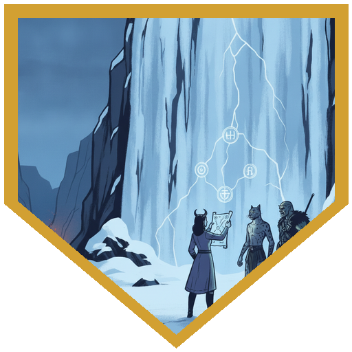
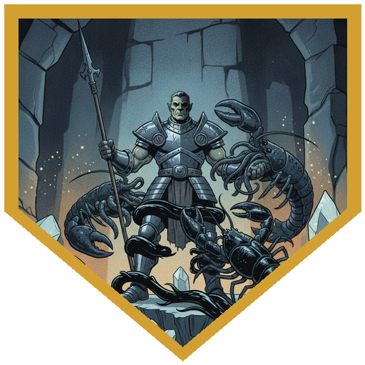
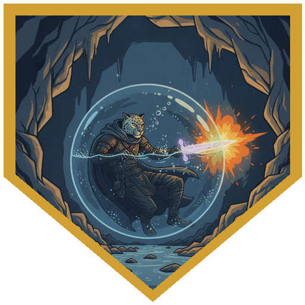
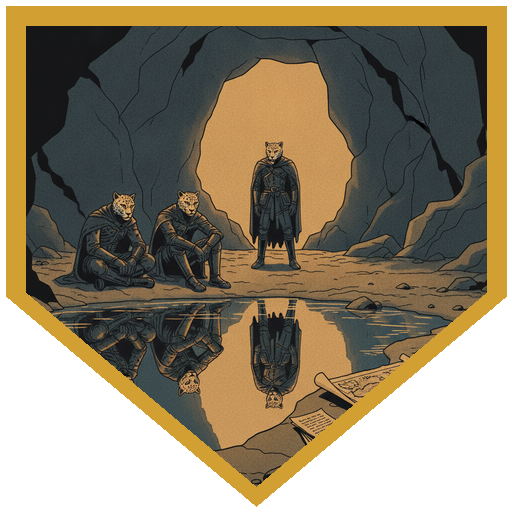
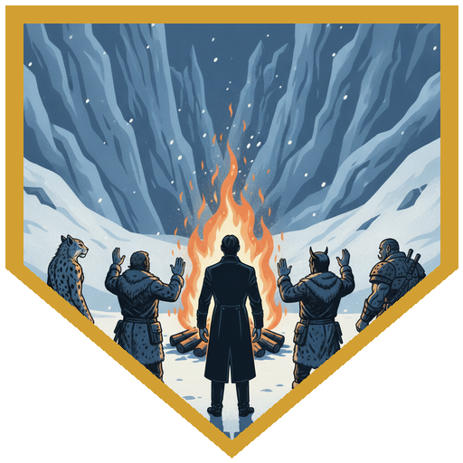

The morning after the siege, River woke with one level of exhaustion gone, not all of it. Father Joseph was already busy. All morning the Elk came to hear Eyvend's story from him, and something in the camp had shifted: they had stopped talking about the journey and started talking about the weaving of their lives, and they had started calling Joseph the Thread Giver. They had been apart from the other Elk so long, and so bound up with Coldpeak, that they spoke of taking a new name. River had his own news. Another page had turned up, in a careful hand he has never used: *"You won't remember writing this. You didn't. There are two of us now."* The other one had doubted the pages until the ravine, where in his version the rim came down in the dark and nobody called out. *"Come tonight while they're all at the fire. Come without him. Ours sells tonics and owes nobody. Yours carries something of hers inside of him."* And: *"You're the river, and we're the bends that have been left behind. Still water, but water."* Folded inside was an arcane drawing that looked like a map. River showed [Alina](../characters/alina). Her training in Arcana and cartography together gave her advantage, and she read it on a 20: a route between two pools, the foot of the frozen waterfall above camp and the warm cave where the party sheltered on their first night in the Dale, where a stream ran off down branches they never took. Conjuration was woven through it, a slow teleport, drawn by a trained cartographer with magic to spare. [Berg](../characters/berg)'s History 22 caught the cost: the Elk tell their stories in the open, and walking out of a telling is a faux pas. They went anyway, and a group Deception check carried the exit.

The waterfall was wrong on its face. Falling water doesn't freeze; something had flash-frozen it, more evidence that this winter is not natural. Held up to the ice, the map's sigils lined up with a pattern in it on Alina's second Arcana check, a 22, and the ice let them through. Behind it the cold stopped. A fast black channel ran through a long cavern deep under the earth, crystals on every surface catching the light of the Moon-Touched blades, the water running down deeper than the slope should allow. [River](../characters/river)'s History check came up 3. He has gone by River so long that he's losing his own Tabaxi, and the name the pages would give the other River, [Atezca](../npcs/atezca), meant nothing to him. The party climbed to a high crystal shelf to stay out of sight, and below them the channel held two chuuls, crayfish the size of horses with tentacles at the mouth, and two Undertows, water elementals in the same shape. They won initiative with advantage, River on a natural 20. He opened with Steady Aim for 20, and Alina's third-level Fireball caught all four for 31. Every save failed. ("Notably not a 33," after [last session](../sessions/2026-09-18)'s run of them.)

Everything came up the ramp for Berg: an Undertow's watery claws for 17 and a grapple, then a chuul, then a third grab. A Constitution save of 26 shrugged off the paralyzing tentacles. "They're all gonna fight over you." "Yeah, it's nice to be wanted." Berg answered with Second Wind, Distracting Strike, Sentinel strikes on anything that grabbed his friends, Indomitable to keep from being swallowed, and Action Surge into the Undertow holding him. River was grabbed too and cut the one holding him for 22; Alina's second Fireball took one out entirely. Then the other Undertow pulled River inside itself: disadvantage on the save, a 4, and 18 cold damage in black near-freezing water full of crystal grit. He kept attacking from inside, restrained, with Steady Aim. Alina's third Fireball ended it, and the last two went down together. The Undertows had a Freeze trait that cold damage would have triggered. Nobody had cast cold at them.

The stream ran on, warmer and smaller, until the warm cave from their first night lay at the far end. Off it ran a side passage River had seen then and not cared about, marked with runes from that first night's puzzle. Down it, a bend of the stream had been cut off into a pool: unfrozen, perfectly flat, fed by nothing, draining nowhere. Beside it sat two Tabaxi who were almost exactly River. "You've been busy exploring the branches, I see." The first named himself **Atezca**, Still Waters, the River from before the Session 12 reweave. He had lessons with a medicine man that this River never had, which may be why he kept a journal. "I kept a record of it, and apparently the records don't get rewritten. The journals make their way to you, but nothing else." The second was new, "just from yesterday," without a name yet. He has a hand for cartography and magic, he drew the map, and he could draw more if they find places like this one. In his version he never met Eyvend or knew who he was. River's History 23 found the word for them: oxbows, bends a river cuts off that slowly fill with silt, and too many of them slow the river down. How many more before something goes wrong, they asked, and nobody knew. Alina's Arcana 19 found Netherese in the passage and one more instance of the phrase that keeps following the party: *"That which never was will be once again."* Here it was about how to come back, and Atezca had taken a rubbing of it. Of Joseph: "Ours continues to sell tonics. Yours has decided to take up religion." Atezca couldn't say how much of that was sales pitch and how much belief. "I don't think Arveth is our ally." River agreed. The bow River carries came with a promise: Atezca had told Ragnhild he would watch over Savin, and he asked River to do it too. "I told her I would," River said. A promise another River made had become his. His last question was whether River trusts his doctor. "He's a good guy." They are echoes, they said, more here when River is here, and they'll send word when they can. The party came back through the ice as the telling ended, in time to hear the camp give Joseph the honorific Thread Giver, a place among them that hadn't existed before. Ragnhild noticed River, noticed that he had come back more than that he'd been gone, and thanked him for keeping an eye on Savin and for coming back when they needed him most. The Elk want to go to Coldpeak, if there is a place for them. The three taken by Rime Talon they hope to save, but not at the tribe's risk. The journey starts next week.

## Player Highlights

<strong><a href="../characters/river">Roaring River</a></strong> (Eric) — Natural 20 on initiative and Steady Aim from the crystal shelf for 20. Swallowed by an Undertow for 18 cold, restrained in black water, and still attacking from inside. History 23 put a word to the other Rivers: oxbows. Told Atezca his doctor is "a good guy." When Atezca brought up the promise to watch over Savin, River claimed it as his own: "I told her I would."

<strong><a href="../characters/alina">Alina Shandorath</a></strong> (Dominic) — Read the map on a 20, her Arcana and cartography training working together: two pools, a slow teleport, and a trained cartographer's hand. At the falls, a 22 lined its sigils up with the ice. Three third-level Fireballs: 31 into all four monsters, 27 that finished one, and a last one that ended the fight and got River out. Arcana 19 at the still pool found the city's phrase once more.

<strong><a href="../characters/berg">Berg Wurdnowwah</a></strong> (Josh) — History 22 warned the party what leaving a telling means to the Elk. On the shelf, grappled by three creatures at once, he made a 26 Constitution save against paralysis and used Indomitable to stay out of an Undertow. Sentinel strikes, Distracting Strike, Action Surge. "It's nice to be wanted."

## Achievements

<strong>The Map Is a Door</strong> — Alina's Arcana and cartography training together gave her advantage, and she read River's map on a 20. It joins two pools, the frozen waterfall and the warm cave from their first night in the Dale. At the falls her second Arcana check, a 22, lined the sigils up with a pattern in the ice, and the ice let them through.

<strong>It's Nice to Be Wanted</strong> — Everything in the cavern went for Berg: an Undertow's claws, then a chuul, then a third grab. A 26 Constitution save kept the tentacles from paralyzing him. "They're all gonna fight over you." "Yeah, it's nice to be wanted."

<strong>Chilly in Here</strong> — An Undertow pulled River inside itself: black water, near freezing, crystal grit, 18 cold damage, grappled and restrained. He kept stabbing from inside. "Boy, it's chilly in here." Alina's third Fireball got him out, and he came out, in his own words, covered in snot.

<strong>Still Waters</strong> — A side passage River never noticed, a bend of stream cut off into a pool fed by nothing, and two Tabaxi who were almost exactly him. "You've been busy exploring the branches, I see." One named himself Atezca. The other, one day old, hasn't picked a name.

<strong>Thread Giver</strong> — Back through the ice as the telling ended, in time to hear the camp give Father Joseph a title that didn't exist before. Ragnhild noticed River had come back, more than that he'd been gone, and thanked him for watching over Savin, a promise he now calls his own.

## Rewards

- **300 gp** each (900 gp total) — crystals recovered from the water elementals in the crystal cavern
- **First session off Adventurers League** — each player keeps about five magic items; the rest go into a group pot anyone can take from
- **Advancement** — milestone, and from now on the party decides when to level
