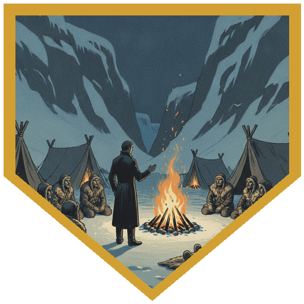
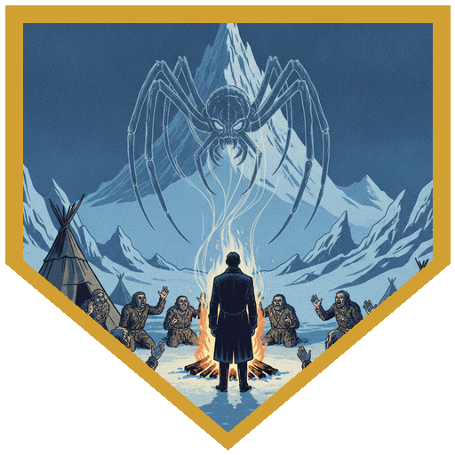
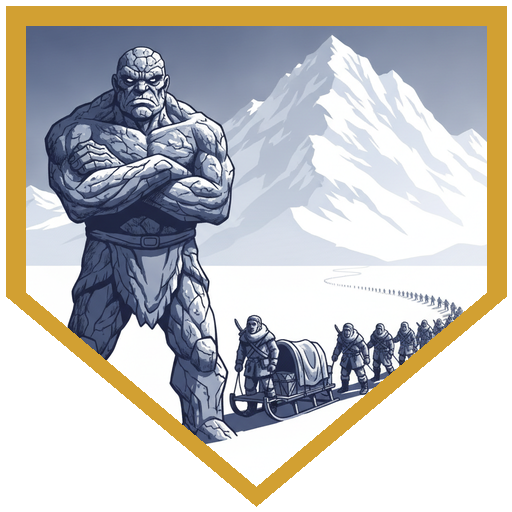
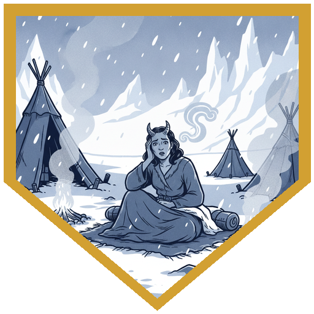
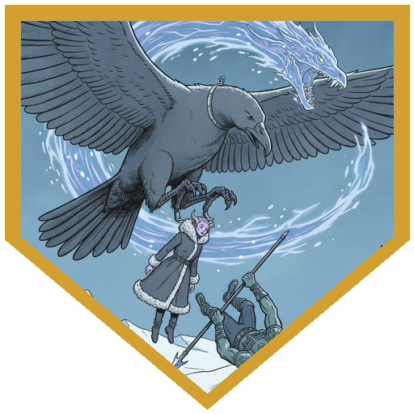

Henry was back, so the night opened where the last one had: the three in the cave, and Father Joseph at the fire. The Elk had laid out [Eyvend](../npcs/eyvend)'s body. [Ragnhild](../npcs/ragnhild) nodded to him. He had told stories all night already, and some of them had been sales pitches, but this time he was being asked to tell a man's life. "The Thread Giver speaks." Eyvend had told him that morning about the wife and daughter this land had taken, and how hard it had been to keep getting out of bed after that. Joseph stood. "I did not get to know Eyvend very well, but he told me of his life. So now I'm telling you, he was a good man. He cared deeply for his family, and cruel as this land may be, it took away his family from him, but nonetheless, he chose his greater family of this tribe to keep going, and he saved many lives by doing a brave thing, getting out and doing his duty. And for that, we honor him." Persuasion: a natural 20. As the telling ended, the other three walked in out of the dark from the waterfall, and Ragnhild spoke. The Thread Giver had started the weaving of threads. This band was not quite the Elk anymore. They would be the **Tribe of the Weaver**, telling the stories of others until all the threads were woven together, and as the party took them to Coldpeak they would find how they wove into its story. Joseph's Arcana came up 22, and he went cold. Eyvend had talked about webs and threads and weaving. Joseph had joked before about making worshippers for [Arveth](../npcs/arveth), and everything the Elk were saying now sounded like worship of her. For a moment he *saw* her: a spider and a mountain at once, an unthinkable combination that wouldn't hold still in his head, the two images laid over each other and fading whenever he looked straight at them. "You may have just created a cult."

Later, the four of them were finally alone, and River told Joseph everything. "Everything you tell him," Alina offered, "I'm just gonna say you've been hallucinating." They'd been together a month, and Joseph had never left anyone behind. Both times he had worked with Arveth to rewind (Durok and Brekk, then Eyvend), a new River had split off with a different past. [Atezca](../npcs/atezca), Still Waters, was one. The other, one day old, finally got a name: **[Achicahua](../npcs/achicahua)**, strong water. Atezca is the still water that stays where it was left. Achicahua is the current that cuts new channels, and he is the one who draws the maps between pools. Atezca had said he doesn't think Arveth is their ally, and that the rewinding has had casualties, people who were here and are no longer. "If they don't exist in our timeline, do they really matter?" Joseph reached for Arveth and found her not listening. A whole tribe's worth of stories had just landed in her lap.

In the morning the Tribe of the Weaver broke camp. The band had lost many members and was heading to a place where it would rely on the Coldpeaks, so the party helped sort what to carry and what to leave behind. The group Survival check passed on a 20 and a 19. Joseph called up the earth elemental from the Stone of Controlling Earth Elementals to help, and it took the request as an insult. It was a being of the deep earth that had moved mountains, and they wanted a wall for sixty people? Told to look at that mountain over there, it set off toward it. By the end of the first day that mountain was in sight, on a trip that had taken them three days the other way, and they made the whole journey in a day and a half. Weather might explain a day. It didn't explain this, and Joseph had his own theory about the elemental. Nobody in the column noticed anything wrong. To them it had always been a one-day walk, which is why they sent runners. That first night, Alina crept up on a dirty 20 to a figure packing at the back of the column. It was [Grath](../npcs/grath). [Tarn](../npcs/tarn) was waiting for someone to come back for him, and Grath wasn't going to face that and say they hadn't even looked. Alina let him go. Berg saw him too and went over. Grath wasn't planning to fight the beast, only to find out whether Tarn was alive. If he was dead, at least nobody else would be lost looking. Berg gave him his copy of the Potion of Heroism. Grath shook his hand. "He was right about you." He didn't say who, and he went.

At dawn a voice spoke in Alina's head: *"Thessaly Vorn. Need help urgently. Can't explain in 20 words. Coming north, will you shelter? Please answer."* She had 25 words to answer with and used fewer than ten: *"Yes, we will shelter. Hurry. On our way to Coldpeak."* That night, crossing the open stretch everyone had dreaded, a shadow passed over the column and the Weavers froze. What came down was smaller than the [Rime Talon](../npcs/rime-talon) they'd seen, with nothing wintry about it, just a big bird. "Much smaller?" "Yes, it's still big as hell." It came for the people around them, and Berg made himself the target: 25 damage, cut to 14 with a parry, and a talon closed on him. Joseph's attack of opportunity was an unarmed strike at −1 Strength, "it slapped it," and the bird's other talon took Alina. Thirty feet up and climbing, Joseph gave his sermon for 12 temporary hit points, summoned [Gunther](../npcs/gunter) as a flying aberration that hit for 24 psychic, and followed with Eldritch Blast for 21. Restrained in a talon, Alina summoned a dragon, which bit twice and breathed. River's blade cut for 25. Berg used his pike as a lever, took the inspiration you'd just given the whole table, and turned the Athletics check into a 19 with Tactical Mind. He pried himself loose and fell 30 feet into the snow. The bird's next attack on Alina was a crit, and she took it and stayed conscious. Then it let her go. The 30-foot fall finished what the crit started and knocked her out, and the bird flew off. On a second look, Alina and Berg saw it wore a delicate silver collar with a small charm, too far away to make out the symbol. Coldpeak was a short walk ahead, and they'd make it there next session.

## Player Highlights

<strong><a href="../characters/dr-medicine">Father Joseph</a></strong> (Henry) — Back at the fire with a eulogy for Eyvend and a natural 20 on Persuasion. Arcana 22 made it clear what the Tribe of the Weaver's new name might mean, and showed him Arveth as a spider and a mountain at once. Asked the earth elemental about that mountain over there, and by nightfall it was a lot closer. Gave his usual sermon for 12 temporary hit points, then summoned Gunther as a flying aberration and hit the bird with Eldritch Blast. On the people the rewinds have erased: "If they don't exist in our timeline, do they really matter?"

<strong><a href="../characters/river">Roaring River</a></strong> (Eric) — Told Joseph everything about the other Rivers and kept nothing back. Gave the one-day-old River a name: <a href="../npcs/achicahua">Achicahua</a>, strong water. Cut the bird for 25 while two of his friends hung from its talons.

<strong><a href="../characters/alina">Alina Shandorath</a></strong> (Dominic) — Crept up on Grath on a dirty 20 and let him go. Answered Thessaly's Sending in under ten words: "Yes, we will shelter. Hurry." Grabbed and restrained thirty feet up, she summoned a dragon. "The small, tiny girl just summons a dragon." Then she took a critical hit from the bird and stayed conscious. It took a 30-foot fall to put her down.

<strong><a href="../characters/berg">Berg Wurdnowwah</a></strong> (Josh) — Went to see Grath before he left, gave him his Potion of Heroism, and got a handshake. Made himself the bird's target so it wouldn't take one of the Weavers, and parried 25 damage down to 14. Levered himself free of the talon with his pike: inspiration, Tactical Mind, Athletics 19, and a 30-foot drop into the snow.

## Achievements

<strong>He Was a Good Man</strong> — Joseph barely knew Eyvend, but Eyvend had told him his life, so Joseph told it to the tribe: "He chose his greater family of this tribe to keep going, and he saved many lives." Natural 20.

<strong>You May Have Just Created a Cult</strong> — The Thread Giver started the weaving, Ragnhild said, so they would be the Tribe of the Weaver. Joseph's Arcana 22 brought a chill: everything they were saying sounded like worship of Arveth.

<strong>The Mountain Over There</strong> — The earth elemental was insulted to be asked to shelter sixty people. By the end of the first day the mountain was in sight, a three-day trip done in a day and a half, and everyone in the column says it has always been a one-day walk.

<strong>Yes, We Will Shelter</strong> — A voice at dawn: "Thessaly Vorn. Need help urgently. Can't explain in 20 words. Coming north, will you shelter?" Alina had 25 words and didn't need them. "Yes, we will shelter. Hurry."

<strong>Still Big as Hell</strong> — Smaller than Rime Talon, "still big as hell," and wearing a silver collar. It grabbed Berg and Alina. Berg levered himself free with his pike and fell 30 feet, Alina summoned a dragon from inside a talon and took a crit without going down, and the bird dropped her and flew off.

## Rewards

- **Inspiration** — everyone, for the run of good sessions
- **Long rest** before the road — spell slots and hit points back, and River sheds one more level of exhaustion
- **Potion of Heroism** (Berg's copy) — given to Grath when he left
- **Advancement** — milestone, and the table decides when; the party stayed at 9th level this session
- **Bastion** — pick two facilities each before next week; the shared camp at Coldpeak and Durok's oasis takes shape on arrival
