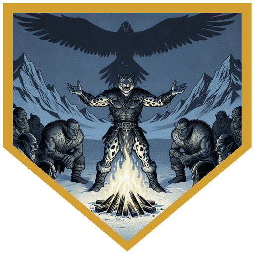
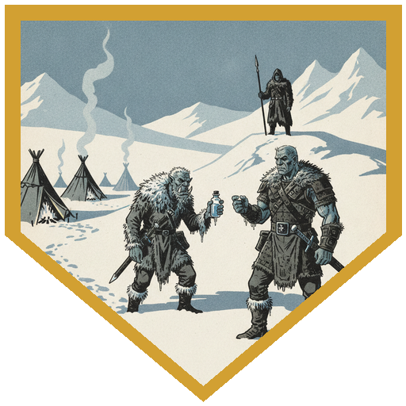
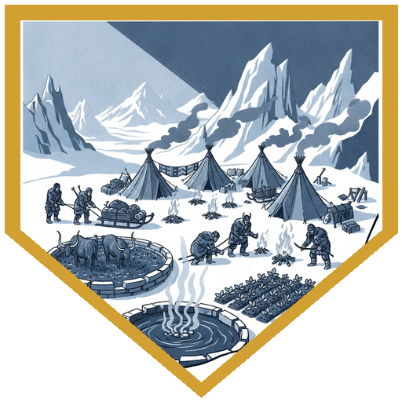
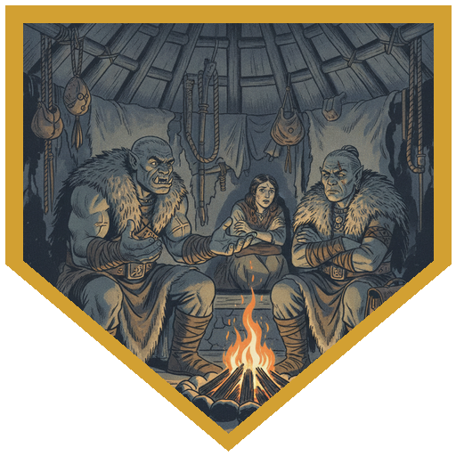
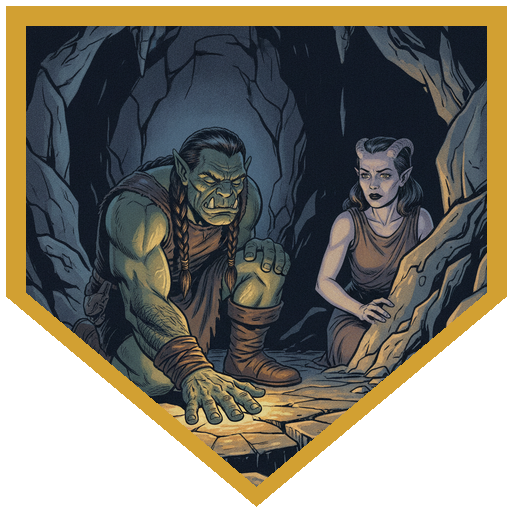

The column reached Coldpeak with Alina limping in on broken bones and Father Joseph's Weavers around him. The first thing anyone noticed was the smoke from the lava tubes at [Durok's Spring](../locations/duroks-spring), which had always been some distance off and was now in sight. [Broken Tusk](../npcs/broken-tusk) and [Ragnhild](../npcs/ragnhild) clasped hands as two chiefs, then embraced as two aunts of the same nephew. Broken Tusk heard the name *Tribe of the Weaver* with a stone face. Then she turned to Berg. The empty seat at the elders' fire was the hunters' seat, earned and never taken, and the one it belonged to had decided Berg would speak best for their interests. Berg took it. River's Perception came up 29, and across the camp he watched [Tarsk](../npcs/tarsk) tell a young orc woman something that broke her. It was Veska, and the something was [Tarn](../npcs/tarn). [Grath](../npcs/grath) wasn't there to tell it himself.

At the first meal the Coldpeak fed the Weavers, and then a Coldpeak hunter stood up and told the day: while the party was gone, hunters had seen a great bird in the distance, turned for home, and been run down by a Remorhaz on the way, and his brother had pulled him clear. The Weavers wanted lives, not days, and the two tribes didn't quite meet. The odd part was that the Coldpeak had a telling tradition at all. They never used to. [Durok](../npcs/durok) came in from the oasis, offered healing, and said quietly, "They say they've always done this. I don't remember this." River's Insight 18 read a man worried in the same way he had been about the Coldpeak changing his tribe, with more to say and no wish to say it here. Then [Dak](../npcs/dak) wanted the bird story. River told it straight (Performance 18): it could have carried off a mammoth, and he wasn't exaggerating. Berg and Alina joined in on a 21 and a 20, and they had the wounds to prove it. The party had been building a reputation with the Coldpeak for months. That night it turned into legend.

As the meal ended a sentry called out, and Grath walked in alone. Tarn and the others weren't in the nest, but the silvery powder they'd found before was. He handed Berg back the Potion of Heroism: "I didn't end up needing it." And when the party goes looking for Tarn, he's coming. Before the elders, Berg asked him the questions the council needed. The nest is on the cliff above the [standing stones](../locations/standing-stones) east of Durok's Spring, the dark rock flecked with silver metal that radiates cold, the ones the party once stood beneath. The Coldpeak have avoided those ruins since a hunter came back from them speaking a different language. Now a human settlement sits there, mostly tents but some large huts, and the Coldpeak say it's been there for months. The party had been there weeks ago. There was no settlement. They kept the Brotherhood out of it until they could talk to Thessaly. Then Ragnhild made her case: sixty Weavers had made it, and they wanted to join their fates to Coldpeak's, not be cared for. "One fabric is stronger than an individual thread." Durok has finally got crops growing outside his oasis and needs hands, though the Coldpeak are still working out whether hunting for vegetables counts as hunting. Berg spoke for the hunters, which meant food: livestock, crops, and protection. The bird, the weather and the strangers at the stones were problems to solve, but the new combined tribe's long-term survival came first. Alina added that more members meant more hunters and more defenders. His Persuasion came up 21. Midway through, a voice spoke in Alina's head: *arriving sooner than expected, attacked, a circling bird, is your camp walled?* Her answer was very short: there's a cave.

In the morning [Thessaly Vorn](../npcs/thessaly) and [Aldric](../npcs/aldric) reached the gate, her exhausted, him limping and freshly clawed by "aggressive animals." The journey had been shorter than Aldric would swear it was, which the party had noticed too. Thessaly has taken leave. She's been reading her own journal and doesn't remember what's in it: a hunting lodge belonging to a Netherese mage who hid his wizardry, one of the dedicants who was meant to give up his hand and refused. Aldric told her she'd been possessed, and the party confirmed it, along with the part where they knocked her out. She doesn't want [Sarevyn](../npcs/sarevyn-cole) to have her research, and he's taken a strong interest in Aldric that she doesn't trust. Berg took her case to Broken Tusk, who knew the outfit. Was this the Brotherhood she'd heard of? "There's the corporate ones and then there's the franchise ones." Three 19s later, she welcomed the help. Durok had a harder message. The mountain hasn't only moved: the people are hearing the words he heard and refused, and their traditions keep turning out to have always been true when they weren't. He feels it strongest in the Great Hall, deep in the earth, which is roughly where Father Joseph dropped [the mountain's pebble](../sessions/2026-08-21). "Arveth's reproducing." Alina proposed using Durok as an Arveth detector: hotter, colder. Aldric, asked about his scars, told of a drunk youth, a camp of Auril worshippers who kept the drink coming, and waking in a gutter with the deepest scar across his hand, where Thessaly found him. The Religion check came up 22: Auril is the goddess of winter, and Rime Talon and the elementals have all worn winter. The nest and the stones are in the same place, and that might be where the Brotherhood gets its chardalyn. Next stop: the nest.

## Player Highlights

<strong><a href="../characters/river">Roaring River</a></strong> (Eric) — Perception 29 caught Tarsk breaking the news to Veska, and River went over to her when Grath couldn't. Read Durok on an 18 Insight: worried, holding something back, not willing to say it at the fire. Told the bird story with no embellishment needed (Performance 18): "It could have picked up a mammoth." Requested that sculptors catch his good side for the monument.

<strong><a href="../characters/alina">Alina Shandorath</a></strong> (Dominic) — Came in on broken bones and still took a 20 on the bird story. Showed Thessaly to the cave, then put together where the strangeness in the Great Hall was coming from: wherever Joseph dropped that pebble. "We might have to use Durok as a little Arveth detector." Pressed Aldric about his scars, and remembered Sarevyn's face faltering when he first saw them.

<strong><a href="../characters/berg">Berg Wurdnowwah</a></strong> (Josh) — Was handed the hunters' empty seat at the elders' fire, and took it. Asked Grath the questions in front of the council that put the nest above the standing stones. Spoke for the hunters on food and the combined tribe's long-term survival, and carried the room on a 21. Then explained the Arcane Brotherhood to Broken Tusk as corporate and franchise locations, on 19, 19 and 19, and got Thessaly welcomed.

## Achievements

<strong>It Could Have Picked Up a Mammoth</strong> — Dak wanted the bird story, and the party didn't need to exaggerate. Performance 18, 21 and 20, with the talon wounds on display. The Coldpeak stopped seeing valuable fighters and started seeing legends.

<strong>I Didn't End Up Needing It</strong> — Grath walked back in alone. No Tarn in the nest, just the silver powder. He gave Berg back the Potion of Heroism unopened, and when they go after Tarn, he's going with them.

<strong>One Fabric</strong> — Sixty Weavers asked to stay, not to be carried: "One fabric is stronger than an individual thread." In his first council, Berg spoke for the hunters, and a Persuasion of 21 put the newcomers to work on food, livestock and defense, including Durok's crops, which may or may not count as hunting.

<strong>Corporate and Franchise</strong> — Broken Tusk knew Thessaly's outfit. Was this the Brotherhood? "There's the corporate ones and then there's the franchise ones." Three 19s, and she welcomed the help.

<strong>Hotter, Colder</strong> — Durok feels the mountain calling from deep under the Great Hall, near where Joseph dropped a small, indistinguishable pebble. "Arveth's reproducing." Alina's plan: walk Durok around and ask if it's getting warmer.

## Rewards

- **Long rest** at Coldpeak; River sheds another level of exhaustion
- **Potion of Heroism** — returned to Berg by Grath, unopened
- **Sixty Weavers** — joining Coldpeak, working off their 48 hours of hospitality on food, livestock and defense; the Bastion's first hands
- **Advancement** — milestone; the party stayed at 9th level this session
