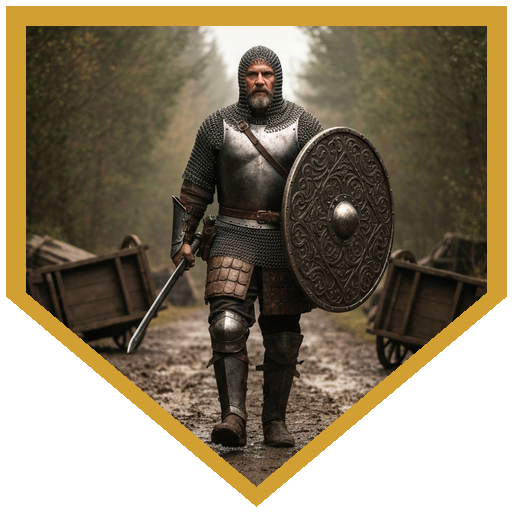
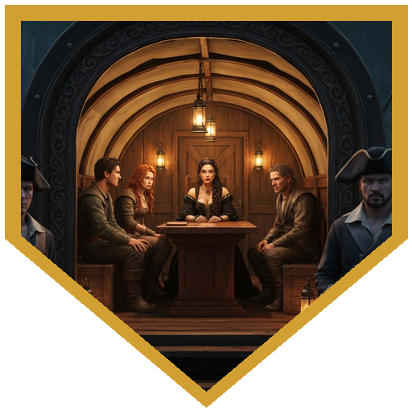
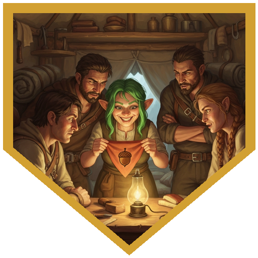
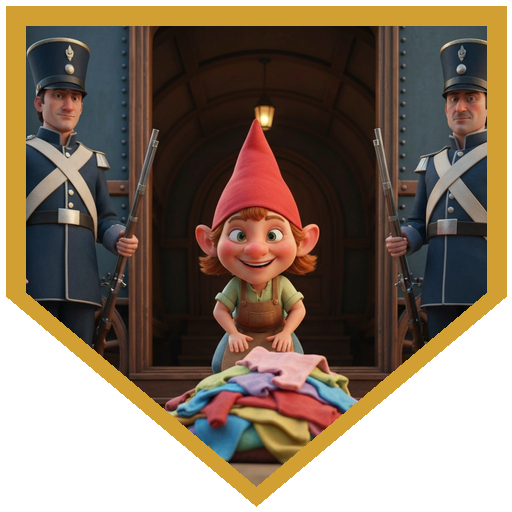
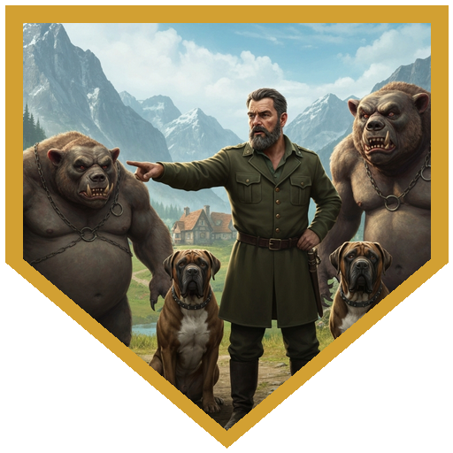
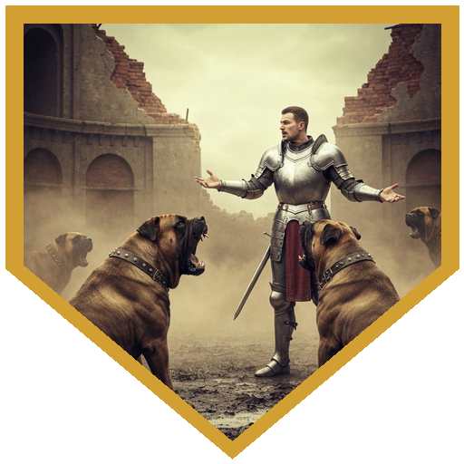
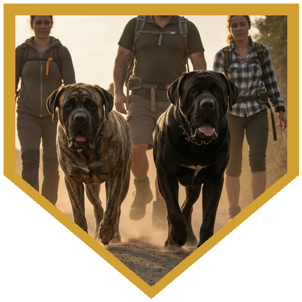
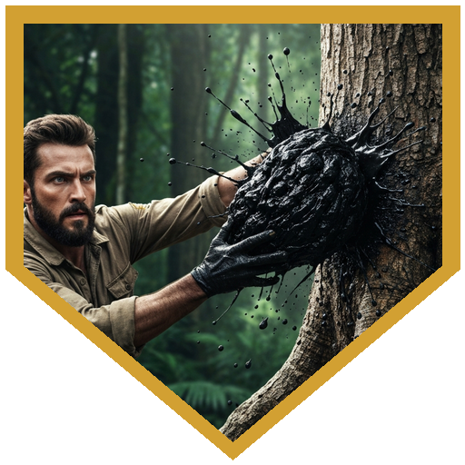

They came in as hired hands with a simple job: find a gnome named Resilin, a spy who had gone dark a week ago in the river town of Nolb. Their token of introduction — an acorn-symbol bandana — rode around Araken's neck. They had horses and a cover story.

The road offered the first test before they even reached town.

## Road Ambush

Overturned carts. Wounded "survivors" calling for help. Oskar rolled a natural 20 on Perception and read the whole scene in a glance — a setup, obvious once you knew to look. Cinder quoted Admiral Akbar. Oskar cast Shillelagh, walked forward, and sprung the trap on his own terms.

Cinder's Bless landed on Oskar, Araken, and himself in the opening seconds and held through every blow that followed. Araken marked the bandit captain with Hunter's Mark and sent two daggers his way; both missed. The captain gave them a sporting offer: just hand over everything you have. Oskar introduced himself as a follower of St. Cuthbert, a man who practices what he called "concussive charisma," and introduced his weapon to the captain's ribs for 8 damage. The captain swung back — 17 to hit against AC 19. Miss.

Oskar burned Action Surge: 22 to hit, 10 force damage, then a bonus-action smite for 12 more — 22 total in a single turn. The captain found himself at 1 hit point. Araken finished him. A commoner managed a crit on Oskar and dealt all of 2 bludgeoning. The remaining scout surrendered.

The scout had useful information: Nolb runs under the Pirate Queen's law — strict peace, no violence, no uncontrolled magic, pay the fees. The river route is called Himrid's Run. These bandits were new. This robbery was literally their first attempt. It had not ended the way they'd planned.

## Nolb

They arrived acting like people who had nothing to prove. Two bugbears named Blag and Gleb had mastiffs, goblins, and a toll to collect. The party paid one silver coin. A dwarf bystander quietly suggested keeping weapons holstered and spells unspoken while they were in town.

## Petita

The acorn bandana found its audience. A gnome named Petita recognized it and pulled the party into her seamstress tent. She was a courier in Resilin's intelligence network, and she had bad news.

Resilin had embedded herself with a pirate band called the Reve Rats. Two days ago, Resilin and two of the Pirate Queen's personal guards were summoned to meet the Queen directly. They departed south along the high road. None of them came back. Petita had overheard the Queen telling a lieutenant afterward that a "problem needed to be handled discreetly."

## The Pirate Queen

Petita walked them past the guards on a cover story involving important laundry and an implausibly high Persuasion roll. The Pirate Queen received them in her large covered wagon.

She had a trade in mind: deal with the bugbears operating outside town — outside her jurisdiction, technically someone else's problem — and she would tell them what she knew about Resilin.

What she knew: Resilin was a spy. She had known for some time. She had dispatched her own guards to eliminate Resilin under the pretense of investigating strange magical effects on the south road — trees and marshland iced over in temperate weather, the kind of thing that warranted a look. Her guards had not returned. She gave the party a map marked with where they had been sent. Her terms: complete the job, send a message when done, and never come back to Nolb.

## Bugbear Camp

The goblins scattered as soon as the party appeared. Two bugbears held the ditch road outside town. Araken opened with Hunter's Mark and informed them that the Pirate Queen had let them go. Cinder cast Divine Favor, then addressed the mastiffs in Goblin: "Sit." Animal handling. The dogs sat.

One bugbear grabbed Cinder and threw him into the ten-foot ditch — 5 bludgeoning. Another tried the same with Araken and failed. Oskar missed on the first swing, then Action Surged: 22 to hit, Warhammer's Push activating automatically and shoving the second bugbear in after Cinder. The first bugbear went down to a ranged shot at 1 HP. Araken climbed into the ditch — exactly enough on the athletics check — and finished the prone one with 12 damage. Both bugbears down.

The mastiffs accepted rations and stayed. The party recovered the one silver coin. They walked back to the Pirate Queen's wagon with two dogs at heel.

The Queen was delighted. "Oh, they're lovely!" Food was served. The intelligence was delivered. The party had earned their information and their exit from Nolb. They refused to sleep in town and camped outside instead. Short rest: Oskar drew on Second Wind; Action Surges recharged.

## The Tattooed Dwarf

Tracks south from the high road. A bloodied, torn-up ambush site — no bodies anywhere. A dwarf bound to a tree, mouth sealed by a dark tarry substance connected to moving tattoos on his face, the designs shifting and alive under the skin. Arcana checks returned nothing useful (7 and 9). Cinder cut the bonds, then grabbed the device — CON save, 14, passed — and ripped it free. He threw it against the tree. It destroyed itself in an organic splatter that answered most of the questions nobody wanted answered about what it was made of.

The dwarf was one of the Pirate Queen's guards. They had been sent to kill Resilin. Ambushed by "creatures of mud and water, spellcasters, pale green robes." He woke up bound. Survivors had gone southeast. As payment for cutting him loose, he pulled a short sword from the ground and handed it to Araken — a family heirloom, +1, offered without ceremony. He was sent back to Nolb to deliver his report as promised.

## The Cave

The trail ended at a partially collapsed underground stronghold. The party looked in.

Hooded cultists chanting in steady rhythm. Ten captives in manacles, forced labor, rebuilding the stone walls under sickle-wielding guards. Two hooded figures sorting through supplies near the entrance. Bridge guards over an underground stream, shallow but wide. The loudest chanting came from somewhere beyond the bridge, still unseen.

Among the captives: a gnome. White hair. Green streak.

Resilin.

The party rolled initiative.

*Session ended here.*

---

## Player Highlights

<strong>Oskar</strong> — Oskar clocked the ambush before anyone else moved, and instead of calling a retreat, walked into it — deliberately, eyes open, on his own initiative. He spent the rest of the fight explaining his theology through Action Surge and Weapon Mastery, and left the bandit captain at 1 HP for Araken to finish like punctuation on a sentence Oskar had written.

<strong>Cinder</strong> — Bless went up in the first round of combat and stayed up through every hit Cinder took, including going into the ditch. He spoke Goblin at the mastiffs and they sat. He grabbed a shifting, clearly-wrong-to-touch tarry device off a dwarf's face and threw it against a tree. Cinder's session was a series of things most people would stop to reconsider, done without hesitation.

<strong>Araken</strong> — Hunter's Mark and the promise of a clean finish — Araken kept his accounting tight both combats. He informed the bugbears of their employment status, climbed into a ditch to execute a prone target, and came out of the session with a +1 short sword the grateful dwarf had been carrying for his family. The sword replaced a broken one. Things evened out.

<strong>Citl-Itzam</strong> — When the bandits clustered, Citl-Itzam put Thunderwave through both of them at once and ended that part of the fight cleanly. The same read — don't play for the individual when you can hit the group — showed up in the information gathering, where listening first gave the rest of the table what they needed to make the right calls at the Pirate Queen's wagon.

---

## Achievements

<strong>Admiral Akbar Would Be Proud</strong> — Oskar rolled a natural 20 on Perception, identified an obvious ambush as an obvious ambush, and walked into it deliberately. Knowing it's a trap is only half the move.

<strong>Concussive Charisma</strong> — Asked who he was and why the Pirate Queen's bandits should take him seriously, Oskar explained that he follows St. Cuthbert and communicates his faith through impact. The bandit captain absorbed the lesson at 22 damage and lived only because Araken needed something to do.

<strong>One Silver Coin</strong> — Two bugbears, four mastiffs, a squad of goblins, and a toll demand. The party paid one silver coin. The dwarf bystander's advice about not starting anything in Nolb was apparently well-timed.

<strong>Important Laundry</strong> — Petita talked past armed guards at the Pirate Queen's entrance on a cover story about laundry. She rolled high. They believed her. The party got their audience.

<strong>Pirate Queen Says You're Fired</strong> — Araken delivered the bugbears' termination notice before the first attack landed. They did not take it well. The outcome was the same regardless.

<strong>Sit</strong> — The bugbears had two trained mastiffs. Cinder addressed them in Goblin with a single word. The dogs sat for the rest of the fight.

<strong>The Dogs Stay</strong> — The mastiffs accepted rations and decided the party was their people now. They walked back to the Pirate Queen's wagon at heel, which is how the party returned two dogs they had no business adopting and still came out ahead.

<strong>Organic Splatter</strong> — The tarry device on the dwarf's face was alive and visibly wrong and nobody could identify what it was. Cinder grabbed it anyway, made his save, and threw it at a tree. Whatever it was, it destroyed itself thoroughly enough that nobody needed to ask follow-up questions.

---

## Rewards

**Favor of the Pirate-Queen** — For helping root out the problem in the forest along the High Road, you have earned the favor of the Pirate-Queen of Nulb. Future adventures set in this area may allow you to call upon her favor.

- **[Moon-Touched Rapier]** *(uncommon)* — Cinder; 63 gp
- **[Cloak of Billowing]** *(common)* — Oskar; 63 gp
- **[+1 Short Sword]** *(uncommon)* — Araken; a family heirloom offered by the grateful tattooed dwarf
- 125 gp — Citl-Itzam

[+1 Short Sword]: https://www.dndbeyond.com/magic-items/5389-sword-1
[Cloak of Billowing]: https://www.dndbeyond.com/magic-items/27040-cloak-of-billowing
[Moon-Touched Rapier]: https://www.dndbeyond.com/magic-items/36822-moon-touched-sword
