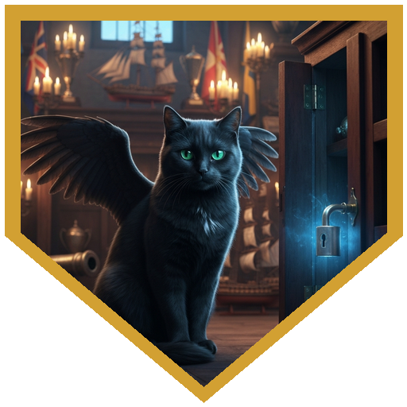
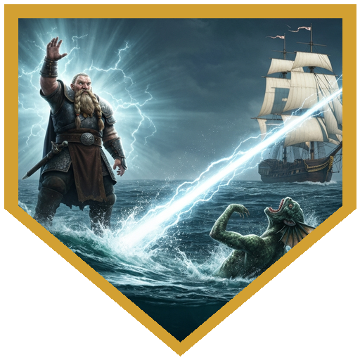
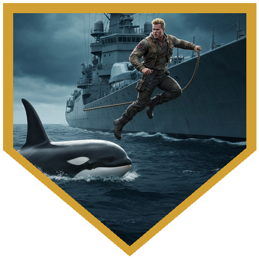
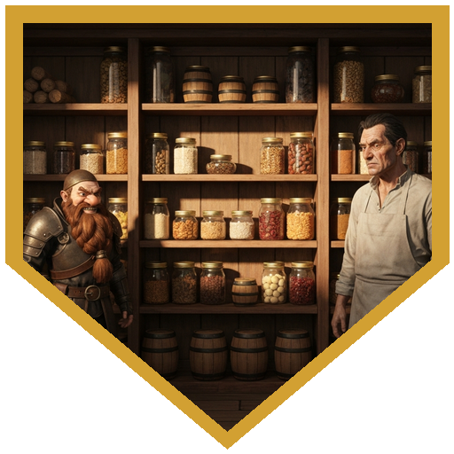
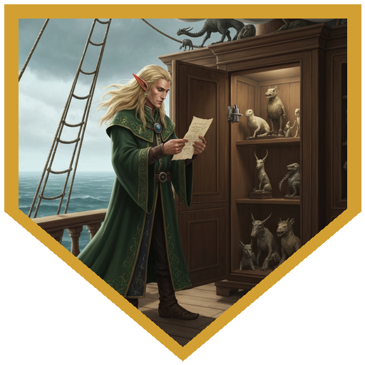

## Aboard the Tallyho

Commodore Bellamy Von Thresher needed crew. His previous hires — a pack of brigands from the Brinejacks — had revealed their true colors and been discharged rather forcibly. The Tallyho was undermanned, a treasure at Fort Delagos waited, and the Corsair was already on the move. The party came aboard at Turtleback Cove and took their posts: Lara to assist navigator Reckless Ren, Rokrun to medicine under Salty Sue, Timavi to the sails, Roric to bosun Monty, and Logos to serve as first mate — a role that had recently opened up for obvious reasons. Before the harbor faded behind them, Logos spotted something in the hold: a teleportation circle, old and worn but still functional. Von Thresher shrugged and said he hoped never to need it. Smoke Powder the winged cat — who had the run of the ship and a velvet-covered barrel for a bed — filed nothing away and went back to sleep.

## Orca in the Breeding Ground

Reckless Ren had charted a shortcut through an orca breeding ground. The ship shuddered when the first hit landed. Four ropes trailed off the stern, each weighted with rotting bags of chum. Roric spotted them and dove overboard; Lara critted through two ropes in a single turn with short sword and scimitar; the orca, finding the freed chum more appealing than the hull, broke off. At the same moment — while everyone was on deck watching the whale — someone had been below. When Von Thresher checked his trophy room, the pseudodragon stinger from his locked display cabinet was gone. The cabinet showed no sign of forced entry.

## The Trophy Room

Lara and Timavi swept the ship first and found nothing. The trophy room investigation started with three taxidermied animals — an owlbear on its hind legs, a juvenile roc hanging from the ceiling, and an eel posed to strike — and a note that Logos retrieved from under the display cabinet using Mage Hand. The note was a private reminder in Von Thresher's own handwriting: clues to a combination he'd apparently worried he might forget. Logos also identified the mind flayer tadpole in one of the specimen jars with a 19 Arcana check, which made the room go quiet for a moment.

Rokrun worked the combination. Touch the beast of eye and claw — the owlbear. Touch the catch stuffed with straw — investigation confirmed the roc was straw, the owlbear and eel fabric. Spin three circles counterclockwise. Embrace the man to whom you owe it all — the portrait of Von Thresher himself. Then: reach out and touch what you hold most dear. Rokrun touched the pearl in another portrait. Three cutlasses launched off the weapons rack and needed to be fought. Lara destroyed the first, Timavi damaged the second, Logos dropped the third with Toll the Dead, Rokrun burned one with Sacred Flame. When the swords were on the floor in pieces, Logos reasoned through the final step: a man who announces at every opportunity that taverns sing songs about him, and who keeps his winged cat on a velvet pillow in his own quarters, holds Smoke Powder above all else. Rokrun touched the portrait of the cat. The cabinet clicked open. Inside: a shattered jar, and the stinger.

## Evening on the Water

Two problems surfaced that evening. Ren and Monty had been arguing about shelf space and lantern hours; Salty Sue's kitchen pantry had been thrown into chaos by a concealed door flying open, scattering her carefully organized ingredients across the floor. She was paralyzed — everything had been muscle memory, and now she couldn't remember where anything went. The party chose Sue's problem. Roric and Rokrun worked through her clues and arranged the grid: ale in the corner, oranges and beans in sequence, spices under the ale, cat food under the fish, pork as far from the cat food as a 3x3 grid permitted. Sue said it seemed off. Roric argued that in a 3x3 grid nothing can actually be more than one slot away from anything else — the geometry doesn't support "more off" — rolled an 18 on the DC 12 persuasion check, and suggested she think of it as Marie Kondo-ing the pantry. She grumbled. She accepted it.

## Day Two: Merrows at the Atoll

Reckless Ren was found unresponsive in her quarters the next morning, Smoke Powder sitting on her chest meowing. Logos spotted a minuscule triangular puncture wound on her shoulder — consistent with a tiny rapier — and dark staining that Von Thresher confirmed matched the stolen stinger's venom. The pieces assembled: Sea Lice, the Corsair's imp familiar, had lost its own stinger and needed a replacement. It had poisoned Ren to leave the Tallyho without a navigator at the worst possible moment.

Merrows hit from both sides of the ship as they reached the Laughing Skull Atoll. Timavi hexed one and Eldritch Blasted from the rail. Lara critted with Starry Wisp and left the first merrow bloodied. Roric jumped in the water again, and when the merrow missed him and triggered his Riposte reaction, put 21 to hit and 14 damage into it and dropped it. Logos fired Magic Missiles into the second. Rokrun's Guiding Bolt landed on a natural 20. The last merrow did not survive it.

Von Thresher still needed someone to navigate the atoll with Ren down. Lara took the survival check and held the course. Logos ran forward as lookout and missed a derelict wreck in the ship's path; Roric grabbed the ballista, rolled a 20 to hit, and destroyed it before impact. Smoke Powder dropped a leather sack at the party's feet afterward: inside, a note in childlike handwriting from Sea Lice, promising that the Corsair would reach the pearl first. The Tallyho was through the atoll. The adventure was over. The message, everyone agreed, was a bit late.

---

## Player Highlights

<strong>Logos</strong> (Dan) — Retrieved the combination note from under the display cabinet with Mage Hand, identified the mind flayer tadpole with a 19 Arcana check, and — after the cutlass fight was over and the final step of the combination still remained — argued the case: the man who makes taverns sing songs about him, and keeps his cat on a velvet-covered barrel-bed, holds Smoke Powder most dear. He touched the portrait. The cabinet opened.

<strong>Rokrun</strong> (Bryan) — Medicine checks stabilized Ren and confirmed she would survive the poison. Sacred Flame and Spiritual Weapon in the orca fight; Sacred Flame again on the animated swords; Guiding Bolt on a natural 20 in the merrow fight, which ended the second combat decisively. Rokrun also executed the trophy room combination sequence step by step — owlbear, roc, three counterclockwise circles, portrait — and was the one whose hands were on the cabinet when it finally opened.

<strong>Roric</strong> (Trey) — Dove into orca-infested water on instinct, climbed back out, did it again the next day when a merrow was in the water. When the merrow missed him and triggered Riposte, he hit for 21 and dropped it. He also talked Salty Sue out of her spiral over the pantry: argued the geometry of a 3x3 grid, rolled an 18 on the DC 12 persuasion check, and suggested she Marie Kondo the shelves. Dinner was only slightly late.

<strong>Lara</strong> (Megan) — Assigned to navigation alongside Reckless Ren, and served as de facto navigator when Ren was found poisoned. Critted through two chum ropes in the orca fight. When the atoll needed someone at the helm, Lara made the survival check and kept the Tallyho on course through the coral spires of the Laughing Skull Atoll.

<strong>Timavi</strong> (Bonnie) — Started the session unable to be heard by the DM, who had accidentally muted her — a small metaphor for a dhampir who slides under notice. Hexed the orca, hexed a merrow, Eldritch Blasted from range at both. Managed the sails. Sliced through the second animated cutlass in the trophy room. When the pantry resolved itself without her, Timavi muttered something about cause and effect, went to bed, and was correct that the imp had been behind everything.

---

## Achievements

<strong>What He Holds Most Dear</strong> — After the pearl triggered three animated swords and the fight was finished, Logos reasoned through the last combination step: the man who has songs sung about him at every tavern keeps his winged cat on a velvet pillow in his own quarters. Smoke Powder. He touched the portrait. The cabinet clicked open.

<strong>Light of Pelor, Natural Twenty</strong> — Merrows on both sides of the ship, the navigator poisoned and unresponsive, the Laughing Skull Atoll dead ahead. Rokrun called down Guiding Bolt and rolled a natural 20. The merrow it struck did not survive. Combat resolved; the ship still had enough crew to navigate.

<strong>Overboard by Choice</strong> — Roric dove into orca-infested water voluntarily, pulled a chum rope back up from the sea, and climbed back out. He did it again the next day when a merrow ended up in the water. The Tallyho's crew noted that the new bosun's assistant had unusual ideas about deck safety.

<strong>Marie Kondo the Pantry</strong> — Salty Sue's ingredients were on the floor and she couldn't remember where anything went. Roric argued that in a 3x3 grid, nothing can be "further" from anything else than one slot — the geometry doesn't support it. DC 12 persuasion, rolled 18. "If it doesn't spark joy, call me back."

<strong>The Roc Is Stuffed with Straw</strong> — Three taxidermied animals, one combination clue: beast of eye and claw, catch stuffed with straw. Investigation confirmed the roc was straw, the owlbear and eel fabric. The puzzle came apart once the animals were sorted. Logos read the note; Rokrun executed the sequence.

---

## Rewards

- **Gold**: 125 gp (Option 2 — Coin from the Coffers, Delagos's vault) — Logos, Rokrun, Lara, Timavi
- **[Moon-Touched Rapier]** *(uncommon)* — Roric; in darkness, the unsheathed blade sheds moonlight, bright light 15 ft, dim light an additional 15 ft. "It's the light of Pelor."
- **Level advancement**: One step closer to next level for all characters
- **Mark of Prestige — Friend to the Tallyho** (all): "Whether you boarded the Tallyho as a seaworthy sailor in your own right or you were just finding your sea legs, your bravery, wit, patience, and determination have earned the respect of its seasoned crew. Commodore Bellamy Von Thresher remembers his friends and will happily provide assistance to you in the future."

[Moon-Touched Rapier]: https://www.dndbeyond.com/magic-items/36822-moon-touched-sword
