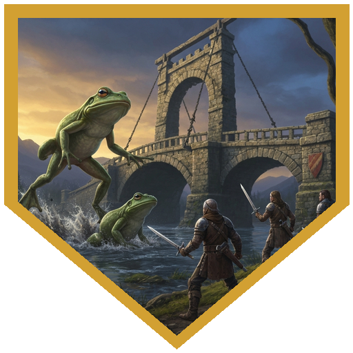
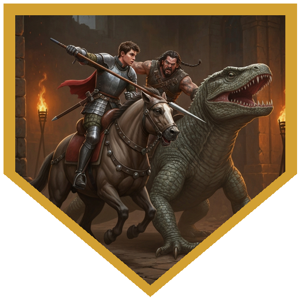
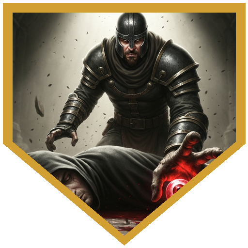
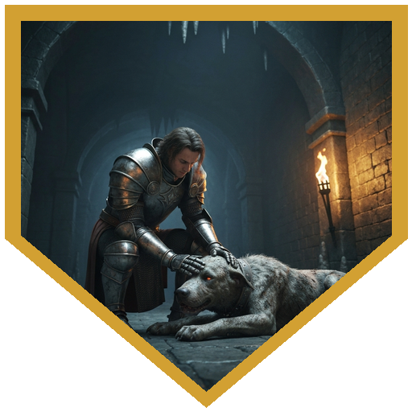
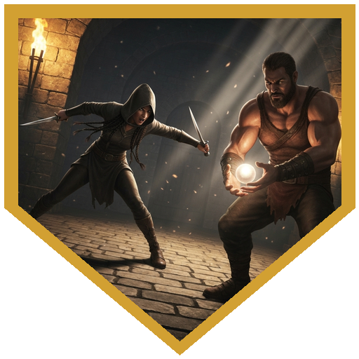

## The Moat House

The Guardians of Hommlet had heard the whispers: something was stirring in the ruins of the moat house. The party went to clear it. At the crumbling drawbridge, a mud-covered elven woman rose from the bog with an arrow drawn — she had been watching the site for two days on behalf of the Viscountess of Verbebank. Her intelligence: half a dozen rough types inside, one who looked like a priest, a vaporous creature she couldn't identify, and two giant frogs that had kept her from getting any closer. The frogs stopped being a problem once Cinder and Oskar dealt with them. She agreed to join.

Nobody trusted the drawbridge. The party leaped over it.

## Upper Ruins

The bandits inside had structure: a sentinel with a readied attack, a captain mounted on a giant lizard, a priest/acolyte casting healing and radiant spells, and a few additional fighters. The sentinel's held crossbow caught Oskar for 15 damage on a crit the moment he stepped around the corner. Xen put the sentinel down non-lethally in round two — 13 damage, unconscious.

The bandit captain was the fight's spine. He had a mount, a healer, and cover. Xen's Battlemaster disarming attacks landed damage but the captain kept his weapon both times. Oskar answered with his Warhammer's Push: 17 to hit, 7 damage, shoved 10 feet back — the captain was on foot and out of position. The scout stepped from concealment with advantage and finished him: minimum six damage on a crossbow bolt at point-blank range. He had four HP left.

Cinder had been fighting the priest/acolyte through the entire exchange, missing repeatedly off a back corner of the door frame. He finished it with max damage — 13 radiant — once the captain was down. The surviving bandits admitted under pressure that they had been coerced into worshipping the Elder Eye. The party tied them up and went downstairs.

## Into the Dungeon

The cellar announced two facts at once: a snoring ogre slumped against empty kegs with a yellow flaming eye symbol around its neck, and a corridor that smelled of excavation and damp stone. The party read the ogre correctly and walked past it.

Further in, the cult's lackeys — two goblins and a bugbear — had been sleeping on bedrolls when the party turned the corner. Cinder killed the first goblin immediately. The scout dropped another from cover. Xen's lance put the bugbear in the dirt on its last 2 HP, and Xen knocked it unconscious rather than dead. Then he tried to recruit it. He rolled too low. The ogre had woken up by then, and the two of them left the dungeon together.

Short rest. Xen lobbied for another shot at the ogre. He did not get one.

## Lareth the Beautiful

North of the lackeys' quarters, the party heard cheering — excavators had found something. Turning the corner, they found Lareth the Beautiful: a priest of the Elder Elemental Eye, holding a glowing pearl over a summoning circle etched in stone. He announced himself as the chosen of the elder elemental eye, the harbinger of chaos, and the herald of its inevitable domination. He cast Spirit Guardians. He retreated around a corner.

Xen charged on his mastiff and hit Lareth with a Precision-assisted lance — 17 to hit after spending the die. He added a Disarming attack on the same strike. Lareth failed the DC 13 strength save. The pearl dropped. Xen dismounted and picked it up.

The scout turned hostile.

She had been a cultist — a former one who had fallen out with Lareth over control of the summoning focus. She had spent two days in a bog and fought alongside the party because they were the most efficient way to neutralize his escort. When Xen took the pearl, she became the threat. She hit the mastiff for 18 damage. It died.

Cinder reached it the same turn. One hit point, Lay on Hands. "Good boy." Then he threw a dagger — smite-enhanced, 18 to hit — for 16 radiant damage at the person who had killed the general's dog.

Oskar went down to the tough cultist's crit for 11 damage and rolled his death save. Cinder revived him to 1 HP with a bonus action on the same turn he was in melee with the scout. Xen peppered Lareth with javelins while the priest kept healing himself and swinging his mace. The rapier finally cooperated for Cinder — max damage again, 13 radiant — and the priest went down. The scout followed. The fight was over.

## Return to Hommlet

The Guardians confirmed what the party had found: Lareth had been the singular organizing force behind the cult's resurgence. As for the pearl — a misshapen thing with a yellow stripe that made it look like a watching eye, recovered from a summoning ritual to Desikis the Devourer — there was no one better suited to look after it than the people who had already taken it from a priest's hands. Nobody was entirely sure whose pack it ended up in. Cinder walked out with a Staff of Flowers.

---

## Player Highlights

<strong><a href="../characters/oskar">Oskar</a></strong> (Dan) — Took a crit for 15 from the sentinel's readied attack the moment he stepped into the ruins, and answered by pushing the bandit captain off his lizard mount — 17 to hit, 7 damage, 10 feet of involuntary repositioning via Warhammer Push. Went down to a crit later in the dungeon, made his death save, and was revived to 1 HP by Cinder's bonus action in the same round Cinder was fighting the scout. He hit something after that. It was the correct response.

<strong><a href="../characters/cinder">Cinder</a></strong> (Trey) — The Moon-Touched Rapier missed for most of the night. Cinder did not slow down. Lay on Hands went to the mastiff the moment it went down — one hit point, same turn. A bonus-action revive brought Oskar back from 0 while Cinder was still in melee with the scout. The rapier finally landed max damage, 13 radiant, to end the priest. He walked out with a Staff of Flowers, which can make flowers bloom on command, which is its own kind of power.

<strong>Xen</strong> (Ken) — Arrived with a mastiff, a lance, and the strategic conviction that every enemy knocked unconscious is a future recruit. Took the sentinel down non-lethal in round two, tripped the bugbear, and drove a Precision-assisted lance into Lareth the Beautiful followed immediately by a Disarming attack — DC 13 strength, failed, pearl on the floor, Xen picked it up. When the scout killed his mastiff for 18 damage, Xen announced there was no mercy left in this dojo and resumed throwing javelins.

---

## Achievements

<strong>Lareth's Opening Statement</strong> — He announced himself as the chosen of the elder elemental eye, the harbinger of chaos, and the herald of its inevitable domination. He had Spirit Guardians. He retreated around a corner. Nobody knelt.

<strong>Disarmed</strong> — Xen burned a Precision die to hit Lareth with the lance, added a Disarming attack on the same strike, and watched Lareth fail his DC 13 strength save. The summoning focus dropped. Xen dismounted and picked it up, and became immediately the most important person in the room to the wrong people.

<strong>We Were Betrayed</strong> — She had spent two days in a bog, provided accurate enemy intelligence, fought frogs alongside the party, and helped take down the bandit captain. She was a cultist who had fallen out with Lareth over the summoning focus and used the party to clear her path to it. The mastiff learned this at full HP.

<strong>Good Boy</strong> — The mastiff absorbed 18 damage and died. Cinder reached it the same turn, used Lay on Hands, returned one hit point. The mastiff got back up. Nobody asked follow-up questions.

<strong>No Mercy in This Dojo</strong> — Oskar went down to a crit. The scout missed Xen. The mastiff was at 1 HP. The priest was healing himself for the third time. Xen threw a javelin anyway, announced there was no mercy left, and kept going.

---

## Rewards

- **[Staff of Flowers]** *(common)* — Cinder; 63 gp. Tap it against the ground, a flower blooms. Ten charges, refreshes daily at dawn.
- **125 gp** — Xen
- **125 gp** — Oskar
- **Pearl of Power** *(adventure item, party)* — a misshapen pearl with a yellow stripe that makes it look like a watching eye; recovered from Lareth's summoning ritual to Desikis the Devourer. While attuned, the owner cannot shake the feeling that someone, somewhere, is always watching.
- **Level advancement** — Oskar reaches Fighter 3

[Staff of Flowers]: https://www.dndbeyond.com/magic-items/9228749-staff-of-flowers
[Pearl of Power]: https://www.dndbeyond.com/magic-items/4700-pearl-of-power
