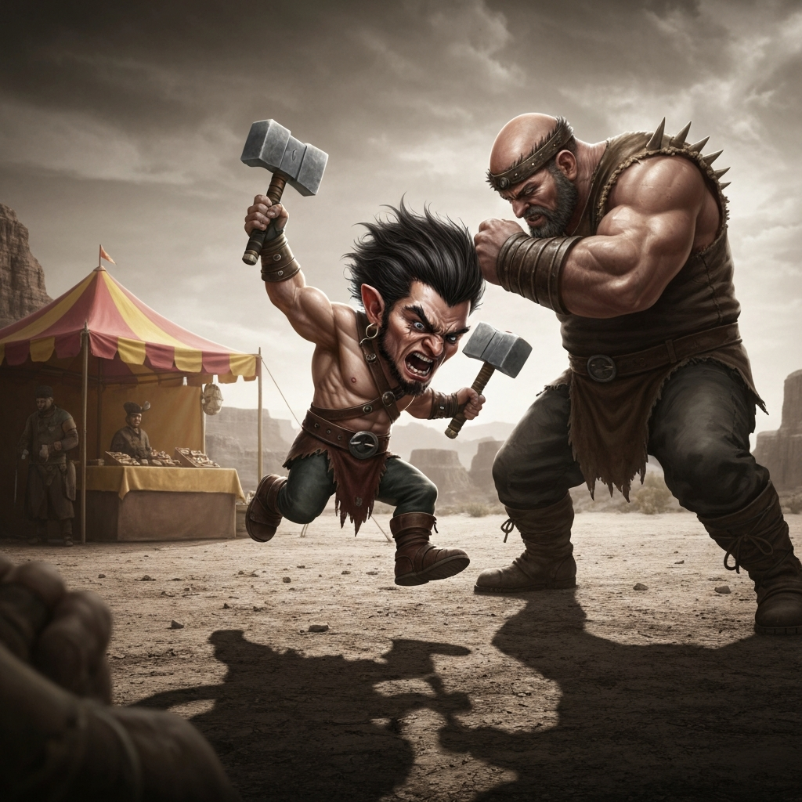
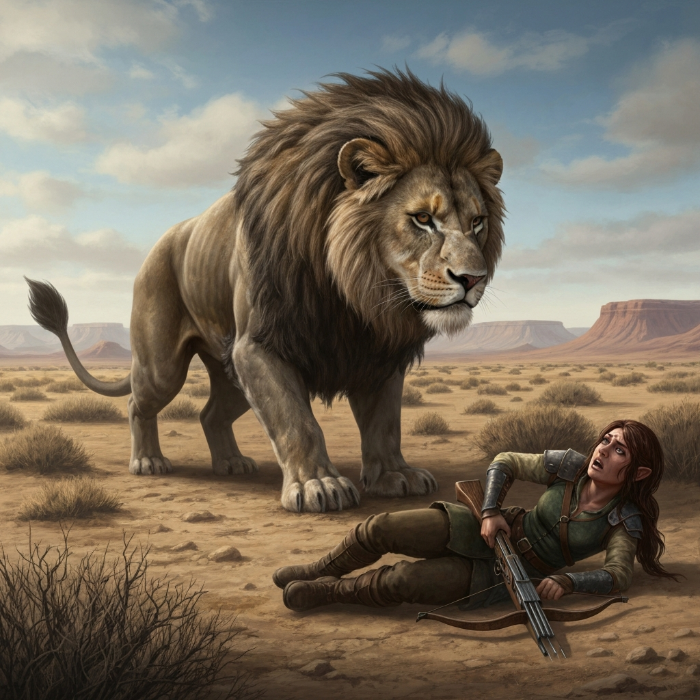
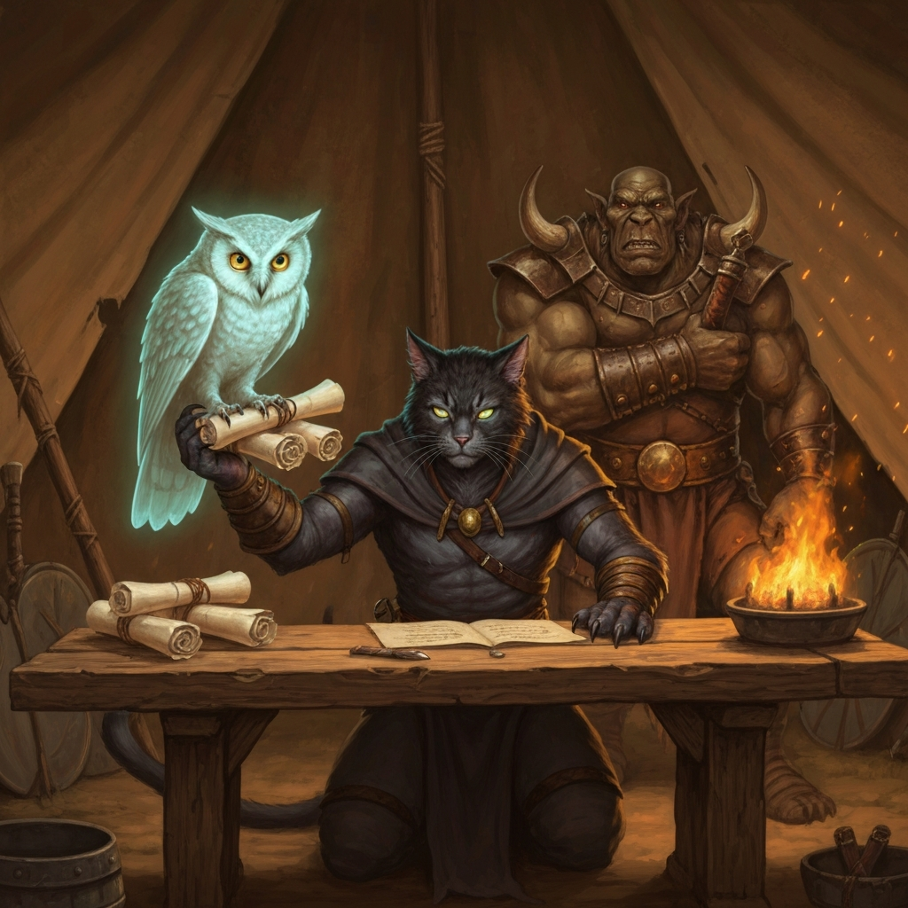
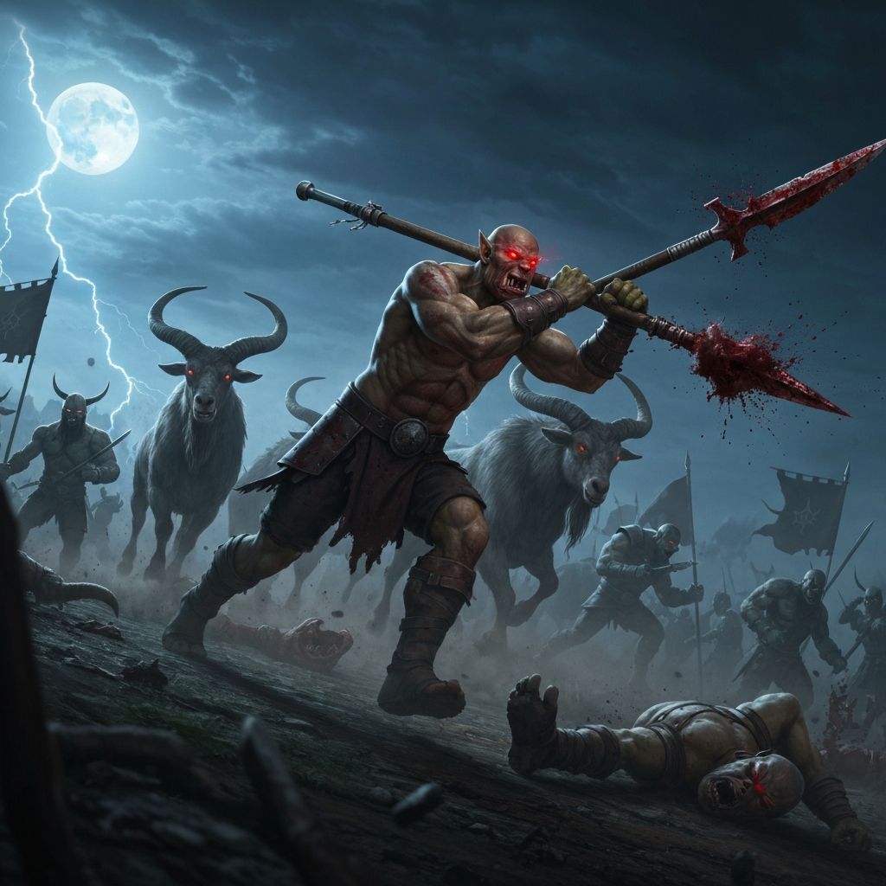
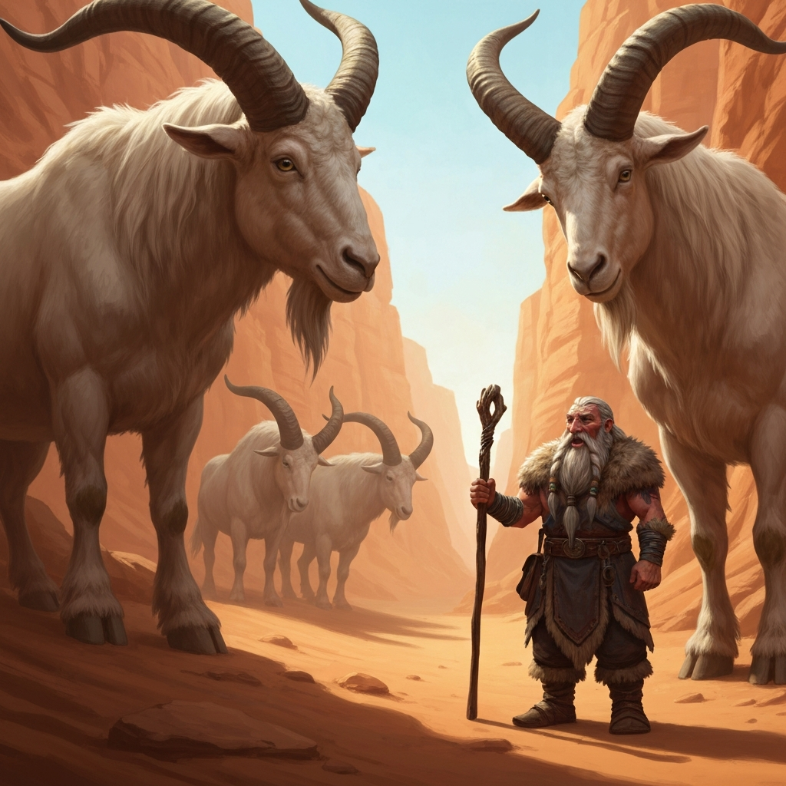

*Played at a charity gaming convention — a fundraiser for Doctors Without Borders. Session run by Chris Moss (Aeryntine).*

---

The party came together the way adventurers usually do: someone needed help, there was money involved, and the situation escalated before anyone had time to think it through. At the bazaar on the Obad Hai Mesa, a merchant was being shaken down by four armed thugs demanding protection money. Kargath was already in lion form. Ozric, two and a half feet of compact fury, held up a pair of light hammers and said "I got your money right here." The thugs called him small. Ozric raged.

It was over quickly. Ilyra's Pipes of Haunting frightened two of the bosses on the first note, Pelargir's Toll the Dead caught one off-guard, and Kargath mauled his way through the front line while Ozric critted repeatedly with reckless abandon. Eight guards arrived after the dust settled — late, as guards tend to be — and escorted everyone to Captain Davies. Davies, an attaché to General Vaylin, had a problem: five rangers had been sent to scout a massive ogre encampment in the Abor Alz badlands and had not returned. He needed the encampment's size, their plans, and the rangers recovered. The party had a new contract, a crystal vial worth five days of water, and two days of hard desert travel ahead of them.

Day one went smoothly enough. Kargath navigated with Osric's help reading the cartographer's map, they found trail markers that turned out to lead the wrong direction, and by mid-afternoon Logos and Pelargir spotted a halfling crouched in the brush ahead — crossbow leveled with shaking hands, injured leg splinted, three days without food or water. She said "Unge." Zute, mid-drink, looked at her and said "Bunga?" She nearly shot him. He said "Hoyer" and she put the crossbow down. It was Jomar, one of the five missing rangers. She'd been knocked into a crevice during an ambush and her four companions were taken. She traded her Cloak of Elvenkind for one day's food and water — Ilyra talked her down from three — and sent them on with the names of her captured scouts. Ilyra and Logos kept watch that night and chased off a pack of rats going for the waterskins.

On day two the party found an ogre patrol at rest — Kargath translated Giant well enough to determine they were complaining about mutton and eyeing a captive shepherd. The party went in at speed. Ilyra's Pipes of Haunting had no effect on the death dogs, who appeared immune, but both ogres failed their saves and spent most of the fight frightened and throwing javelins at disadvantage. Kargath ate one death dog and lion-clawed through the other; Zute impaled the final ogre clean through on a charge and had to spend his next action pulling the pike out. Ilyra's Chromatic Orb bounced twice — the first explosion triggered a chain that caught a second ogre mid-turn. They made camp in the evening and discovered a fire ant colony near their chosen site. Kargath ritual-cast Speak with Animals, rolled an 18, and the ants addressed him as Giant Master. He now had a fire ant grenade in a non-throwable format.

The encampment on day three was a canyon fortress: cliffs on three sides, a palisade gate, and Logos's owl reconnaissance estimated fifty ogres while Kargath and Ozric counted closer to three hundred. Two wooden cages held four humans. A massive tent dominated the far end. And a herd of horse-sized giant goats wandered the ravine floor. Kargath strolled over to introduce himself — in goat, via ritual cast — and explained that the ogres had been eating their friends and that a distraction involving running very fast and making a lot of dust would result in their freedom. The goats said they could do that. He also found the secret cave passage the rangers had mentioned, which connected underground to a pool inside the camp. When a goat-herder patrol came too close, Kargath released the fire ants into them and the patrol fell apart.

The infiltration happened at night. Zute went through first — tied to a rope, sixty feet of cold water, nearly ran out of air before spending a tactical mind roll to push through. Ilyra used Alter Self's aquatic adaptation to swim back and help the rest across. Inside the camp, Vargnac the two-headed troll king was giving a speech about the rights of the strong to rule the weak; every ogre in the encampment was watching. Kargath kicked over a brazier to light a tent on fire and draw the cage guards away. Pelargir dropped a Silence around the cages. Ozric ripped the first cage open with a 25 Athletics while Raging; the scouts inside barely knew what was happening before two of them were loose. Zute critted the second cage open without noticing he'd done it, then handed the freed rangers his remaining rations. Logos sent the owl into the commander's tent, where it found a table covered in maps and letters — the owl retrieved an intelligence map of the county's defenses and a letter promising weapons and supplies to the ogres, signed by "Omni" and marked with the unholy symbol of Tharizdun. As the ogres began to notice the empty cages, Ilyra conjured illusions of prisoners still sitting inside — the guards counted four, came up with four, and moved on. Kargath triggered the goats.

The goat stampede was everything. Three hundred ogres trying to coral horse-sized goats at midnight, chaos in every direction, and the party and all four rescued rangers ran for the palisade. Zute passed a chest on the way out, noticed it was marked with the Tharizdun symbol, sniffed it, tasted it, and grabbed the entire chest of ogre swill and sprinted up the hill. A dwarf in black robes came out of a tent yelling that he'd stolen his beer. Zute yelled back "It's five o'clock somewhere" and didn't slow down. Captain Davies received them back at the mesa with the intel, the rescued rangers, and what turned out to be the most useful cart of stolen devil-cult alcohol in the entire duchy.

---

## Player Highlights

<strong>Ozric Underhill</strong> (Rob) — A two-foot-seven halfling who opened the session by telling four armed thugs "I got your money right here" and then critting one of them in the face with a hammer. Spent the session bouncing between reckless attacks and being the party's designated cage-ripping resource. When Zute couldn't crack the second cage, Ozric had "loosened it for him." His intimidation roll to keep the guards from hauling everyone to the captain — a 23 Athletics, mid-Rage — was the social interaction of the session.

<strong>Ilyra Wavecrest</strong> (Jeff) — Opened combat in the market with Pipes of Haunting, frightening two of the bosses before a single other character had acted. In the ogre patrol ambush, her Chromatic Orb bounced twice in a single cast, killing one ogre and damaging a second from the same spell. During the infiltration, she used Alter Self's aquatic adaptation to personally shepherd the party through sixty feet of underground pool. The illusions she maintained over the empty cages during the escape — faking out guards who'd just watched their prisoners vanish — bought the party the time it needed.

<strong>Kargath Runehand</strong> (Ron) — Running a moon druid for the first time and doing it with commitment: spent most of combat as a lion. Navigated the badlands both days with Speak with Animals cast as a ritual whenever something with ears showed up. Made friends with the fire ants (Persuasion 18, giant master), made friends with the giant goats (Animal Handling 14), and timed the goat stampede to cover the party's entire escape from the ogre encampment. Also lit the diversion fire, maintained Pass Without Trace through the infiltration, and spotted the egress routes while inside the camp.

<strong>Pelargir</strong> (Josh) — Slow-moving cleric in chain mail who planned the infiltration logistics several steps ahead. Spotted Jomar in the brush on day one before anyone else. Cast Create Water to solve the water rationing problem. Dropped Silence around the cages before the extraction, which let Ozric destroy a wooden cage without a sound — a detail that made the whole rescue viable. Earned an exhaustion level from the desert travel and kept taking watches anyway.

<strong>Zute</strong> (Locust) — Professional day drinker, semi-literate, uses a thumbprint instead of a signature, and took a 25-damage crit from an ogre without changing his approach. Scouted the underground passage first — nearly didn't make it back for air, spent a Tactical Mind roll on a Strength Athletics check, swam sixty feet of cold underground water in the dark, and came up inside an enemy encampment to tie off a guide rope so his friends could follow. On the way out, stole a chest of Tharizdun-cult alcohol. "It's five o'clock somewhere."

<strong>Logos</strong> (Dan) — Maintained an Unseen Servant to carry equipment and hand out potions, cast Toll the Dead all session, and sent an owl into a troll king's command tent through active combat air space. The owl retrieved an intelligence map of the county's defenses and a letter from "Omni" marked with Tharizdun's unholy symbol — documents that turned a scout mission into something considerably more significant. A Religion 15 identified the symbol. Logos made note of the disembodied hand that crawled toward the owl as it was leaving, and did not mention it until safely outside the camp.

---

## Achievements

<strong>You Called Him Small</strong> — Four thugs. One halfling barbarian. The thugs looked at Ozric Underhill and said "are you threatening us, little one?" Ozric raged, critted one of them in the face with a light hammer, and explained via the nick attack that everyone now had advantage on his target. The bosses had a very bad round.

<strong>Unge — Hoyer</strong> — A halfling with a shaking crossbow and three days of dehydration stepped out of the brush and rasped the code phrase. Zute said "Bunga?" She nearly shot him. He said "Hoyer" and she put the crossbow down. Jomar, last of the scouting party still free, had found her rescue — one word from a half-drunk orc at a time.

<strong>Documents from the Commander's Tent</strong> — While the troll king addressed his army and the party was inside the camp rescuing four captive rangers, Logos sent his owl through active ogre zombie air space into Vargnac's command tent. It came back with a battle map and a supply letter from a cult agent signed with the symbol of Tharizdun. The owl also noticed a disembodied hand that had climbed onto the table next to it, which Logos filed under "later."

<strong>It's Five O'Clock Somewhere</strong> — Sprinting out of a canyon fortress with four rescued rangers, Zute passed a chest marked with a Tharizdun cult symbol. He stopped, sniffed it, tasted it, and grabbed the entire chest. A dwarf in black robes emerged from a tent yelling that he'd stolen his beer. Zute did not slow down. He called back the only thing that seemed relevant.

<strong>Giant Master</strong> — Kargath ritual-cast Speak with Animals near the fire ant colony, rolled an 18, and was immediately addressed as Giant Master. He recruited a fire ant army as a patrol distraction, negotiated a stampede from a herd of horse-sized giant goats, and released both at the right moment. The goat stampede alone occupied three hundred ogres long enough for the entire party to get out of the camp.

---

## Rewards

- **Gold**: 125 gp (Option 2) — Pelargir, Zute, Logos; 63 gp (Option 3) — Kargath, Ozric, Ilyra
- **[Cloak of Elvenkind]** *(uncommon)* — available as an unlock (featured item); advantage on Stealth checks, disadvantage on Perception checks targeting you while hood is up
- **[Wand of Pyrotechnics]** *(common)* — available as an unlock (Kargath, Option 3 roll: 52)
- **[Hat of Vermin]** *(common)* — available as an unlock (Ozric, Option 3 roll: 17; Ilyra rolled the same)
- **Mark of Prestige — Crest of Bear and Swan**: A polished steel brooch enameled with a rampant bear and swan within a shield, representing honorable service to both the Duchy (bear) and County (swan) of Urnst. Opens doors in either realm. All players.
- **Level advancement**: One step closer to next level for all characters

[Cloak of Elvenkind]: https://www.dndbeyond.com/magic-items/4607-cloak-of-elvenkind
[Wand of Pyrotechnics]: https://www.dndbeyond.com/magic-items/16909-wand-of-pyrotechnics
[Hat of Vermin]: https://www.dndbeyond.com/magic-items/16881-hat-of-vermin
