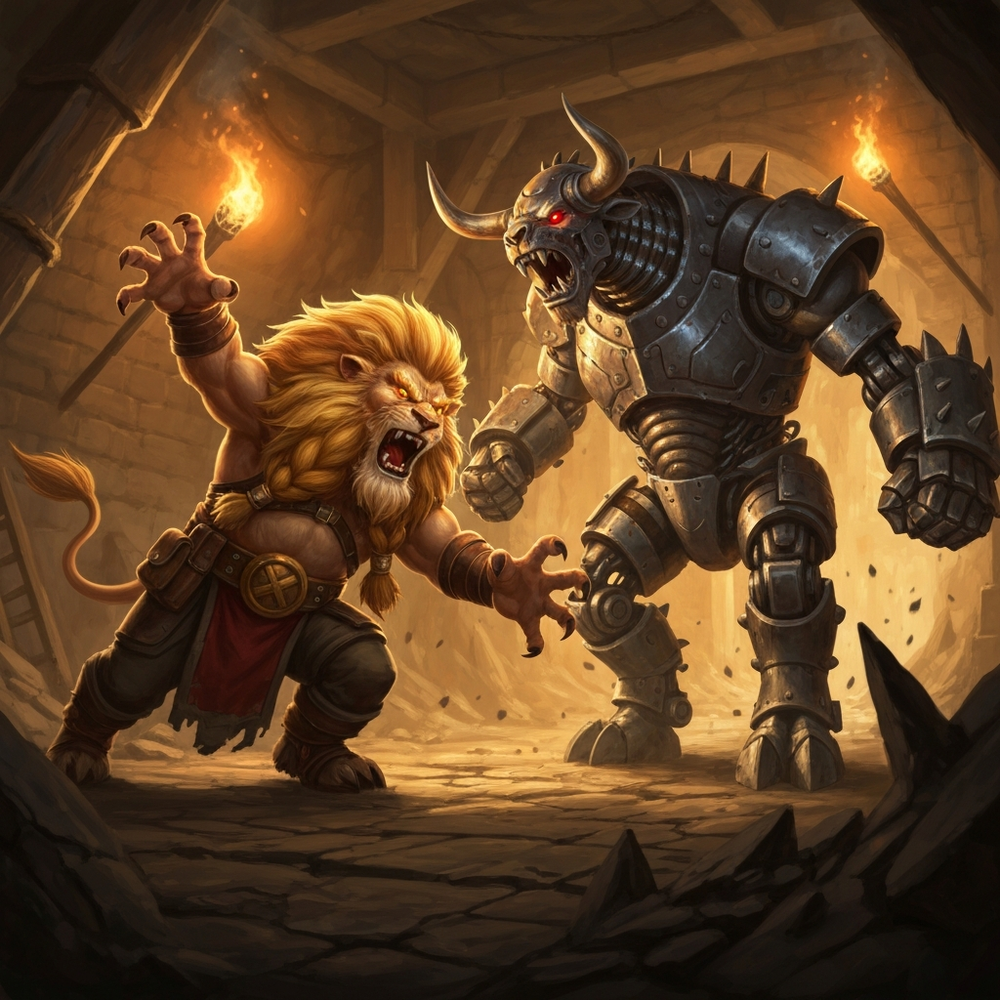
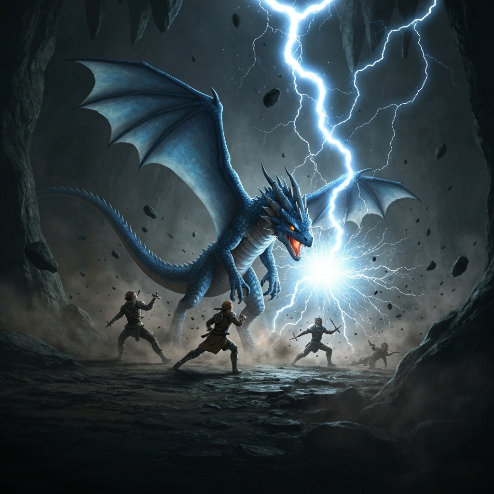
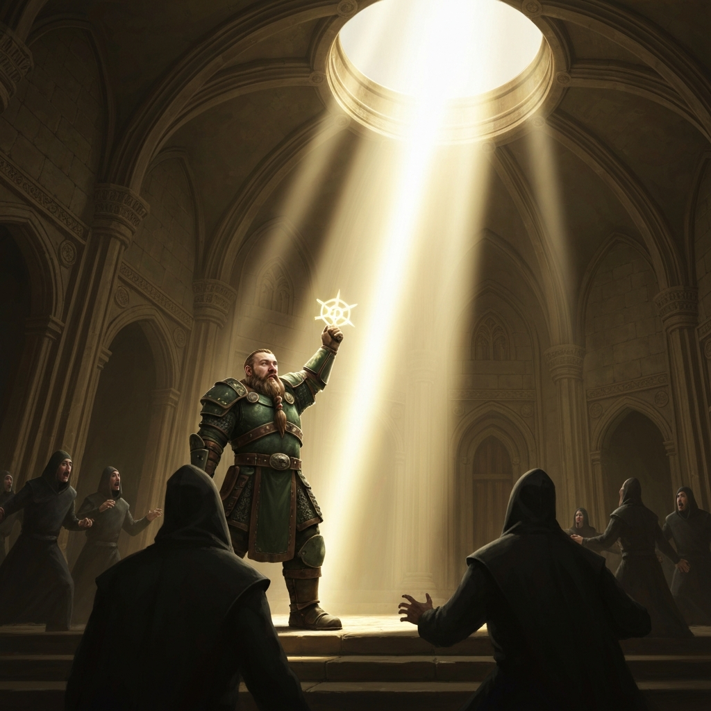
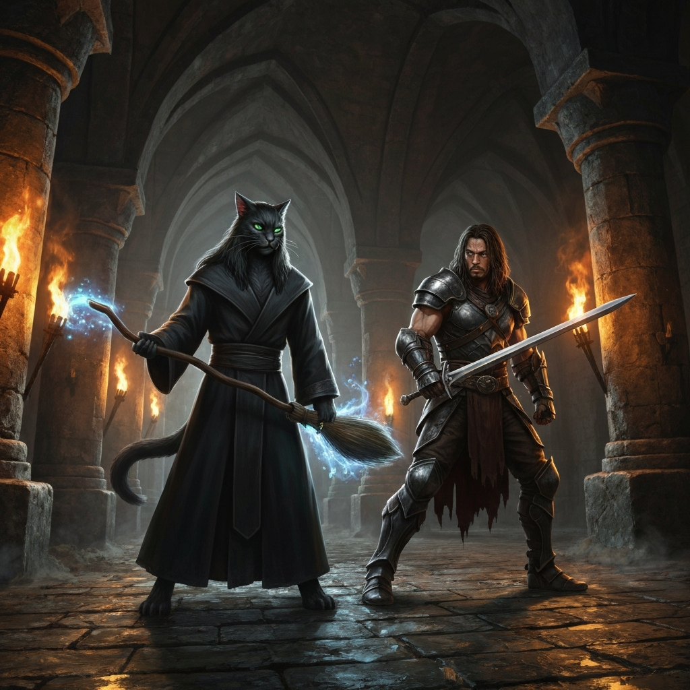
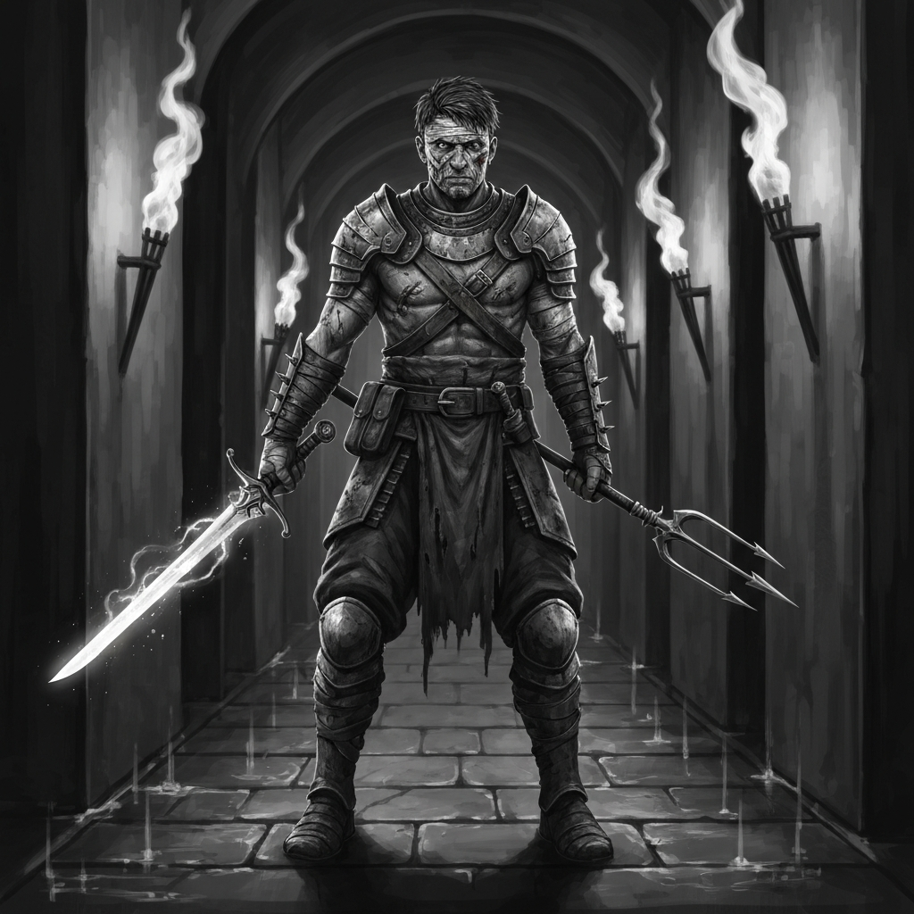

*Played at Summer Knights Online 2026 — a charity gaming convention raising funds for Doctors Without Borders. Session run by Brian Chalmers.*

---

The contract was simple enough on paper: enter the Toghust Mountain Mine, locate Delija's Vault, and retrieve whatever survey the old cartographer had left behind. Fridolin Kleinhaendler wanted the mine's untapped gold vein data, and he'd assembled a table of five — Logos, Kargath Runehand, Roric, Rokrun, and Q — to get it. The first thing waiting inside was a Mechanical Minotaur. Roric noted afterward, with some precision, that the constructs had been diseased — a detail the party discovered mid-combat when constitution saves started appearing. Kargath dropped into lion form on round one. Roric opened with Trip Attack and Topple; Logos cast Shatter while the construct was prone; Rokrun opened with three Scorching Rays for 29 fire damage. Roric absorbed the worst of the exchange and burned two Second Winds inside a single fight. The mine had not yet fully introduced itself.

A Blue Dragon Wyrmling held the next chamber, and it had no interest in negotiation. Its Lightning Breath recharged three consecutive times — 20 lightning, then 23, then 16 — and each charge caught overlapping portions of the party. Kargath's lion form took two of those directly and kept clawing through it. Logos burned Healing Word to keep him functional, then switched to Magic Missiles to sustain pressure. Roric drew his Moon-Touched Rapier for the final push, landing two clean Vex hits to finish the fight. The party took a short rest — Kargath spent two Hit Dice and a Cure Wounds — and pressed further into the mine. In the exploration between encounters, Logos cast Comprehend Languages to work through the vault's mechanisms, returning with a golden cog, a mundane cog, and a golden key.

The next obstacle was a Manticore. It opened with three Tail Spikes in the first round, distributing pain across the front line. Roric kept the Topple + Trident combination going across multiple rounds — the Manticore spent more time on the ground than standing. Kargath's Moonbeam caught it in radiant light; Q landed Battleaxe hits whenever the Eldritch Blasts went wide. After the Manticore, the party examined the surrounding area: Logos's Investigation of 22 found something significant; Roric's Religion checks came up a 1 and then a 2, which was at least consistent. Someone had been using this section of the mine recently. Someone with a religious affiliation.

The cultists were still inside. They had Pact Blades and their own Spiritual Weapons, and they opened with Wisdom saves that not everyone in the party passed. What they did not have was a plan for Channel Divinity: Radiance of the Dawn. Rokrun invoked it for 23 radiant damage, and most of the cultist group ended there. The Fanatics who survived into the next round were handled by Kargath's lion, Q's Battleaxe, Roric's Trident, and a final Magic Missile from Logos. Delija's Vault was open. Among the survey maps and the mission objective — a detailed record of the mine's untapped gold veins — was a Wondrous Item: Baba Yaga's Dancing Broom. It was awarded to Logos. Before the party had fully processed this development, Roric had activated the Animated Broom: Slam, 21 to hit, 6 bludgeoning, flyby, 50-foot move. "Could be worse," Roric said.

---

## Player Highlights

<strong><a href="../characters/logos">Logos</a></strong> (Dan) — The diviner wizard ran the dungeon as a support frame: Shatter on the prone Mechanical Minotaur, Healing Word to keep Kargath functional through two lightning breath charges, Magic Missiles in every fight. Cast Comprehend Languages during the mine's exploration phase and came away with a golden cog, a mundane cog, a golden key, and an understanding of what the vault actually held. Left the session with Baba Yaga's Dancing Broom, which Roric immediately tested without asking.

<strong><a href="../characters/kargath-runehand">Kargath Runehand</a></strong> (Ron) — Moon druid, with commitment: lion form from round one of every encounter, straight through to the end. Absorbed two Lightning Breath charges from the Blue Dragon Wyrmling without breaking form, spent a short rest burning two Hit Dice and a Cure Wounds, and came back as a lion. Moonbeam on the Manticore. Lion rend in the cultist vault. The druid's full toolkit was available; he had preferences.

<strong><a href="../characters/roric">Roric</a></strong> (Trey) — Battle Master fighter who used every Second Wind available: two in the Mechanical Minotaur fight, one more against the Blue Dragon Wyrmling. The Topple + Trident combination kept the Manticore grounded across multiple rounds while the party worked on it from range. Drew the Moon-Touched Rapier for the dragon's final push. Was also first in line to deploy the Animated Broom, which he treated as an entirely reasonable tactical decision.

<strong><a href="../characters/rokrun">Rokrun</a></strong> (patoente) — Opened with triple Scorching Ray on the Mechanical Minotaur and kept Spiritual Weapon running for the rest of the session. When the cultists appeared in the vault, he invoked Channel Divinity: Radiance of the Dawn for 23 radiant damage and ended most of the encounter before it could develop. "wait.... Rokrun is a Cleric???" asked Kargath in chat. "Right?!" said Roric. The Fanatics had their own Pact Blades and Spiritual Weapons. It didn't help.

<strong>Q</strong> (Sam) — Aasimar Fighter/Warlock making their Legends of Greyhawk debut. History and Investigation checks in the exploration phases; Eldritch Blast and Battleaxe Topple in combat. The Eldritch Blasts were inconsistent. The Battleaxe was not: 21 to hit, 12 slashing damage on the cultist fanatic. The History check total across two rolls came to 3. Nobody mentioned it.

---

## Achievements

<strong>First In, Claws Out</strong> — Kargath Runehand spent this session as a lion. Round one of the Mechanical Minotaur fight: lion. Round one of the Blue Dragon Wyrmling: lion. Round one of the Manticore: lion. Round one in the cultist vault: lion. He absorbed two Lightning Breath charges from a dragon, burned Hit Dice on a short rest, and came back as a lion. The druid had options. He had a favorite.

<strong>23 Lightning. Try to Stay Calm.</strong> — The Blue Dragon Wyrmling's breath weapon recharged three consecutive rounds. 20 lightning. 23 lightning. 16 lightning. Each charge hit overlapping portions of the party. Kargath's lion form failed two of those saves. Logos burned Healing Word to keep him in the fight. Nobody dropped, which was a better outcome than the dice suggested was guaranteed.

<strong>Wait, Rokrun Is a Cleric?</strong> — Triple Scorching Ray on the first fight. Consistent Spiritual Weapon damage all session. Nobody asked any follow-up questions. When the cultists appeared, Rokrun invoked Channel Divinity: Radiance of the Dawn for 23 radiant damage and cleared most of the room before a second round was necessary. "wait.... Rokrun is a Cleric???" asked Kargath in chat. "Right?!" said Roric. The Fanatics who survived long enough to swing Pact Blades and summon their own Spiritual Weapons needed them more than they knew.

<strong>Could Be Worse</strong> — Delija's Vault held what they'd come for: survey maps, gold vein data, the mission objective. It also held Baba Yaga's Dancing Broom. Logos claimed it. Before anyone had formed an opinion about this, Roric had already activated the Animated Broom: Slam, 21 to hit, 6 bludgeoning, flyby, fifty-foot move. "Could be worse," Roric said. He was technically correct. The broom had no comment.

<strong>Three Second Winds</strong> — Roric used all three of his available Second Winds across the session: twice against the Mechanical Minotaur, once more against the Blue Dragon Wyrmling. The Topple + Trident combination kept enemies grounded through multiple rounds. The Moon-Touched Rapier came out for the dragon's final push. A Battle Master with limited resources and no hesitation about spending them.

---

## Rewards

- **Baba Yaga's Dancing Broom** *(wondrous item, uncommon, requires attunement)* — awarded to Logos; as a Magic action, transforms into an Animated Broom under your control; acts after you on your initiative count; mentally commanded within 30 feet; shatters at 0 HP, regains all HP if reverted while alive
- **Mark of Prestige — Toe the Company Line**: You delved the Toghust Mountain Mine and delivered a map detailing untapped gold veins. You're confident that this will get you noticed by Fridolin Kleinhaendler and will surely secure your place in the organization. The future looks bright indeed. All players.
