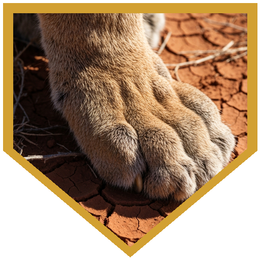
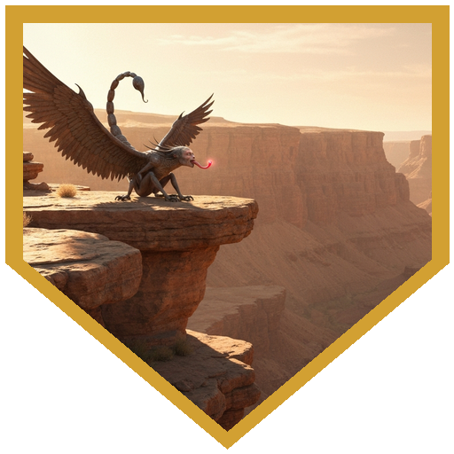
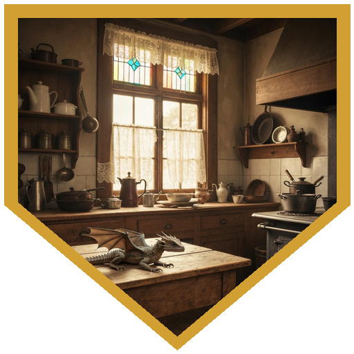
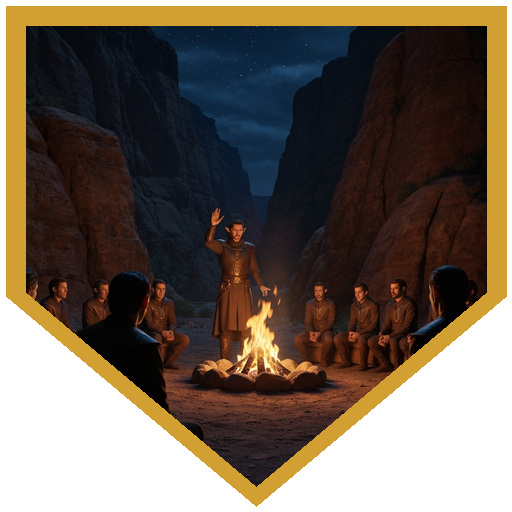
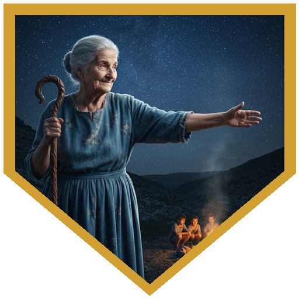

The party met in the morning heat of Lukash's tent city, drawn together by a cry and a man who had a rapier but not the skill to use it. Nico Liecki was outnumbered three to one by bandits when the group showed up: Logos opened with a Suggestion that sent the lead thug home questioning his life choices, Kargath cracked another with his quarterstaff and flashed his Duchy crest to scatter the rest, Lastrasa stood in the road playing something threatening in a minor chord, and Dorian put a radiant True Strike into the captain before the whole group thought better of it. Afterward, Nico explained why he was in the market at all. His mentor Bershon — a diplomat who had once wandered into the Valley of Lost Hunger, been captured by gnolls, spent a year earning their trust, and come home nicknamed the Fox — had died of a snakebite the previous night. A meeting with the Silver Howl tribe of gnolls was already arranged: negotiate an alliance, or at least neutrality, against the Troll King Bargnach's approaching ogre army. Nico had the notes, the seal, and absolutely nothing else going for him. He hired the party on the spot.

Thirty minutes into day one, Nico remembered he had left the Fox's personal seal — the identification token the gnolls would recognize — on a table inside his house. Kargath shifted into a mountain lion and ran back alone; the trip took him thirty minutes, and he returned with the pouch in his teeth — and had run down one of the bandits who'd fled the market fight on the way. Day two brought three manticores perched over the only viable pass through the ravines. The party chose not to fight. Kargath extended a goodberry by hand; the manticore nearly took the hand with it. Logos mage-handed the remaining ones across. The manticores ate, settled into contented grooming, and the party walked past while they bathed. By day three, the Valley's hunger curse had arrived — a gnawing that nothing in the ration packs could touch — and Kargath's Goodberry spell was the difference between walking and exhaustion.

The Silver Howl gnolls met them with armed caution. Elder Amok, the tribe's Song-Sayer, would hear the case — but only after a rite of passage: enter the Cave of Fire and bring back a dragon's fang. Kargath scouted ahead as a centipede, tremorsense on the cave floor, and relayed a kobold ambush by Message. Lastrasa went in invisible and triggered the kobolds' shot early; they stood down when they recognized the Silver Howl name. Inside, red dragon wyrmlings held court over their kobold servants, the alpha Cyrenix already crushing failures underfoot. The runt, Skirinix, watched from a ledge apart. Boon introduced the party as a dental inspection crew. She didn't buy it — but she saw an opportunity. Back her political claim with the gnolls or the people of Lukash, and she'd hand over a tooth willingly. She pawned one out of her own mouth and sent them off with a warning: red dragons don't forget faces. That night, Lastrasa found Elder Amok alone on a cliff ridge, playing his bandore into the dark. She climbed up and joined him without a word, learning the melody and weaving her lines around his. He smiled and kept playing.

The gnolls called the full council fire when the party returned with the fang. Brack and Yamag, emissaries of the Troll King, were already seated. Three rounds of argument followed. Kargath shifted to lion form for his first contribution — lay down directly beside the ogre emissaries and groomed himself theatrically while they tried to rally the council. Later he pointed out the human-tooth necklace on Yamag's neck and the too-fine great sword peace-tied at Brack's back, trophies from past conquests. Logos, in the final round, made a religion check and drew a line from the ogres' closing speech — pride, savagery, the embrace of wild heritage — directly to the dogma of Inogu, the demon lord these gnolls had spent generations running from. "Isn't that what you left?" Dorian finished with Elder Amok's own tune still on his strings. The elders went into a cave for two hours. When they emerged, the final score was 208 to 36. The Silver Howl Gnolls would stand with Ernst. Elder Amok called Nico "the Kit" — child of the Fox — and gave away the bandore he had been playing all his life.

## Player Highlights

<strong>Lastrasa</strong> (Bryan) — Found Elder Amok on a cliff ridge the night before the council, playing his bandore alone into the dark. Climbed up and joined him without being invited — learned his melody by ear and wove her lines around it. He smiled and kept playing, and sent her to the debate with heroic inspiration. When her turn at the council fire came, she was the first to hit 21 persuasion, pointing out that the ogres' style of alliance tends not to distinguish well between enemies and expendable allies.

<strong>Dorian</strong> (Sam Tagliafarre) — Kargath recognized the family name at introductions — he'd met Dorian's brother at a previous table. Small world, smaller army. In the closing round of the debate, Dorian picked up Elder Amok's tune from the night before, still on his strings. "You trusted Fox. Fox got you here." He played and spoke at the same time, rolled persuasion at advantage, and hit it.

<strong>Boon</strong> (E. Sennet) — Walked into a volcanic cave of dragon wyrmlings and introduced the party as a professional dental crew. Skirinix wasn't convinced but saw the potential and offered a deal — political backing in exchange for a willing tooth. Boon negotiated it straight, Skirinix pulled her own fang and spit it on the floor, and the party walked out with both the tooth and a conditional dragon ally. In round two of the council debate, hit 21 persuasion on a "big tent coalition" speech that explicitly named the dragon they had just recruited.

<strong>Logos</strong> (Dan) — Used Suggestion in the first combat round to send the lead bandit home puzzled. In the final round of the council debate, cleared a religion check and connected the ogres' closing appeal — gnoll pride, savage nature, the heritage of wild things — to the specific doctrine of Inogu, the demon lord these gnolls had built their tribe to escape. "Isn't that what you left?" The elders convened for two hours after that.

<strong>Kargath Runehand</strong> (Ron) — Shifted into a mountain lion thirty minutes into day one to retrieve Nico's forgotten seal, ran down one of the fleeing market bandits along the way, and came back with the pouch in his teeth. In the council debate's second round, pointed out the trophies on Yamag's neck — human teeth, a too-fine sword that no ogre forged — and let the crowd notice. In round one, lay down as a lion directly beside the ogre emissaries and groomed himself theatrically while they tried to rally the gnolls.

## Achievements

<strong>A Badge This Time</strong> — In the opening market fight, Kargath cracked bandit C with his quarterstaff in one hit, then pulled back his cloak to flash the crest of the Duchy — bear and swan. The remaining bandits scattered. On the way back to retrieve Nico's forgotten seal, still in lion form, he ran down one of the bandits who had fled the market fight. He came back with the pouch in his teeth.

<strong>The Manticore Treaty</strong> — Three manticores blocked the only pass on day two. Kargath extended a goodberry by hand; the manticore's tongue curled around the berry and snapped at his wrist as it took it. Logos mage-handed the remaining ones across with better results. The manticores ate, settled into contented pre-nap grooming, and the party walked past while they bathed. Everyone received heroic inspiration. The DM confirmed that was better than half an hour of combat.

<strong>Dragon Dentist</strong> — Boon introduced the party to Skirinix, the runt wyrmling in the Cave of Fire, as a professional dental inspection crew. She saw through it inside a minute but found the meeting useful. Her terms: broker her political standing with the gnolls or with Lukash, and she would pull a tooth herself. She pawned it from her own jaw and spit it on the cave floor. "If you betray me, I will remember." The party did not disagree.

<strong>Inogu's Prayer</strong> — In the final round of the council debate, Logos made a religion check and drew a line from Yamag's closing speech — the nobility of savagery, the gnolls' wild heritage, the strength of those who don't compromise — directly to the doctrine of Inogu, the demon lord the Silver Howl tribe had spent generations putting behind them. "Isn't that what you left?" The elders filed into a cave and deliberated for two hours.

<strong>The Silver Howl Will Mourn My Passing</strong> — After three rounds of argument and a final count of 208 to 36, Elder Amok extinguished the council fire and declared the Silver Howl tribe's alliance with Ernst. He named Nico "the Kit" — child of the Fox — and told him to grow into the shoes his predecessor wore. Then he turned and handed over his bandore, the instrument he had been playing when Lastrasa found him on the cliff the night before.

## Rewards

- **125 gp** (standard LoG session reward)
- **Mark of Prestige: *The Silver Howl Will Mourn My Passing*** — You have found kindred spirits amongst the Silver Howl Tribe of gnolls. You are a welcome friend in the Valley of Lost Hunger and have convinced their warriors to join in Urnst's defense in the upcoming ogre war.
- **Magic Item Unlock: Instrument of the Bards – Fochlucan Bandore** *(Wondrous Item, Uncommon, Requires Attunement by a Bard)* — A superior instrument in every way, gifted by Elder Amok himself. While attuned, a bard can cast Entangle, Faerie Fire, Fly, Invisibility, Levitate, Protection from Evil and Good, Shillelagh, and Speak with Animals from it.
