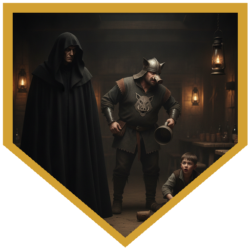
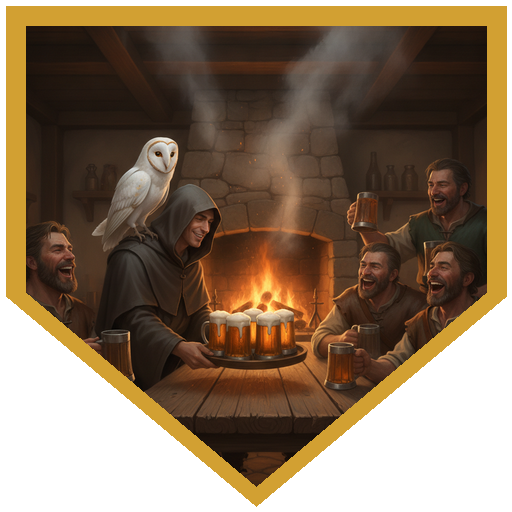
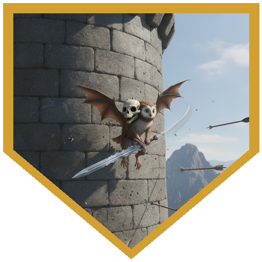
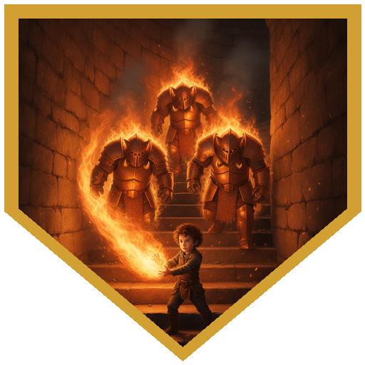
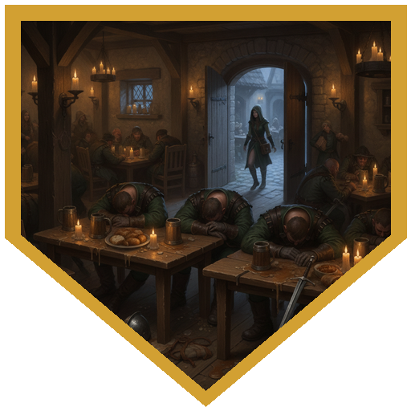

Aeldwyn One-Arm had been a fierce sellsword once. In her later years she became Safeton's healer, and by Richfest she had decided her own time was nearly up — she wanted one last journey somewhere of her own choosing, and she would not leave the town without a healer while she took it. Lord Protector Wolstan put the problem to four newcomers in the audience chamber of Safeton Keep, gave them five gold each to spend at the festival, and pointed them at the Midsummer crowds pouring in from all over the Wild Coast. Orin Darkward went to the wild priests he had guided in years past; they knew of **Tasencia Lafanel**, Count Merleche of Phlandish's court mage, who had taken his money for a magical education in Greyhawk and had been working off the debt in his service ever since. Their assessment was blunt: the interest was outrageous, Merleche was cruel, and she would be old before the bond broke. Madmartiken worked the crowd by claiming to be auditioning performers for a romantic production. Huckleberry leaned on the charlatan circuit he used to travel with. Cir Mevut got to talking about Greyhawk with a stranger and came away with the more interesting rumour — Merleche had not called himself a count until Tasencia arrived, and some people thought she and his dwarven castellan Naro Gunnaham were the real power behind the title. Wolstan wrote a writ for a thousand gold, and mentioned quietly that he could go to fifteen hundred if the man proved cantankerous.

The road north skirted Pelgarin on Wolstan's advice, and by afternoon two dozen armed and armoured riders were visible crossing the plains toward that same village. Madmartiken squinted and recognised bandits when he saw them; Orin took the party onto the game trails, and nothing troubled them for two days. In Zulern they found half a dozen ruffians in boar's-head livery making sport of a fourteen-year-old serving boy — kicking him across the tavern floor while he gathered the cups they had scattered, pouring ale over his head. An old man stepped up to warn the party off. Orin was already moving around behind the nearest one. "Neither does the boy." The thugs stopped, then swaggered, and Cir Mevut stepped in with an offer to buy the whole crew a round — honestly meant, which got him a straight roll instead of disadvantage. By the time they were toasting their absent employer he had learned that Merleche was at home in his castle. On the way out Orin pressed a gold coin into the boy's hand: *don't let him see this.* Two more days east through farmland, a silver each at the gate, and they stood in front of a man with a wolf at his heel. Merleche put Tasencia's outstanding balance at five thousand gold and said flatly that he knew Wolstan's coffers and knew he could not pay. Then Naro whispered in his ear and his mood improved: a dozen of his warriors had been taken by orcs, and the one they released — Vellana Quicknife, a wood elf scout, wounded — was carrying a ransom demand of a thousand gold. He refused it on principle — *extort me once, extort me again* — and made the party a different offer. Bring his warriors home, make certain those orcs never extort him again, and Tasencia's debt would be considered paid.

Tasencia led them out herself. She healed Vellana, handed over three potions she had brewed, and Vellana described the old stone tower near the Gnarley a few miles off the forest edge where she had been held — five storeys, orcs on the roof, and a hole in the ground-floor flagstones where the captives were being made to dig. Cir Mevut's owl confirmed it from the air: three on the roof, two at the door. They went in by daylight, on Orin's reading of the ground, and got close before anyone looked up. Cir held one door guard in place; Orin marked the other and shot him; Huckleberry followed with a 14-point burst of sorcerous cold ("peppermint"); Madmartiken swung, missed, and the surviving guard shouted the tower awake. What followed took most of the session — orcs off the roof and out the door, pack tactics, heavy crossbows through arrow slits. The party freed the diggers on the ground floor, armed them out of the orcs' own stores and fed them, and pushed upstairs past an abandoned circular chamber with two iron bulbs set into the east and west walls, ambient magic still humming: somebody's unfinished experiment from when this had been a wizard's tower. The orc boss and his priest held the stair above. Parley was floated and declined — too many orcs were already dead for that. Huckleberry corked the stairwell with his own body and took hits from two floors at once. Madmartiken went down and came back up. Orin killed the priest with a scimitar and eight points of dreadful strike on top of it, twenty-two in one blow, then put the same blade to the throat of the crossbow orc who had spent the entire fight taking potshots from the corner. Madmartiken finished it by charging up the stairs screaming, with a sword flip, until the rest surrendered — then offered them work as his acolytes. They declined. Not orcish enough.

The priest's only valuable was a shiny stone, which Madmartiken pocketed and named Steve; it turned out to be a Stone of Good Luck. Twelve captives walked back to Phlandish. Merleche greeted them with *"I didn't actually expect you guys to return, really, but good job,"* threw a feast, took the full fifteen hundred anyway, and sent six fresh warriors along as escort in the morning. The one snag came at Zulern on the way home, where the local boar's-heads wanted the elf handed back — contractual obligations, they explained, with no real conviction behind it. Madmartiken invited them to go outside and play a game by themselves. Then the party bought the bar. Between Tasencia's purse and the five gold each of them had never got around to spending at Richfest, the whole crew was blackout drunk before the argument could restart, and the villagers — no friends of Merleche's — were glad to help it along. *What elf?* Back in Safeton, Aeldwyn got her successor and the party got a feast and the last night of Richfest. She pulled them aside during the festivities to ask how well they knew a certain stretch of country. Orin, who guides for a living, said it was where he spent his time.

## Player Highlights

<strong><a href="../characters/huckleberry">Huckleberry</a></strong> (Dan) — A former stage magician whose tricks started working for real, and who still isn't sure how. Opened the tower fight with a sorcerous burst for 14 cold damage — "peppermint" — then spent most of the long fight standing in the one square that kept the orcs upstairs from spilling down, taking attacks from two floors at once for the privilege. When Cir Mevut's channel divinity put him back to full with sixteen temporary hit points on top, he repaid it with a Burning Hands up the stairwell that caught three orcs for nine apiece. Ended the adventure at third level and finally, properly wild.

<strong><a href="../characters/cir-mevut">Cir Mevut</a></strong> (Brian) — A Greyhawk scholar who studies at the Great Library when they let him, which is not often; mostly he checks books out and reads them at his apartment. Defused the Zulern tavern by offering to buy a round and actually meaning it, and walked away knowing Merleche was home in his castle. His owl scouted the tower before the assault and spent the entire fight helping and harrying — and, on his instructions, looked down into the captives' pit. Held a door guard to open the fight, and later burned a channel divinity to heal Huckleberry to full and stack sixteen temps on him.

<strong><a href="../characters/orin-darkward">Orin Darkward</a></strong> (Trey) — Moves people from point A to point B for a living and admits he hasn't done much of "this kind of stuff." Stepped out of the shadows behind a bully in Zulern with "Neither does the boy," then slipped the kid a gold coin on the way out. Kept the party off the open road and clear of two dozen riders for two days of travel. In the tower he shifted Hunter's Mark a dozen times, landed a 25-damage swing, finished the orc priest with a scimitar plus eight points of dreadful strike, and held the last crossbowman at the point of the same blade until he dropped it.

<strong><a href="../characters/madmartiken">Madmartiken</a></strong> (Ken) — Arrived with a new pact and new company: Franjean and Rool, a bickering two-in-one who insist in the same breath that each of them is the one in charge. He drew more aggro than the rest of the party combined, went down under a crit and a crossbow bolt, got hauled back up, and kept swinging. With the boss dead and the surviving orcs wavering, he charged the stairs screaming with a sword flip and intimidated the rest into surrender — then tried to recruit them as acolytes, on the grounds that they were clearly used to a priest telling them what to do. "You're not orcish enough."

## Achievements

<strong>Neither Does the Boy</strong> — An old man in the Zulern tavern stepped up to warn the party off: "You best not, friend. You don't need that kind of trouble." Orin, already moving around behind the nearest boar's-head thug, answered "Neither does the boy." The DM credited the line as much as the dice. The bullies stopped laughing, then swaggered — and Orin caught the kid's eye and nodded him toward the door before anything got worse.

<strong>A Round for the Boar's Heads</strong> — With Orin behind one thug and the tavern about to turn, Cir Mevut stepped in and offered to buy the whole crew a round. The DM called for persuasion at disadvantage, then waived it when Cir made clear he genuinely intended to pay. The ruffians took the drinks, asked who they owed the round to, and in the course of getting chummy told him exactly where their employer was: home, in his castle.

<strong>The Greatest Swordsmen in the World</strong> — Madmartiken's vestige manifested this session as Franjean and Rool, who share one small body and argue constantly about which of them is in charge. They flew up the tower wall to get out of crossbow range, hit more reliably than anyone else at the table, carried and drank healing potions, and hauled Madmartiken back up off the floor. "They're more effective than a lot of us right now." One of them wore a small skull helmet on backwards for the entire fight.

<strong>Fingers of Fire</strong> — Huckleberry spent most of the tower fight as the cork in the stairwell, absorbing attacks from two floors at once so the orcs above couldn't pour past him. When Cir Mevut's channel divinity put him back to full and stacked sixteen temporary hit points on top, he finally got a turn worth having: Burning Hands straight up the stairs, three orcs in the cone, nine damage each, and all three failed the save.

<strong>What Elf?</strong> — On the way home the Zulern toughs wanted Tasencia handed back — contractual obligations, they said, without much conviction. Madmartiken suggested a game they could go play outside by themselves. Then the party asked the bartender what it would take to put the whole crew on the floor, paid for it out of Tasencia's purse and the five gold each of them had never spent at Richfest, and walked out with her. As far as Zulern was concerned, there had never been an elf.

## Rewards

- **Treasure bundle: Stone of Good Luck (Luckstone)** *(Wondrous Item, Uncommon, Requires Attunement)* — all four took the stone over 125 gp or a random roll. Looted off the orc priest, who carried nothing else worth taking. Madmartiken named it Steve.
- **Mark of Prestige: *Hero of Safeton*** — You have delivered a new healer to Safeton. You may call upon Tasencia's formidable knowledge in your future adventures.
- **5 gp each** in walking-around money from Lord Protector Wolstan, most of it eventually spent putting Zulern's toughs on the floor.
- **Three potions of healing** from Tasencia for the rescue — greyhawked at the end of the adventure, as such things are.
- **Advancement** — Huckleberry reached 3rd level and came into his Wild Magic.
