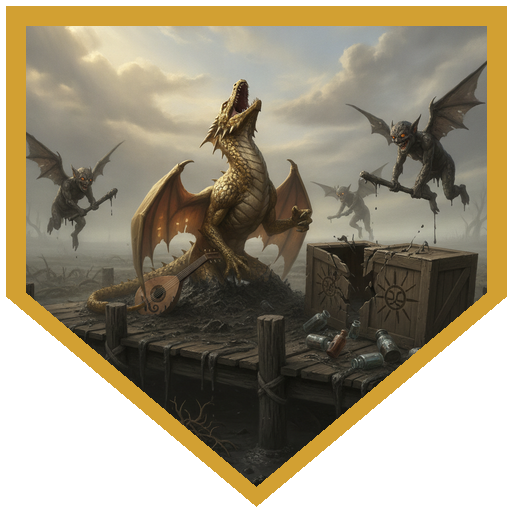
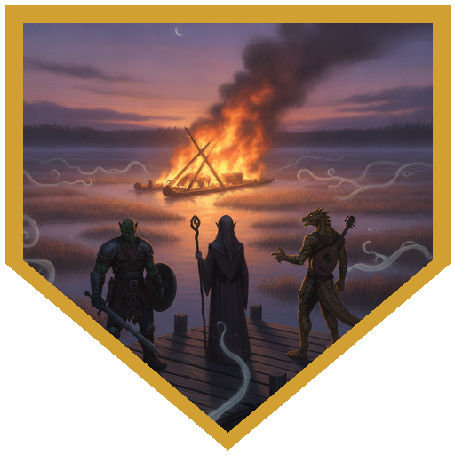
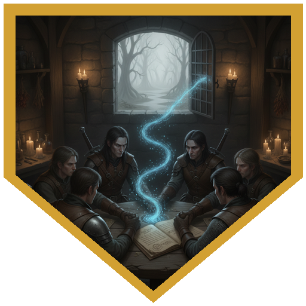
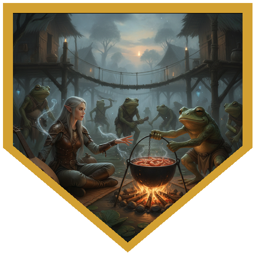
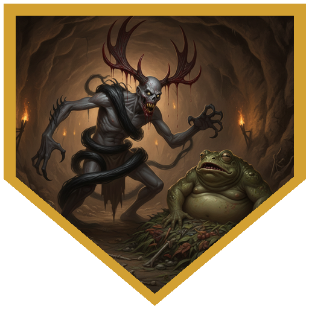

A letter from Issa Rivermane of the Rivermane Infirmary brought the party downriver by barge to Muckroot, a stilt village in the marsh, with crates of medicine and food marked with Pelor's sun. Issa met them at a fishing hut on the isthmus in a cloth mask and asked them to turn around. The fever had already taken her mother Mara, the healer who went looking for a stronger remedy, and Issa had been sending travellers away ever since. Once she understood they had answered her letter, she let them examine the body before she burned it. Mara was still feverishly warm under a gentle repose, with a faint blue dust beneath her fingernails. GrebeL confirmed it was no ordinary swamp fever. Logos's Detect Magic, with an Arcana check of 27, found enchantment and necromancy woven through it: something like *contagion*, but more persistent, and built to change what its victims perceive. The herb bundles in Issa's crates held marigolds and white lilies, which Lastrasa knew from her work with the dead as funeral flowers. Their petals were tipped with blue. Issa cast her mother's body off on a burning raft. While the party stood watching, Wülgrëen, Logos and GrebeL each felt their temperature spike, and each heard a voice telling them to forget the thing they held dearest.

Muckroot's dock was under attack when the barge arrived. Six mud mephits had carried off a bespectacled girl and dropped her near the water. More came up through the planks while a halfling and a gnome fought them further off. Wülgrëen split the first mephit open and got buried in its mud for his trouble. GrebeL stood over the girl so nothing could reach her. Lastrasa's Thunder Wave threw three mephits ten feet clear before they burst. Some of the mephits turned on the medicine crates and smashed about half of them before the party finished the rest. The girl was Elena, daughter of the infirmary's apothecary Erisa, and she liked to collect pretty flowers and hand them out around town as "Pelor's light." The dwarven priestess Yarni Lightbeard had encouraged it. Yarni thought Pelor was testing the village; Erisa blamed the bullywugs of Muckglob, who had stopped trading and gone quiet since the fever began. When the party shared Mara's field notes, Erisa noticed that the first letter of each sentence spelled out **Blue Twirl Cap**, a mushroom she knew. She joined hands with the party to cast *locate object*, and the spores led north into the swamp, straight to Muckglob. Brewed fresh, the mushroom could be the base of a cure, but the bullywugs held it sacred.

At Muckglob the party split up. GrebeL turned invisible and dropped twenty feet through a guarded hole in the roof of the mound, into a flooded cave where the blue-tipped mushrooms grew on a heap of rot. Lastrasa stepped out of the bushes in front of the guard, Diploplop, who had a crossbow levelled at her before she said a word. She talked him down anyway. Then she walked into the village, whistling and waving at companions who weren't there. From the villagers she learned that the tribe was split. Boss Bliglox held to the old ways of Ramenos, the drowsing god of sloth and rot. The shaman **Splumpluff the Languid** had made a deal with a powerful fey queen, who sent giant toads to guard the tribe and promised to lead it back to the fey courts. In return, the tribe was to keep adventurers away from the mushrooms. (The villagers would not share their shrimp.) Down in the cave, GrebeL walked into a tripwire hung with pots and pans and woke the whole mound. Diploplop spotted movement below and levelled his crossbow again, until Roland, still hidden up near the hole, sent him a Message that only he could hear: it was Ramenos speaking, and nothing down there was his concern. Splumpluff met Lastrasa and offered a straightforward deal: kill Boss Bliglox and take all the mushrooms you want.

The rest of the party decided to go to the boss instead. Bliglox had been having visions of assassins, and when adventurers walked into his lair he assumed the visions were right and charged. Roland met the charge in his ghastly form: bloody antlers, twisting shadow and putrid fangs. The boss and every bullywug in the room were frightened. Roland's first attempt to talk sense into them came up badly short. His second, at advantage, worked: *Splumpluff wants you dead, he's in league with a hag, and he's the one making the village sick.* Bliglox considered this, told his warriors to stand down, and confirmed that he was the boss. The party then turned on Splumpluff. A giant frog that had grappled Wülgrëen and the bullywug warrior beside it died together to Logos's Thunderwave, and the blast tossed both bodies out of the cave. Lastrasa hit Splumpluff with a Chromatic Orb for twenty-nine. GrebeL flew up and lit him with Starry Wisp. Wülgrëen dashed across the chamber and smote him, taking twenty points back from the shaman's staff. Roland dropped both swords, drew his shortbow, and put Splumpluff down on his own silk-draped bed. Under the bed, next to a frog statue of Ramenos that Splumpluff had been using as a clothes rack, Wülgrëen found a box of coin, nine amethysts, and a wooden idol of a fey woman with a black diamond painted on her: the **Queen of Air and Darkness**. Bliglox handed over the mushrooms. Erisa brewed the cure in Muckroot, and Issa paid what she had promised.

## Player Highlights

<strong><a href="../characters/logos">Logos</a></strong> (Dan) — Read the illness off Mara Rivermane's body with Detect Magic and a 27 on Arcana. It was enchantment and necromancy, close kin to <em>contagion</em> but longer-lasting, and shaped to bend perception. The fever got into him anyway, and the voice told him to forget his dearest thing: the proof he had just finished working out, on a math problem he had been at for a long time. When Muckroot filled up with blue-tipped flowers, he pointed out that the ones they had checked hadn't shown as magical. In Bliglox's lair, one Thunderwave killed the giant frog grappling Wülgrëen and the warrior at its side, and threw both bodies out of the cave.

<strong><a href="../characters/lastrasa">Lastrasa</a></strong> (Bryan) — A spirit bard who collects the dead she leaves behind. She knew Issa's lilies and marigolds as funeral flowers before anyone else did. At the dock, a second-level Thunder Wave threw three mephits clear so they burst away from the party. At Muckglob she walked out of the bushes into a levelled crossbow, talked the guard into pointing her at his boss, got the whole Splumpluff plot out of the villagers, and still couldn't get a shrimp. Opened on the shaman with a 29-damage Chromatic Orb.

<strong><a href="../characters/wulgreen-bonesteele">Wülgrëen Bonesteele</a></strong> (Timothy T Cheng) — A sword-and-shield paladin of Grumish the Vengeful Redeemer. Acted first at the dock, swore his Vow of Enmity, and split the first mephit, which left him stuck in its hardening mud. The fever took the memory of the mentor who first trained him. In the cave he fought his way out of a giant frog's grapple with a 25 to hit, then crossed the chamber to smite Splumpluff and took twenty back from the shaman's staff. Found the box under the bed and recognised the idol inside as the Queen of Air and Darkness.

<strong><a href="../characters/roland">Roland</a></strong> (James Schweiss) — A smugglers' guide who was murdered, buried in a shallow grave, and got back up to hunt the man who did it, Vanowen. He never sleeps, eats or breathes except to talk. Laughed as a mephit burst in his face, and used Message to taunt another one in Primordial. In Bliglox's lair he put on his ghastly form and frightened the whole room. His Knowledge from a Past Life came up a 1 ("now we know why the past life died"), but his second intimidation turned the boss. He finished Splumpluff with a shortbow after dropping his swords to draw it. "First time I've ever used that ghastly form in a positive way."

<strong><a href="../characters/grebel-ogden">GrebeL oGden</a></strong> (Calvin Kelley) — A bard who believes this is the best of all possible worlds, and by his own account is "pretty good at being unconscious for part of almost every fight." He stood over Elena so the mephits couldn't reach her and burned two of them with a line of fire breath. At Muckglob he dropped twenty feet into the mushroom cave, walked into the alarm tripwire, said "my bad," and lay flat beside the mound while a bullywug searched for him. When the fighting reached him: "Go away. We don't want to kill you. I'm trying to take a nap."

## Achievements

<strong>Hey, Mephits, Leave Those Drugs Alone</strong> — Stuck in mud while the mephits smashed Muckroot's medicine crates one at a time, GrebeL did the only thing he could and sang them Pink Floyd, with Vicious Mockery behind it. The mephit made its save and answered him in Primordial: they were on an anti-drugs campaign.

<strong>Forget the Dearest Thing</strong> — Minutes after Mara Rivermane's funeral raft caught fire, three of the party were feverish and hearing a voice that told them to let go of what mattered most. Wülgrëen lost the mentor who made him a paladin. GrebeL lost a good night at the bar with good friends and good ale. Logos lost a mathematical proof he had only just finished, the end of a problem he had spent a long time on.

<strong>Blue Twirl Cap</strong> — Mara Rivermane hid her last finding in her field notes, one capital letter per sentence. Erisa spotted it, the table spelled it out (<em>B-L-U-E T-W-I-R-L C-A-P</em>), and then everyone joined hands for a circle-cast <em>locate object</em> that followed the spores north into the swamp, to the bullywugs of Muckglob, who held the mushroom sacred.

<strong>Not Good Enough for the Shrimp</strong> — Lastrasa walked into Muckglob as the self-appointed dignitary of Muckroot, whistling to companions who weren't there, and got the bullywugs to tell her about the shaman's secret bargain with a fey queen, his plan to take the tribe back to the fey courts, and who in the village could and couldn't be trusted. Then she asked for one of their boiled shrimp. They said no.

<strong>I'm Boss</strong> — Boss Bliglox had dreamed of assassins coming, and then a dead man with bloody antlers walked into his lair. He was still frightened when Roland told him who really wanted him dead, and he called off his warriors. "I'm boss." "Yes, you are. Very good boss."

## Rewards

- **Adventure reward** — a choice of **125 gp**, the featured item, or **63 gp plus a random magic item roll**.
- **Featured item: Keoghtom's Ointment** *(Wondrous Item, Uncommon)* — a glass jar three inches across holding five doses of a thick mixture that smells faintly of mushrooms.
- **A dose of the Blue Twirl Cap cure** from Issa Rivermane, in case the sickness ever turns up in your company again.
