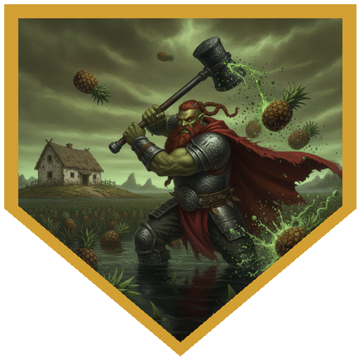
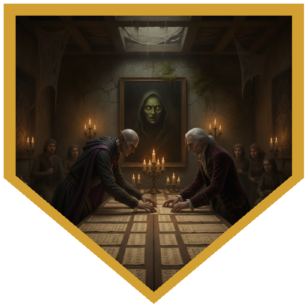
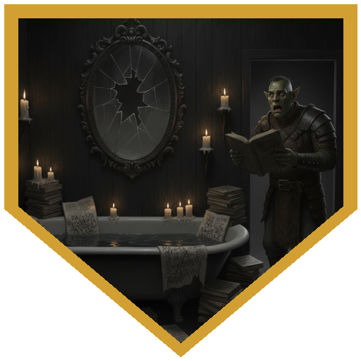
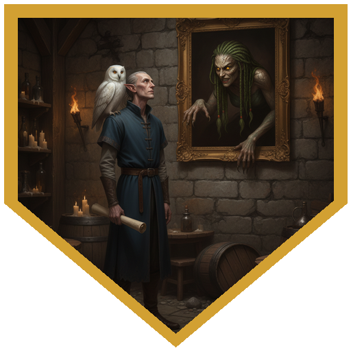
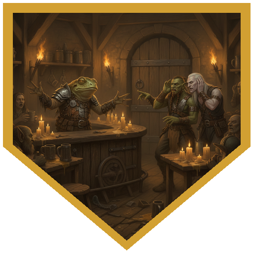

*Played online on Roll20 as the Tier 1 special of the Iuzual Suspects: Return to the Isles convention. Run by Brian.*

The sequel to Mud and Mushrooms opened with four strangers at a virtual table and one table captain, Sam, who volunteered before the introductions were finished. Silef is a Shield Lands sorcerer who used to help people and now wanders doing the same. Longtooth is a dhampir galley cook from the jungles of Amedio, raised to be an undead hunter, who looks like an orc and thinks he is one. Deimos Locke spent seven years as a vampire's thrall, still hears her voice, and now hears another voice promising power through magic (he stressed to Longtooth that he is undead-adjacent, not undead). Logos brought his owl, Phi. Then every table joined the shared audio channel and the admins read out the opening: the sun was gone, a green-brown sky dripped like sludge, and Muckroot's healer, Mother Erisa, her daughter Elenna and the bog witch Madam Emery were circling overhead on twisted black staves, delighted to have been seen at last. The village was a prison, the hags were its jailers, and the only way out was a counter-charm.

The party landed on the edge of a drowned pineapple farm, in front of a pockmarked farmhouse. Phi scouted ahead, and something in the fields lobbed pineapples at Longtooth, who kept failing the Dexterity save and kept taking 5 acid damage. Inside, a locked drawer of a card catalog gave way to Longtooth's crowbar, and the rug on the floor of the upstairs office rose up to smother him. Silef's Vicious Mockery bounced off its immunity to psychic damage. Longtooth's maul hit it for 14, Deimos summoned a glaive, and Logos finished it with an 11-point Fire Bolt. Sorting the scattered cards, Deimos found a dream catcher carved with the names Abacaxi and Applepen, with a note tied to it. Madam Emery arrived with her owl to watch, and the d20 the DM rolled for a random player landed on Deimos, a natural 20: he danced uncontrollably for a round. When the party read out the couplets from the note, the house rumbled, and Emery fled with her hands over her ears. A journal under a squeaky floorboard turned out to be a love story between two employees, "forbidden love" and "duty to company," each of them signing off with a small heart. Out in the flooded rows, the thing throwing pineapples was a water weird. It crushed Deimos for 11 and then 17 cold damage, and Logos's two Thunderwaves ("water pushes very well") shoved it off him both times. Silef's Chromatic Orb, Longtooth's, and a final shot with Logos's help action behind it broke it apart. The haunted-field warning turned up afterward, in the cab of the harvester. In the tiller, Longtooth's Survival found a rock jammed in the wheel, Deimos worked out how to shut the machine off, and Longtooth's crowbar levered the rock out. The wheel came around to show a record of workplace accidents, a heart with initials in it, and a plank reading *16 bushels still in debt*. The table reported the Inspired by Love boon.

Act two took them to the manor house in the middle of Muckroot, where a cypress stood in a flooded courtyard and Issa Rivermane was trying to hold the villagers together. She had found verses carved and scribbled across the building that no one could put in order, and three groups disagreed about what they meant. The tired adventurers, led by a tiefling riverboat captain named Sindroi, wanted a clever leader and did not think it was any of them until Silef's Persuasion came in at 23. The herbalists, led by the dwarf Torga, were hiding something: Logos's Insight check (20) caught two of them avoiding his eyes, and under their feet was a floorboard with a fourth line carved into it. The farmers, led by an orcish farmer, were the friendliest group, and with their sheet music pinned to the wall the table had every quatrain. Elenna's face slid into a painting in the herbalists' room to watch, and Longtooth said "not only is it a hag, it's a nag." His Charisma save came in at 21, and in the washroom later the party found waterlogged romance novels where every heroine's name had been replaced with Elenna's and every man's with "Longtooth." Logos's Investigation (20) found the lever for a trapdoor, which was a bookcase in the library. Below was a cellar with the party's names inked on the wall (Prestidigitation would not clean them off), a stone door that gave way to Longtooth's crowbar on the last of many attempts, and a cell with two chained one-eyed prisoners. The DM mentioned the cell was another table's social encounter, and the party shut the door. Logos's passive Perception found a secret door into a pantry, a cistern, and a kitchen stocked with something labeled honey that nobody trusted. The table's assembled rhyme was close enough to try on Issa, who said it didn't sound quite right. Other tables on Track A had been fighting nothics and a psychic ooze in the same house, and some of them had apparently solved the rhyme already.

Act three began at the Toeless Frog, a tavern perched on a pair of enormous frog legs, which lowered itself to let the party up the porch. A bullywug barkeep stood on the bar fending off stirges with daggers. Silef's Acid Splash hit two of them at once, a stirge crit Longtooth for 14, and Deimos's glaive burned the one on Longtooth off him. Then Elenna swept in, pointed at Logos (Deimos did), and asked him to fail a Charisma save. He rolled a 20, and the offer of a boost, if he'd murder some bullywugs for her, went nowhere. A volley of exploding pineapples left everyone deafened until the attic. Longtooth and Deimos both knew Common Sign Language, and the bullywug barkeep signed back directions, which was how the party got around the back. A real Issa found them in a hallway with a pot of tea (they couldn't hear her, and had a few jokes about her being a hag). Stirges waited in every room. Logos's Shatter killed four of them at once in the room where the others couldn't hear it go off. Longtooth maul'd one on the stairs and Deimos's glaive zapped one on the landing. In the attic Mother Erisa appeared in a window, warned them they'd forgotten where they were, and leapt out through the glass as a phase spider dropped from the rafters. Longtooth's second-level smite and Deimos's Eldritch Blast knocked it off the wall, and one last stirge came in through the window to be flattened. The barkeep, Frognando, wiped his frying pan on a dagger and flung the tavern across town to the square, and the party found a parchment with the last two lines of the counter-charm. Every table gathered in the square, Issa having gone off to create a distraction at the cauldron, and the villagers and adventurers together chanted the whole thing out. Golden light cracked the dome, Emery and Elenna melted into the mud, and Erisa swore the town would meet "a sickening gurgle" before sinking away and leaving her staff behind. The sun came back to Muckroot.

## Player Highlights

<strong><a href="../characters/logos">Logos</a></strong> (Dan) — Rolled 13 and 19 on his Portents before anyone had done anything, and sent Phi to scout the farmhouse. Killed the animated rug with an 11-point Fire Bolt and chalked up the card catalog to "too invested in organizing the fallen cards" to investigate them. Used both Thunderwaves to shove the water weird off Deimos, gave Longtooth the Help action for the shot that broke it, and passed his cup of tea to Silef when Silef was still low. Rolled 20 on Insight to catch the herbalists hiding a floorboard, 20 on Investigation to find the trapdoor lever, and found the cellar's secret door with passive Perception. When Elenna picked him as the smart one and called him unattractive, he rolled a natural 20 on the Charisma save and told her no. Killed a room of four stirges with one Shatter nobody could hear.

<strong><a href="../characters/silef">Silef</a></strong> (Matthew) — The party's talker: Smooth Talker plus a Persuasion of 23 took the riverboat captain from "nope, can't be" to sharing her lines. Opened on the rug with Vicious Mockery, found the journal under the squeaky floorboard, and put a 22-damage Chromatic Orb into the water weird. Splashed two stirges at once with Acid Splash in the tavern. Rolled a 58 on the reward chart for a talking doll.

<strong><a href="../characters/longtooth">Longtooth</a></strong> (Sam Tagliafarre) — Table captain and the party's crowbar. Popped the card catalog, pried the rock out of the tiller wheel with an Athletics 26, and got the stone cellar door open on the last attempt. Took 5 acid damage from two separate pineapples ("I need more pineapple than I deserve"), a 14-damage stirge crit, and an unbroken run of Elenna's attention: called her a nag, passed the save, and found his name in her novels. Smacked the rug for 14, made a second-level smite against the phase spider, and finished the water weird with a Chromatic Orb. Took the Staff of the Adder.

<strong><a href="../characters/deimos-locke">Deimos Locke</a></strong> (JSweat2) — Found the dream catcher, danced for a round on a natural 20 when Madam Emery picked him, and was the water weird's favorite target for 11 and then 17 cold damage while grappled and restrained. Worked out the tiller's shutoff from watching over the others' shoulders (Investigation 18), swatted stirges with a glaive that does radiant damage ("it's a fly zapper"), and put an Eldritch Blast into the phase spider that knocked it off the wall. Pointed at Logos for the smart one when Elenna asked. Predicted the reward chart: "I swear if I get cast-off breastplate, I'm going to throw up." He rolled a 71.

## Achievements

<strong>Pineapple Magnet</strong> — Whatever was throwing pineapples out of the flooded rows at the party aimed at Longtooth, twice, and he missed the Dexterity save both times. He tried slicing the first one out of the air with his battle axe ("Fruit Ninja") and took 5 acid damage anyway. "I'm just an attraction for pineapples."

<strong>Side by Side</strong> — The counter-charm was a rhyme in scraps: carved into floorboards, pinned up as sheet music, tied to a dream catcher, and nailed to a parlor wall. The table gathered all of it from the tired adventurers, the herbalists and the farmers, argued over where "rhyme and time" belonged, and posted its quatrains to the counter-charm channel. It was close enough that Issa was unsure, and close enough for another table to finish.

<strong>She Loves Me</strong> — Longtooth called the hag in the painting a nag and passed her Charisma save with a 21. A few rooms later the party found her romance novels with every hero's name crossed out and replaced with his. Elenna, to the channel: "Love is a lie." Longtooth, to the channel: "Love conquers all."

<strong>Smart, but Not That Attractive Either</strong> — Elenna asked which of them had worked out the counter-charm. Deimos pointed at Logos. She looked him over, told him he wasn't that attractive either, and asked for a failed Charisma save. He rolled a natural 20, and when she offered a boost in return for bullywug blood he didn't take it.

<strong>Frantic Hand Gestures</strong> — A volley of exploding pineapples left the whole party deafened until the attic, so the table fell back on Common Sign Language. Longtooth looked for the bullywug barkeep and made frantic gestures, and the barkeep pointed at the front door and hooked his arm to the right: around the back.

## Rewards

- **Adventure reward** — a choice of **125 gp**, the featured item, or **63 gp plus a random magic item roll**. No Magic Item Rolls; this is a Lordship of the Isles adventure.
- **Featured item: Staff of the Adder** *(Wondrous Item, Uncommon)* — a black twisted staff capped with a carved alligator head with a toothy grin; the head bites and snarls when animated. Mechanically it is the DMG Staff of the Adder.
- **Table choices** — Logos took 125 gp. Deimos Locke took 63 gp and rolled 71 (cast-off breastplate); Silef took 63 gp and rolled 58 (talking doll); Longtooth took the Staff of the Adder.
- **Tea from the Muckroot Teahouse** — a refreshing cup for each character on Track B, acting as a Potion of Healing until the end of the adventure.
- **Boons:** Inspired by Love (reported).
