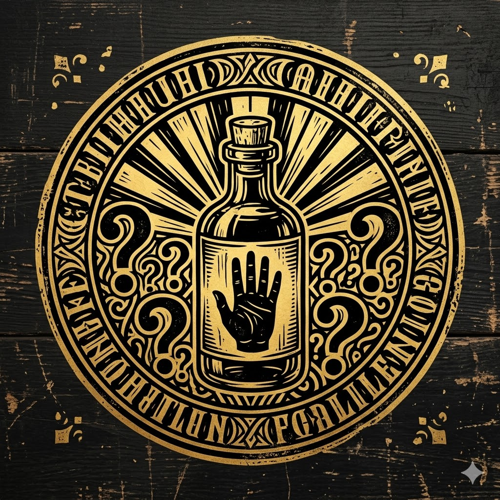
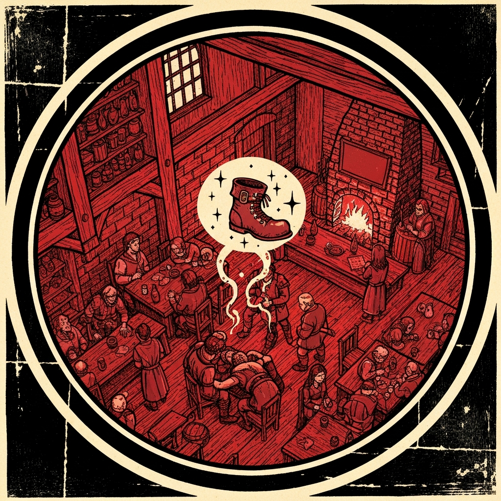
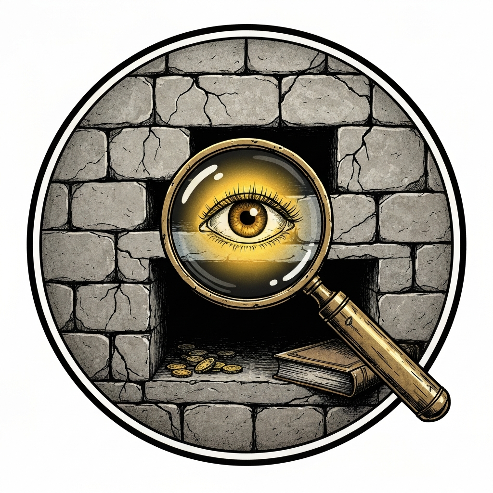
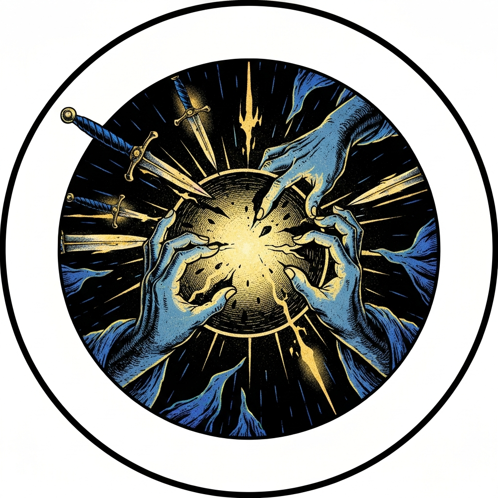
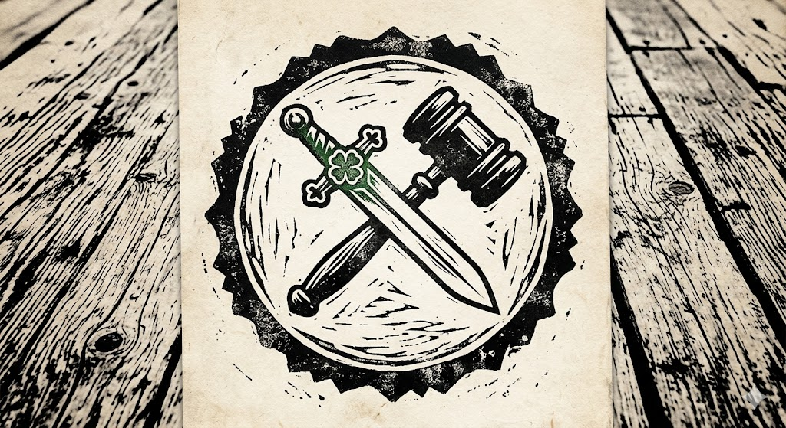

They came to in a tavern that smelled like spilled liquor and copper. Bodies were arranged around them — not piled, but arranged — and everyone was holding something: a dagger, a holy symbol, a pitchfork. The last few hours were simply gone, and the Lethe was why. They had chosen to drink it. Whatever the book had shown them, they had decided together that forgetting was better than knowing.

Sergio Bloodstone came to with them, spun a story quickly, and hired them to find the book — claiming he'd take it to the right people. Two hundred gold each. Nobody argued with the rate, given the bodies.

What followed was an investigation threading through Pandemonium's impossible geography — the House of Late Blessings, Burton's Building Supplies, the Asylum. The clues cohered slowly: six-fingered tattoos pointing to Graz'zt's followers; a woman named Marla Swift Strike who had not drunk the Lethe, and who had used that clarity to take the book before Sergio could reach it; a notebook, a journal, and the shape of a lie assembling itself in reverse. Sergio hadn't been hired to return the book to anyone legitimate. He'd been working for Graz'zt all along.

They found him at the end of it, in a haunted office climbing toward the monstrous thing that had come to collect. Sergio was already being killed for his failure when they arrived — the book lost, the demon impatient, the deal collapsed. The party came out with vital documents and a resolution: the liquor burns, the book is destroyed. They had drunk the Lethe to forget something terrible. It turned out the terrible thing was what they'd been doing before they forgot.

That counts for something. Probably.

---

## Player Highlights

<strong><a href="../characters/sparrow">Sparrow</a></strong> (Michael) — At the Asylum nightclub, a bruised informant spotted the party and bolted into the crowd. Sparrow didn't chase. From thirty feet away she reached out with Mage Hand, tripped him flat on the floor with a sleight-of-hand check of 30, then strolled over and kicked him for emphasis. His response: "I know what you can do. I don't think I'm gonna sleep comfortably for the next month." She also landed the killing blow on the transformed Marla Swift Strike — critical hit, 22+ damage — then turned to the party and deadpanned, "What'd you go ahead and kill her for?"

<strong><a href="../characters/pierce">Pierce</a></strong> (Mike) — When the party found Sergio's apartment and a monstrous abyssal entity standing over his torn-in-half body, Pierce walked in, declared "Begone, foul creature!" and blasted it with Thunder Wave. A 4th-level Spiritual Weapon connected immediately for 18 force damage. When the creature grappled him, he Misty Stepped free as a bonus action and fired a second Thunder Wave. He maintained Spiritual Weapon concentration throughout the whole fight — and his passive perception of 18 is what uncovered Marla's hidden cache behind the wall in the first place.

<strong><a href="../characters/pal-go-lucky">Pal Go Lucky</a></strong> (Don) — The party's moral center and most effective interrogator. After Pierce's medicine check revealed that one of the corpses at Burton's Building Supplies appeared to have been killed by Pal's own weapon during the memory-erased fight, Pal's defense was immediate: "I plead temporary insanity." Sparrow replied, "That's not gonna work. I will call you as a witness at your own trial." He recovered quickly — pressing the surviving henchwoman for the location of 80 bottles of Crème de Léthe and a full list of delivery addresses, handing the party their biggest evidence haul of the session.

<strong><a href="../characters/kenistopheles">Kenistopheles</a></strong> (Ken) — Set the comedic and narrative tone from the opening scene. When asked about the bodies, he explained: "They kept jumping on my trident — they got tired and laid down. They'll probably get up later once they've finished their nap." In the final combat, after rolling badly on a Confusion save and genuinely becoming confused, he announced, "I remember what I was doing now and where I left my car keys" — then spent his entire turn trying to drag the demon into [**Scry**](../characters/scry)'s Cloud of Daggers with his pitchfork, missing twice, and accomplishing nothing. The table found this funnier than any hit would have been.

<strong><a href="../characters/therion-starblade">Therion Starblade</a></strong> (Mark) — Played the group's measured voice of accountability. At every interrogation, it was Therion who pressed for commitment: "We will take your promise that you won't do it anymore, but you have to confess your crimes." In combat, he landed a Nat 1 followed immediately by a Nat 20 on consecutive bow shots in the same turn — one miss, one crit for 14 damage — then ducked back behind the doorframe.

<strong>Scry</strong> (XZ) — The most tactically decisive moment of the final combat. The demon had plunged the room into magical Darkness, repositioning freely while the party fumbled blind. Scry recognized that Dispel Magic at 3rd level automatically strips any spell of 2nd level or lower — and Darkness is 2nd level. One cast and the darkness was gone. Cloud of Daggers followed immediately. The party's response: "Brilliant." He also rejoined the game mid-session after an actual home power outage, which the table handled with more grace than Pandemonium deserved.

---

## Achievements

<strong>We Chose to Drink It for Science</strong> — When asked to explain how the party ended up passed out in a tavern surrounded by cult bodies and empty bottles of memory-erasing Crème de Léthe, Kenistopheles's answer was: "We said 'for science' and then we downed it." The DM replied, "I couldn't understand your method, because anything you'd learn from that you'd lose the memory of." Awarded to the most committed empiricists in the planes.

<strong>The Boot Remembers</strong> — Sparrow rolled a 30 to trip a fleeing informant from thirty feet away using Mage Hand, without moving from her spot. The informant, flat on the floor: "I know what you can do. I don't think I'm gonna sleep comfortably for the next month." She then walked over and kicked him. For emphasis.

<strong>Oh My Gosh, Pierce</strong> — Pierce's passive perception of 18 located Marla Swift Strike's hidden cache — the journal, the book, the coins — without him even looking for it. The DM's exclamation says it all: sometimes the best investigator in the room isn't trying. Awarded for the most elegant contribution to the investigation.

<strong>Lights On</strong> — The demon had filled the room with magical Darkness. Scry noted, calmly, that Dispel Magic automatically removes any spell of 2nd level or lower and that Darkness is 2nd level. One cast. The darkness ended. Cloud of Daggers followed. Party reaction: "Brilliant." Awarded for the right answer at the right moment.

<strong>I Plead Temporary Insanity</strong> — Pierce's medicine check confirmed that one of the corpses at Burton's Building Supplies appeared to have been killed by Pal's own weapon. During the session where the whole party was memory-wiped. Pal's legal strategy: "I don't remember. I plead temporary insanity." Sparrow: "I will call you as a witness at your own trial." Awarded to Pandemonium's most creative legal mind.

---

## Rewards

- **Gold**: 350 gp
- **Downtime**: 10 days
- **Advancement**: level (optional)
- **Streaming hours**: 2
- **Potion of Greater Healing**
- **Ioun Stone of Awareness** *(rare, requires attunement)* — a dark-blue rhomboid that orbits your head, granting advantage on Initiative rolls and Wisdom (Perception) checks.

  This particular stone has something extra inside it. From the handout:

  > This crystal contains a secret, cursed by an unknown being of terrible power and influence: a secret that can warp the minds of those who hear it and tear their bodies asunder. A secret so powerful it couldn't be destroyed; only trapped in this crystal. You think it's probably safe to have on your person. What could possibly go wrong?
  >
  > *Secret Message.* When you hold this crystal to your ear, you think you hear snatches of the maddening secret it contains. If some unknown condition is met, the secret in its entirety might be retrieved from the crystal. Until that happens, it is completely inert and harmless.
