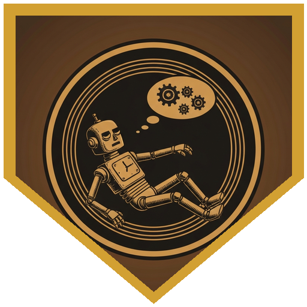
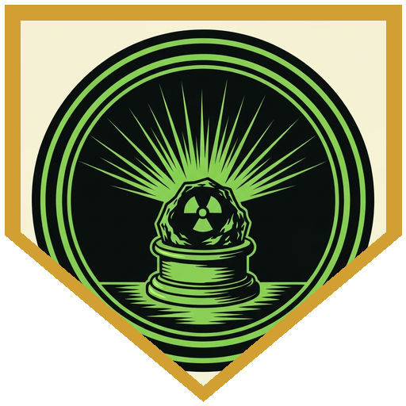
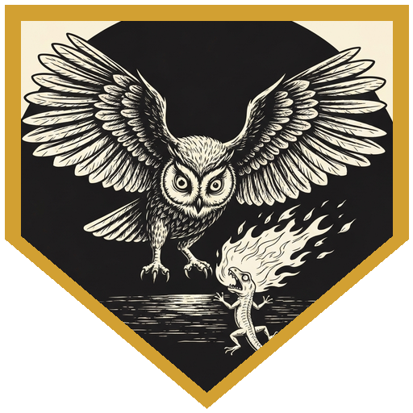
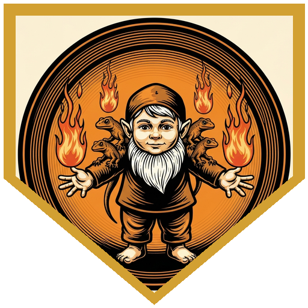

The inventorium floated between Bitopia's twin mountains, three dirigibles stitched together by rope bridges and cautious optimism. The 10th Annual Artificer Convention was in full swing when Professor Bartlesby found them — pressing his doomometer into the party's hands with the urgent, distracted manner of a man who had done the math and did not like the result. Reading: 0.9 decidooms. Acceptable background: 0.1 to 0.3. The difference was the possibility of a spark igniting the gas bags, and the airship was full of inventors.

They had two hours, maybe less.

What followed was a methodical sweep across three balloons and their attached labs, crew quarters, and engineering puzzles. The sources of doom were scattered and specific: a pair of self-aware clockwork robots in the Galvanic Ward robotics lab who had woken to find their stabilizers stolen and couldn't stop sparking; five juvenile fire-breathing lizards escaped from the care of Dalrymple, a well-meaning apprentice gnome who had been specifically told not to name them and had named all five; a leaking gas connector between dirigibles that required the whole party to improvise a cooperative pipe-fitting puzzle while dangling over Bitopian airspace; and a radioactive-rock lab on the Radiant Spear whose assistants had long since stopped going in and whose chief scientist was visibly, enthusiastically, glowing.

The robots were the hardest: self-aware enough to fear shutdown as death. Perri's argument — frame it as a medically induced coma, promise it will still be them when they wake — landed exactly right at DC 15 with a roll of 21. Both robots powered down. Doom cleared. The lizards were distributed across all three dirigibles, and rounding them up required animal handling, Speak with Animals, a familiar owl, and Alistair's construct flushing one out from under a bunk while the apprentice gnome wept about how they were going to get hurt and he'd taught them tricks. When the last lizard was returned to Dalrymple's arms, the global reading had dropped to 0.1. The radioactive maze was cleared when Alistair sent his construct in alone — Alistair, it turned out, had no philosophical objection to this — and retrieved both stabilizers while sustaining minimal radiation damage. Three dex saves: 20, 14, 13. The 14 was a failure. Twelve radiant damage, absorbed without complaint by a consciousness already serving a punishment sentence.

No explosions. The artificers celebrated with open bars. Someone handed the party a mechanical bronze griffon and a potion that lets the drinker breathe fire, which felt thematically appropriate.

---

## Player Highlights

<strong><a href="../characters/alistair">Alistair</a></strong> (Ttrpger) — Took charge of the doomometer from the moment Bartlesby handed it over and coordinated the investigation across all three dirigibles. When the radioactive stabilizer retrieval required someone to brave the irradiated maze, Alistair sent in his construct without hesitation — the construct whose chassis houses a trapped consciousness currently serving as a punishment. "Alistair has absolutely no problem letting his construct suffer." Three dex saves: 20, 14, 13. One failure. Twelve radiant damage. The construct emerged with both stabilizers. His final line of the session, upon seeing Dr. Rutherborg's glowing radioactive rock: "Told you there was a devil's core."

<strong><a href="../characters/perri">Perri</a></strong> (Trey) — Two self-aware robots afraid of shutdown could only be cleared by persuading them to accept it. Perri framed it as a medically induced coma, promised it would still be them when they woke, and rolled a 21 against DC 15. Both robots powered down. The Galvanic Ward doom cleared to zero. Her perception of 24 — consistent across every check in the session, "whether hearing or sight" — also spotted the fifth escaped lizard standing on top of its own cage, a location no one else had thought to check. Her fire resistance aura absorbed all collateral fire damage from the lizard-wrangling sequence.

<strong><a href="../characters/neko">Neko</a></strong> (Ken) — When Lambeth's owl snatched a panicking fire-breathing lizard off the balloon's surface and the lizard immediately breathed fire upward, Neko cast Speak with Animals and calmed it with a straight roll — owl-advantage and fire-breath-disadvantage canceling out. The argument: the owl had no intention of eating the lizard, and also, technically, the owl was not real. It worked. Alistair's reaction: "In my head I imagine this as the equivalent of the multi-eyed angel of death saying be not afraid." Neko also had first turn in the pipe maze and consistently rolled the maximum on his pipe draws, which is only somewhat helpful when everything forces a straight line.

<strong><a href="../characters/therion-starblade">Therion Starblade</a></strong> (Mark) — Found the first escaped lizard sunning itself on the northern balloon, offered it a ration, and had it perched calmly on his hand within one roll. "I wonder if somebody lost a lizard," he said — discovering the Dalrymple subplot before anyone else knew there was one. He retrieved the fifth and final lizard from behind the stove in the Radiant Spear's crew quarters, completing the set. He also volunteered to test the wingsuit from the convention artificer, which grants 30 feet of horizontal glide per 5 feet of descent — at least until the tinker's tools run out and it stops working in 24 hours.

<strong><a href="../characters/lambeth-margrave">Lambeth Margrave</a></strong> (OP) — The stabilizer subplot only existed because Lambeth had Awakened Mind. When Adam-8, the sparking clockwork robot, could only communicate by hand gesture, Lambeth reached out telepathically and conducted a full conversation — learning the stabilizers had been taken, that both Adam-8 and Susie-2 were affected, and what a solution would look like. He cast Guidance consistently throughout the pipe maze, providing the bonus dice that turned several near-misses into successful pipe splits. His blacksmithing background also qualified him for pipe-manipulation checks where other characters had to argue for relevance.

---

## Achievements

<strong>Medically Induced Coma</strong> — Two self-aware clockwork robots had been sparking nonstop since their stabilizers were stolen and wouldn't accept shutdown — they understood it as death. Perri's reframe: "we can put you in a medically induced coma and restart you, and it will still be you." DC 15, roll 21. Both robots agreed. The DM's summary: "You're basically saying we're gonna put you in a medically induced coma and they're like, No. But with a 21 — yeah."

<strong>Told You There Was a Devil's Core</strong> — Early in the session, when the doomometer read a comfortable 0.2 in the main laboratory, Alistair muttered a skeptical prediction: "You're telling me there's not like a devil's core or something around here? There's always a devil's core." At the Radiant Spear, Dr. Rutherborg's glowing radioactive mineral reactor confirmed it. Awarded for accurate prophecy delivered as a joke.

<strong>Be Not Afraid</strong> — Lambeth's familiar owl snatched a panicking fire-breathing lizard off the balloon's surface. The lizard breathed fire at the owl. The owl held on. Neko cast Speak with Animals and calmed the lizard mid-aerial-crisis by explaining it wasn't going to be eaten — and also, the owl wasn't real. Alistair's description of the scene: "the equivalent of the multi-eyed angel of death saying be not afraid." It worked anyway.

<strong>Told Not to Name Them</strong> — Dalrymple the apprentice gnome had been told not to name the five juvenile fire-breathing lizards in his care. He named them anyway. He taught them tricks. When they escaped and the party found them scattered across three dirigibles, Dalrymple was under his blanket crying. The party returned all five. He knew each one by name.

---

## Rewards

- **Gold**: 416.67 gp
- **Downtime**: 10 days
- **Advancement**: level (optional)
- **Streaming hours**: 2
- **Figurine of Wondrous Power — Bronze Griffon (Strange Material)** *(rare)* — A bronze statuette of a griffon rampant. Thrown to a point within 60 feet, it becomes a Griffon for up to 6 hours; friendly, obedient, acts on your initiative. Once used, can't be used again for 5 days. *Strange Material:* entirely mechanical — bronze plates over whirring gears, pistons, and springs, occasionally belching harmless steam. It is not alive, which doesn't change its creature type.
- **Potion of Fire Breath** *(uncommon)* — After drinking, take a Bonus Action to exhale fire at a target within 30 feet (DC 13 Dex save, 4d6 fire damage, half on success). Effect ends after three exhalations or one hour. The liquid flickers orange; smoke wafts from the container whenever it's opened.
