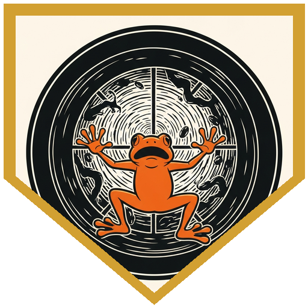
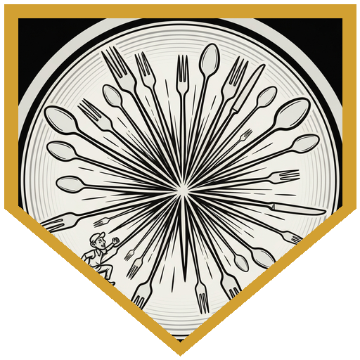
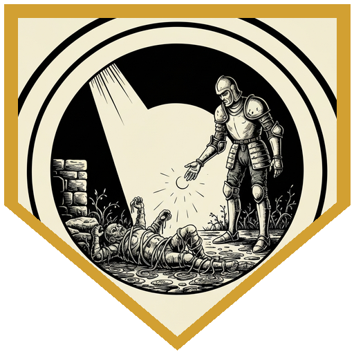

The restaurant was inside a spelljammer — three decks of curved walls, plush carpet deep enough to swallow a hand, and long windows that looked out into the formless stuff of Limbo, where earthbergs dissolved into living flame that became clouds of mechanical butterflies that rained down as diamonds, endlessly, against the glass. The 10th-anniversary pub crawl had brought a small group of nobles aboard for something exclusive. They got it.

A grung warned them in a hurried whisper before anyone had a chance to order a drink. The crew had been replaced by imposters — members of a cult who believed the Petraki frog-people were the progenitors of the Slads, and that this ancient lineage entitled them to become Slads themselves. The method involved hostages. Twelve of the Nameless Voyager's crew had been held for twelve days, injected with Slad tadpoles, and kept below decks while the grung ran the restaurant under cover. The grung who warned them didn't want to become a Slad. She just didn't think anyone should have to die for it.

She was dragged off while they were on the upper decks.

The Nameless Voyager ran on a Gith-built spelljammer drive — a 20-foot lump of black material humming with barely restrained power. Getting to it required hacking through four consoles, each written in a different language, while security drones and animated swords materialized from the walls and tried to put the whole thing to a stop. The hacking was systematic: one console suppressed the defense gas, another killed the drones, a third opened the blast doors, and the fourth shut down the drive entirely. Each required an Arcana or Investigation check while everything else in the room tried to end the attempt. Pierce, Hedy, Therion, Sparrow, and Pal all took turns at the consoles between rounds of combat. Matrim sent his familiar cat to hack the matrix. The cat failed its first attempt and succeeded on the second.

When the drive went offline, everything not bolted down went flying — plates, glasses, cutlery, the grung themselves. All twelve cultists on the upper decks were killed within moments. The four pub crawlers had the presence of mind to hide behind the bar. The party made their way up through a cascade of debris and into the bridge, where the last of the grung were mid-transformation. They finished what was started: a fireball from Hedy at the fifth level, Alcor dropping spike growth across the deck, Pierce flying up with Spiritual Weapon while Toll the Dead cleaned up the last resisting grung. The gold-skinned grung who led the cult finished his transformation into a Slad as he died. His armor — made from the hide of a green Slad — hit the floor.

The hostages were in bad shape. Twelve days of captivity and the tadpoles in their systems had left them exhausted. Pierce diagnosed the condition and applied Greater Restoration. They would be fine. A glowing portal tore open, lined with energy, and the assembled survivors — mixed-riff crew, pub crawlers, disaffected cultists including the one who had warned them — stepped through back into Sigil, stumbling as gravity reasserted itself. All of them had briefly forgotten how walking worked. The pub crawlers seemed to be taking it the best.

One of the party remembered, before leaving, that it was still a pub crawl. They stayed long enough for a drink.

---

## Player Highlights

<strong><a href="../characters/pal-go-lucky">Pal Go Lucky</a></strong> (Don) — Pal opened every encounter with diplomatic honesty of varying accuracy. At the first locked hatch, he climbed up and told the grung guard that they absolutely had permission to be up there and had been specifically requested. The DM ruled this was deception, not persuasion, and asked him to roll accordingly. On the second locked hatch, when a grung challenged what business they had in the reactor room, Pal simply bought time with a lucky-point advantage roll while someone else hacked the console. When a grung critted him on the bridge stairs, he used his guardian emblem to reduce it from 22 to 12 — exactly equal to his temporary hit points. He also distributed four-leaf clovers to everyone at the table at the start of the session, especially the new ones.

<strong><a href="../characters/pierce">Pierce</a></strong> (Mike) — Pierce opened the final phase of the engine room fight by casting Twilight Sanctuary, giving everyone in his 30-foot radius 12 temporary hit points, then took Steps of Night to fly up and position himself. He hacked one of the consoles — suppressing the defense systems enough to halve the damage from the poison gas — and ended the engine room with Mass Healing Word for 11 to everyone who needed it. On the bridge, he flew in, cast Toll the Dead on the wounded Slad, and followed with a level-5 Spiritual Weapon for 30 force damage. His diagnosis of the hostages — Slad tadpoles, treatable with Greater Restoration — closed the mission cleanly.

<strong><a href="../characters/matrim">Matrim</a></strong> (Trey) — Matrim arrived as the session's most-traveled pub crawler, having been to every prior plane with this or similar groups, trailing a Sphinx familiar and a growing reputation for creative resource use. In the engine room, he sent his cat familiar to hack a console — "it's arcane capable," he noted, as if this were obvious — and the cat succeeded on its second attempt, shutting down one of the three security systems. He spent the reactor fight bouncing between Eldritch Blasts and bardic action management, keeping his Aberrant Spirit Slad up and fighting while working around the damage resistance. His suggestion to throw a fireball up the ladder before everyone climbed was vetoed by Hedy. She then threw the fireball herself two rounds later.

<strong><a href="../characters/hedy">Hedy</a></strong> (Gon) — Hedy was the engine room's primary console hacker and the reason the party got through the blast doors at all. At the first locked hatch, she hard-cast Comprehend Languages, read the Gith writing, and used Arcana with guidance for a 20 to open it. In the engine room, she hacked three of the four consoles — the security drones, the defense systems, and finally the main drive itself — using Arcana checks of 36, 18, and others, with her owl Alley providing Help action advantage. She also used her diviner's portents to guarantee a failure on one of the larger enemies. The session's decisive blow was hers: a 5th-level fireball that hit two transforming grung, rolled 33 damage, and dropped one outright. Then she turned invisible.

<strong><a href="../characters/therion-starblade">Therion Starblade</a></strong> (Mark) — Therion spent the engine room fight hacking consoles, taking a crit reduced to 10 damage by his guardian emblem, and surviving a lightning floor trap with a successful save. On the bridge, he fired a True Strike arrow into the grung on the ladder for 29 damage and Action Surged to take out the last one before anyone else could reach it. He also suggested using the destroyed animated swords as door jams to prop the blast doors open, which was accepted immediately and worked. The party recovered the sword fragments afterward as salvage.

<strong><a href="../characters/sparrow">Sparrow</a></strong> (Michael) — Sparrow moved through the engine room's confined curved space with practiced ease, opening with a 26 to hit that became a crit — 38 damage to the helmed hoarder on the first swing, followed by a dagger for a two-for-one clear. She ended the combat by using a luck point on Investigation to shut down the last console, which caused the fourth hidden console to appear in the middle of the room. She also picked all six of the crew's locked boxes in the quarters level with a single roll of 35, noting it was nearly impossible to fail. The boxes held 250 gold in crew savings and enough makeup to assemble full disguise kits. The party did not use the disguise kits.

<strong><a href="../characters/alcor">Alcor</a></strong> (XZ) — Alcor introduced himself as a Stars Druid-for-hire, a freelancer. He opened the engine room fight in Starry Form: Archer, casting Guiding Bolt for a crit of 23 radiant damage, then using the Luminous Arrow follow-up from Starry Form to add another 15. In subsequent rounds he deleted two animated swords with a pair of ranged attacks — 9 and 11 damage — and provided the Guiding Bolt advantage to other attackers. On the bridge, he dropped Spike Growth across the whole deck before anyone climbed the ladder, dealing 2d6 per movement to everything on the floor. He also had the idea to use inspiration before the last roll of the engine room and took it.

---

## Achievements

<strong>All for a Cult</strong> — A sympathetic grung, hopping nervously between tables, explained in a hurried whisper that the restaurant's crew had been replaced by a cult of frog-people who believed they were descended from the Slads and wanted to become them via human sacrifice. She added: "I used to listen to them, but the hostages sort of convinced me otherwise." Then she hopped away before anyone could ask a follow-up question. Matrim summarized the situation: "They're high, right? They're just cuckoo for Cocoa Puffs?"

<strong>Everything Not Bolted Down</strong> — Hedy's final console hack shut down the spelljammer's drive. The engines went offline. Everything on the ship not bolted to the floor — plates, glasses, cutlery, twelve grung — went flying simultaneously. The cultists were killed by their own restaurant within moments. The party was told to make dexterity saves as they ran through the debris. The pub crawlers had already hidden behind the bar. Nobody had told them to. They just knew.

<strong>Slad Tadpoles</strong> — The twelve hostages had been held for twelve days and were in obvious distress. Pierce ran a medicine check and delivered the diagnosis: Slad tadpoles, injected. Greater Restoration could cure it. He cast it. They were cured. The mission's final complication was resolved with a single spell and a DC that wasn't even contested. The party had spent four hacked consoles and two full combats getting to this moment, and the ending was quiet.

---

## Rewards

- **Gold**: 357.14 gp each
- **Downtime**: 10 days
- **Advancement**: level (optional)
- **Streaming hours**: 3
- **[Plate, +1](https://www.dndbeyond.com/magic-items/5092) — Strange Material** *(rare)* — This armor has been fashioned from the hide of a green slaad. Its durability is unaffected. The armor includes a helm made from the head of the slaad, which sits loosely on your own head. Provides a +1 bonus to AC. It belonged to the cult leader. He no longer needs it.
