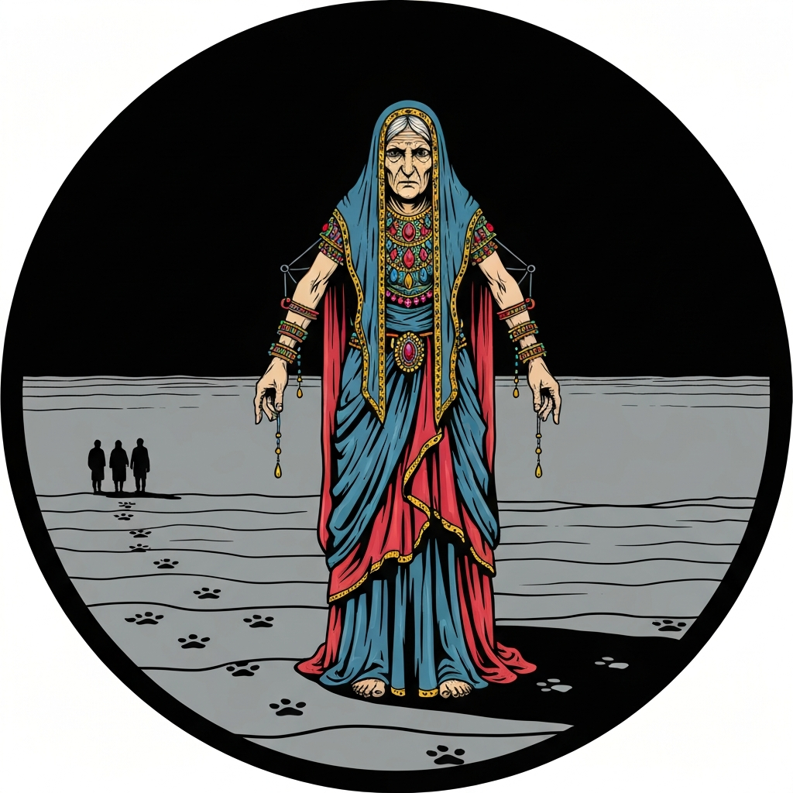
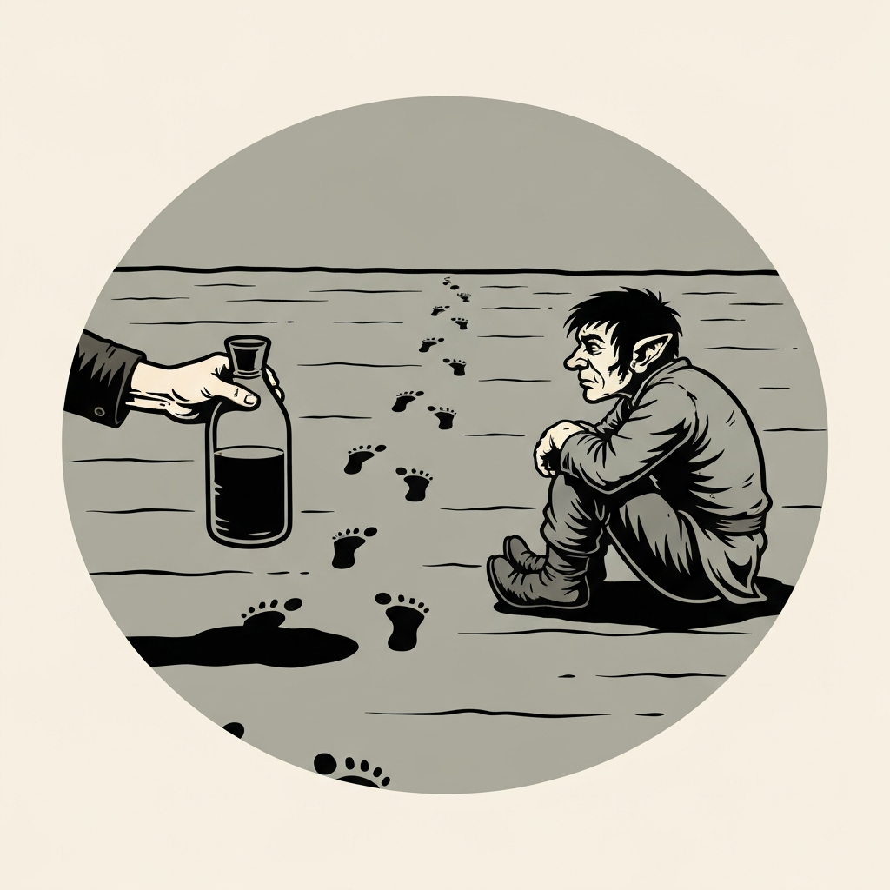
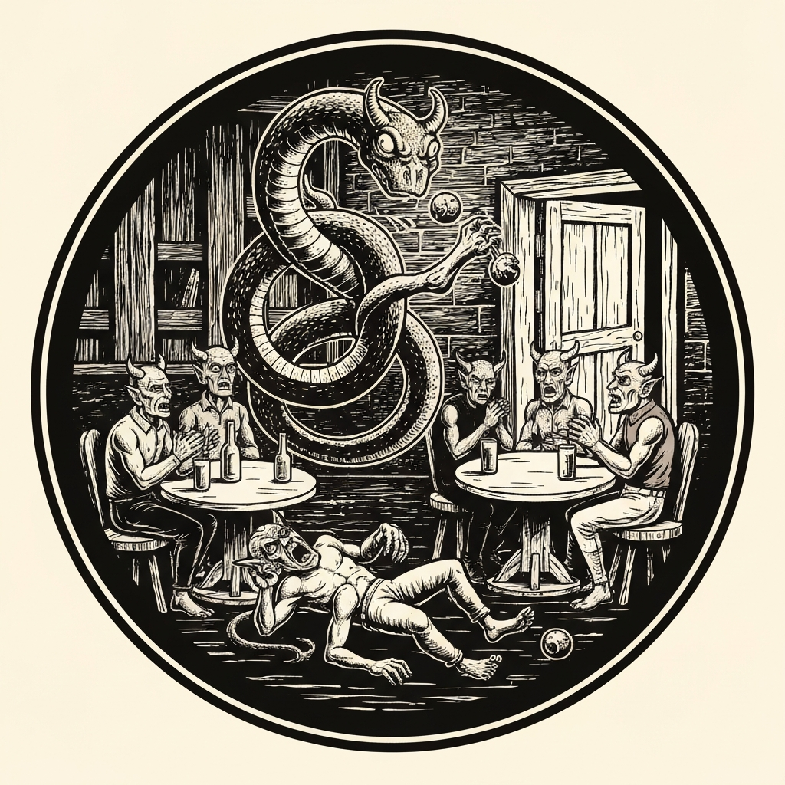
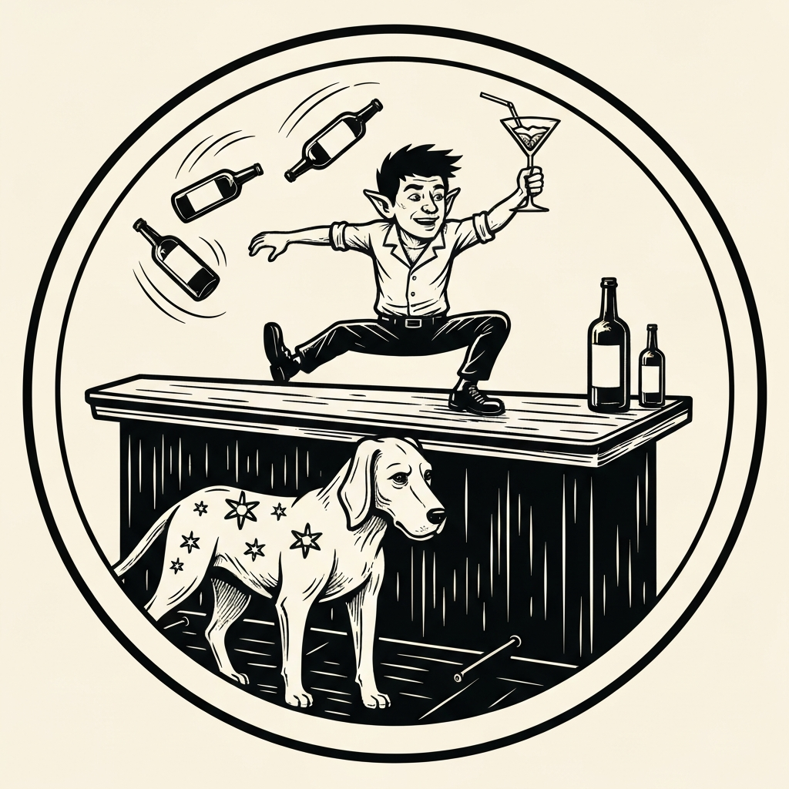
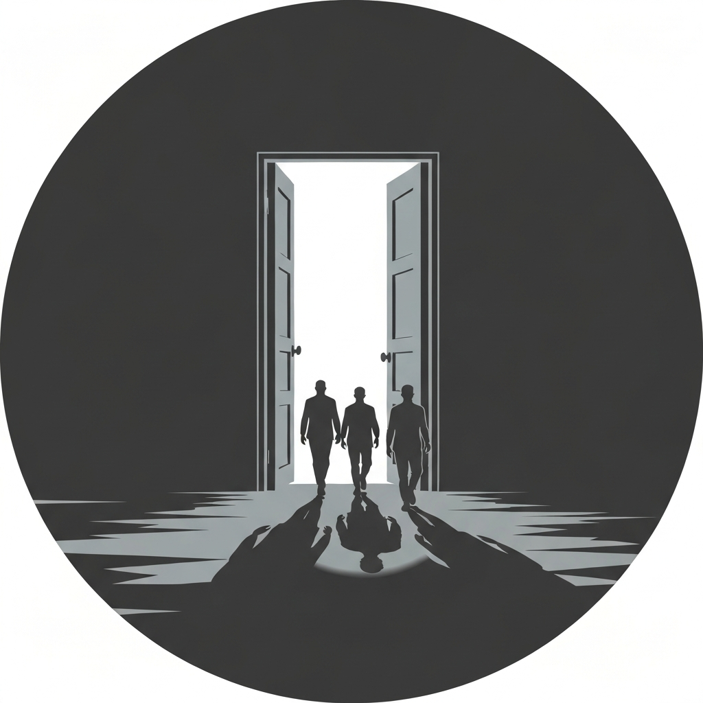

They stepped through the portal expecting a dining room and found themselves buried up to the neck in gray sand. Everyone dug out to the same view in every direction: flat gray desert, gray sky, gray horizon. The only thing that wasn't gray was a halfling at the end of a long trail of footprints — well-dressed once, but the color had drained out of him. His name was Erasmus. He was the captain of a riverboat called the Queen of Souls, run aground somewhere back along those prints, and he had been walking for what felt like years looking for anyone who hadn't given up yet. Perri told him they had not. Waffles put his nose down and started following the trail back.

Three days through the gray waste. Hades works on you slowly — the Grays, that ambient despair that leaches conviction out of anyone who lingers — and the five pub crawlers complained every single day with remarkable dedication. Perri walked back and forth among them performing, keeping the tone light, escalating his targets as the DCs climbed from 10 to 14 across three nights and making every single one. Pierce provided create food and water so the group had something to eat that wasn't sand. On the second night, a figure approached out of the gloom: an old woman, strong and built, draped in jewels and vibrant colors unlike anything else in Hades, whose hands were attached backwards at her wrists and whose tracks were paw prints though she had no visible paws. She was a Rakshasa — Madame de Trolley — and she collected what the Grays took. The five larval creatures squirming in her backpack with human faces on them had been Erasmus's crew. She gave the party three riddles: what's a glove, what's time, what's a tongue. They answered all three. Satisfied, she handed them a scroll of tongues — of little use to her nature — and told them that when they decided to lay down, she would come back. They declined to lay down.

The Queen of Souls was exactly where Erasmus's footprints started: a 120-foot paddleboat wedged against the Styx's bank, gold fittings still sparkling, ten sailors sprawled across the deck like clocks that had stopped. The gash in the hull took three people casting Mending in rotation for about an hour. Carpenter's tools were attempted; the bar is high and mending spells are lower. Getting the boat off the bank was a different problem — a combined strength of 150 — and every body counted: the party, Waffles, the re-motivated sailors (Perri had rolled a 21 to get them back on their feet), Erasmus. It totaled exactly 150 on the nose. Then Perri drank a storm giant potion and pushed it to 169, and after eight minutes of swearing and frustrated heaving, the Queen of Souls was floating.

Two hours down the River Styx, a squad of devils and a pack of demons both boarded the neutral vessel separately, and Erasmus asked the party to tend bar. Nobody said no. Hedy deployed an Unseen Servant that glided invisibly between cellar and table with wine bottles and a complete absence of personality. Pierce Misty Stepped between deliveries. Perri mixed a cocktail with a performance roll of 25 — the full Tom Cruise scene, table-hopping, flying wonder as assistant — and Lidnerae retrieved bottles from the wine cellar on back-to-back investigation checks. Zac, who has the charisma of a Menzoberranzan street fighter, attempted a performance cocktail on a five, spent his Tactical Mind to reroll, and critted. Adtic, positioning near table four to run the relay, stepped in when a collapsed demon was blocking foot traffic: wild-shaped into a jaculi, coiled around the fiend, and threw him bodily through the door and into the River Styx. The demon's companions cheered. The chain devil, who had been explicitly told he was not expected to tip, reached into his chains and tipped anyway. Five drink orders. Zero diplomatic incidents. The rage meter never peaked.

Erasmus produced a battered tinderbox from somewhere on his person — a cheap thing, but bearing the image of a pomegranate. He held it to the door on the upper floor and the door swung open onto blinding color. They stepped out of the grey light of Hades into Sigil and felt the weight of whatever had been sitting on them just fall away. It was only Sigil. It was the best anyone had felt in days.

---

## Player Highlights

<strong><a href="../characters/pierce">Pierce</a></strong> (Mike) — The session's most dedicated courier. Once Zac mixed a cocktail or Lidnerae surfaced from the wine cellar, Pierce was usually the one taking the handoff and getting it where it needed to go — Misty Stepping across the bar to reach table seven when no one else had the movement for it, burning a bonus action to teleport back, and resetting for the next relay. He made his own drinks too, mixing the white lady using his arcana modifier when the order called for an arcana check and nobody else had a better number. Outside the bar, he sustained the whole party through create food and water across three days of desert travel — the logistical foundation that let Perri focus entirely on morale. He also answered the second riddle ("time") quietly, before anyone else had spoken.

<strong><a href="../characters/perri">Perri</a></strong> (Trey) — The session's load-bearing morale officer, lead bartender, and riddler. During three days of gray desert travel, Perri walked the pub crawler convoy back and forth keeping spirits up with escalating performance checks — DC 10, 12, 14 across successive nights — making every one. When Madame de Trolley appeared and demanded they prove they still had their wits, Perri answered the first riddle (a glove) and pointed at Waffles's open, panting mouth to solve the third (a tongue). In the bar scene he rolled a 25 on the hot sin cocktail — earning a DM comparison to the Tom Cruise bartending movie — then jumped onto the table to hand the drink to his flying wonder for delivery. A 21 persuasion check earlier had re-motivated Erasmus's despairing sailors to help push the Queen of Souls off the bank. He also contributed 19 strength plus a storm giant potion, the margin that pushed the group from exactly 150 to 169.

<strong>Zac Valor</strong> (Mark) — A drow from Menzoberranzan who rejected cruelty, found a portal to Sigil, and is now serving cocktails to Blood War participants aboard a paddleboat on the River Styx. He attempted the hot sin cocktail with a carpenter's-tools intelligence check, scored a 10 against a high target, and failed — but kept his Tactical Mind for the next attempt, where he rolled a 5, spent Tactical Mind, and critted. The drow street fighter makes drinks by sheer stubbornness.

<strong>Adtic</strong> (Ttrpger) — A dhampir druid covering Alistair's regular spot, new to the pub crawl, "just happy to be along for the ride." When the bar scene assigned him to table four and he couldn't reach the bar efficiently, he positioned himself as a relay runner — then pivoted entirely when a fiend collapsed on the floor at table one and started irritating the neighboring customers. Adtic wild-shaped into a jaculi, coiled around the fiend, and threw him through the door into the River Styx. Both demons and devils stopped complaining long enough to applaud. The chain devil, who doesn't tip, tipped.

<strong><a href="../characters/hedy">Hedy</a></strong> (Gon) — Prepared her Unseen Servant before the bar scene started — "I can cast before the combat" — and used it to cover table deliveries as a bonus action throughout the challenge, freeing her physical turn for wine cellar investigation checks. The Unseen Servant's delivery style: invisible, silent, impeccably snobbish. She also pre-rolled her portents for the session and had her owl Alley available for Help action advantage. Her diviner instinct about low rolls being useful was correct almost every round.

<strong>Lidnerae Starfarer</strong> (Brainarius) — An astral elf war cleric of Corellon Laurentian, described as having been drinking somewhere in Wild Space and gotten pulled along. In the bar scene she handled back-to-back wine cellar investigation checks — a 16 and then a successful follow-up — emerging with the right bottle both times. The DM noted she had a couple of nervous moments getting it into the glass. It got into the glass.

---

## Achievements

<strong>You've Kept Your Wits</strong> — Madame de Trolley appeared on the second night, hands on backwards, paw prints behind her in the sand, backpack full of larval former-sailors who had not kept their wits. She was a Rakshasa, and she collected what the Grays took. She gave the party three riddles before she'd move on without collecting anything: a glove, time, a tongue. They answered all three. Her parting assessment: "Rarely do you end up leaving with your wits. But you have them for now." She then gave them a scroll of tongues, noted it was of little use to her, and walked back into the gray.

<strong>Three Days of Perri</strong> — Surviving the Grays required a daily performance check to keep the party — and five complaining pub crawlers — from losing morale entirely. The target climbed from DC 10 to 14 across three consecutive nights. Perri made every one, walking the convoy back and forth, telling jokes, and keeping the tone light in a plane designed to make everyone give up. The pub crawlers survived mentally intact and complained regardless. That was the ceiling and also the goal.

<strong>150 on the Nose</strong> — Getting the Queen of Souls off the riverbank required a combined strength total of 150. With every conscious body contributing — party members, Waffles, Erasmus, and the re-motivated sailors — the tally hit exactly 150. The DM paused. Then Perri drank a storm giant potion, pushed it to 169, and after eight minutes of frustrated heaving, the paddleboat slid back into the Styx. "150 on the nose," the DM noted, still slightly amazed.

<strong>Tom Cruise Scene</strong> — When the hot sin cocktail required a DC performance check, Perri rolled a 25 — twice the target. The DM ruled he had "pulled off the entire scene from that Tom Cruise movie." He then jumped onto the table, used ten feet of movement to reach the next table, and handed the completed cocktail to his flying wonder for final delivery. "Coyote Ugly, maybe?" someone suggested. The DM accepted the comparison. It was delivered.

<strong>Fiends Don't Tend to Tip</strong> — Erasmus had made this clear at the outset: fiends don't tend to tip, that's just the way they are. The chain devil, having heard this same briefing, waited until Adtic wild-shaped into a jaculi and threw a collapsed demon bodily through the cabin door into the River Styx — then reached into his chains and handed over a Ring of Protection. The demon's companions cheered. Erasmus looked like he had reconsidered his understanding of fiend economics.

---

## Rewards

- **Gold**: 116.67 gp each
- **Downtime**: 10 days
- **Advancement**: level (optional)
- **Streaming hours**: 2
- **Scroll of Tongues** — Given by Madame de Trolley, who noted that her nature made it of little use to her. She did not elaborate on what her nature was, but she had hands on backwards and left paw prints.
- **Ring of Protection (Guardian)** *(uncommon, requires attunement)* — +1 to AC and saving throws. Minor property: if you are not incapacitated when you roll initiative, you gain +2 to the roll. The ring is tarnished — its metal has the grey-stained look of something that spent time in Hades. The chain devil gave it as an unsolicited tip.
