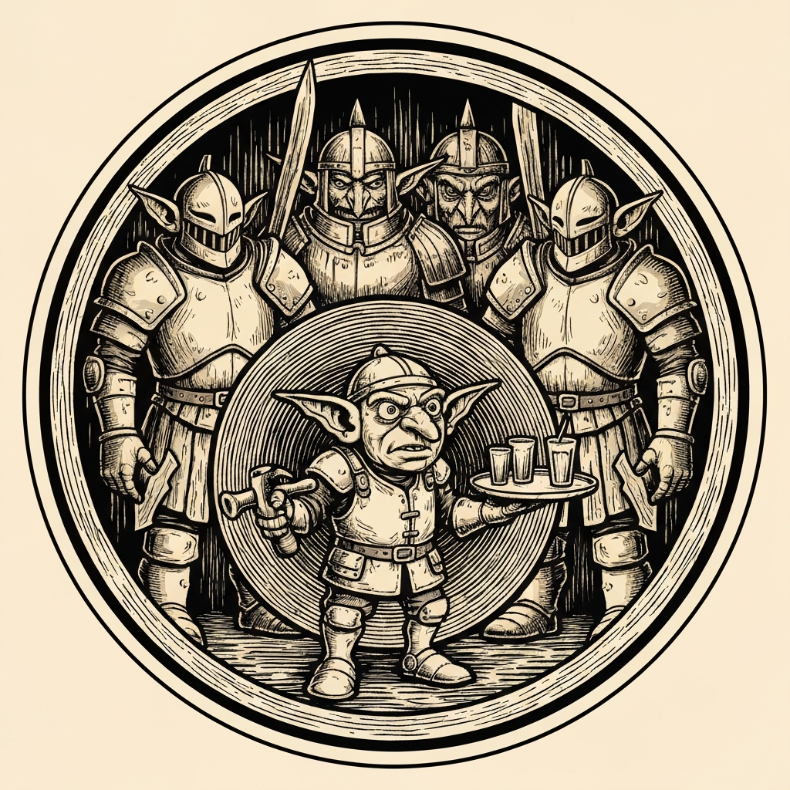
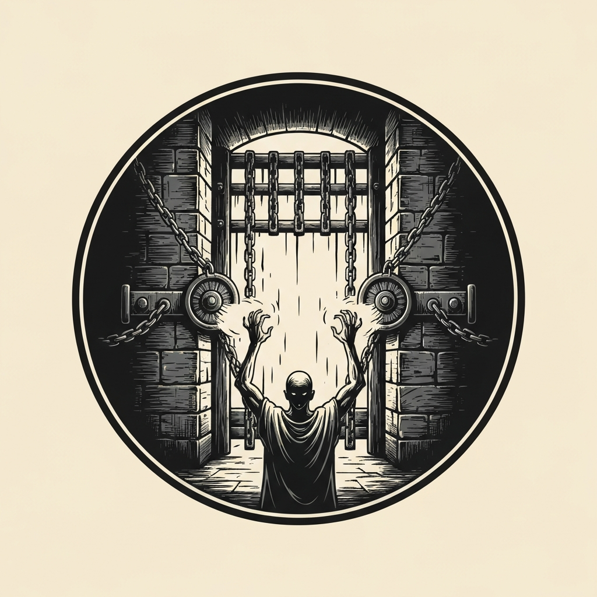
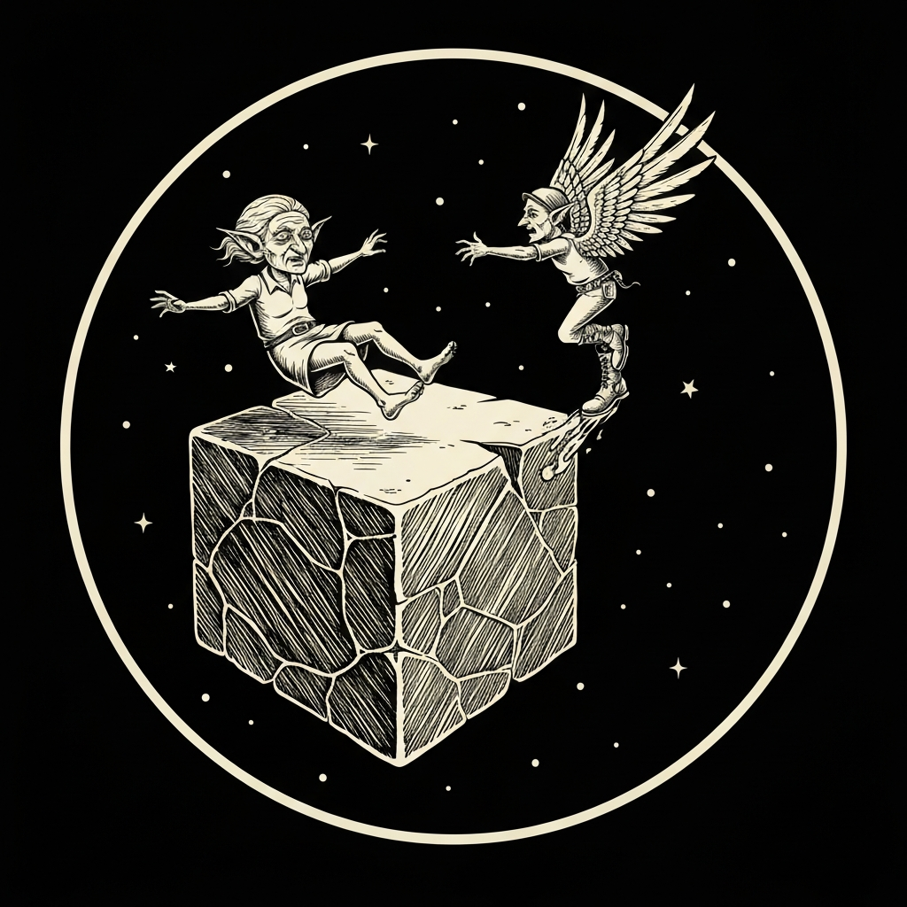
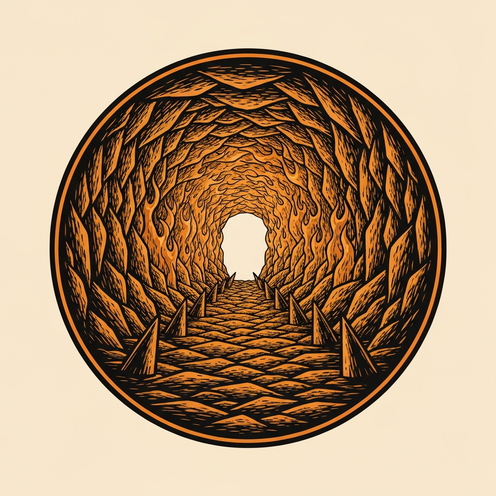
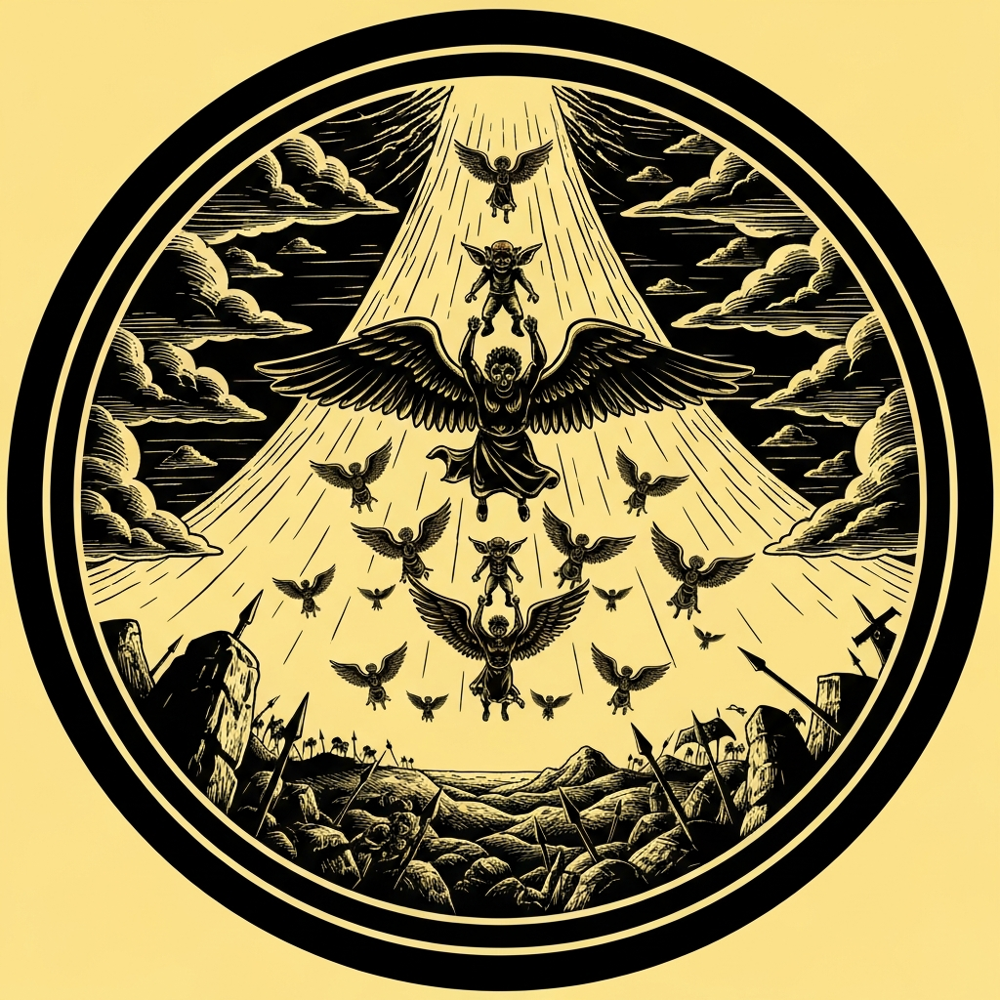

The pub crawl arrived at the City Armory in Sigil's Ladies' Ward and slipped through a side door glowing with otherworldly light — and stepped out into Archeron, the eternal battlefield of Clangor, surrounded by hobgoblin soldiers with crossbows leveled. Warlord Yarvik Bonegrinder smoothed things over with surprising hospitality, escorting the party and five well-heeled pub crawlers into a marble-and-gold officers' lounge — a fountain bleeding red wine into its basin — before delivering the actual proposition: the pub crawlers were here to fight, whether they'd signed up for it or not. A goblin server, hands shaking as he poured drinks, admitted the truth under questioning: he'd been a shoemaker in Sigil who died without ever worshipping Maglubiyet, and woke up here as a "petitioner" anyway — one of roughly twenty non-believer goblins stuck in Archeron's endless war, with no way home and no second chances if they died again. The hobgoblins offered the party 500 gold to escort all twenty across the battlefield to a hidden, unguarded portal in a distant cave.

Of the three routes out — a guarded gate, a sealed ventilation shaft, or a sewer — the party picked the gate, betting on stealth over crawling through latrines. Sparrow scouted ahead under Pass without Trace, then traded places with Xavius via Misty Step so Neko's Silence could mask the gatehouse winch from the garrison entirely. Neko leaned into his Githzerai "portal cracker" instincts — at the DM's suggestion this somehow extended to gate mechanisms too — and a generous +5 bonus turned a fumbling first attempt (a 13, just enough for five quiet but unproductive minutes) into a clean success on the retry. The drawbridge and portcullis dropped without a sound, past three hobgoblins so institutionalized they'd forgotten how the controls even worked. Pal's pangolin mount Peppy ferried the goblins and pub crawlers across the moat in relays while Pal lent his strength to the lift.

The hours-long trek across the floating battle-cube had its own hazards. A fragment of a shattered neighboring cube came crashing down nearby, and while most of the party found cover, the goblin Burke stumbled and was left behind — Peppy doubled back and snagged him just ahead of the impact on a clean Athletics 19. At the cube's literal edge, where gravity quietly flips and the world just ends in open sky, an elderly goblin everyone called Grandma stepped over with a little too much spring in her step and began drifting off into the void; Xavius burned a charge of his winged boots to fly her back down. Further on, the party passed a goblin memorial — armor and weapons hammered into a rough goblinoid shape, names written in blood, coins left by the dead's comrades as they passed. The party left coins of their own and felt the warmth of a Bless that would last the rest of the adventure. At the cave, Neko's portal sense confirmed the hidden portal — but it led back to the Material Plane, a route closed to petitioners who'd already died once. One panicking goblin bolted for it anyway, and Pal tackled him down (Athletics 16) before he could throw away whatever afterlife he had left.

With the goblins delivered and the 500 gold paid, the hobgoblin commander made one more ask: hold the cave while the five pub crawlers and the goblins sought help through the portal. After a round of negotiation that devolved gloriously into threats of lawyers and slander suits (with the 500 gold conveniently equal to "a lawyer's fee"), the party chose to stay and fight. Spike growth carpeted the approach outside the cave — Mattrum's attempt to reinforce it with plant growth was foiled by a reminder that the cube was solid rock with nothing to grow — and the first wave of hobgoblin warriors walked straight into it, taking 44 damage before Mattrum's quickened fireball finished the job. An ogre with a battering ram smashed Peppy to the ground in two hits, but not before Sparrow's readied arrow landed a 22-damage sneak attack and Xavius's thrown trident toppled it. Neko repositioned his Moonbeam to plug the hole the ogre had punched in the cave wall, turning it into a new chokepoint, while Pierce floated the idea of Divine Intervention to drop a Leomund's Tiny Hut over the whole party. A second wave broke against a second quickened fireball — DC 19, and every last one of them failed. Then the war horns sounded: a dozen planetar angels descended through a rift in the sky, routed the hobgoblin army, and carried all twenty rescued goblins off to Mount Celestia for a fresh start. The party claimed the defeated Yarvik Bonegrinder's Flame Tongue Whip and stepped back through the cave portal to Sigil, where after Archeron's endless battlefield, the noise of the city felt almost peaceful.

---

## Player Highlights

<strong><a href="../characters/neko">Neko</a></strong> (Ken) — When the gate's lever-and-winch puzzle stumped the party on the first try (a 13, just enough for five loud-but-quiet minutes), the DM ruled that "portal cracker" instincts could stretch to fortress gates too — and handed over a +5 bonus "for the portal cracker that deserves some love this adventure." The retry sailed past the DC. Later, Neko's portal sense found the cave portal with no ambiguity at all ("It's right there. Like, seriously.") When the ogre's battering ram punched a new hole in the cave wall, Neko relocated Moonbeam to plug it, turning a breach into a chokepoint.

<strong><a href="../characters/pal-go-lucky">Pal Go Lucky</a></strong> (Don) — Spent the session as the party's conscience and muscle. He tried (and failed) to get the noble pub crawlers excused from the fighting, then organized the goblins for the crossing instead. When the falling cube fragment threatened to leave the goblin Burke behind, Pal sent Peppy back for him — a clean Athletics 19 grabbed Burke just ahead of the impact. Later, when a panicking goblin bolted for a portal that would mean his final death, Pal tackled him down with an Athletics 16. He also left coins at the goblin memorial alongside the rest of the party, earning the group a session-long Bless.

<strong>Xavius Fairgate</strong> (Patman) — New to the table and immediately useful. When the elderly goblin called Grandma stepped over the edge of the cube with a little too much enthusiasm and started drifting into the void, Xavius burned a charge of his winged boots and flew up to bring her back down. In the cave fight, his readied tridents found the ogre battering ram — one throw landed a Topple (DC 16 strength save) for 11 damage, helping turn the beast around before it could finish off Peppy.

<strong><a href="../characters/mattrum">Mattrum</a></strong> (Trey) — Won the cave fight more or less single-handedly. After standing up from a 23-damage hit that knocked him prone, he quickened a fireball that "cleared the field" against the first wave. Mid-fight, he burned a spell slot to refuel his sorcery points via a Magic action, then quickened a second fireball against the next wave — DC 19, and every last hobgoblin warrior failed. His sphinx familiar, reflavored for the night as "a big cat that's actually small," spent the early trip yelling course corrections at Pierce ("no, the other left").

<strong><a href="../characters/sparrow">Sparrow</a></strong> (Michael) — Did the legwork, literally. Her stealth check (a base of 30, plus assists) got the whole crossing past the garrison without a sound, and her investigation rolls drove the gate puzzle even before Neko's portal-cracker bonus sealed it. In the cave fight, she readied a bow shot with Steady Aim against the ogre battering ram and landed a 22-damage sneak attack — 9 from the arrow, 13 sneak — softening the ogre right before it went down.

<strong><a href="../characters/pierce">Pierce Watterson</a></strong> (Mike) — Spent the early battlefield crossing eating ice cream out of his Chest of Preserving and brewing tea, fully committed to the pub crawl premise even mid-warzone. When the cave fight got serious, he floated using Divine Intervention to drop a free Leomund's Tiny Hut over the party — an idea so good the table briefly worried it would trivialize the fight before everyone realized the goblins and the enemy could still get at each other around it.

---

## Achievements

<strong>I Was a Shoemaker in Sigil</strong> — The goblin pouring drinks in the hobgoblin officers' lounge wasn't a true believer — he never worshipped Maglubiyet, never asked to die in someone else's war, and never asked to wake up in Archeron afterward either. "I was a shoemaker in Sigil. I'm not supposed to be here." About twenty goblins shared his predicament: trapped petitioners with no faith to bring them back if they died again. Awarded for the line that turned a pub crawl into a rescue mission.

<strong>The Portal Cracker Gets His Due</strong> — Neko's first attempt at the gatehouse winches managed only a 13 — five loud minutes of trial and error. The DM, deciding a Githzerai's portal sense could stretch to "basically a portal" gate mechanisms, handed over a +5 bonus "for the portal cracker that deserves some love this adventure." The retry blew past the DC, and the gate opened in total silence.

<strong>Grandma Takes Flight</strong> — At the literal edge of the floating battle-cube, where gravity quietly reverses and the world just ends, an elderly goblin everyone called Grandma stepped over with a little extra spring in her step — and kept going, drifting helplessly toward open sky. Xavius burned a charge of his winged boots and flew up to retrieve her before she vanished into the void for good.

<strong>The Correct Answer to the Exact Problem</strong> — A field of spike growth outside the cave entrance dealt 44 damage to the first wave of charging hobgoblin warriors before Mattrum's quickened fireball finished them off. A second wave met a second quickened fireball — DC 19, and every single one of them failed the save. The DM's verdict: "This is the correct answer to the exact problem."

<strong>Twenty-Two to the Ogre</strong> — An ogre wielding a battering ram smashed Pal's mount Peppy to the ground in two hits. Before it could press the advantage, Sparrow's readied arrow — Steady Aim plus a sneak attack — landed for 22 damage, and Xavius's thrown trident toppled it outright. The ogre never got a third swing.

---

## Rewards

- **Gold**: 375 gp each
- **Downtime**: 10 days
- **Advancement**: level (optional)
- **Streaming hours**: 2
- **[Flame Tongue Whip](https://www.dndbeyond.com/magic-items/5386-flame-tongue)** *(rare, requires attunement)* — Taken from the defeated Warlord Yarvik Bonegrinder. On command, the whip's lash bursts into flame, dealing an extra 2d6 fire damage on a hit and shedding bright light in a 40-foot radius. This one glows distinctly red whenever goblins are near.
