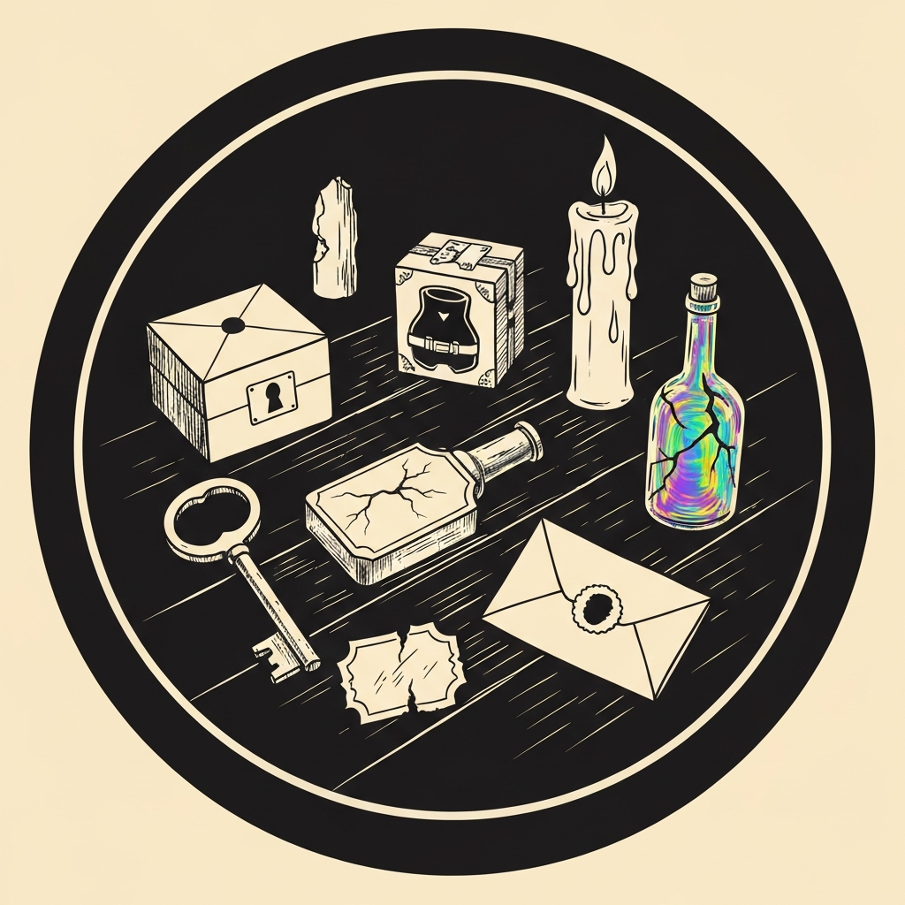
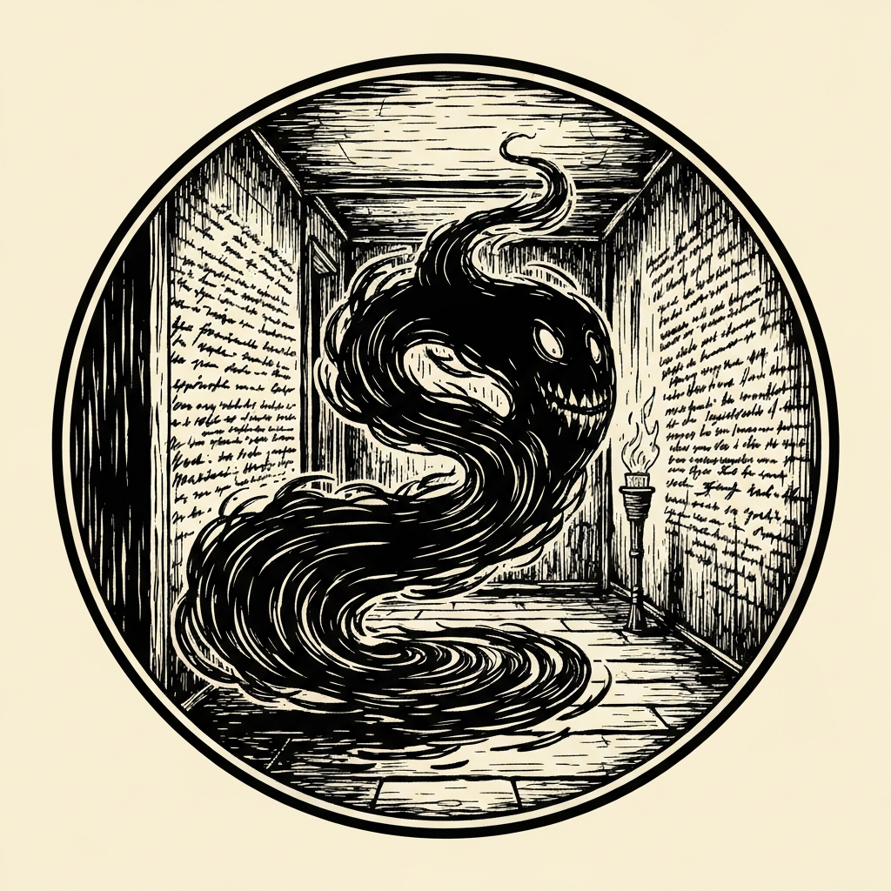
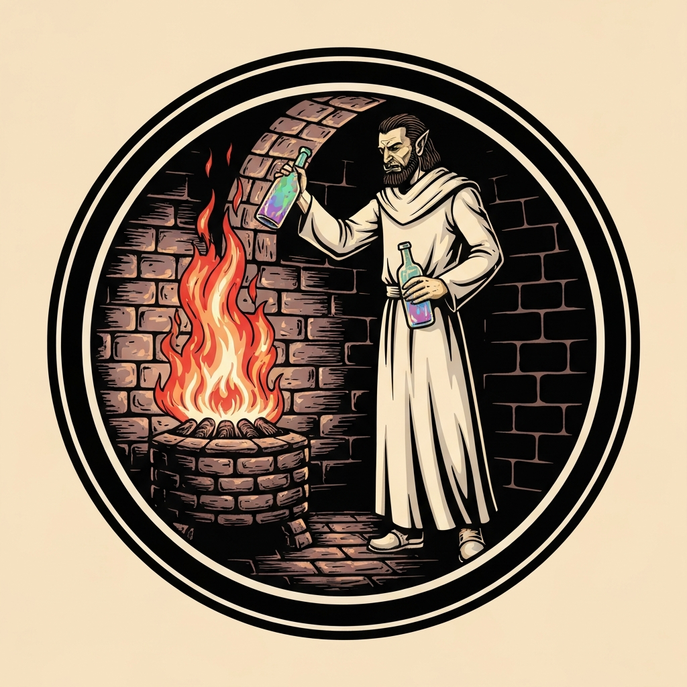
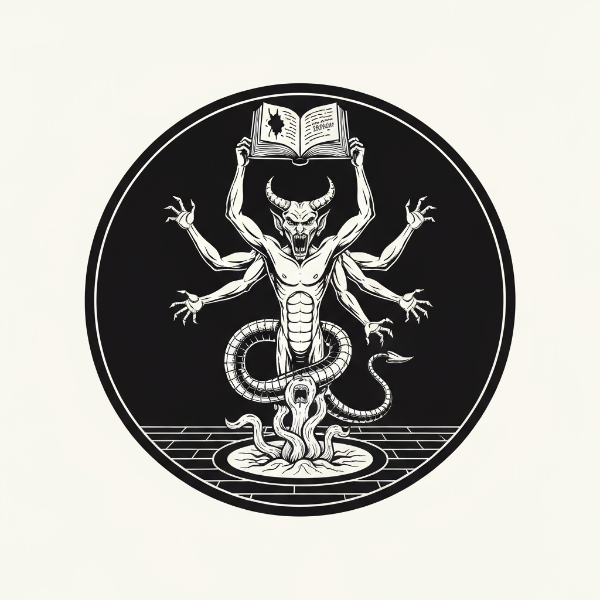
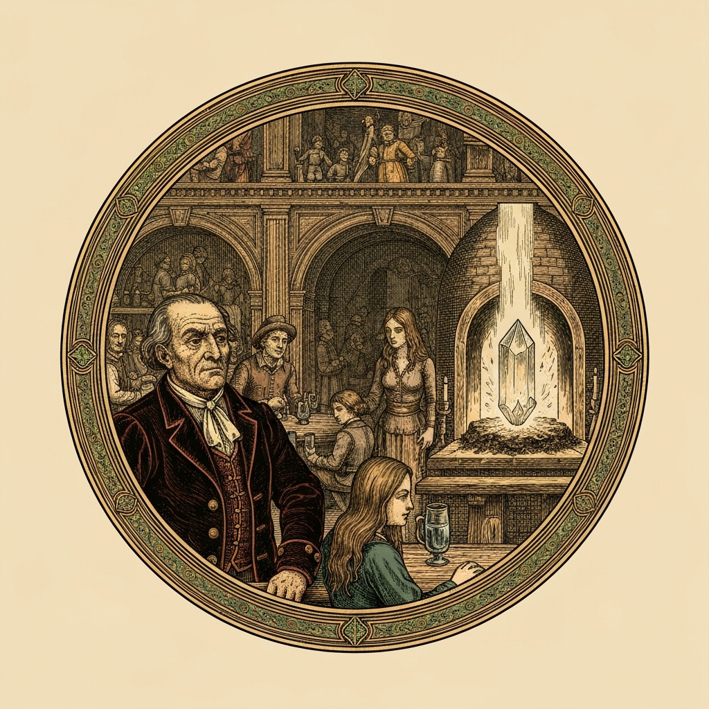

The pub crawl's latest stop delivered the party into consciousness the hard way: flat on the floor of a ruined tavern in Pandemonium, four d12 damage each, surrounded by corpses bearing the marks of their own weapons. None of them could remember anything past the last time they'd slept. A stranger named Sergio Bloodstone was in the same state — a private investigator hired to track a dangerous book, he assumed he'd hired them and offered two hundred gold for anything they could find. He left for his office, and the party took stock of the clues they'd been found clutching: Tarik had a key, Xavius a cheap tinder box stamped with a straitjacket and the words *The Asylum*, Alistair a torn bottle label scrawled with *Burton's Building Supplies, five bells, ask for Boars Bremen* — it was now seven bells — Vexal a bottle of Crème de Léthe, and Hedy a letter from one Varus Lightfeather, cleric of Ilmater, asking for help with a problem in the Madhouse. Outside the door, Pandemonium's deafening winds could be heard rattling the windows. Alistair conjured candle wax earplugs from his tinker's tools before anyone set foot outside.

At the House of Late Blessings — a maze of mismatched rooms overflowing with the mad, injured, and blank-eyed — Varus Lightfeather filled them in. The Crème de Léthe contained distilled essence of the River Styx. People drank it without knowing what it was; those who drank it repeatedly had gone mad or died. Xavius had encountered the Styx's effects before, in Hades — the recognition landed the moment Varus named it. Varus offered five gold per recovered bottle and two hundred gold to find the source, and had an initiate cast cure wounds on anyone still injured. Next stop: Burton's Building Supplies, two hours late.

The warehouse had the same look as the tavern — a dozen corpses with wounds matching their own weapons, a front office nailed shut, and a back office where Boars Bremen lay dead at his desk. The wounds on Boars were different: claw gauntlets, the signature weapon of the Mercy Killers, a Sigil faction that pursues criminals across the planes. A barely-conscious tiefling named Absolution was the only survivor, having been paid to tail Marla Swiftblade on Boars' behalf. She swore off the work immediately and was left to find her own way out. In the corner of the back office, a three-foot crate held eighty bottles of Crème de Léthe.

The Asylum Club looked like a warehouse and felt like one too: deep shadows, black curtains, bards playing deafeningly loud while the crowd danced in dark red and black. On the way there, shifting gravity sent a barrage of rocks skittering across the street — Dex save DC 13, 25 damage on a fail. Inside, Tarik's passive perception of 21 caught a bruised man with a bloody nose trying to duck out the back. They caught him. He confirmed that earlier in the forgotten evening the party had already roughed him up and told him to stop selling the Crème de Léthe here. Marla Swiftblade, the bartender Shenila Moonshadow explained, was a Mercy Killer who had been investigating Boars' operation; the party had joined forces with her after their earlier visit. Shenila pointed them to Marla's apartment near the Citadel — blue door.

They arrived to find Marla had become an Allip: a creature of black mist floating over a puddle of black ooze, howling in a frantic female voice. She begged them to run, warned them the book had taken her mind. Hedy went first. A Psychic Lance struck the Allip — "It is not immune to psychic," the DM observed with some surprise, "considering it is a creature devoted to psychic damage" — dealing 25 damage and leaving it incapacitated. Tarik finished it with two sword strikes, and it dissipated, looking at peace. The walls were covered in writing Marla had scratched with her own dissolving body: Sergio had stolen the book from the Faded Fashion, who had been keeping it locked away because of how dangerous it was. The party had joined forces with her to confront him. When Sergio read the book aloud, everyone was affected. The party drank the Crème de Léthe to save themselves. Marla had chosen instead to hide the book and sacrifice herself so Sergio couldn't retrieve it.

Sergio's apartment held the final scene. The Marilith demon — sent by the demon lord Graz'zt, whose agent Sergio had been — had already arrived. Sergio had been torn in half for delivering nothing. Animated flesh constructs rose from the summoning circle on the floor. Hedy's Synaptic Static hit every enemy in the room (DC 20 Intelligence, all failed), muddling their attacks and checks. Vexal killed two constructs back-to-back. Tarik's Hollow Warden feature fired a reaction strike every time the Marilith hit an ally. Alistair landed twice with a Shining Smite. The Marilith's six attacks, hampered by disadvantage, connected only twice before Tarik finished it on his second round — twenty-four to hit for eighteen, twenty-three to hit for seventeen — and it returned to the Abyss.

The book and all eighty-plus bottles went into the furnace in the cellar of the House of Late Blessings. Everything burned. Everything except the book's secret, which refused to be destroyed and formed instead into a crystal. The Bleak Cabal offered it to the party to keep and guard: an Ioun Stone of Awareness with a Secret Message property — the book's forbidden contents, sealed inside, whispering to whoever carries it, trying to convince them to crack it open and release what should not be heard. The party walked out of Pandemonium with 480 gold each, a clean memory of a night they hadn't wanted to know about, and a contained catastrophe orbiting someone's head.

---

## Player Highlights

<strong><a href="../characters/tarik">Tarik</a></strong> (TreyM) — Set the pace on both encounters. His passive perception of 21 — the highest at the table — spotted the bruised Asylum Club dealer trying to slip out the back before anyone else noticed him, triggering the chase and delivering the key lead about Marla's location. In the Marilith fight, his Hollow Warden feature turned every hit the demon landed into a free reaction strike back: the DM noted the party shouldn't have to know what the monsters do, but they definitely felt it here. Finished the Marilith with two consecutive hits on the second round.

<strong><a href="../characters/xavius-fairgate">Xavius Fairgate</a></strong> (Patman) — When Varus named the River Styx as the source of the amnesia, Xavius was the one who'd actually been there. He'd encountered the Styx's effects on an earlier pub crawl and recognized the mechanism immediately, confirming the scope of the problem before Varus had to explain it. He also spent three Luck points across the session pushing through the deafening winds — "I'll spend a luck point because this is important" — and landed the toppling strike on the Marilith (DC 16 strength save, which it failed) after Hedy's Synaptic Static opened the door.

<strong><a href="../characters/alistair">Alistair</a></strong> (Ttrpger) — When the party realized they'd have to walk through Pandemonium's deafening winds between every location, Alistair's solution was immediate: his Tinker cantrip produces candles, candles produce wax, and wax in the ears is a practical solution. He fabricated earplugs for the whole party, giving advantage on Con saves against the wind for every crossing that followed. In the Marilith fight, he opened with Shining Smite and hit twice; his steel defender, fielded throughout, completed his action economy.

<strong><a href="../characters/hedy">Hedy</a></strong> (Gon Prie) — Carried both combats. Against the Allip, she went first, drove a Psychic Lance through a creature the DM hadn't realized was vulnerable to psychic damage, dealt 25 damage, and left it incapacitated for Tarik to finish in the same round. Against the Marilith and its flesh constructs, she opened with Synaptic Static — DC 20 Intelligence save, every enemy in the room failed — muddling the entire encounter. She spent her last Portent die to push a strength save past the Marilith's grapple attempt. Her owl Alley provided Help action advantage for the final round's attack rolls.

<strong><a href="../characters/vexal-shadeprowler">Vexal Shadeprowler</a></strong> (MarkD) — Woke holding the bottle of Crème de Léthe, which turned out to be the most immediate piece of evidence. In the Marilith fight, he opened with Hunter's Mark on one of the animated flesh constructs and killed it with a 26-to-hit strike; bonus action off-hand into the adjacent construct, 26 to hit, killed that one too. Against the Marilith on the next round, he added Dreadful Strike for psychic damage on a successful hit — nine slashing plus six psychic — and passed the strength save versus grapple.

---

## Achievements

<strong>Your Drink Count Comes with a Body Count</strong> — The party woke in one location surrounded by corpses bearing wounds from their own weapons, found another such scene at Burton's Building Supplies, and pieced together that the same thing had happened at the Asylum Club before they could remember it. The DM's summary of the evening so far: "Your drink count comes with a body count."

<strong>Not Immune to Psychic</strong> — When Hedy opened the Allip encounter by casting Psychic Lance, the DM checked the stat block and found something unexpected. "It is not immune to psychic, which surprises me," he said. "Considering it is a creature that is devoted to psychic damage." The save failed. The Allip took 25 psychic damage, was incapacitated, and was finished off before it could act.

<strong>I Already Told You</strong> — The bruised dealer at the Asylum Club had already been roughed up by this exact party earlier in the same forgotten evening. They caught him slipping out the back a second time. His defense: "I gave you the note, I told you where to go, I don't know what else you want from me." Vexal's response: show him the bottle of Crème de Léthe again and let him draw his own conclusions. His answer: "I'm not in this business."

<strong>She Kept the Book Safe</strong> — Marla Swiftblade chose not to drink the Crème de Léthe when Sergio read the book aloud. While the party wiped their memories and lived, she held onto hers — and onto the book — as her mind came apart. She hid it in her apartment and inscribed everything she knew on the walls with her own dissolving body so someone would be able to read it. The party found her as an Allip, still trying to warn them away.

<strong>The Secret Stubbornly Refuses to Burn</strong> — The party threw the book and eighty-plus bottles of Crème de Léthe into the furnace at the House of Late Blessings. Everything burned. The book's secret didn't. As the furnace roared, a crystal formed around the forbidden knowledge, intact and whispering. The Bleak Cabal handed it over: an Ioun Stone of Awareness that tries, every time, to convince whoever carries it to crack it open.

---

## Rewards

- **Gold**: 480 gp each
- **Downtime**: 10 days
- **Advancement**: level (optional)
- **Streaming hours**: 2
- **Ioun Stone of Awareness (Secret Message)** *(uncommon, requires attunement)* — Recovered from the furnace of the House of Late Blessings, where it crystallized from the remnants of a book that should not be read aloud. Normally, an Ioun Stone of Awareness prevents its wearer from being surprised. This one also carries a Secret Message property: the book's forbidden contents, sealed inside. The stone whispers to whoever bears it, trying to convince them to crack it open. Until then, it is harmless. The Bleak Cabal's advice: don't.
