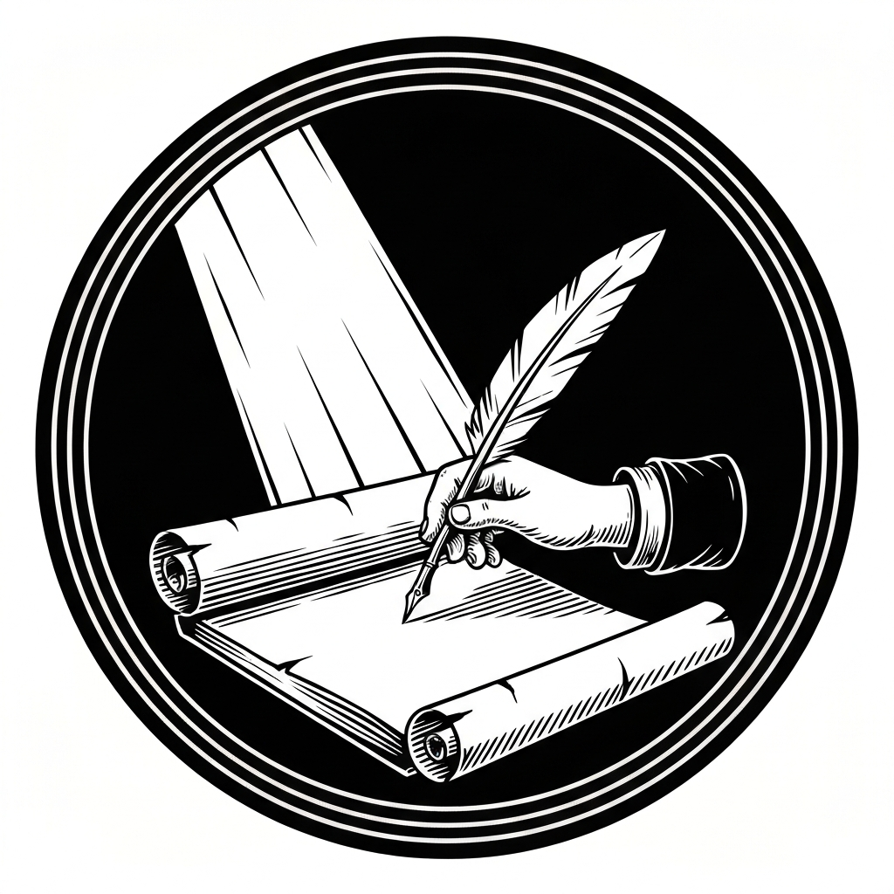
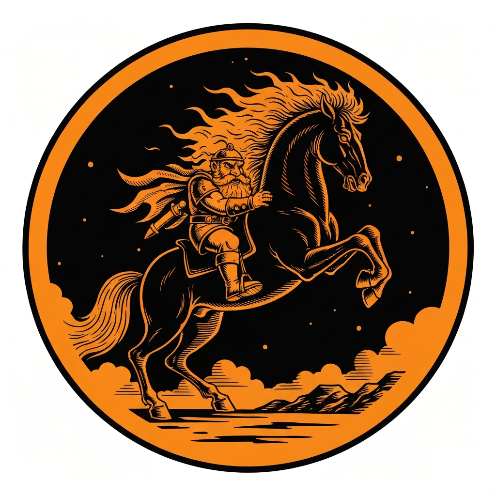
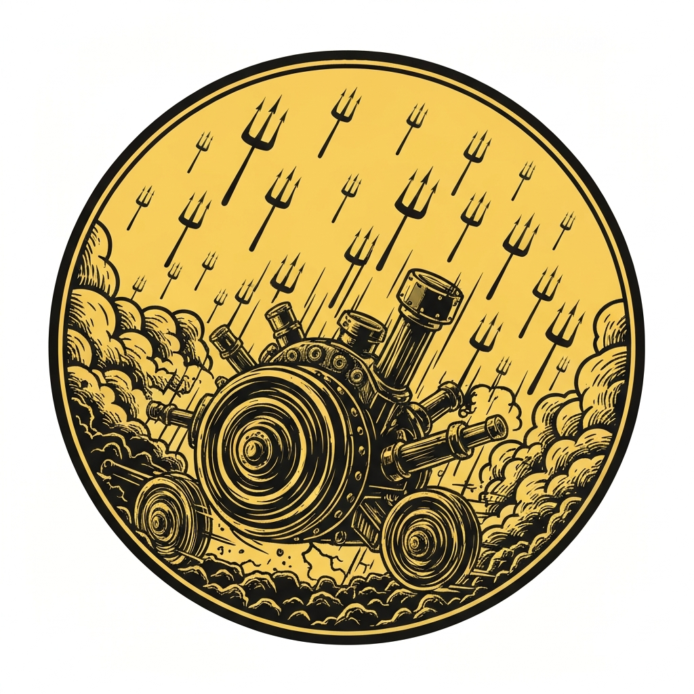
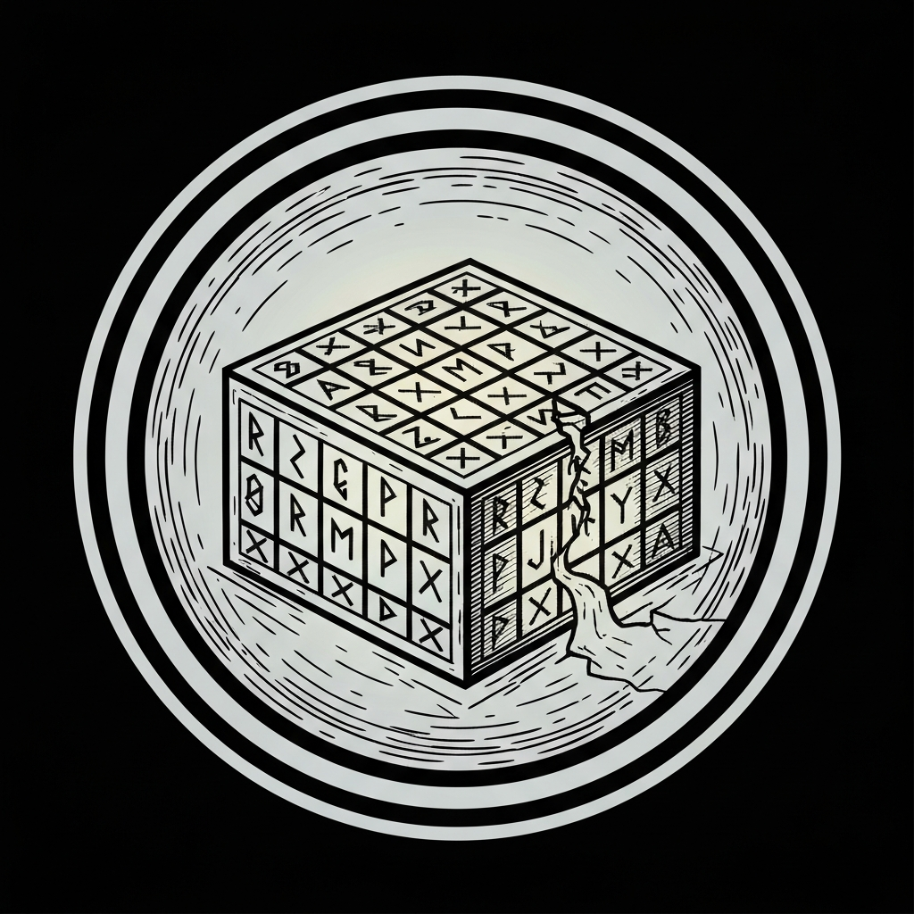
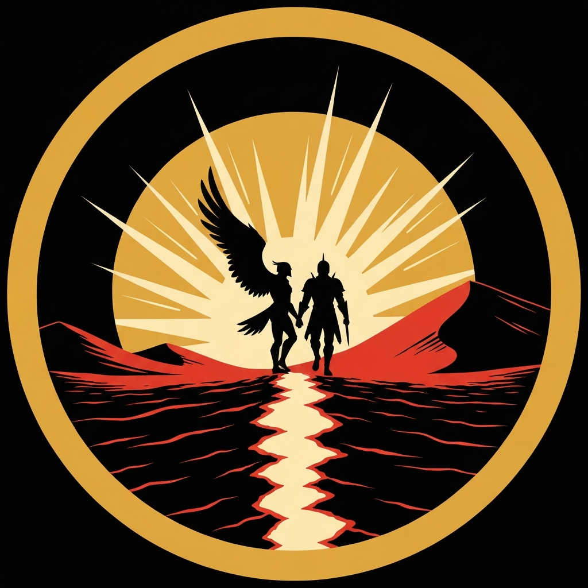

The pub crawl's newest stop was Mahadi's Infernal Rapture — a smoky lounge of impossibly fine wine and impossible hospitality, tucked behind a curtain the party hadn't actually been cleared to walk through. When the bearded merchant Mahadi discovered the mixup, his first offer was a soul-shaving contract for the luxury they'd already enjoyed. His second offer was a job: find his missing server. She'd run off with one of his prized war machines, a sealed puzzle box, and — it turned out — a paladin. Sparrow flatly declined to put her name on anything devil-drafted ("I'm willing to do so on word, but not by contract"), and the rest of the table backed her up. Mahadi settled for a handshake, a twenty-four-hour clock, and the promise of double pay if the succubus came back alive.

The Beastmaster's nightmares didn't care much for the deal. Fire-maned and razor-toothed, the steeds despised their good-aligned riders on principle — Pal failed his Animal Handling check at disadvantage and spent the entire flight white-knuckling an Athletics check just to stay mounted, while Sparrow rode alongside threatening his nightmare directly: "If you throw him, we'll see how far I can throw you." Mattrum swapped his familiar for an imp to look properly disreputable for his own mount. When they caught up to the stolen war machine, Dudley — the paladin riding it — refused to slow down: he was taking the succubus Mizriella home to Elturel, chains or no chains, and he believed, sincerely, that she loved him back. An insight check confirmed it wasn't a charm. The party made him an offer instead of a fight: escort them to the portal, and everyone walks away with what they actually came for.

The escort lasted exactly until a second war machine roared out of the dust — a Medusa driving, kobolds and grimlocks crewing, a half-dragon fiend riding shotgun. Pierce's Thunderwave, fired off a scepter with no spell components to counter, dropped an entire cluster of enemy casters in one blast. Xavius answered with a sixty-foot Conjure Barrage that caught the rest of the crew — 23 damage to anyone who failed the save, 11 to anyone who didn't — and sent one war machine spinning out of control, destroyed for good. Left behind on the ground when the vehicles sped off, Pierce traded blows alone with the half-dragon, surviving one lightning breath at exactly 24 hit points remaining before Spiritual Weapon and a second Thunderwave wore it down, with Xavius finishing it off by Misty Stepping in for the kill. Hedy's Psychic Lance incapacitated the Medusa outright; Pal closed the distance and ended her with Moonbeam, radiant damage she had no resistance to.

With the threat cleared, Xavius's Planar Warden training paid off in a way it rarely gets to: an automatic success on the Arcana check to trace the lingering residue of Elturel's portal, no roll required. Mizriella used it to open a rift home. Before she left, she handed over the puzzle box without negotiating — a box she'd originally meant to use as a bargaining chip — and invited the party to her and Dudley's wedding at the Temple of Lassander. Dudley left his +2 shield behind as thanks. Back at the wrecked war machine, Mattrum worked out the box's lock — a Sator Square palindrome, SATOR AREPO TENET OPERA ROTAS — to reveal a contract and a small gold statuette inside. Mahadi paid out the agreed bounty: a flat hundred gold, not the doubled sum they'd have earned for bringing Mizriella back alive, plus their share of the scrap and the stolen statuette — 400 gp each once it was all totaled and split. He never asked how his enforcers had died or why his stolen war machine came back without a scratch. He didn't need to: the enforcers he'd quietly sent after Mizriella had defied his actual plan, and paid for it.

---

## Player Highlights

<strong><a href="../characters/pal-go-lucky">Pal Go Lucky</a></strong> (Don) — Tried diplomacy first: a persuasion check at the war machine's edge, boosted by a luck point to a 25, asking Dudley to hand over the machine and the box so "we can all just go on our ways happily." Dudley refused outright — he wasn't taking orders, he was rescuing the woman he loved. Pal pivoted to the escort-to-portal compromise that ended the chase without further bloodshed, then closed out the fight himself: bucked clean off his nightmare, he made the jump anyway, and finished the Medusa with a Moonbeam for clean radiant damage she had no resistance to.

<strong><a href="../characters/sparrow">Sparrow</a></strong> (Michael) — The only one at the table who said no to Mahadi's contract outright: "I'm willing to do so on word, but not by contract... It won't be by my signature." The deal got done anyway, on a handshake. In the chase itself, she stuck an Acrobatics landing onto the moving war machine, slipped into stealth, and put a sneak attack into the Medusa for 22 damage — a roll short of finishing her, but enough to soften her up for the kill that followed.

<strong><a href="../characters/mattrum">Mattrum</a></strong> (Trey) — Swapped his familiar for an imp specifically to look more disreputable for his nightmare steed, then leaned into playing the villain for the whole flight ("I am a very deceptive person"). In combat, he Misty Stepped clear and summoned a fey ally — named, with real comic timing, Cafe — for two attacks at 4d6+16 combined. Back at the wrecked war machine, it was Mattrum who cracked the puzzle box's Sator Square lock letter by letter in real time: "It spells the same way going up and down — you just had to grab the letters from the other areas."

<strong><a href="../characters/xavius-fairgate">Xavius Fairgate</a></strong> (Patman) — Opened the real fight with a sixty-foot Conjure Barrage of spectral tridents that caught the entire enemy crew at once and helped wreck one war machine beyond saving — with no one left alive to counterspell it. He finished the half-dragon himself with a Misty Step and a trident through the ribs. At session's end, his Planar Warden background paid off on a check built for exactly this moment: an automatic success tracing the portal residue back to Elturel, no roll required.

<strong><a href="../characters/pierce">Pierce</a></strong> (Mike) — His Thunderwave, fired through a scepter with no spell components to counter, dropped a whole cluster of enemy spellcasters in a single blast. Left behind on the ground when the war machines sped off without him, he stood and traded blows alone with a half-dragon fiend — surviving a lightning breath at exactly 24 hit points remaining — before dashing 60 feet to close the gap, landing a second Thunderwave, and grinding the thing down with a sustained Spiritual Weapon.

<strong><a href="../characters/hedy">Hedy</a></strong> (Gon) — Opened the session explaining, unprompted, why a planar-traveling Firbolg wizard finds Sigil more comfortable than the Material Plane. In the chase combat, her Psychic Lance incapacitated the Medusa outright, taking the party's most dangerous threat off the table right as Pal moved in to finish her off with Moonbeam.

---

## Achievements

<strong>Not By My Signature</strong> — When Mahadi insisted on a signature to formalize the rescue mission, Sparrow shut it down flat: "I'm willing to do so on word, but not by contract." Pressed again, she didn't budge: "It won't be by my signature." The job got done anyway — on a handshake, with a devil who clearly wasn't used to hearing no.

<strong>Hang On, Don't Throw Him</strong> — Pal's nightmare steed loathed him on sight — a failed Animal Handling check at disadvantage left him holding on by Athletics alone for the entire flight. Sparrow rode up alongside and made the stakes clear to the horse directly: "If you throw him, we'll see how far I can throw you." It worked. Mostly.

<strong>Twenty-Three on the Fail, Eleven on the Save</strong> — Xavius answered the second war machine's ambush with a sixty-foot Conjure Barrage of conjured tridents, catching the Medusa, grimlocks, and kobolds in one cone. One war machine spun out and crashed for good. There was no one left alive to counterspell it.

<strong>Sator Arepo Tenet Opera Rotas</strong> — The adamantine puzzle box's lock was a five-by-five grid that had to spell the same word across, down, and backwards. Mattrum worked it out loud, letter by letter, until the box clicked open to reveal a contract and a small gold statuette inside.

<strong>The Payoff for a Feat You Never Get to Use</strong> — Tracing the lingering planar residue of a portal back to Elturel should have been an Arcana check. Instead, Xavius's Planar Warden feat made it automatic — no roll required, after nine levels of carrying an ability built for exactly this moment. Mizriella used the rift to go home, and left the party a standing invitation to her and Dudley's wedding at the Temple of Lassander.

---

## Rewards

- **Gold**: 400 gp
- **Downtime**: 10 days
- **Advancement**: level (optional)
- **Streaming hours**: 2
- **Shield, +2** — Bears the heraldic symbol of Lithander and carries the *Beacon* property, casting *light* at will. A devoted paladin's parting gift.
- **Oil of Slipperiness** *(uncommon)* — Coats the user, granting the effects of *freedom of movement* for 8 hours.
