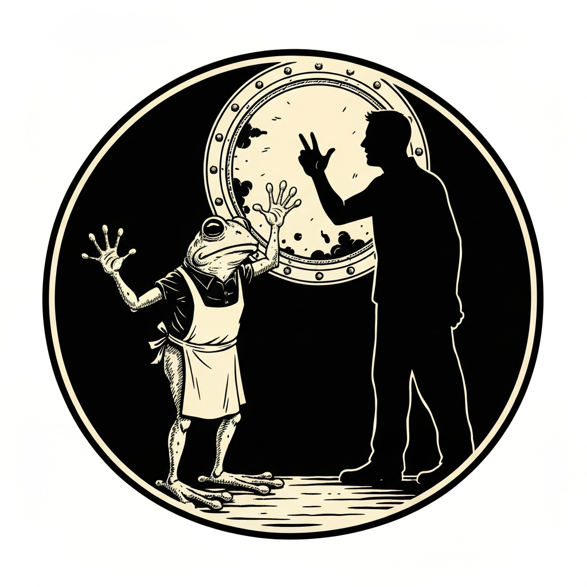
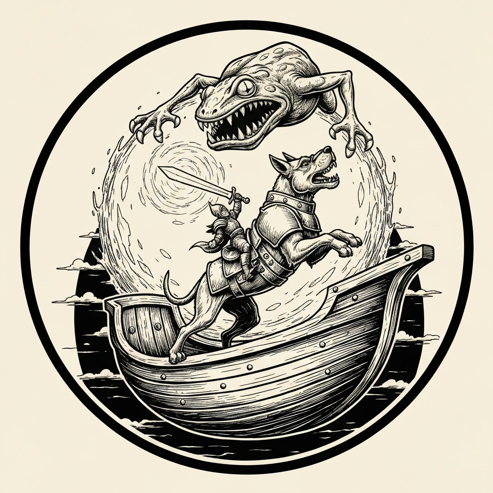
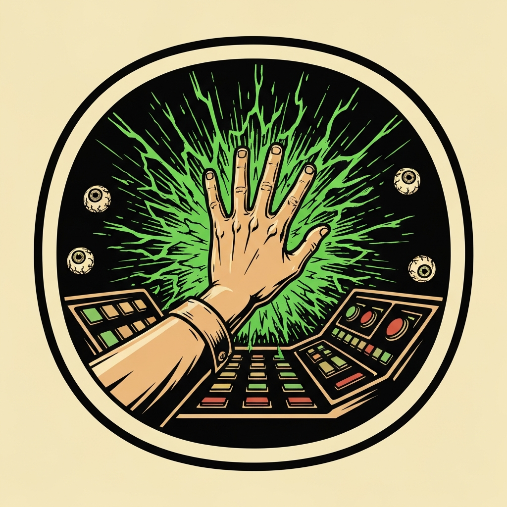
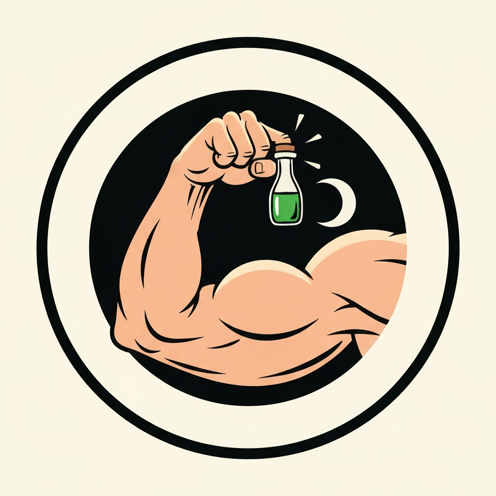
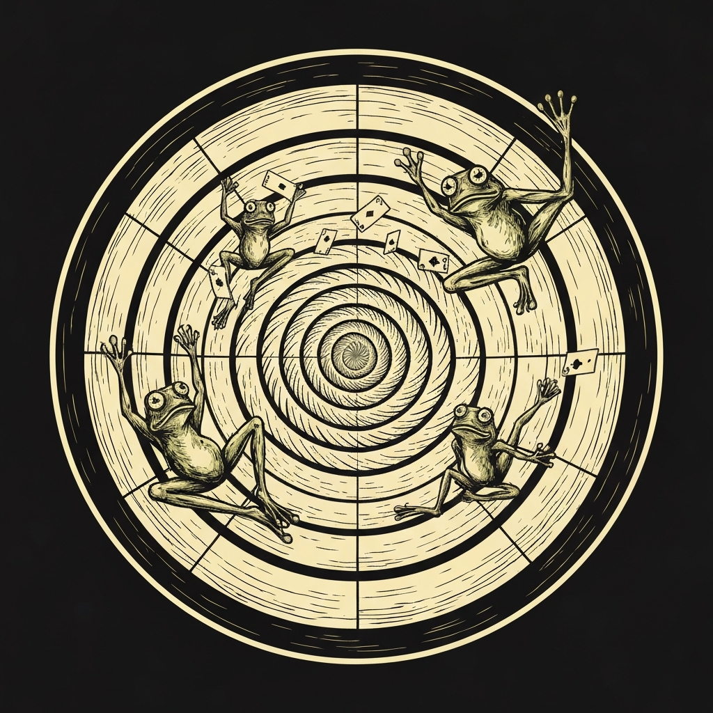

A tiefling chalked a door in the marble walls of Sigil and led them through into something off the tour map: the Nameless Voyager, a restaurant ship drifting through Limbo with curved walls, zero gravity, and a full crew of grung — poison dart frog people — working every table and the gyroscope bar. The pub crawlers they'd been escorting scattered toward the drinks immediately. The party ordered, spread out, and watched. Within minutes a grung server named Throd Uroq was hovering too close, watching Alistair with an urgency that didn't match her station. When he waved her over, the truth came out in a rush: the cult of Kerak Muylop had seized the crew; hostages were locked in the bridge; a ritual to transform the grung into slaadi was already underway. More than half the people in the room — servers, patrons, bar staff — were part of it. Throd just wanted to go home.

The plan started with a bluff. Perri told a grung guard she'd been tasked by the powers that be to check on the reactor, and he pointed the party straight downstairs. What waited in the engine room was a sphere of black metal twenty feet across, thrumming with barely restrained power, ringed by three consoles labeled in Deep Speech: Blast Doors, Defense Systems, Security Drones. The moment someone touched the first console, a Helmed Horror phased through the wall and animated swords began cycling in through the hull. Combat in zero gravity, console hacks between sword waves. Perri worked the blast door console first, Tinker's tools giving her the advantage she needed to crack it on the first try. The defense system console fell next — Vexal spent a Luck point, got the success, and triggered a floor-wide electrical arc as a side effect (DC 15 dex save, 7 on fail, 3 on success), dropping Xavius's concentration and costing everyone a few hit points. The security drone console was last, and when Alistair's investigation roll came up one point short, he burned his Flash of Genius reaction — a free boost equal to his Intelligence modifier — to push it to 18. Every trap on the ship went dark at once.

The now-quiet ship wasn't restful. Floating bodies of dead grung drifted through the dining room. Broken silverware and glass from the reactor fight hung suspended in all directions, erupting further as the party rushed through — a DC 12 dexterity gauntlet that everyone cleared, Perri's persistent aura of +4 saves pulling borderline rolls over the threshold. The pub crawlers they'd escorted were gone from the restaurant level; the bridge was still above. When the party broke through to the top floor, they found Kerak Muylop, a ring of cult guard grung, and fifteen hostages — not ordinary captives but Githzerai, their chests already showing the early signs of slaad tadpoles forming. The cultists had nearly completed the ritual. The party had interrupted the last stage.

Raydin opened the bridge fight with Hypnotic Pattern — DC 16 wisdom save, five of six cultists failing and standing entranced while Xavius's conjured frog spirits (a thematic choice the room appreciated) swept through on his movement-triggered activations. Poweye finished a cult guard with a Level 3 Divine Smite for 48 damage, delivered with considerable nautical metaphor. Perri rose above Kerak Muylop on Waffles's back and closed it out: two Green Flame Blade strikes for 27 and 41 damage, the slaad leader dropping to zero. The surviving grung stood down the moment Kerak Muylop died. Before the porthole tore open a portal home, the party warned every Githzerai about what was growing inside them. Gravity reasserted itself on the other side of the portal, and everyone spent a moment relearning how to use their legs.

---

## Player Highlights

<strong><a href="../characters/alistair">Alistair</a></strong> (Ttrpger) — A 23 insight check caught Throd Uroq's too-intent stare before she'd worked up the nerve to approach, letting him wave her over and pull the whole picture out in one careful conversation. In the engine room, when the security drone console resisted his investigation check by a single point, he burned his Flash of Genius reaction to push the total to 18 — shutting down every trap on the ship simultaneously. His Battlesmith construct helped keep swords off the team while the hacks happened.

<strong><a href="../characters/perri">Perri</a></strong> (Trey) — Got the party into the engine room with a breezy bluff: "I've been tasked by the powers that be. Something's wrong with the reactor." The grung waiter pointed her right to the console room. She then cracked the blast door console on the first investigation roll (Tinker's tools advantage), and her persistent +4 save aura carried the whole party through the debris-filled dining hall without a scratch. On the bridge, she finished Kerak Muylop with back-to-back Green Flame Blade strikes from Waffles's back.

<strong><a href="../characters/vexal-shadeprowler">Vexal Shadeprowler</a></strong> (MarkD) — Spent a Luck point on the defense systems console and hacked it, inadvertently triggering a floor-wide electrical arc — 7 lightning on a failed DC 15 dex save — that punished the whole room and dropped Xavius's concentration on his spirit animals. In combat he put Hunter's Mark on the sword targeting him, cleared multiple animated blades with dual shortsword strikes, and was first in position to engage the cult guards when the bridge push began.

<strong><a href="../characters/poweye">Poweye</a></strong> (Ken) — In the middle of the engine room fight, announced as a bonus action that he was tired of all this, said "da da da da da da," produced a Potion of Hill Giant Strength, drank it, and punched the Helmed Horror for 14 magical bludgeoning damage. Later, on the bridge, finished a cult guard grung with a Level 3 Divine Smite for 48 damage — accompanied by the kind of nautical metaphor that only makes sense if you know the character.

<strong><a href="../characters/raydin">Raydin</a></strong> (Nader) — New to the pub crawl, introduced himself as a bladesinger whose spellbook has been converted into cards. Opened the bridge fight's decisive moment: Hypnotic Pattern with a DC 16 wisdom save, catching five of six cultists and leaving them entranced while the party handled the live ones. Sent his familiar downstairs to grant advantage to allies still engaging the remaining guards below.

<strong><a href="../characters/xavius-fairgate">Xavius Fairgate</a></strong> (Patman) — Conjured frog-shaped spirit animals and kept them active across both combats by triggering the spell's movement clause twice per turn — DC 14 dex saves, damage on fail, damage halved on success, all turn. On the bridge, Misty Stepped into better position when the final guard needed a clear line of sight, while his spirits continued sweeping independently on both sides of the deck.

---

## Achievements

<strong>The One Who Wanted to Go Home</strong> — The cult of Kerak Muylop held most of the restaurant, but Throd Uroq couldn't stop staring at the adventurers from across the room. Alistair rolled a 23 insight, caught the signal, waved her over, and had the whole operation mapped out before anyone else had ordered a second drink. Without that moment, none of the rest of it would have happened in time.

<strong>Something's Wrong With the Reactor</strong> — Perri's engine-room bluff required no preparation and exactly one flat-faced delivery: "I've been tasked by the powers that be. Something's wrong with the reactor." The grung guard pointed her straight to the console room without a second look. She had never been to the reactor before. There was nothing wrong with the reactor. Yet.

<strong>Flash of Genius</strong> — The security drone console required a specific investigation threshold, and Alistair came up one point short. His Flash of Genius reaction added his Intelligence modifier as a flat bonus, pushing the total to exactly 18 — the number needed. Every trap on the ship shut off at once. The timing left no margin.

<strong>Da Da Da Da Da Da</strong> — As a bonus action, mid-fight, Poweye announced his intention, hummed a brief tune, produced a Potion of Hill Giant Strength, and drank it. Then he punched the Helmed Horror for 14 magical bludgeoning damage. He described this as a matter of nutrition. The DM noted it was "probably spinach." No one disagreed.

<strong>DC 16 Wisdom, Five of Six</strong> — Raydin's first action on the bridge was Hypnotic Pattern: a 30-foot cube of swirling hypnotic light, DC 16 wisdom save. Five of the six cult guards failed. They stood frozen, staring at nothing, while the party handled the one who didn't. The bridge fight was effectively decided before anyone else had taken a swing.

---

## Rewards

- **Gold**: 416 gp
- **Downtime**: 10 days
- **Advancement**: level (optional)
- **Streaming hours**: 2
- **[Plate Armor, +1 (Strange Material)](https://www.dndbeyond.com/magic-items/5092-plate-1)** *(rare)* — +1 bonus to AC. Fashioned from the hide of a green slaad; includes a helm made from the slaad's head, which sits loosely on your own. The durability is unaffected, which is the least reassuring thing about wearing it.
- **[Potion of Pugilism](https://www.dndbeyond.com/magic-items/9228938-potion-of-pugilism)** *(uncommon)* — After drinking, each Unarmed Strike deals an extra 1d6 Force damage on a hit for 10 minutes. Thick green fluid. Tastes like spinach. Poweye had strong opinions about this.
