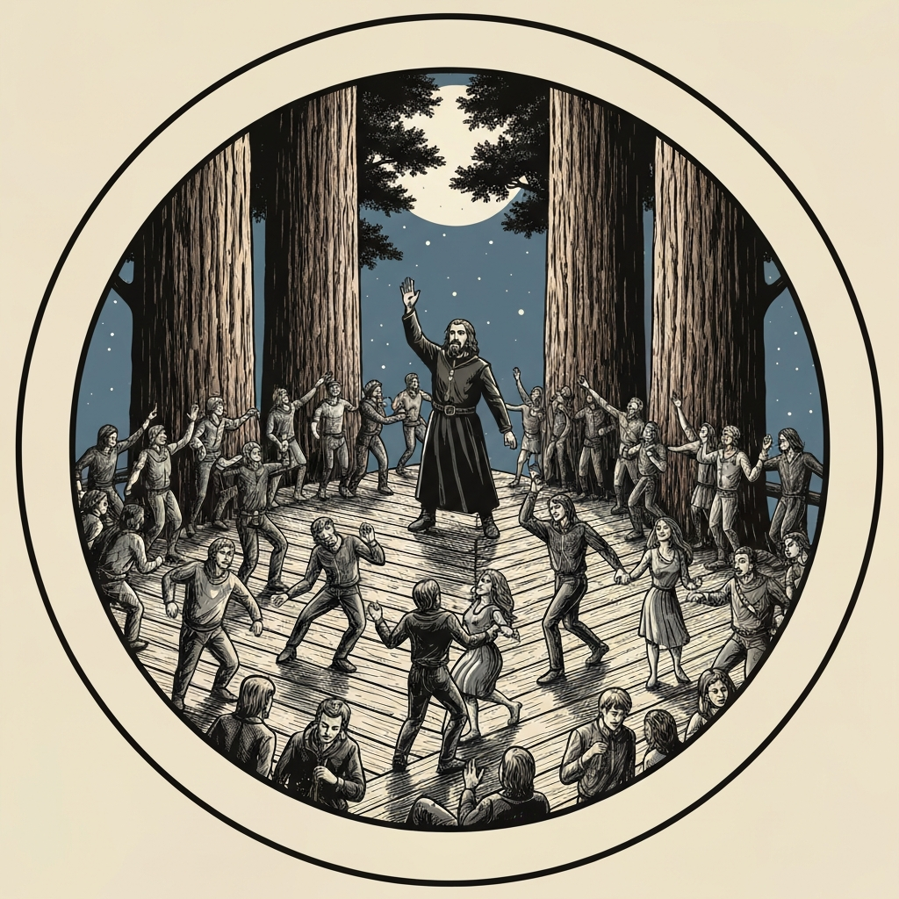
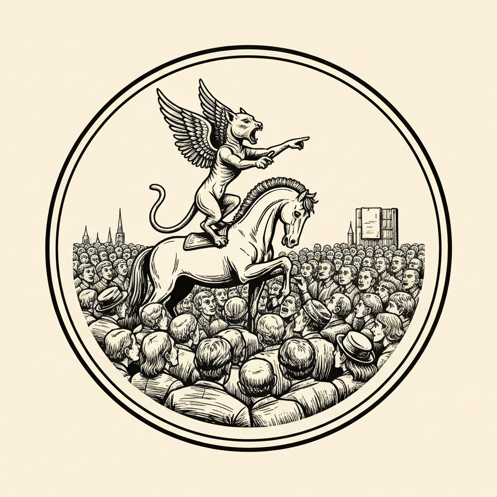
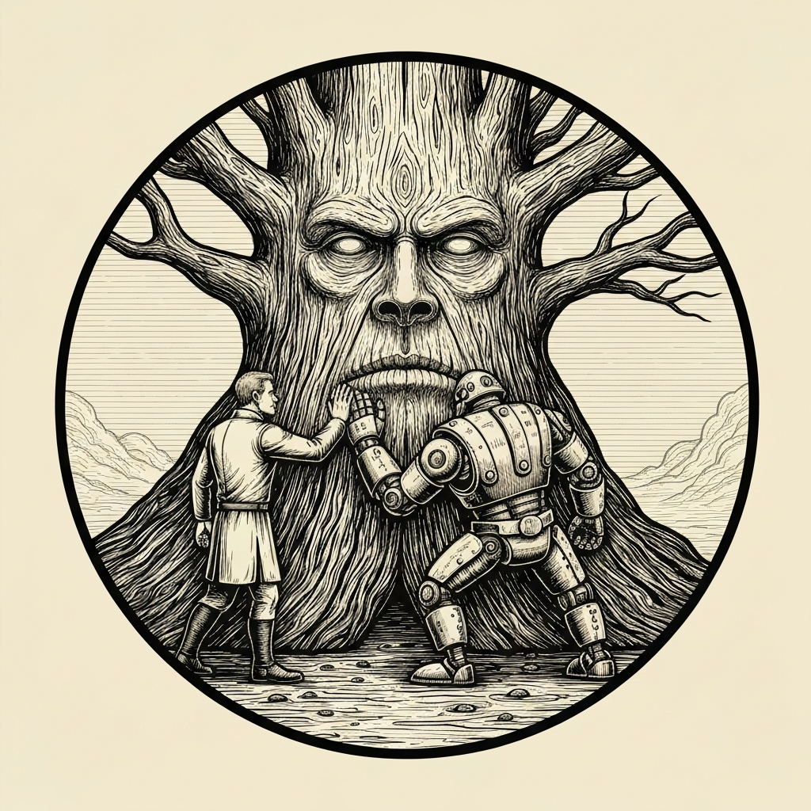
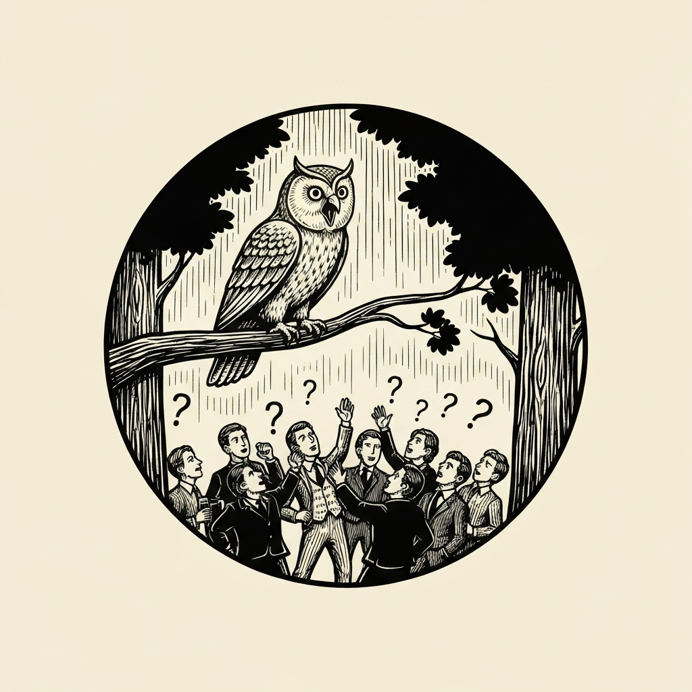
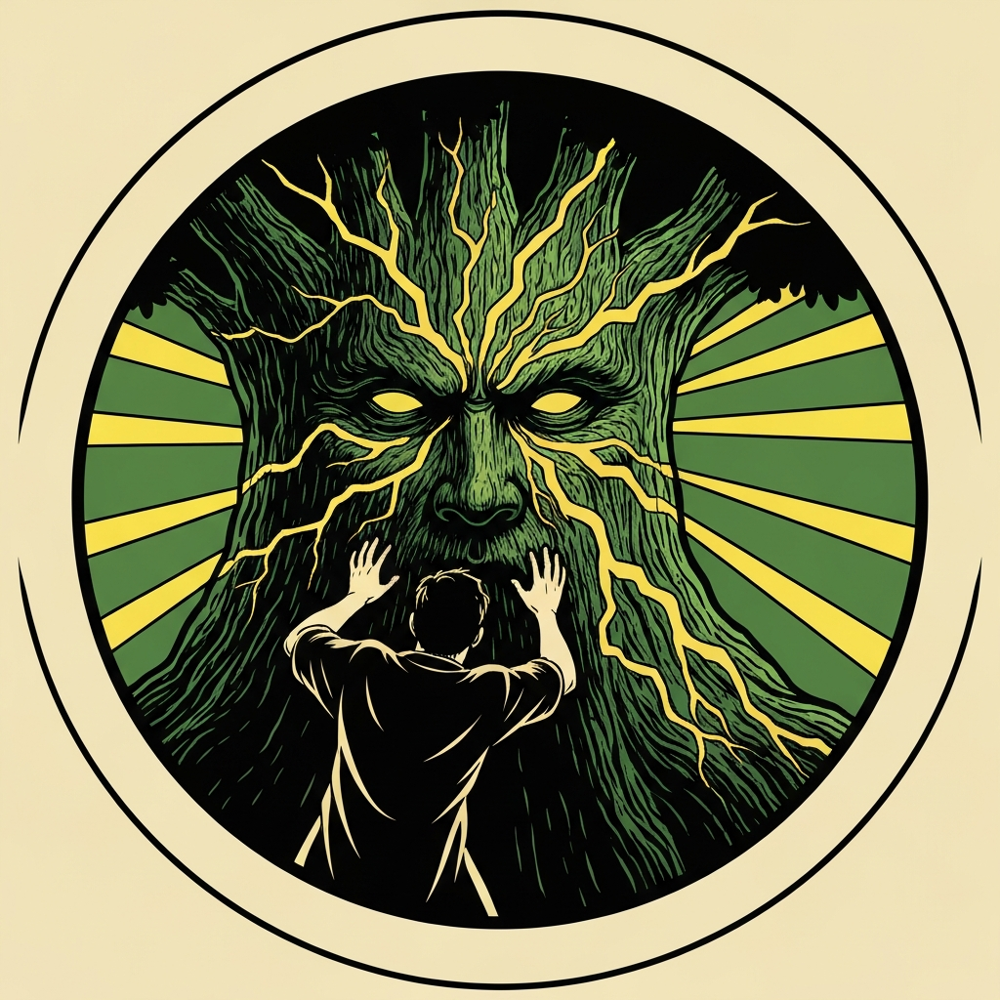

A glowing portal in a Sigil shrine led through to wooden bridges strung between colossal redwoods — fifty feet at the trunk, hundreds to the forest floor — and a whole elven village pinned to the branches like barnacles. The pub crawlers scattered toward the empty bar. The elves had more urgent concerns. The Bacchae, souls of mortals who'd earned their afterlife reward and were spending it in one unending party, had gathered into something closer to a natural disaster: a Category 5 festival, bearing down now. Village elder Shenhar explained the situation — pointed the party toward the ranger station, and made no promises. Then the horn sounded.

The party grabbed what they could — sleeping gas, gust-of-wind jars, dust of dryness, smelling salts, Mattrum talking his way into a third item for his cat — and spread across the walkways just as the first torches crested the bridges. Thousands of footsteps made the treetops grumble. Vexal opened with Entangle on the northern approach, rooting the bulk of the first wave before they reached the village interior. Pierce followed with Sleep at DC 18 Wisdom — the Twilight Cleric version, which swept a wider area than the module called for and dropped everyone it caught mid-shuffle. Hedy, invisible after a Firbolg Hidden Step, cast Slow on the next column at DC 20 and caught them all, leaving the ones who passed with a single action per round. Alistair detonated a gust-of-wind jar and blew two off the platform; his Battlesmith body-checked a third over the edge. A Maenad tore herself out of the press and attacked Peppermint; Pal rode over and knocked her out in two non-lethal strikes. Mattrum's sphinx climbed onto Peppermint's haunches and delivered a theological sermon on the Words of Mystra to the crowd below — Mattrum added the boost at the last second and three groups of Bacchae lost interest simultaneously. Hedy used her Natural 20 portent die on a performance check and had Alley the owl perform animal calls until the last three wandered off. Festival interest: zero.

The music returned. Louder. From inside the tree.

A face the size of a building opened in the bark of the oldest redwood — eyes, mouth, grapevine crown growing where a god had been watching all along. The treant swayed in time with the music it had been absorbing all evening, and the walkways swayed with it. Everyone within a hundred feet had to save DC 16 Wisdom each round or drift toward the trunk. Peppy failed and went prone. Alistair's Battlesmith took a branch for 17 damage. Smelling salts reduced the treant's madness from 15 to 9; dispel magic couldn't reach the affliction at all — it was not a curse, the DM had been careful to say. Alistair burned his action on an Arcana Study check with Battlesmith advantage, hit 29, and called out the answer: Greater Restoration. Pierce Misty Stepped to the base of the trunk using his Channel Divinity variant — no spell slot — and cast.

The music stopped. The crowd of thousands looked around, found nothing calling them, and drifted toward the next party. Through a mile of press a figure stood looking back at them: young, garlanded in vine and ripe grape, unmistakably Dionysus. He offered a bow that was clearly ironic, turned away, and vanished. Village elder Shenhar gave them a life-size carved elf — six feet tall, eighty pounds, worth a thousand gold. They swept the forest floor and found jade beads, onyx beads, and Potions of Greater Healing already in their packs. The village was intact. The forest for miles in every direction was ruin.

---

## Player Highlights

<strong><a href="../characters/pal-go-lucky">Pal Go Lucky</a></strong> (Don) — His Aura of Warding kept the whole party at +4 to spell saves through both phases, pulling borderline rolls over the threshold all session. When a Maenad emerged from the swarm and attacked Peppermint, he rode up and knocked her out non-lethally in two strikes. He also talked the ranger station into a third supply item before the horn sounded, and burned a Luck point to help Peppermint make its Wisdom save against the treant's maddening music.

<strong><a href="../characters/mattrum">Mattrum</a></strong> (Trey) — His sphinx companion climbed onto Peppermint's haunches and gave an impromptu theological sermon on the Words of Mystra; Mattrum boosted the check at the critical moment — "he then realizes it might not be enough and gives it plus two" — and three clusters of Bacchae interest collapsed. He also Quickened Sleep on the southern wave and passed his smelling salts to the group once the treant appeared. His direct persuasion attempt on the Bacchae ("You really, really ought to get the hell out of here") received a toast.

<strong><a href="../characters/alistair">Alistair</a></strong> (Ttrpger) — Deployed a gust-of-wind jar to blast two Bacchae off the platform and ordered his Battlesmith to body-check a third over the edge. When the treant proved immune to dispel magic and smelling salts, he burned a Study action — Battlesmith providing advantage — rolled a 29 Arcana, and identified Greater Restoration as the specific cure. His Battlesmith took a branch for 17 damage in the process and spent the rest of the fight prone.

<strong><a href="../characters/pierce">Pierce Waterson</a></strong> (Mike) — His opening Sleep at DC 18 Wisdom caught more of the first Bacchae wave than the module specified — the DM rolled against more targets than it called for and kept the result. In the treant fight, Pierce Misty Stepped using his Twilight Cleric Channel Divinity variant (no spell slot cost), appeared at the base of the trunk, and cast Greater Restoration, ending the encounter in one action from the moment Alistair called the diagnosis.

<strong><a href="../characters/hedy">Hedy</a></strong> (Gon) — Slow on the northern column landed at DC 20 on round one and caught every target, giving the party clean shots at half-speed, single-action Bacchae for the rest of the wave. She went invisible via Firbolg Hidden Step and repositioned inside Pal's aura. When only three Bacchae remained and nothing else had worked on them, she spent her Natural 20 portent die on a performance check and let Alley the owl demonstrate goose calls, chicken calls, and several others until the crowd's interest expired completely.

<strong><a href="../characters/vexal-shadeprowler">Vexal Shadeprowler</a></strong> (MarkD) — Opened with Entangle on the northern approach — DC 15 Strength, wide area — restraining the bulk of the first wave before they reached the village interior. His Shadar-kai heritage gave him advantage on charm saves, which kept him fully functional when the treant's music took the rest of the party to DC 16 Wisdom each turn. In the treant fight he moved into Pal's aura and Dodged, drawing fire away from the pub crawlers still clinging to the tavern deck.

---

## Achievements

<strong>The Sovereign of Naps</strong> — Pierce cast Sleep at DC 18 Wisdom over the first Bacchae wave. The module specified how many targets it should reach; the DM grabbed more tokens than it called for, rolled against all of them, and watched them fall mid-dance. He acknowledged the mistake and let it stand on the grounds that a destroyed village wouldn't benefit from a re-do. The Twilight Cleric said "Oi, go to sleep" and moved on.

<strong>The Theological Sphinx</strong> — Mattrum's sphinx familiar climbed aboard Peppermint and delivered an impromptu lecture on the Words of Mystra to the Bacchae crowd below. Mattrum added his boost at the last second — "he then realizes it might not be enough and gives it plus two" — and the check cleared, collapsing three groups of festival interest simultaneously. Pal Go Lucky did not ask why there was a sphinx on his horse.

<strong>Not Twenty for Twenty-Nine</strong> — When dispel magic and smelling salts both failed on the treant, Alistair burned his action on a Study check to identify what would actually work. His Battlesmith provided advantage. The base roll was a Natural 20; the total came to 29. "Not twenty for twenty-nine," he said, and shouted the answer to the party: Greater Restoration. Pierce had the spell. The treant had maybe two more rounds before someone failed a save by five or more and picked up indefinite madness.

<strong>What the Fox Says</strong> — Three Bacchae remained when Hedy was out of tactical options. She spent her Natural 20 portent die on a performance check and let Alley the owl perform: "honk honk honk honk for goose, and then this is for the chicken." Mattrum asked what the fox says. The owl did not perform a fox. The Bacchae stood there, apparently considered their options, and concluded there was a better party somewhere else.

<strong>Greater Restoration</strong> — Pierce Misty Stepped to the base of the treant using his Channel Divinity variant — the version that doesn't cost a spell slot — appeared at the trunk, and cast Greater Restoration on a Dionysian-maddened awakened tree. The affliction, which dispel magic couldn't reach and smelling salts could only partially suppress, ended immediately. Alistair had identified the solution thirty seconds earlier. Pierce just needed to get there.

---

## Rewards

- **Gold**: 416 gp (2,500 gp total, divided six ways)
- **Downtime**: 5 days
- **Streaming hours**: 2
- **Advancement**: level (optional)
- **Potion of Greater Healing** *(uncommon)* — One tucked into each character's pack after the festival dispersed, apparently while no one was looking. Restores 4d4+4 hit points. Brewed from an extremely potent fortified wine, per whoever left it there.
- **Instrument of the Bards (Cli Lyre)** *(uncommon, requires attunement by a bard)* — Found on the forest floor during cleanup.
