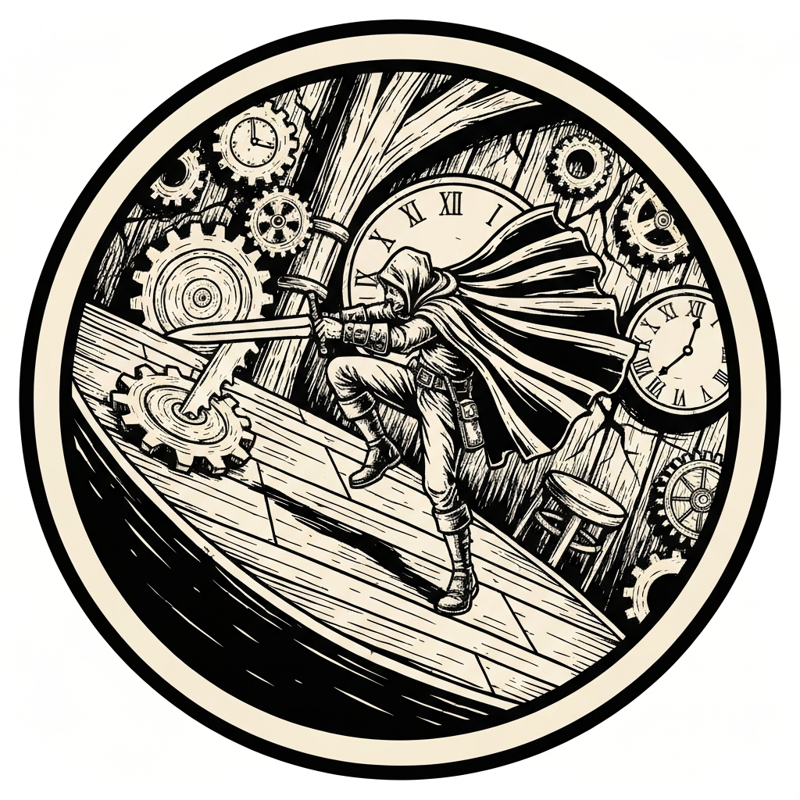
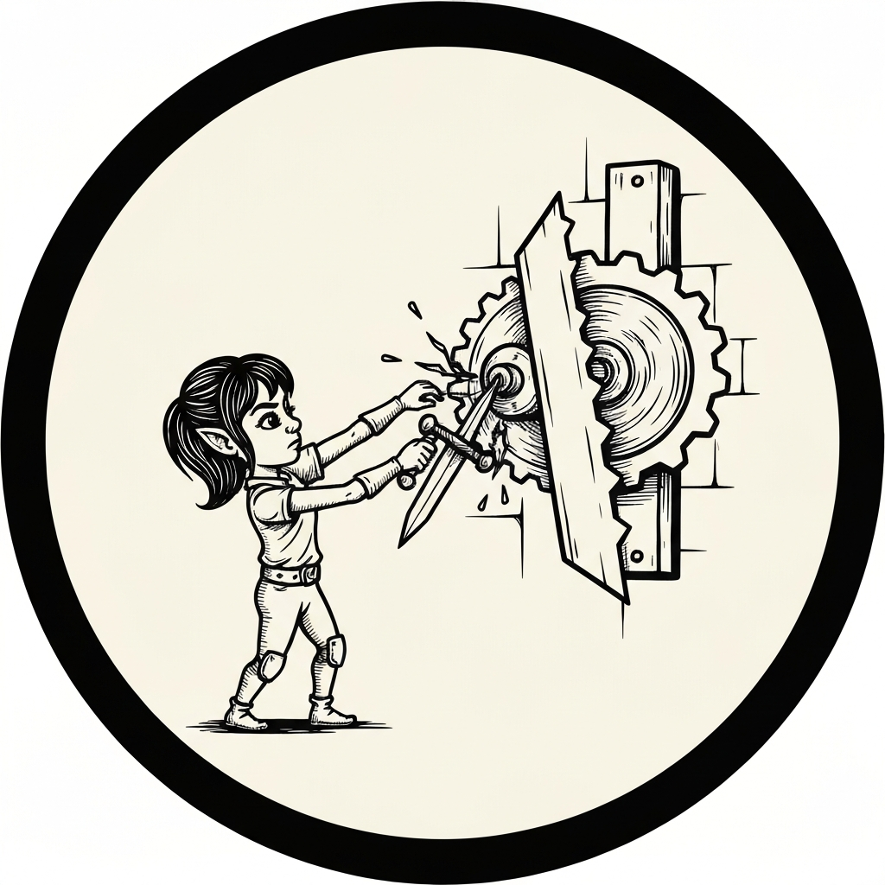
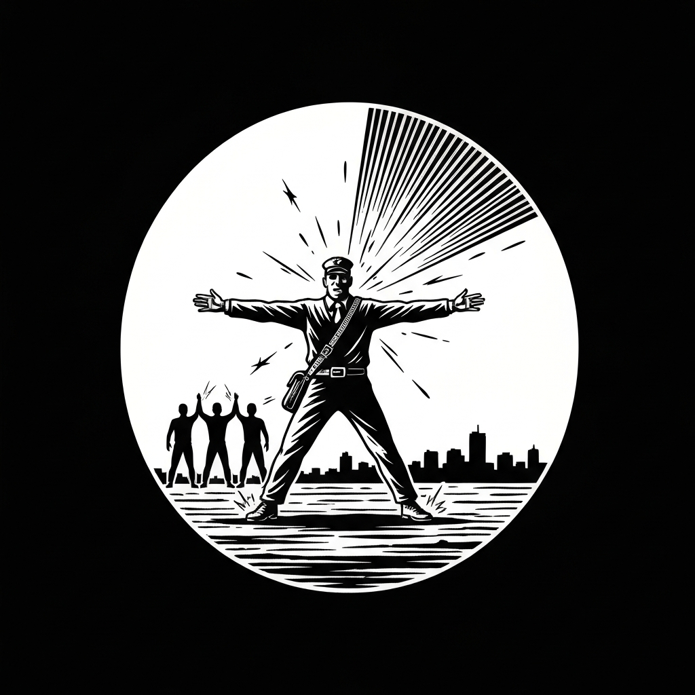
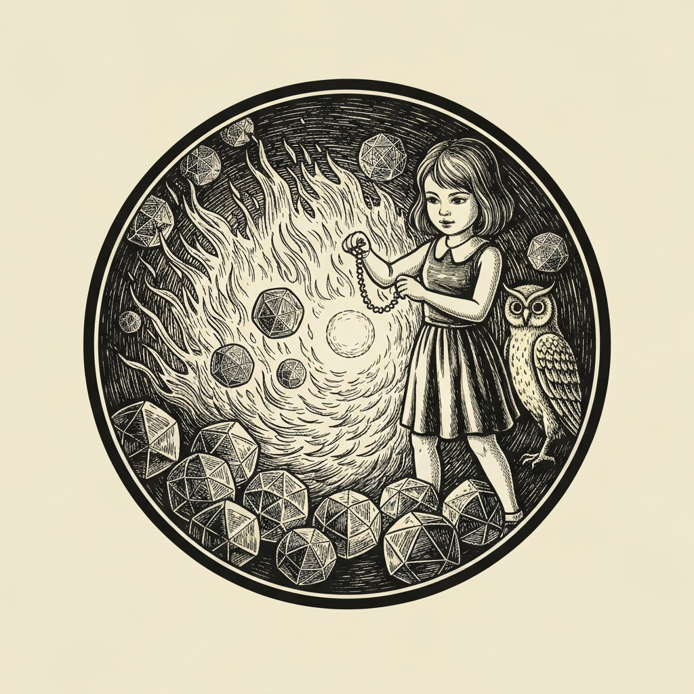
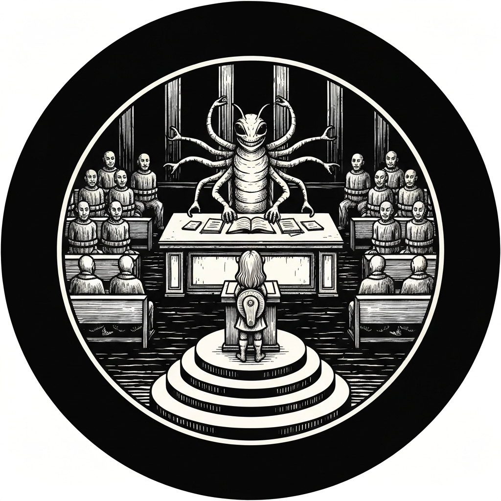

Garm Redbrand of the Society of Sensation had a simple ask: a previous pub-crawl group had gone to Mechanus, entered Tavern A7-G88 in Regulus on Cog #42, and hadn't come back. The Modrons who ran the place weren't talking — or rather, they were talking, but only in the sense that they'd used the word "defective" and left it there. The party took the job, pulled on their matching "Planar Pub Crawl 1499" tunics, and followed the next group of crawlers through a clock-stall portal in Sigil that deposited them on the orderly streets of Mechanus. Alistair deployed his Mimir immediately to find the tavern. The Mimir told him the destination didn't exist — then clarified: it was "scheduled to not exist." After ten minutes of interpreting coordinate addresses that bore no relationship to navigable directions, they found the building: the one crumbling exterior on an otherwise immaculate street, music still playing inside on a timer.

The bar was cog-shaped, literally rotating, tended by eight monodrone bartenders overseen by a quadrone supervisor. Talking to them required speaking Modron. Alistair ordered the house special — a liquid with the color and viscosity of motor oil — and gained bilingualism for twenty-four hours. Odie, who was thirteen and couldn't drink, ordered straight milk. Tarik helpfully suggested she meant a White Russian. She did not. Sung Kenwoo rolled a 23 Deception check and talked his way into a conversation anyway. Every bartender pointed to the quadrone. The quadrone told them the previous pub-crawlers had been found defective and would be recycled — returned to them "brand new without the defect." Before anyone could determine what that meant for a humanoid, the tavern dropped: a thud, a scream from the crawlers they'd been escorting, and a long scraping fall through visible layers of turning gears into a lava pit beneath the cog. The Modrons filed out the door into the fire below as though this were scheduled, the quadrone mid-sentence. Then the buzzsaw blades started cutting through the walls.

The fight ran on strong mode — saws appearing on initiative 20 and 10, sweeping across the room on the following count if not destroyed in time. Tarik had Jump active; he vaulted across the tilting floor and hit the first saw for 27, twelve damage, destroying it before it cleared the room. Sparrow theorized that a saw moving freely through the air must be mechanically supported somewhere, and rammed a dagger into the backing mechanism — 32 Sleight of Hand, destroyed. Two nobles were swept off the map by a saw that got through in round two. Alistair, equipped with a magic item that could redirect force on impact, deliberately didn't save against an incoming blade and stepped into its path, knocking it ninety degrees upward through the ceiling to keep it off the remaining nobles — nineteen damage, taken willingly. Odie pulled a bead from her Necklace of Fireballs and threw it into a cluster of incoming Modrons: DC 15, eighty-six fire damage. When her owl finished the last survivor with Dragon's Breath acid, Sung Kenwoo announced to no one in particular that if anyone asked, they were just helping to recycle. Then the floor cracked apart into four sinking pieces over the lava. Alistair summoned a mechanical griffin, grabbed a noble, grabbed the cash register, and left. Sparrow spent a Luck point on an Athletics check and jumped to a stable rock with another patron. Tarik Misty Stepped across the gap and ran for the nearest solid surface.

They surfaced to find hundreds of Modrons. A creature shaped like a long caterpillar — nine segmented arms, a single fixed eye — occupied a raised desk at the head of a vast chamber. It spoke directly into their minds: they had trespassed in a restricted area and would be tried for malfunctions. The benches of the chamber were filled with manacled pub-crawlers from the previous group. Three charges: impersonating Modrons, trespassing with intent to steal, reckless endangerment of the crawlers in their care. Sparrow argued for the first two — pointing out that a lawfully organized plane that failed to communicate a scheduled demolition to the civilians deposited inside it bore some responsibility for the results. Odie removed her armor in the middle of her own testimony to demonstrate she could not possibly be a Modron. The court found this "impressive." Sung Kenwoo argued that the party's actions had accelerated recycling throughput and functionally trained defective units — a claim that was only partially grounded in reality — and rolled a thirteen. Alistair's Flash of Genius put it over. The court found for the defense on all three charges, acknowledged a gap in its procedures for humanoid visitors during disassembly events, and awarded emotional distress compensation. The party returned the surviving pub-crawlers to Garm Redbrand, plus the ones from the courtroom, with the cash register as a tip.

---

## Player Highlights

<strong>Odie Hilltopple</strong> (Gon) — A thirteen-year-old Shadar-kai wizard who snuck off from Blackstaff Academy to experience her first pub crawl, Odie was declared ineligible for the Modron-enabling house drink on account of being both underage and a minor, then spent most of the fight putting out more damage than anyone: Dragon's Breath from her owl familiar, Thunder Wave to clear Modrons, and a Necklace of Fireballs bead that did eighty-six fire damage in one throw. In the courtroom she removed her shield and then her armor mid-testimony to demonstrate she was biologically incapable of being a Modron. The court acknowledged the argument.

<strong><a href="../characters/tarik">Tarik</a></strong> (Trey) — Had Jump active before the initiative rolled and used it immediately, leaping across the tilting barroom floor to connect with the first buzzsaw on round one — 27 for 12 damage, gone before it could cross the room. His Unnerving Aura caused the Modrons entering through the holes in the walls to make DC 15 Wisdom saves each round, successfully fearing several of them. When the tavern split apart over the lava he Misty Stepped across a fifteen-foot gap and ran a noble to safety.

<strong><a href="../characters/sparrow">Sparrow</a></strong> (Mike) — Sparrow observed mid-combat that a saw moving through open air must have a mechanical backing somewhere, and proved it by sticking a dagger in with a 32 Sleight of Hand and watching it fall apart. She used the same method again later — 25 on the action, another roll on the bonus action — to take out two more in a single turn. Three saws, no attack rolls. In the courtroom she argued the defense's first two counts without notes and drove the legal argument while Odie handled visual aids.

<strong>Sung Kenwoo</strong> (Ken) — Self-described "worst adventurer," a level-5 rogue/wizard here for the grind, Sung Kenwoo opened with a 23 Deception check to extract information from the Modron bartenders and ended with a courtroom argument that the party had technically improved Mechanus' operational efficiency. The argument was a thirteen. Alistair gave him the extra points. After the last Modron fell to his owl's Dragon's Breath, he noted aloud: "If anyone asks, we were just helping to recycle."

<strong><a href="../characters/alistair">Alistair</a></strong> (Ttrpger) — His last pub crawl. He used a magic item to deliberately step into the path of a buzzsaw aimed at the nobles, taking nineteen damage to redirect it through the ceiling. His Steel Defender took eleven damage from Modron gear fire, sparking and glitching, "cries out in pain, but hoping for an end while Alistair smirks." When the tavern split apart, he summoned a mechanical griffin, grabbed a noble, grabbed the cash register off the bar on the way out, and contributed a Flash of Genius to Sung Kenwoo's courtroom roll before the session ended. A fitting final performance for a character defined by controlled infliction of suffering — other people's, and now his own.

---

## Achievements

<strong>One Swing</strong> — Tarik had Jump active before initiative rolled. When the first buzzsaw appeared on initiative 20, the DM noted it would sweep across the room on the following count; Tarik used his turn to vault across the tilting barroom floor and hit it for 27, twelve damage. "That will destroy it," the DM said — then checked his notes, surprised there was no hit-point threshold for the object. The saw was gone before it moved.

<strong>Dagger in the Works</strong> — Sparrow observed that a saw moving through open air with no visible support must have a mechanical backing somewhere behind the wall. She rammed a dagger into the mechanism with a 32 on Sleight of Hand, destroying it without an attack roll. She used the same method later in the same fight, taking out a second saw on her action (25, partial damage) and a third on her bonus action. Three saws total, zero attack rolls, two of them in one turn.

<strong>Deliberate Target</strong> — Alistair had a magic item capable of redirecting kinetic force on impact. When a buzzsaw came in on a path that would sweep the nobles, he announced he would not make the dexterity save and stepped in front of it. "I don't know how you explain it — change its trajectory by ninety degrees, make it go up." The DM said sure. The saw hit him for nineteen damage and exited through the ceiling. "That's my construct's problem, not Alistair's."

<strong>Eighty-Six Fire Damage</strong> — Odie pulled a bead from her Necklace of Fireballs. DC 15. She threw it into a cluster of Modrons: eighty-six fire damage. "Eight, the six, burn the hole." The next round her owl finished the last survivor with Dragon's Breath acid. Sung Kenwoo watched this happen and announced to the remaining room: "If anyone asks, we were just helping to recycle."

<strong>The Three-Count Acquittal</strong> — Three Modron prosecutors, three charges, three separate skill checks in a courtroom full of manacled pub-crawlers. Sparrow handled the trespassing and impersonation charges, arguing that a lawful organization failing to warn civilians about a scheduled demolition had created its own problem. Odie removed her armor to prove she could not have been impersonating a Modron; the court found this "impressive." Sung Kenwoo argued their actions improved Mechanus' throughput, rolled a thirteen, and Alistair's Flash of Genius got it over the line. All charges dismissed.

---

## Rewards

- **Gold**: 500 gp each (2,500 gp total) — 500 from Society of Sensation, 500 from the tavern cash register, 1,500 in Modron court emotional distress award
- **Downtime**: 5 days
- **Streaming hours**: 2
- **Advancement**: level (optional)
- **[Cube of Summoning](https://www.dndbeyond.com/magic-items/9228412-cube-of-summoning)** *(uncommon)* - 
  - This item holds an assortment of criminals, imprisoned for petty crimes by modrons on Mechanus. When you activate its magic, you release a random inmate. 
  - **Sentinel**. Writing in the Modron language covers this item; it glows faintly whenever modrons are within 120 feet of it, but is not otherwise visible. It appears to list the names and offences of all the cube’s inmates.
- **[Oil of Slipperiness](https://www.dndbeyond.com/magic-items/9228909-oil-of-slipperiness)** - The bottle resembles a beer bottle and the liquid within resembles an especially dark stout. The label bears a warning in the Modron language that consumption by any organic creature is likely to result in death.
