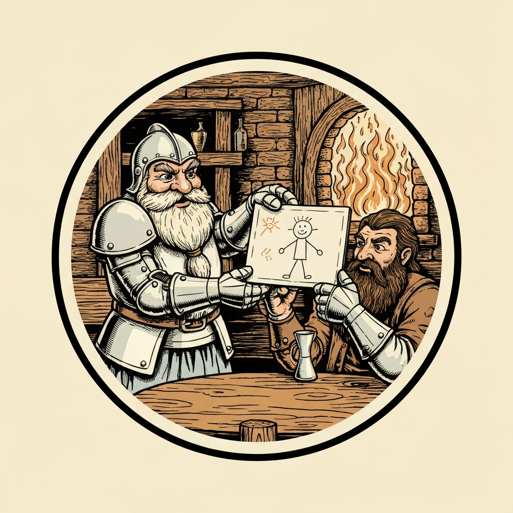
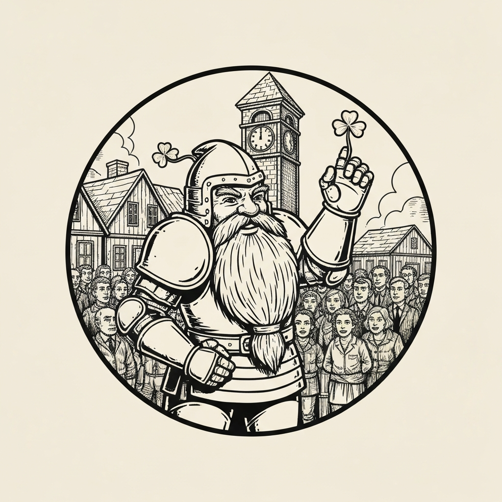
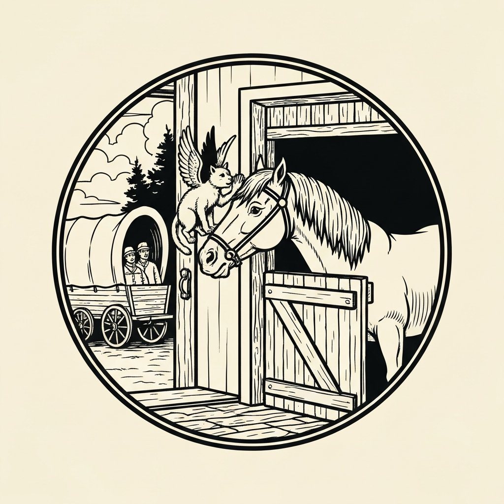
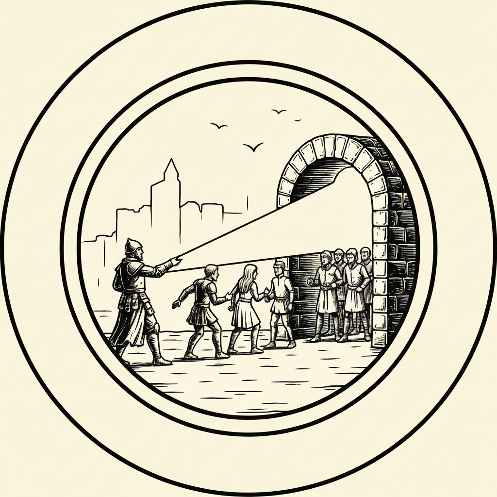
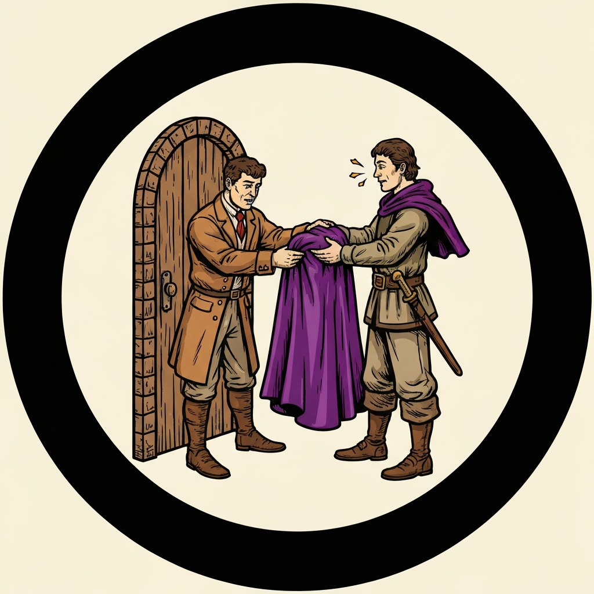

Before the pub crawl even started, a seven-year-old stopped Pal Go Lucky in a Sigil park. Lula pressed a crayon drawing of her father into his gauntleted hands — a man with a very large beard — and asked, in her most serious voice, if he would help find him. Her mother, Ayala Ware, had been dozing on that bench for days. Garen, a bodyguard for the Golden Hand Trading House, had followed the merchant Steady Goldenhand through the portal to Elysium a month ago; the trip was supposed to last eight days. A rescue party, Hector's Heroes, had followed ten days ago. Neither group had come back. Ayala had fifty gold left and a spell scroll of Sending, and her daughter had written a letter on the back of the drawing. Pal Go Lucky said yes immediately. Mattrum clarified he was speaking only for himself.

They stepped through the portal into clean air and birdsong, past a pair of equinal Guardinals who scrutinized their bags and let them pass. Elysium was not what most of them expected from a rescue mission — it was genuinely, extravagantly beautiful. They tracked Garen's trail like a breadcrumb path: in Restover, the clock-tower town, locals remembered a bushy-bearded man who'd asked about clock replicas and headed northwest. In Green Edge, a logging village, the same trail. In Ocean View, a dye-maker's town, the gossip was that the merchant Thaddeus Goldenhand had not stopped bragging about his purple cloak — which was, the locals noted with dry amusement, worth about fifty gold here, where purple dye was cheap and abundant. Pal Go Lucky rolled 32 on persuasion at every stop with Mattrum's assistance and Pierce's guidance, kept buying rounds for the pub crawlers they were nominally escorting, and kept the party moving north rather than admiring the scenery. In Muscaton, a wine village surrounded by grapevines, they learned Garen had asked about woolen dolls for his daughter and that the group had planned just one more stop before heading home. He had never made it.

Meadowbrite, the wool village, was the last town. The party found Garen and Thaddeus at the pub — and found all four of Hector's Heroes there too, at the same table, toasting and genuinely debating whether it was really time to go. ("We were supposed to bring them home. Yeah, but do you want to get up from the table?") This was Elysium's mechanic made flesh: the plane's "overwhelming joy" had rendered the NPCs incapable of willingly approaching the portal. The townsfolk said they'd seen it before and offered to help with ropes. Pierce, the only party member prepared with Dispel Evil and Good, became the extraction mechanism. The plan: haul all six NPCs and two very contented horses to the portal, and batch-cast the dispel in groups of three — cast on three, push them through, then three more. The horses were the complication: Pierce rolled a 2 on Animal Handling at the stables. Mattrum's Sphinx of Wonder slipped over to the nearest horse and whispered something in its ear, granting Pierce exactly +2. "That's all you needed was another one," the DM said. The cart moved. Every PC made their Wisdom saves cleanly.

Back in Sigil, the portal closed behind them. Ayala woke from her bench when she saw Garen's face and burst into tears. Garen, blinking in the city's sudden smoke, handed Lula the woolen doll he'd bought before he got stuck. Thaddeus rewarded the party with a thousand gold and pressed his famous purple cloak into their hands — the one he'd been bragging about across four planes of existence, the one that was supposed to protect him from magical effects. He explained that it had not worked. The cloak was genuine; Elysium's joy had simply outclassed it. The party also came home with dye worth six times what they paid, a barrel of the finest Elysian wine, and a standing offer from Hector's Heroes — soon to rename themselves Hestalia's Heroes — to buy them a drink.

---

## Player Highlights

<strong><a href="../characters/pal-go-lucky">Pal Go Lucky</a></strong> (Don) — The party's social engine. Pal Go Lucky — Hill Dwarf paladin in white plate with four-leaf clovers sprouting from the joints and Sailor Moon accents — rolled 32 on persuasion at every town in Elysium with Mattrum's help and Pierce's guidance, carrying Lula's crayon drawing as his primary evidence at each stop. His paladin aura stacked with Azhar al-Nar's to keep the whole party's Wisdom saves high enough that no PC fell under the plane's overwhelming joy at all. He bought a round for the pub crawlers in every village and never stopped moving.

<strong><a href="../characters/pierce">Pierce Waterson</a></strong> (Mike) — The session's operational backbone. Pierce carries Dispel Evil and Good and Elysium's extraction mechanic required exactly that spell on each affected NPC. He worked out the batch strategy — cast on three, push them through the portal, dispel three more, push those — and executed it cleanly at the portal with six NPCs and two horses to process and only three casts per long rest. He had already given up drinking because of these pub crawls. He remains unbothered by all of this.

<strong>Tarrie</strong> (Ttrpger) — A lizardfolk barbarian who, through a wish spell and some backstory, looks like a medium-sized Tarrasque. Tarrie's role was the party's bodyguard presence — an adventure built around persuasion and planning didn't make heavy demands on a Path of the Beast barbarian, but Tarrie's presence made the pub crawlers feel extremely protected, and the Guardinals at the border probably thought twice about pressing the bag search too hard.

<strong><a href="../characters/hedy">Hedy</a></strong> (Gon) — The Firbolg wizard joined the pub crawl because she needed the money. She rolled Portent dice on arrival and got a 14 and a 6, which she described as "not really good." At Muscaton she bought three bottles of Elysian wine to drink along the road — Mattrum may or may not have told her this was what kept her Wisdom saves so clean. Her owl familiar, Owly, was present and watchful throughout.

<strong>Bob</strong> (gy_zero) — A plasmoid Order of Scribes wizard from outer space, present for the adventure and happy about it. Bob introduced himself as mostly a Sky Wizard with a tiny bit of artificial loading, was unfazed by equinal Guardinals, and passed his Wisdom saves against paradise by whatever mechanism a plasmoid uses. His equanimity is consistent.

<strong><a href="../characters/mattrum">Mattrum</a></strong> (Trey) — The Fairy Sorlock who travels with a Sphinx of Wonder familiar turned out to be the session's decisive margin. Pierce rolled a 2 on Animal Handling at the Meadowbrite stables — 4 total, right on the edge of failure. Mattrum's Sphinx crept to the nearest horse and whispered in its ear, providing exactly the +2 needed. "That's all you needed was another one." He also spent the session assisting Pal Go Lucky's persuasion checks and carefully telling the table that when Pal said they'd help for free, he was speaking exclusively for himself.

<strong>Azhar al-Nar</strong> (Mark) — Fire genasi Paladin of the Oath of the Noble Genies. His +5 aura stacked with Pal Go Lucky's +4 to give the group its best possible footing on every Wisdom save in Elysium. He identified the batch extraction strategy early in the portal discussion — dispel three, send three through, dispel three more — before anyone had fully articulated the resource math. He also confirmed there was likely no arcane workaround in Liberton's library or Theolia's temple. Just the cleric, doing his job, three people at a time.

---

## Achievements

<strong>The Drawing</strong> — Pal Go Lucky carried Lula's crayon stick-figure portrait of her father across four towns in Elysium, showing it at each stop. "He has a large bushy beard that's scratchy if you get too close" came with it as a verbal supplement. In Meadowbrite, locals described a man with a beard "so bushy he could tuck it in his belt" — and when the party stepped into the pub, the drawing confirmed the match. Garen had, in the end, bought the woolen doll for Lula before he got stuck. He was still carrying it.

<strong>Thirty-Two</strong> — At every town in Elysium, Pal Go Lucky opened with a persuasion check. With Mattrum assisting and Pierce's guidance adding a d4, he rolled 32 in Restover, 32 in Green Edge, 32 again at Ocean View, and 32 at Muscaton. The DC at any of these stops was never above 15. "We're not content with doubling the DC," the DM noted. "We're just gonna go and add more."

<strong>Horse Whisperer</strong> — The Meadowbrite stables held two horses that had been eating the finest oats of their lives and had no intention of moving. Pierce rolled Animal Handling: a 2, coming up 4 total, right on the edge of failure. Mattrum's Sphinx of Wonder crept to the nearest horse and whispered something in its ear, providing +2. "That's all you needed was another one," the DM said. The cart moved. The horses grumbled the entire way to the portal.

<strong>Batch Processing</strong> — Six NPCs and two horses, all unable to approach the portal due to overwhelming joy. Pierce could cast Dispel Evil and Good three times per long rest, and there was no time to sleep. Azhar al-Nar articulated the answer first: dispel three, send them through, dispel three more. "Dispel on three, send them through. Dispel the next three and send them through." Pierce executed it. No PC needed a dispel — all seven adventurers made their Wisdom saves without a single failure across the entire journey.

<strong>The Cloak That Did Not Work</strong> — Thaddeus Goldenhand spent four towns' worth of local gossip being described as the man who kept bragging about his purple cloak and how it would protect him from magical effects. He was rescued from Elysium by someone casting Dispel Evil and Good on him while the party held him near a portal. Upon returning to Sigil, he gave the cloak to the party and explained it had obviously not worked. "Obviously the person that told him ripped him off." The cloak was a genuine magic item. Elysium's overwhelming joy simply exceeded what it was rated for.

---

## Rewards

- **Gold**: 342 gp each — from trading profits (dye: 50 gp → 300 gp; wine: 100 gp → 300 gp), Thaddeus's 1,000 gp reward, and Ayala's 50 gp
- **Downtime**: 5 days
- **Streaming hours**: 2
- **Advancement**: level (optional)
- **Purple Cloak** *(magic item, minor spell resistance)* — Thaddeus Goldenhand's famous cloak, dyed royal purple and enchanted with spell resistance properties. He purchased it believing it would protect him from magical effects. He was not wrong about what it did; Elysium's overwhelming joy simply outclassed it. Awarded by Thaddeus on return to Sigil, along with a thousand gold and his sincere if embarrassed thanks.
- **Spell scroll of Sending** — Provided by Ayala Ware as part of the rescue contract; never needed. Returned to the party's inventory.
