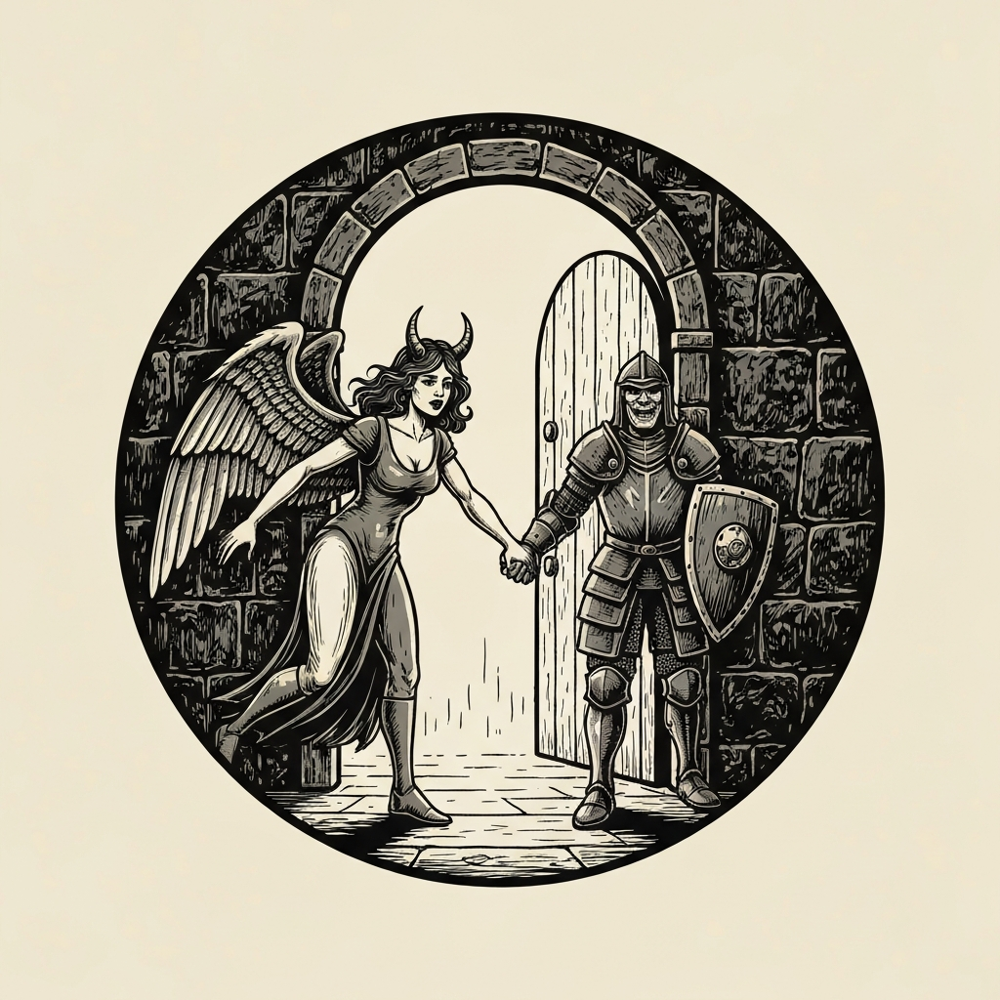
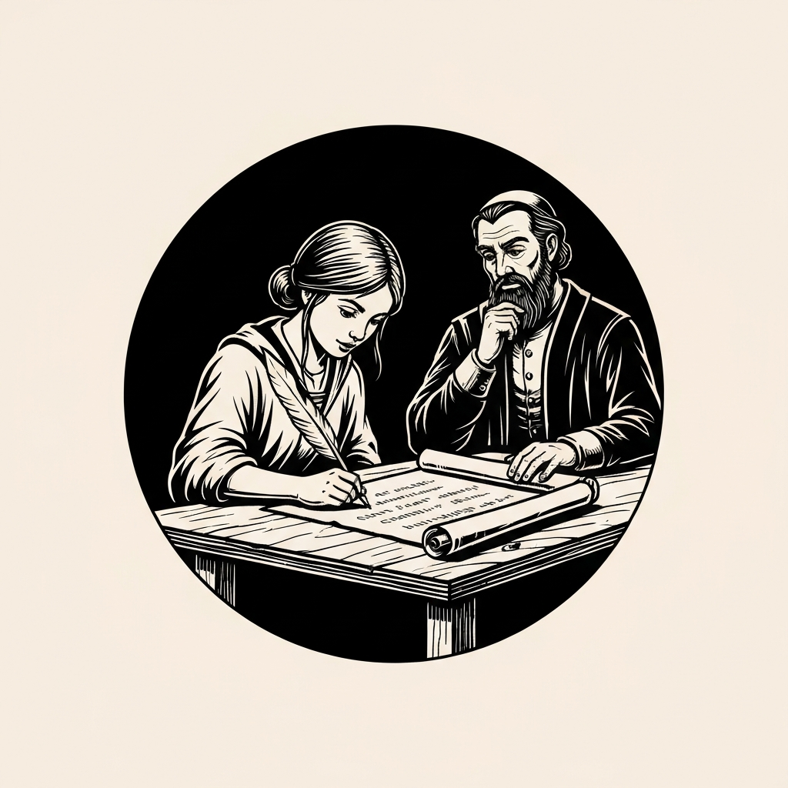
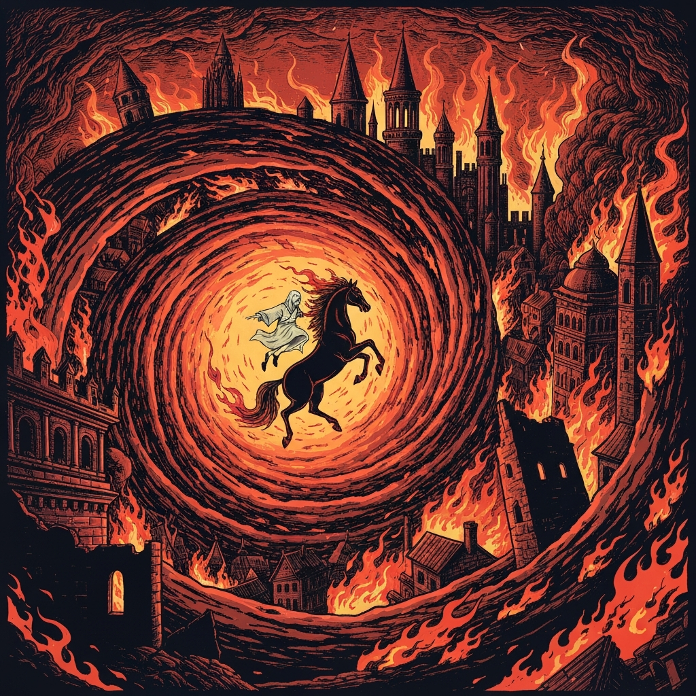
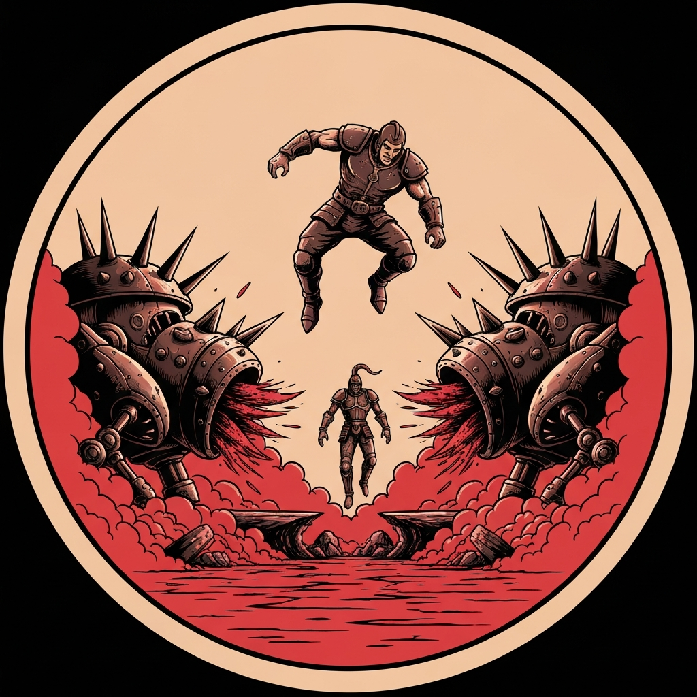
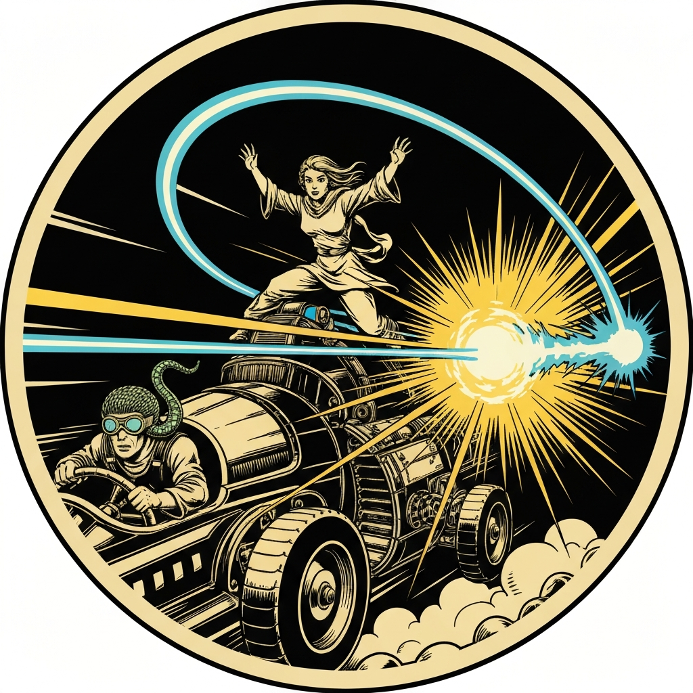

Before they ever caught up to the war machine, the party had already navigated their first contract in the Nine Hells. Mahadi — owner of the wandering emporium and its flagship demiplane, the Infernal Rapture — found four adventurers enjoying the wrong pub: the exquisite lounge reserved for high-value clients, not the modest infernal bar the City Sensation had arranged for the pub crawlers. His succubus hostess Mizarella had vanished, taking with her a war machine called the Tormentor, his personal puzzle box, and a pub-crawl guest named Dudley. Mahadi offered a deal: retrieve Mizarella and the vehicle within 24 hours, and the debt was settled. Odie read the contract carefully — twice — confirmed no soul clauses, asked for a milkshake (Mahadi does not do second-best; there is no second-best), and signed. Tarrie declined on deeply personal grounds and stood firm.

Each party member received a nightmare: an intelligent fiend, mane of fire, teeth like a tiger's, deeply invested in the dignity of its rider. The wrangling was mostly conclusive. Ravaah made the first check. Odie did not make either — she is good-aligned, and the nightmare found this a matter of principle. It flew as high as it could and inverted. Odie featherfell to safety and borrowed space on Azhar's saddle. The remaining nightmares launched into the Avernian sky trailing fire, and the party tracked the Tormentor by the red dust it threw half a mile behind it.

Dudley was in the weapon emplacement, armored in a rising-sun emblem, shouting at devils from the top of a speeding war machine. Azhar al-Nar opened negotiations from a nightmare at speed: a paladin does not protect a succubus who steals from the damned. Dudley had answers for all of it — "I don't need to see the contract to know that slavery is evil" — but a 22 persuasion roll and two more from the rest of the table were enough to talk their way aboard. The nightmares, disgusted at the diplomacy, tried to throw their riders and then left. Mizarella explained herself during the ride: she wanted to reach Elteril, marry Dudley, and be something better than what she'd been. Ravaah and Tarrie passed their insight checks and believed her. Azhar and Odie weren't convinced.

The Medusa's war machine emerged from the red dust before the question could be settled. Two kobold sidecars flanked her, carrying Grimlocks and scale sorcerers. The fog cloud came first; Odie cast Bless at second level and sent her owl above the cloud to spot targets. When the blue half-dragon leapt onto the Tormentor, Tarrie grappled him, jumped between the vehicles at full sprint, and dropped him under the Tormentor's scythe blades — a 25 Athletics check, 20 trample damage, exactly the Mad Max stunt Tarrie announced before executing it. Odie triggered Guardian of Faith around the vehicle and killed four Grimlocks in a single burst. Her Chromatic Orb that followed ran into simultaneous counterspells from both kobold sorcerers; she beat both concentration saves (a 17 and a 30, with Azhar's +5 aura stacking into each roll) and landed the acid damage anyway. When the Medusa critted Odie for 17 and her sorcerers levitated Tarrie off the vehicle, Ravaah used lay on hands and Azhar's aura held the petrifying gaze from finding purchase across the whole table. Odie had been holding a saved Portent — a natural 20 rolled at the session's start — and spent it: third-level Guiding Bolt, auto-hit, 12d6 divine radiance. The Medusa went down. The kobolds scattered.

Mizarella found the planar traces at the Chains of Elteril with an Arcana 20 from Odie to guide her, then opened a portal to the Material Plane. She and Dudley went through it together. Dudley left his shield behind as thanks — the same rising-sun shield he'd worn into the weapon emplacement, bearing the mark of Lathander, now in the party's hands. Mizarella left the puzzle box: leverage she no longer needed, contents still unknown. The party drove the Tormentor back to Mahadi. He paid what he had promised — 300 gp each from the contract and salvaged scrap — and the Infernal Rapture flickered out exactly twenty-four hours after it started, depositing four adventurers on a street in Sigil.

---

## Player Highlights

<strong><a href="../characters/azhar-al-nar">Azhar al-Nar</a></strong> (Mark) — The session's diplomatic engine and its passive force multiplier. Azhar opened the Dudley negotiation on nightmare-back — "A paladin should not be protecting a succubus; what has come over you?" — rolling 22 on persuasion and holding the floor long enough for the rest of the table to seal it. In combat, his +5 aura turned every saving throw in the party's favor: Medusa gaze, kobold Constitution saves, the two counterspells Odie had to push through. He also landed a third-level Chromatic Orb on the Medusa for 27 acid damage and critted the half-dragon with Flame Tongue, but the aura did as much work as any spell.

<strong>Ravaah Heatherleaf</strong> (Lazarus) — Halfling Crown paladin, auburn-haired and bearded, with a celestial direwolf named Frank. Ravaah was the first to pass the nightmare wrangling and the insight check on Mizarella — and the only party member who went in already believing the redemption was real. In combat they cast divine favor, critted the blue half-dragon for 25 total radiant damage, and then jumped to the Medusa's war machine with Frank to bring the fight to her vehicle. When the half-dragon critted Odie for 17, Ravaah used lay on hands for 20 HP on the spot.

<strong><a href="../characters/tarrie">Tarrie</a></strong> (Ttrpger) — A former Tarrasque, now a lizardfolk barbarian in a medium-sized body, with deeply held fears about the Nine Hells and where he's headed when he dies. Tarrie refused to sign Mahadi's contract — not out of opposition, but because signing felt like exactly the kind of thing that should worry him — and then proceeded to do the job anyway. When the half-dragon boarded the Tormentor, Tarrie grappled him, jumped the gap between war machines at speed, released the half-dragon mid-jump, and let the vehicle handle the rest. Athletics 25. Trample 20. "I'm basically doing that one Mad Max move."

<strong><a href="../characters/odie-hilltopple">Odie</a></strong> (Gon) — Signed the contract (after checking it twice for soul clauses and extracting a promise of the finest milkshake on offer), got rejected by her nightmare for being good-aligned, featherfell to safety, and arrived at the war machine on Azhar's saddle. From there she ran the party's support: Bless at second level covering all four party members, Guardian of Faith wiping four Grimlocks in one activation, an owl above the fog cloud to maintain line-of-sight, and Chromatic Orb that pushed through two simultaneous counterspells on back-to-back Constitution saves. She'd been holding a Portent die — natural 20, rolled at the session's start — and spent it on the Medusa: third-level Guiding Bolt, auto-hit, 12d6. Then rolled Arcana 20 to help Mizarella find the planar traces before the portal closed.

---

## Achievements

<strong>Fallen for You</strong> — The module's title turned out to be literal. Mizarella the succubus, who had spent a lifetime performing emotion to claim souls, got blindsided by Dudley — a sweet, oblivious paladin who "acts and thinks like a hero should" and "isn't smart enough to doubt his purpose." She stole a war machine, a puzzle box, and a portal's worth of leverage, all to buy him his freedom. The party spent the session debating whether it was real. Ravaah and Tarrie believed her. The puzzle box she handed over at the end suggests she wasn't bluffing.

<strong>The Rules Are Clear</strong> — Odie read Mahadi's contract twice, confirmed the terms aloud ("we are to get Mizarella, the war machine, the puzzle box, and the paladin, within twenty-four hours, no soul clauses"), and then asked for the second-best milkshake on offer. Mahadi explained that the Infernal Rapture does not do second-best. Odie signed. This made Odie the only party member contractually on the hook for the mission — which Mahadi considered entirely sufficient.

<strong>Hell Horse Rejection</strong> — The nightmares required riders to prove themselves worthy. Good-aligned riders were especially unwelcome. Odie failed the first persuasion check, then failed the second with disadvantage. Her nightmare flew as high as it could and flipped over. She rolled a Strength save, did not make it, and began falling toward the Avernian hellscape. "I got rejected by a hell horse. Jeez." She cast Featherfall and drifted safely down, then rode the rest of the chase on the back of Azhar's nightmare.

<strong>The Mad Max Move</strong> — The blue half-dragon jumped from the kobold sidecar onto the Tormentor. Tarrie grappled him. Then Tarrie jumped the gap between the war machines at full speed, held the half-dragon mid-leap, and released him in the gap between the vehicles. The DM called for Athletics. Tarrie rolled 25. The Tormentor's scythe blades did 20 damage. "I'm basically doing that one Mad Max move."

<strong>Double Counterspell</strong> — Odie had been holding a saved Portent — a natural 20 from before combat — and lined up Chromatic Orb on the Medusa to soften her first. Both kobold scale sorcerers used their counterspells in sequence. Odie beat both Constitution saves (17, then 30) with Azhar's aura stacking into her rolls, landed 9 acid damage on the Medusa anyway, and then spent the Portent: third-level Guiding Bolt, automatic hit, 12d6 divine radiance. "That will take her out." The kobolds turned and fled.

---

## Rewards

- **Gold**: 300 gp each — 100 gp from Mahadi's contract reward, 200 gp per character from 800 gp in salvaged war machine scrap
- **Downtime**: 10 days
- **Streaming hours**: 2
- **Advancement**: level (optional)
- **+2 Shield (Beacon)** *(rare, no attunement)* — While holding this shield you gain +2 to AC in addition to the shield's normal bonus. As a bonus action, the bearer can cause it to shed bright light in a 10-foot radius and dim light for an additional 10 feet, or extinguish the light. This shield bears the rising sun symbol of Lathander — the same emblem Dudley wore into battle — and glows with a rosy dawn-light when its bearer speaks a prayer to the Morninglord. Any large temple can reconsecrate it to another god, requiring a tenday of prayer and 500 gp in materials.
- **Oil of Slipperiness** *(uncommon, no attunement)* — One vial coats a Medium or smaller creature (along with all its equipment) granting the effect of Freedom of Movement for 8 hours. Alternatively, pour it on the ground as a Magic action to duplicate Grease in a 10-foot square for 8 hours. Stored in a rust-patina'd metal can; despite the old rust on the outside, the oil is as good as ever.
