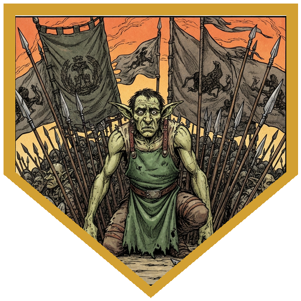
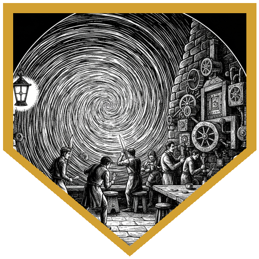
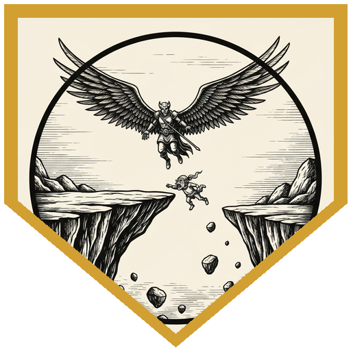
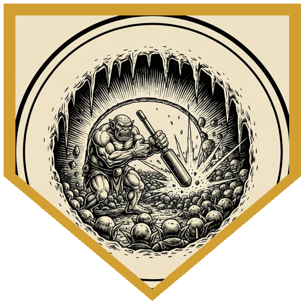
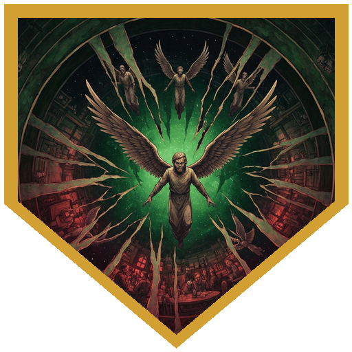

The Sensation's latest pub crawl sold tickets to Acheron — the plane of eternal war, and specifically Clangor, the crumbling cube where Maglubiyet's goblins fight the orcs of Nishrek over the better half of a broken world. The party stepped through the armory portal into a room full of hobgoblin crossbows and were greeted by Warlord Yaverk Bonegrinder, feathers in his hat, who apologized for the reception and promised them the finest drinking a warrior gets: the kind before a momentous battle. In the gilded officer's lounge, waited on by goblins in plain leather, Hedy noticed one server who didn't fit. His name was Jenvak Jaan. In life he had been a shoemaker in Sigil — no god, no war, a wife and children and a good life — and the great planar switchboard had crossed its wires and dumped him into a goblin afterlife he never earned. He didn't want to die again on a battlefield. An insight check (12) told Hedy he meant every word. He and a couple dozen others had found three ways out — an old gate, a ventilation shaft, and a sewer — and enough coin to pay for an escort. The whole "drink before battle" pitch, he warned, was a scam to conscript the pub crawlers into the front line. The party took the coin and the gate.

Getting there was a quiet walk behind the lines; goblins belong in a goblin fortress, and no one looked twice. Perri cast Pass Without Trace and the party slipped up to an empty gatehouse crowded with winches and levers. Opening it was an Intelligence check against the mechanism — Hedy rolled 22 with Zeli's help against an 18, and the portcullis rose while the outer gate dropped. That got the attention of the guards on the battlements, who came down the stairs to see what was moving their gate. The party set an ambush. Keno cast Jump on himself and on Azhar (Waffles was, sadly, spared the indignity), then went to work with his wintery heavy crossbow — crossbow expert, a rider of cold damage, and enough force to send a body flinging off the wall to his friends below. Perri flew in on Waffles with a mounted combatant's advantage and dropped two guards without killing them. A group Athletics check ran the whole column out the gate before reinforcement horns began to sound behind them.

The escape road ran across a battlefield of floating rock under a dim sky, the cube itself broken and drifting. A four-inch ledge, ninety feet long, became a group check with a name attached: the goblins all call one of their own "Grandma," and the party's success or failure was her fate. Trey shrank Perri with Reduce and handed his mount to Hedy; when Grandma slipped, one of the fliers caught her mid-fall. Further on, a wounded goblin footman begged in Goblin not to be killed — terrified of everyone but his own kind — until a persuasion check convinced him he was safe, and he joined the line. They passed a shrine of ruined armor hammered into a humanoid shape, names written in blood, and each left something of worth: Azhar a real dagger, Hedy a handful of coins, each of them feeling a Bless settle over them for the fight to come. A group History check let them gather battlefield relics worth good coin back in Sigil. Then the cave, and the silvery portal — into which the freed goblins rushed, and out of which they fell in a confused pile. The portal wouldn't carry petitioners home. With an army assembling on the horizon, the pub crawlers volunteered to go through and send back help, and Keno spoke for the party: "A knight wouldn't leave anyone behind. I will stay."

Two hours bought them a killing ground. They funneled the tunnel with Entangle, grease, Control Winds, and a pair of Glyphs of Warding primed to blow. Yaverk arrived to demand his soldiers back under the rules of hospitality, lectured the party that free will is a fiction and rules exist because the universe is built that way, and got Trey's considered reply: "You seem like an asshole. This is not Clangor. Not here." The fight was lopsided by design. The first hobgoblin failed his save, tripped a Glyph, and ate 68 acid damage on the spot. An ogre with a battering ram — the "Kool-Aid Man" everyone had been bracing for — smashed through the weak wall on the flank, and Azhar met it with a readied Chromatic Orb that chained through three more hobgoblins. Keno sniped Yaverk down with a crit and his own inspiration. When a wave of invisible casters teleported in with a *bamf*, Perri stripped their invisibility with See Invisibility and Hedy counterspelled the Devastator's lightning bolt off Keno's head. The last two waves never made it through the Glyphs. Then the horns changed key: the pub crawlers had reached the Monastery of the Yellow Rose and moved Ilmater to answer, and green-skinned angels descended through a hole in the sky with pillars of holy light, gathering the goblins up toward Mount Celestia and the shores of the Silver Sea. It was bittersweet — some goblins were lost, some couldn't flee — but after Acheron, even Sigil's streets felt calm.

---

## Player Highlights

<strong>Zeli Vantel</strong> (Lazarus) — An autognome hunter ranger and former sentry of a druid town, wandering under his late master's dying command to find a new purpose. Zeli was the quiet backbone of the gate plan: he lent Hedy the help that turned the gatehouse check into an advantage roll and a 22, then accepted Perri's Reduce and borrowed mount to make the grandma-saving ledge. In the cave siege he threw Hunter's Mark and heavy-crossbow bolts into the murder funnel, dropping a hobgoblin in the open once the Glyphs had done their work.

<strong><a href="../characters/perri">Perri</a></strong> (Trey) — Human paladin-sorcerer with a flying celestial steed named Waffles, and the party's conscience. Perri's Pass Without Trace carried the strike team to the gatehouse unseen; on Waffles he took two battlement guards down non-lethally, both by choice. He shrank himself with Reduce to free his mount for Grandma's crossing, talked the terrified wounded goblin into joining, and answered Yaverk's free-will sermon with "You seem like an asshole — this is not Clangor, not here." In the fight he stripped the invisible casters with See Invisibility and carved the ogre up with Flame Tongue and green flame blade.

<strong>Keno Ichikawa</strong> (Ken) — A Purple Dragon Knight in training, dreaming of protecting everyone from every monster, armed with a wintery heavy crossbow and a rider of unresistible cold. Keno opened the gate fight with Jump-spell theatrics and crossbow-expert fire that flung bodies off the battlements to his allies below. When the portal failed the petitioners, it was Keno who refused to leave: "A knight wouldn't leave anyone behind. I will stay." He then sniped Warlord Yaverk to death — a crit stacked with his own inspiration die — and answered a hobgoblin's demand for surrender with a critical hit through cover.

<strong><a href="../characters/tarrie">Tarrie</a></strong> (Ttrpger) — The former Tarrasque, now a lizardfolk barbarian, and the architect of the party's killing ground. When talk turned to fortifying the cave, Tarrie called for slippery-spot traps and glyph-of-warding placements to seal the tunnel — the bones of the murder funnel that broke three waves of hobgoblins before they ever reached the line. A creature who once was the thing armies feared, now drawing up the trap that stops one.

<strong><a href="../characters/azhar-al-nar">Azhar al-Nar</a></strong> (Mark) — Fire Genasi paladin, wanderer of the Kalisham desert, quick to say the party should help and quicker to spend a spell doing it. Azhar left a genuine dagger at the goblins' blood memorial and felt a Bless settle over him for it. When the ogre broke through the flank, his readied Chromatic Orb hit for 20 and chained through three more hobgoblins on the fire jump. Late in the fight he closed on an invisible caster he couldn't see, hit at disadvantage, and finished it with a divine smite and Vexed follow-up.

<strong><a href="../characters/hedy">Hedy</a></strong> (Gon) — Firbolg diviner-artificer with an owl familiar, and the party's negotiator, engineer, and artillery in one. Hedy drew Jenvak's story out of him and read it true; rolled 22 to crack the gatehouse mechanism; and spent a saved Portent (18) to auto-pass the escape check. She built the ambush — two Glyphs of Warding and Control Winds — and the first Glyph alone vaporized a hobgoblin for 68 acid damage. When the invisible Devastator lined up a lightning bolt on Keno, Hedy dropped invisibility to counterspell it clean.

---

## Achievements

<strong>Just a Shoemaker</strong> — Jenvak Jaan never worshipped Maglubiyet, never went to war, never asked for any of it. He made shoes in Sigil, paid his taxes, gave to the orphanage, and the great planar switchboard saw "goblin" and filed him into an afterlife of endless battle. An insight check (12) confirmed he wasn't lying. The party took his coin, but they took the job for the story.

<strong>A Lot of Tinkers in One Group</strong> — The gatehouse was a wall of winches and levers and no obvious way to work them — an Intelligence check with no skill to lean on. Half the party turned out to carry tinker's or engineering tools. Hedy took the roll with Zeli's help and landed a 22 against the DC of 18. The portcullis rose, the gate dropped, and the guards upstairs started down to find out why.

<strong>Save Grandma</strong> — A ninety-foot ledge four inches wide, and the DM attached a name to the group check: the goblin the others all call Grandma. Success or failure was her fate. Trey shrank Perri with Reduce and handed off his mount to widen the party's margin. When Grandma began to fall, one of the fliers dove and caught her before the drop took her.

<strong>The Kool-Aid Man Cometh</strong> — Warned that something might just smash through a wall, Keno called it: "I feel like the Kool-Aid Man's coming." He was right. An ogre with a battering ram and warriors on its back broke through the weak flank of the cave — straight into the party's kill-corridor of Entangle, grease, wind, and two primed Glyphs of Warding. The first hobgoblin to fail a save took 68 acid damage from a single rune.

<strong>Green-Skinned Angels</strong> — The portal wouldn't carry the petitioners home, so the pub crawlers went through it to find help — and found the Monastery of the Yellow Rose, and Ilmater. As the last hobgoblin waves broke on the Glyphs, horns of a different kind sounded: green-skinned angels descending through a hole in the sky, pillars of holy light in the enemy army, come to carry the goblins up to Mount Celestia. Bittersweet for the few who were lost, but they'd never have had the chance without the party.

---

## Rewards

- **Gold**: 375 gp each
- **Downtime**: 10 days
- **Streaming hours**: 2
- **Advancement**: level (optional)
- **[Flame Tongue Whip](https://www.dndbeyond.com/magic-items/9228647-flame-tongue)** *(rare, requires attunement)* — available as an unlock. A flame tongue that takes the form of a whip, with goblin skulls worked into the handle and no other ornament or hint of its origins; its command word is an archaic Goblin word of unclear meaning. It carries the **War Leader** property: as a Magic action, the bearer can make their voice or a signal carry clearly for up to 600 feet until the end of their next turn.
- **[Dust of Sneezing and Choking](https://www.dndbeyond.com/magic-items/9228524-dust-of-sneezing-and-choking)** *(uncommon)* — available as an unlock. A packet of fine dust that appears to be dust of disappearance; when thrown, it forces creatures in a 30-foot radius to sneeze and choke rather than turn invisible.
