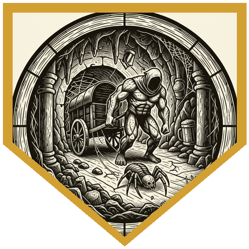
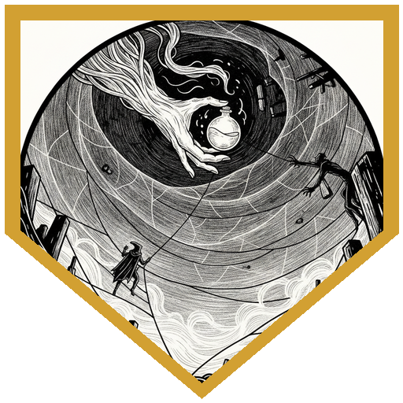
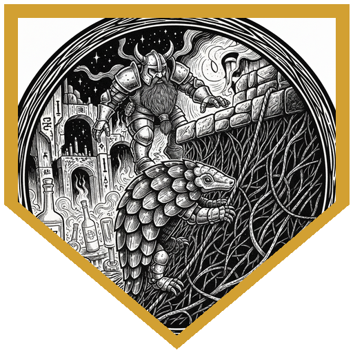
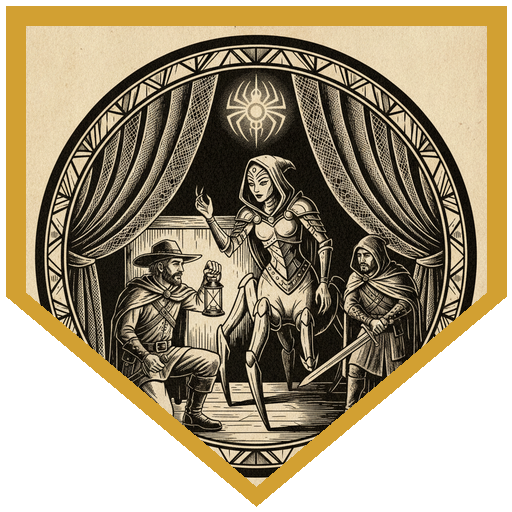
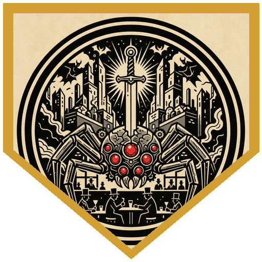

The Society's planar pub crawl reached the 66th layer of the Abyss — the Demonweb — through an obsidian mirror in the back of Sigil's Civic Festhall. Six drinkers stepped through: Tarrie the reformed tarrasque, Pal Go Lucky and his celestial pangolin Peppy, the two-foot arcane trickster Sparrow, the twilight cleric Pierce, the shadar-kai newcomer Zavik, and the planar guide Xavius. Their host at the Mask and Dagger — a nervous drow named Jarrick — confessed that he'd led a hunt after "the beast," a spider killing the drow of Duskhaven, and lost his nerve when it attacked, abandoning the famous hunter Tanar Kilmire and his crew. Each hunter wore a named iron ring. Find them, or their bodies. Five hundred gold and a scroll of spider climb for proof.

The trail wound out across an endless web strung over a lightless chasm, hung with the flotsam of a dozen shattered planes. Tarrie cleared a wagon jammed across the path with a single unimpressed "yank" (a 28), dragging a drained, desiccated spider along behind it. Sparrow cut down the first cocoon — the drow Seffril Mojanni, dead and stippled with hundreds of puncture wounds. Then the web tore: the party plunged 60 feet down a 150-foot drop into rising mist. Tarrie raged, climbed the whole span in one turn, and knotted ropes to haul everyone up — while Sparrow kept a potion of gaseous form hovering an inch from Zavik's hand the entire climb, and Pal's pangolin Peppy nearly didn't make it, failing check after check before finally scrabbling to the top.

Aboard the wrecked galleon *Valiant Heart* they revived a second hunter, Yirulle Kirresh — exhausted but alive, who traded them 300gp of diamond dust for the rescue and warned that the beast's carapace rang like iron. Deeper in, amid a field of dead spiders and the fallen hunter Garm Uthril, Tarrie and Xavius alone heard a whisper from the webs. It belonged to a drider — a former priestess who had failed one of Lolth's tests by being too protective of her people, now atoning in a village of the cursed. She revealed the truth: the "beast" was a *retriever*, a demonic construct Lolth's priestesses command, and it had gone rogue. Because the two of them carried what she called Lolth's blessing, she told them where to find it.

The retriever dropped on them in a ruined temple, seven red eyes glowing, scythe-taloned and immune to ordinary steel. Pierce opened by *Commanding* the mindless thing and parking a *Moonbeam* on it; Pal lit it with *Shining Smite* so the whole party struck with advantage; Xavius swirled spectral spiders around it while Zavik and Sparrow peppered it from the dark. It paralyzed Pal, seized him, and started climbing away — until Pierce flew up and burned a *Lesser Restoration* to cut him loose. Cornered and bleeding, the construct tried to flee; Pal ran it down and finished it with a critical divine smite, calling to burst each of its eyes. Only afterward did the drider reveal the retriever had never once intended to strike Tarrie or Xavius — Lolth favors whom she pleases, for no reason at all. The party carried the last hunter, Tanar Kilmire, home to Duskhaven's cheers, drank free at the Ramshackle Tavern, and stepped back through the mirror into Sigil — while Jarrick the coward, blamed for the dead, drifted off alone into the Demonweb.

---

## Player Highlights

<strong><a href="../characters/tarrie">Tarrie</a></strong> (Ttrpger) — The reformed tarrasque, now a lizardfolk barbarian. He cleared the blocking wagon with a single unimpressed "yank," then raged and climbed 60 feet in one turn to run rope for the whole party up the chasm. In the temple he raged into beast-claw form and lit his scales blue with an Eldritch Claw tattoo ("yes, it's an obvious reference, I don't care"). One of the two the drider named as Lolth-blessed — and, unknowingly, one the retriever was never going to touch.

<strong><a href="../characters/pal-go-lucky">Pal Go Lucky</a></strong> (Don) — Hill dwarf paladin who handed out four-leaf clovers for luck and rode Peppy the peppermint pangolin into the Abyss. His <em>Shining Smite</em> lit the retriever so everyone struck with advantage; then it paralyzed and grabbed him, and Pierce's <em>Lesser Restoration</em> saved him. He landed the killing blow — a critical divine smite for 38 — and called to explode each of its seven eyes.

<strong><a href="../characters/sparrow">Sparrow Swiftfeather</a></strong> (Michael) — The two-foot arcane trickster doled out antitoxins, slicked herself with oil of slipperiness to move through the webs untouched, and stowed the recovered bodies in her portable hole. Her signature moment: keeping a potion of gaseous form floating an inch from Zavik's hand for the entire chasm climb, "so if Zavik slips, he's gonna have it right away."

<strong><a href="../characters/pierce">Pierce Waterson</a></strong> (Mike) — Twilight cleric of Celestian, offering vanilla ice cream from his chest of preserving between fights. He gambled a level-1 <em>Command</em> on the mindless construct — and it worked — then anchored it with <em>Moonbeam</em>. His clutch play won the fight: flying up to a paralyzed, kidnapped Pal and cutting him free with <em>Lesser Restoration</em> at the exact moment it mattered.

<strong><a href="../characters/zavik-ravenstep">Zavik Ravenstep</a></strong> (Mark) — The shadar-kai newcomer and lowest-level of the crew, and he knew it ("not sure it's a great idea for a fifth-level guy, but we'll give it a try"). He made the climb on rope and <em>Enhance Ability</em>, shadow-stepped with Step of the Raven Queen, and worked the retriever from cover — a shortbow shot, then hide-and-return, again and again.

<strong><a href="../characters/xavius-fairgate">Xavius Fairgate</a></strong> (Patman) — Planar guide "almost done with his bingo sheet of planes." His religion and insight reads on Vhaeraun and Lolth talked the party into parley instead of a fight with the drider. In the battle he swirled <em>Conjure Animals</em> spiders to force save after save, marked the retriever with planar warrior, and lobbed tridents — one of the two the drow chose to speak to.

---

## Achievements

<strong>"Yank."</strong> — Faced with a wagon jammed wall-to-wall across the path, Tarrie didn't examine it. He grabbed it and pulled — a 28 — and dragged the desiccated husk of the spider that had been hauling it out into the open along with it.

<strong>A Potion an Inch Away</strong> — As the party climbed a 150-foot drop, Sparrow used mage hand to keep a potion of gaseous form floating one inch from Zavik's hand at all times. "He's not going all the way down, and Sparrow's not gonna let that happen."

<strong>Come On, Peppy</strong> — Pal's celestial pangolin failed climb check after climb check up the sheer web, sliding back each time, until — on a last advantage roll — the little armored beast finally reached the top. "He wants the pangolin equivalent of a sugar cube now."

<strong>The Favor of Lolth</strong> — Only Tarrie and Xavius heard the drider's whisper, and only they were addressed as blessed. The truth came after the kill: the retriever had never intended to attack either of them. Lolth is capricious and favors people for no good reason at all.

<strong>Explode Each of Its Eyes</strong> — Paralyzed and nearly carried off, Pal was freed just in time — and returned the favor. A critical divine smite for 38 damage tore the retriever apart, and Pal called to burst each of its seven ruby eyes one by one.

---

## Rewards

- **Gold**: 416.67 gp each
- **Downtime**: 10 days
- **Streaming hours**: 2
- **Advancement**: level (optional)
- **+2 Rod of the Pact Keeper (Harmonious)** *(rare, requires attunement by a warlock)* — available as an unlock. Lets the bearer regain an expended Pact Magic slot once per long rest; the *harmonious* property means re-attuning to it takes only 1 minute.
- **Spell Scroll of Spider Climb** *(uncommon)* — available as an unlock. The scroll Jarrick offered at the outset; a caster can use it to climb webbed walls and ceilings hands-free.
