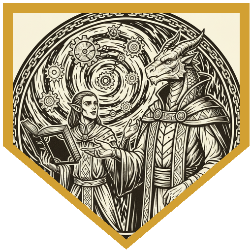
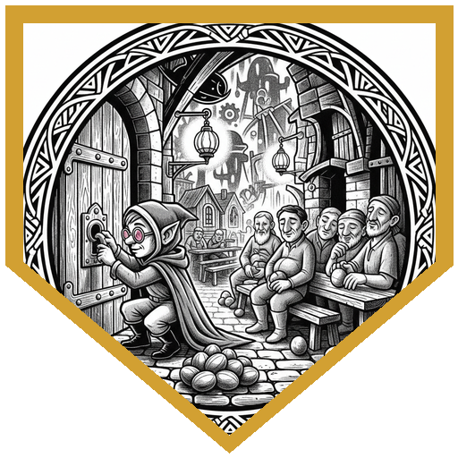
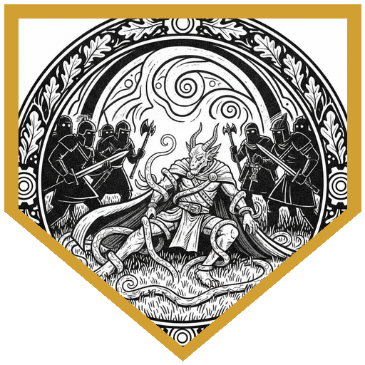
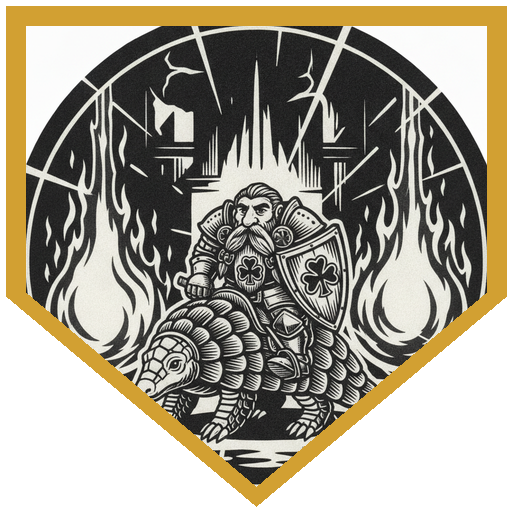
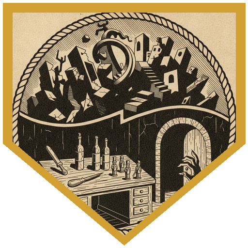

The Society of Sensation's planar pub crawl reached its sixteenth and final stop: Arcadia, the peaceable meadow-land beyond Sigil. A top-hatted dwarf guide knocked a pattern, turned a handle backwards, and the door opened onto a field of daffodils under a brilliant blue sky — children weaving flower garlands, the gabled roofs of Littleton in the distance, and a crew of modrons methodically measuring the road straight. It should have been the easy one. But it was Greengrass, the spring festival, and every adult in town had gone quiet and gray — going through the motions, missing birthdays, letting the cupcakes come out undercooked. Only the children still cared: Elsie, the mayor's daughter, had taken it on herself to throw the festival, sloppy frosting and all. Sparrow handed out an unlimited supply of chocolate eggs from her trace; Pal passed four-leaf clovers to every kid. With *tongues*, the modrons explained the horror in flat, orderly terms — the plane was adjusting toward Mechanus, "right on schedule," eight hours to integration, and the whole town would fold into the clockwork.

The party worked out the counter: hold the Greengrass festival, and the town stays anchored to Arcadia. So they went door to door through Littleton's seven quarters, shaking people out of their lawful stupor one persuasion check at a time — the party steamrolling the DCs so hard that when Sparrow deadpanned asking if she'd "at least beat it by one," the DM shot back "eleven times you beat it by one," and a 31 to pick a stubborn town-hall lock. In the tavern, Pierce dropped platinum on a dust-covered bar to keep the pub crawlers occupied. Pal bluffed the party past the tri-drones guarding the stairs — a deception roll that cleared *double* the DC — to reach Mayor Philomena Lampwick, slumped and mechanically signing papers. Woken, she confessed the truth: she'd been working with **Marlax Truthmaker** of the Fraternity of Order, her old faction, who'd been feeding her documents to sign. He carried a shard of pure Law drawn from Mechanus itself, and he was driving the merge. Take the shard, or run the festival, and it might break.

They sent a town crier to declare Greengrass — starting the clock — and swept the rest of town: decorations and a cellar full of glaze-eyed prisoners in the town hall basement, two halfling bakers who needed firewood, a carpenter roused from bed (Sparrow tipped him ten platinum to build the kids a treehouse), musicians with a broken lute and a fiddle to replace it. In the houses they found the one person the stupor never touched — a singer who'd screamed herself hoarse and punched holes in her walls trying to wake everyone else. Pal restored her voice with a touch of Lay on Hands; grateful, she pressed rare garden bulbs on them, worth coin to a botanist. As the orb of day and night dimmed to moonlight, the sad little picnic bloomed into a real festival — until the sky tore open, silver void and then vast spinning cogs, and Marlax arrived.

He came as a silver dragonborn, flanked by two mages and a knot of toughs in fireball formation, and offered two thousand gold just to leave. Pal counter-offered three thousand for him to *stop*; Marlax refused, insisting the town was already in Mechanus and he was merely letting law do what law does. The party opened first. It was a brutal, crowded fight: the mages charmed the townsfolk ringing the field, and the party spent much of it pulling them back out of it while two fireballs and a cone of cold came down into the crush. Pal drank a **potion of invulnerability** and rode Peppy the pangolin straight into it, halving every blast; his Channel Divinity restraint, together with Sparrow's rose-colored-glasses tumble and trip attack, dropped Marlax prone and pinned — the great lawbender spent nearly the whole fight in the dirt, unable to stand, reduced to casting from the ground. Glindton pulled a law book from his pack and argued the silver dragonborn out of a reinforcement wave, lecturing him on sovereignty, imperialism, and colonialism until the case landed (a History check on Charisma). Pierce swept charm off the townsfolk four at a time, Xavius raked the line with conjured spiders and a barrage cone before switching to hunter's-marked tridents, and Zavik and Sparrow peppered the boss from the dark. Pal misty-stepped in and finished Marlax with a flurry of moon-touched steel. With him down, the integration reversed at once — the children got their parents back, the festival ran long into the night, and the party stepped home through a portal above the festival pond, having completed all sixteen stops of the crawl without once stooping to pocket the loot they were free to take.

---

## Player Highlights

<strong><a href="../characters/pal-go-lucky">Pal Go Lucky</a></strong> (Don) — The clover-armored hill dwarf paladin who rode Peppy the peppermint pangolin and handed luck to every child in Littleton. He bluffed the party past the tri-drones on a deception roll that cleared double the DC, healed the hoarse singer's voice with Lay on Hands, then drank a <em>potion of invulnerability</em> and tanked two fireballs and a cone of cold. His Channel Divinity restraint helped keep Marlax pinned, and he misty-stepped in to land the finishing blows.

<strong><a href="../characters/sparrow">Sparrow Swiftfeather</a></strong> (Michael) — The two-foot arcane trickster fed the kids an endless stream of chocolate eggs from her trace and carried the whole town-waking montage — rolling so far over every persuasion DC that when she asked whether she'd "at least beat it by one," the DM deadpanned "eleven times you beat it by one," plus a 31 to pick the town-hall lock. She tipped the carpenter ten platinum to build the children a treehouse, then lowered her rose-colored glasses, tumbled in on a 20, and tripped the silver dragonborn prone to set up the kill.

<strong><a href="../characters/glindton">Glindton</a></strong> (Ttrpger) — The shifter bladesinger, new to the crew and fresh off the Fey Wild and a wizard school or two. His signature moment was pure theater: pulling a law tome from his pack and arguing Marlax out of a reinforcement wave, lecturing a silver dragonborn on sovereignty, imperialism, and cultural assimilation until "by the eyes of law itself" the case landed. He also reached for a clutch counterspell before the night was out.

<strong><a href="../characters/xavius-fairgate">Xavius Fairgate</a></strong> (Patman) — The planar guide, nearly done with his bingo sheet of planes, who kept the party asking the right questions — pressing the modrons to confirm the town was merging with <em>Mechanus</em> specifically. In the fight he raked the enemy line with conjured spiders (catching both mages), followed with a conjure barrage cone, and marked Marlax with hunter's mark before lobbing ensnaring-strike tridents into him.

<strong><a href="../characters/pierce">Pierce Waterson</a></strong> (Mike) — Twilight cleric of Celestian, the Star Wanderer. His <em>tongues</em> cracked the whole mystery open, letting the party actually talk to the modrons; he then quietly bought off the bartender with platinum to babysit the wandering pub crawlers. In the melee he made himself the linchpin, sweeping the charm off the townsfolk four at a time to keep them clear of the fight, and dropping a level-5 spiritual weapon on a tough for 26.

<strong><a href="../characters/zavik-ravenstep">Zavik Ravenstep</a></strong> (Mark) — The shadar-kai scout, only his second time out and the lowest level of the crew. He kept his head down and did the disciplined work: steady-aim shortbow shots into the boss (a 24 to hit for 14), Blessing of the Raven Queen up, and moving between the charmed townsfolk to free them so they stayed out of the way.

---

## Achievements

<strong>Full Lawyer Mode</strong> — Glindton pulled a book of law from his pack and argued a silver dragonborn out of his own courtroom: sovereignty, imperialism, colonialism, and cultural assimilation, all to prove that "by the eyes of law itself" Marlax was the one in the wrong. The check landed — and denied him his next wave of reinforcements.

<strong>Beat It By Eleven</strong> — Waking a whole town out of its lawful stupor meant check after check, and the party kept obliterating the DCs. When Sparrow deadpanned asking whether she'd "at least beat it by one," the DM fired back: "eleven times you beat it by one" — she'd cleared it by eleven, with a 31 to pick the town-hall lock for good measure.

<strong>Grounded</strong> — Between Pal's Nature's Wrath restraint and Sparrow's rose-colored trip attack, the silver dragonborn "lawbender" spent almost the entire fight prone and pinned to the festival grass, unable to stand and reduced to casting spells from the dirt.

<strong>Two Fireballs and a Cone of Cold</strong> — Pal downed a <em>potion of invulnerability</em>, rode Peppy the pangolin into the thick of it, and stood firm through everything the mages threw — two fireballs and a cone of cold, all cut in half — and kept swinging.

<strong>You Are Not Thieves</strong> — The mayor's silver letter opener, the wine in the cellar, the carpenter's carved wooden soldiers — all there for the taking, all left where they lay. The party saved Littleton and walked out with only what was freely given.

---

## Rewards

- **Gold**: 366.67 gp each
- **Downtime**: 10 days
- **Advancement**: level (optional)
- **Streaming hours**: 2
- **[Ioun Stone of Protection](https://www.dndbeyond.com/magic-items/9228798-ioun-stone-of-protection) (Harmonious)** *(rare, requires attunement)* — a dusty-rose prism that orbits your head and grants +1 AC; the *harmonious* property means attuning takes only 1 minute. Taken from Marlax himself.
- **[Spell Scroll](https://www.dndbeyond.com/spells/1888882-spell-scroll-calm-emotions) of Calm Emotions** *(uncommon)* — a 2nd-level spell scroll (save DC 13, attack +5).
